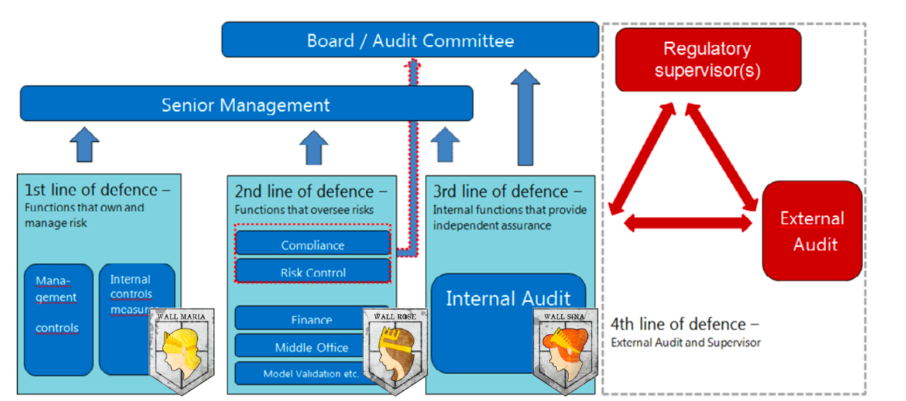

# Risk Management

Banks are by their nature risk-taking institutions. Risk management is integral to a bank's strategy and must be set at board and senior management level. The regulatory framework sets minimum standards, but management must establish risk policies that fit the bank's markets and capabilities.

## Framework and Culture

A bank's risk management approach defines its identity. The key elements of establishing an effective risk management framework are:

- Defining a [[01-business_model|business model]] based on competitive strengths in markets and products
- Identifying and understanding the risks and returns of the model, reviewing and adjusting constantly as conditions change and markets evolve
- Quantifying the risks and developing and maintaining risk management monitoring capabilities supported by robust IT systems
- Constructing a broad array of possible techniques for mitigating risks
- Instilling a strong culture of risk management and ensuring objectives of the risk strategy are understood at all levels of the bank

Risk oversight is the responsibility of the board, while risk management is the responsibility of management. Internal audit teams are important in risk management, focusing on protecting against fraud and the preparation of sound financial reports. However, the board is accountable ultimately for all aspects of risk management at every level. Good practice dictates that the board defines risk management issues that will always require direct elevation for its attention — the board must own every aspect of risk tolerance and [[02-risk_appetite|risk appetite]] for the bank, from credit risk through to [[05-market_risk|market risk]] and operational risk as a business-as-usual (BAU) function. This culminates in a formal [[02-risk_appetite|risk appetite]] and guidance statement that every member of the board must sign up to and maintain responsibility for.

The reward system of the bank must encourage employees to seek out business and realise returns without taking excessive or disproportionate risks. A strong independent risk function ensures "producers" (lending officers, sales teams, and traders) keep revenues and new business in balance with risk. This must be backed up and fully supported by senior management. A key challenge is consistency across all areas, so that perceived banking "stars" or over-hyped "businesses of the future" are held to the same risk / reward standards.

## Lines of Defence

### 1st LOD (Risk Ownership)

The revenue-generating business units form the basis of the model and are referred to as the first line of defence. The model assumes that controls in this first line are very granular and based on individual transactions as staff are involved in processes on a daily basis and are familiar with the workflow and possible control weaknesses.

### 2nd LOD (Risk Control)

It comprises various risk management and compliance functions (ie support functions) such as finance, compliance, risk control, model validation and back office, whose key duties are to monitor and report risk-related practices and information, and to oversee all types of compliance and financial controlling issues. The second line must be independent of the first and apply controls either on an ongoing basis.

- **Credit Risk Committee**: Often at board level but can also report to the group risk committee, supported by balance-sheet management and an independent group risk unit within the bank. Its role is to monitor credit risk exposures, expected asset impairments, and their associated provisions and stress scenarios, ensuring they remain within a specified [[02-risk_appetite|risk appetite]] profile.
- **Asset-Liability Committee (ALCO) / Treasury Committee** — Usually found at the Exco level, supported by balance sheet management functions within the bank. The ALCO will report to a board committee such as the Group Risk and [[04-capital_management|Capital Management]] Committee. This committee has the specific responsibility for overseeing all aspects of balance sheet structure, including capital and asset / liability management, the raising of funds (from the front office money market function to the raising of capital and long-term debt), middle office reporting on all aspects supporting the front office (or execution desks) and back office functions including risk management.
- **Model Risk Committee (MRC)**: set up to have oversight of the various models used by the bank. The MRC will:
  - Independently validate and review new models and any new calibrations that are required
  - Monitor the ongoing performance of models against pre-defined risk thresholds to ensure that the model is working as intended
  - Determine when intervention is needed — model recalibration, re-parameterisation, or rebuild — when the model breaches defined thresholds
- **Group Risk Committee** — There is a group risk committee at board level, as mandated by the King Code, wherein the board should be responsible for the governance of risk. Boards of banks or bank groups normally include [[04-capital_management|capital management]] in the terms of reference of this committee.

### 3rd LoD (Independent Assurance)

- **Audit Committee** — Every public company and state-owned company must appoint an audit committee, with duties described in the relevant Companies Act. As with the Group Risk Committee, this is a board-level committee, given the King Code and other codes require directors to enquire and then, if satisfied, confirm in the annual report the adequacy of internal controls in a company. In the last years, the practice has developed such that it provides independent assurance to senior management and the board on a broad range of objectives Internal audit teams protect against fraud and prepare sound financial reports. Requires its Board members (under King IV and other codes) to confirm the adequacy of internal controls in the AFS (reference [[04-capital_management|capital management]]). Duties are described in the Companies Act.
- **Board**: Board is responsible for risk oversight but accountable for all aspects of risk management at every level. Board defines risk management issues that will always require direct elevation to its attention. Culminates in all Board members signing up to a risk guidance and appetite statement.
  
### 4th LoD

Finally, there are additional external levels of controls that complement the three existing internal layers of controls.

- External auditors are among the most common bodies in this category as they are required by law for most organisations.
- Regulatory authorities
