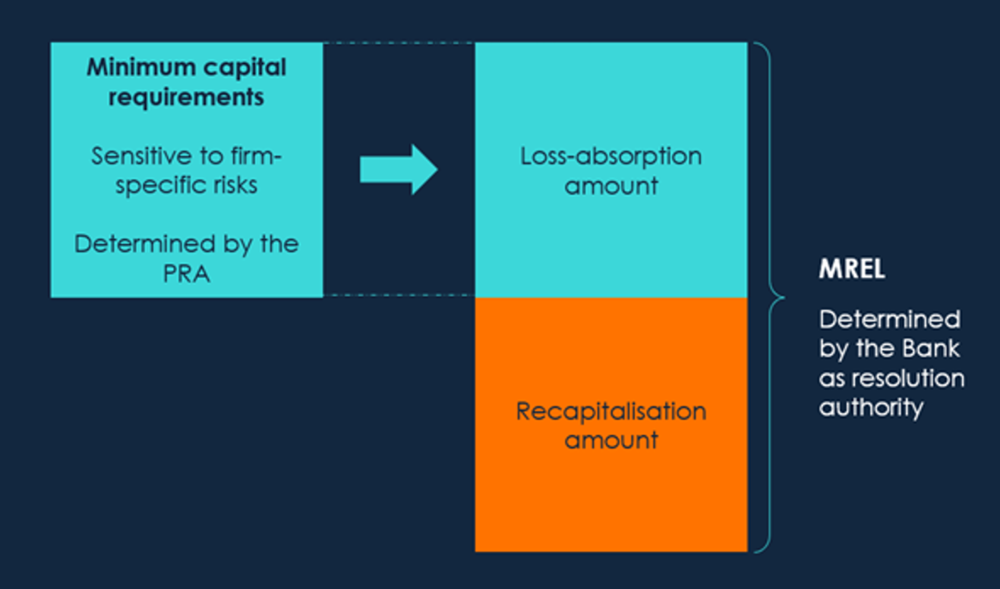

# Regulatory Capital (Banking Book)

What we call regulatory capital differs from what is known as economic capital. In effect there are two approaches to consider the supply and demand of capital. The regulatory approach dictates the rules on which the demand is to be set, as well as the admissibility of supply, while an internal or economic approach considers the internal best estimate of demand and supply. Regulatory capital supply compared to a predetermined scalar of demand is what the regulators determine as adequate for a bank’s operations. Economic capital is what the bank itself views as appropriate for its activities. Usually, it is lower than regulatory capital, in that it incorporates a portfolio effect reflecting diversification of activities, but it may also include an additional small capital cushion or buffer.

For the broader treatment of bank capital management (sources of capital, Pillar 1/2/3 framework, buffers, TLAC/MREL, leverage ratio, capital allocation, and economic capital), see [Capital](..\..\..\..\04-capital.md). For the historical evolution of the Basel accords, see [Basel / BIS](..\..\..\..\..\..\regulation\international\bis\bis.md). This file focuses on the **computation of risk-weighted assets (RWAs) for credit risk** under each Basel framework.

## Pillar 1: Minimum Capital Requirements (MCR)

The motivation to develop credit risk models stemmed from the need to develop quantitative estimates of the amount of regulatory and economic capital needed to support a bank’s risk taking activities. Pillar 1 provides detailed approaches to measuring the primary risks banks face, one of which is credit risk.

### Basel I

Under [Basel I](..\..\..\..\..\..\regulation\international\bis\bis.md), a bank’s assets were allotted via a **simple** rule of thumb to one of four broad risk categories, each with a ‘risk weighting’ that ranged from 0%-100%. A portfolio of corporate loans, for instance, received a risk weight of 100%, while retail mortgages – perceived to be safer – received a more favourable risk weighting of 50%.

Minimum capital $K$ was then set in proportion to the weighted sum of these risk-weighted assets (RWAs).

```math
K \geq 8\% \times \text{RWA}
\\
\text{RWA} = \text{Exposure} \times w
```

This can also be expressed in terms of capital adequacy ratio (CAR)

```math
\frac{K}{\text{RWA}} \geq 8\%
```

Note that the original Basel I Accord only considered credit risk in the RWA. However, an amendment in 1996 then included an RWA associated with market risk as well. Some jurisdictions in emerging markets still apply the Basel I framework. For bank groups, some of their exposure may therefore be subject to Basel I in a specific country, Basel II in another country and Basel III on consolidation.

### Basel II

Under Basel II, Pillar 1, the minimum capital requirement for credit risk in the banking book, is calculated in a new way that reflects the credit ratings of counterparties. The capital requirement for market risk remained unchanged from the 1996 Amendment, but there was a new capital charge for operational risk. The general requirement in Basel I, that banks hold a total capital equal to 8% of RWAs, remained unchanged. In response, Basel II had a much more granular approach to risk weighting. Under Basel II, the credit risk management techniques can be classified under:

- Standardised approach: this involves a simple categorisation of obligors, without considering their actual credit risks. It includes reliance on external credit ratings.
- Internal ratings-based (IRB) approach: here banks are allowed to use their ‘internal models’ to calculate the regulatory capital requirement for credit risk.

These frameworks are designed to arrive at the RWAs, the denominator of four key capitalisation ratios (Total capital, Tier 1, Core Tier 1, Common Equity Tier 1).

#### Standardised Approach

The standardised approach has been used by banks which are not sufficiently sophisticated enough (in the view of the regulators) to use the internal ratings approaches. The standardised approach is similar to Basel I except for the calculation of risk weights.

The SA is a simple approach, involving [external ratings](), asset classes, and risk weights. It must be noted that under the latest amendments to the SA, external credit ratings cannot be used without satisfying the following:

- The national supervisor has recognised the credit rating agency as an “external credit assessment institution (ECAI)”.
- The bank has performed due diligence on the creditworthiness of the entity, to ensure the credit risk posed does not require a higher risk weight. (The risk weight cannot be lowered using this assessment.)

##### Risk Weights

The risk weight for a country (sovereign) exposure ranges from 0% to 150%, and the risk weight for an exposure to another bank or a corporation ranges from 20% to 150%. Supervisors are allowed to apply lower risk weights (20% rather than 50%, 50% rather than 100%, and 100% rather than 150%) when exposures are to the country in which the bank is incorporated or to that country’s central bank.

For claims on banks, the rules are somewhat complicated. Instead of using the standard risk weights, national supervisors can choose to base capital requirements on the rating of the country in which the bank is incorporated.

The standard rule for retail lending is that a risk weight of 75% be applied, compared with 100% in Basel I. When claims are secured by a residential mortgage the risk weight is 35%, compared with 50% in Basel I. Due to poor historical loss experience, the risk weight for claims secured by commercial real estate is 100%.

##### Collateral Adjustment

There are two ways that banks can adjust risk weights for collateral. The first is called the simple approach and is similar to the approach used in Basel I. The second is called the comprehensive approach. Banks have a choice as to which approach is used in the banking book, but they must use the comprehensive approach to calculate capital for counterparty credit risk in the trading book.

Under the simple approach, the risk weight of the counterparty is replaced by the risk weight of the collateral for the part of the exposure covered by the collateral (the exposure is calculated after netting). For any exposure not covered by the collateral, the risk weight of the counterparty is used. The minimum level for the risk weight applied to the collateral is 20%. A requirement is that the collateral must be revalued at least every 6 months and must be pledged for at least the life of the exposure.

Under the comprehensive approach, banks adjust the size of their exposure upwards to allow for possible decreases in the value of the collateral. (The adjustments depend on the volatility of the exposure and the collateral.) A new exposure equal to the excess of the adjusted exposure over the adjusted value of the collateral is calculated and the counterparty’s risk weight is applied to this exposure. The adjustments applied to the exposure and the collateral can be calculated using rules specified in Basel II or, with regulatory approval, using a bank’s internal models. Where netting arrangements apply, exposures and collateral are separately netted and the adjustments made are weighted averages.

#### IRB Approach

The SA frequently results in high risk weights being applied to a bank’s clients, which can affect capital requirements and pricing. This leads to many banks, which have the available resources, using the internal ratings-based approach.

The rationale behind the IRB approach is that [internal ratings]() can prove to be more sensitive to the level of risk in a bank’s portfolio. Internal ratings may incorporate supplementary customer information, which is usually out of the reach of ECAIs.

There is also an incentive for banks to further refine internal credit risk management and measurement techniques under this approach, as this could lead to being able to optimise capital, i.e. to hold more or less capital based on the bank’s view of their own portfolio’s risk.

Under the internal ratings-based (IRB) approach, regulators base the capital requirement on the value at risk calculated using a 1-year time horizon and a 99,9% confidence level. They recognise that expected losses are usually covered by the manner in which a financial institution prices its products (for example, the interest charged by a bank on a loan is designed to recover expected loan losses). The value at risk is calculated using a Gaussian copula model (single factor Vašíček) of time to default.

```math

\text{UL} = \text{VaR}_{99.9^{th}} = \text{LGD}_\text{Reg} × \text{WCDR}
\\
\text{EL} =  \text{LGD}_\text{Reg} × \text{PD}_\text{Reg}
\\
```

The capital given by the above equations is intended to be enough to cover unexpected losses over a 1-year period that we are 99,9% certain will not be exceeded. The WCDR is the probability of default that (theoretically) happens once every thousand bank years. The capital required is therefore the value at risk minus the expected loss.

```math
K = (\text{UL} - \text{EL}) \times MA
\\
K = \text{EAD}_\text{Reg} × (\text{LGD}_\text{Reg} \text{WCDR}-\text{LGD}_\text{Reg}\text{PD}_\text{Reg}) \times MA
\\
K = \text{EAD}_\text{Reg} × \text{LGD}_\text{Reg} × (\text{WCDR}-\text{PD}_\text{Reg}) \times MA
\\
K=\text{EAD}_\text{Reg}\times\text{LGD}_\text{Reg}\times[N(\frac{G(\text{PD})+\sqrt{R}\times G(0.999)}{\sqrt{1-R}})-\text{PD}]\times \text{MA}
```

When the capital requirement for a risk is calculated in a way that does not involve RWAs, it is multiplied by 12,5 to convert it to an RWA. This approach has been adopted given the original Basel I approach to assess risk as a percentage of the value of an asset rather than calculating the capital requirement explicitly.

```math
\text{RWA} = K \times 12.5
```

For credit risk, the total RWA amount would be calculated as the sum of the RWA for banking book exposures, including RWAs for:

- Counterparty credit risk (arising from banking or trading book exposures)
- Equity investments in funds held in the banking book
- Securitisation exposures in the banking book
- Exposures to central counterparties in both the banking and trading book.

The Basel Committee reserves the right to apply a scaling factor (less than or greater than 1,0) to the result of the calculations, if it finds that the aggregate capital requirements are too high or low.

A scaling factor of 1,06 has been applied by the SARB consistent with international practice.

##### Defaulted Assets

The capital requirement (as a percentage of the outstanding balance) for defaulted assets is calculated as:

```math
K = \max(0,\text{LGD}_\text{Reg}\times \text{BEEL}
```

LGDs for defaulted assets should reflect the need for potential additional losses over the recovery period. The best estimate of expected loss (BEEL) is the estimate of loss set by the bank taking into account the current economic climate and the status of the facility. The BEEL is usually the specific provision loss estimate of that facility.

##### Maturity Adjustment

The maturity adjustment is designed to allow for the fact that, if an instrument lasts longer than 1 year, there is a 1-year credit exposure arising from a possible decline in the creditworthiness of the counterparty as well as from a possible default by the counterparty.

```math
\text{MA}=\frac{(1+(m-2.5)b)}{(1-1.5b)}
\\
b = [0.11852 – 0.05478\ln(\text{PD})]^2
```

where$ b$ is the adjustment factor and $m$ is the effective maturity.

For most retail exposures, the capital requirement is calculated as follows, where there is no maturity adjustment included as maturities of retail assets will be the same within portfolios

##### F-IRB

Under the foundation IRB approach, banks supply PD, while the LGD, EAD, and maturity M are supervisory values set by the Basel Committee.

- PD is subject to a floor of 0,03% for bank and corporate exposures, while the LGD is set at 45% for senior claims and 75% for subordinated claims.
- When there is eligible collateral, in order to correspond to the comprehensive approach that was described earlier, the LGD is reduced by the ratio of the adjusted value of the collateral to the adjusted value of the exposure, both calculated using the comprehensive approach.
- The EAD is calculated in a way similar to the credit equivalent amount in Basel I and includes the impact of netting.
- M is set at 2,5 in most cases.

##### A-IRB

Under the advanced IRB approach, banks supply their own estimates of the PD, LGD, EAD, and M for corporate, sovereign, and bank exposures, subject to regulatory approval and therefore not necessarily the same as internal estimates.

- The PD can be reduced by credit mitigants such as credit triggers.
- The two main factors influencing the LGD are the seniority of the debt and the collateral.
- In calculating the EAD, banks can, with regulatory approval, use their own estimates of credit conversion factors.

> Suppose the assets of a bank consist of R1 billion of loans to BBB-rated corporations. The PD for the corporations is estimated as 0,1% and the LGD is 60%. Average maturity of the corporate loans is 2,5 years. Adjusted maturity is 1,59, which according to our equation makes the WCDR 3,4%. An implied value of p equal to 0,4 is used under the Basel II IRB approach, the RWAs for the corporate loans are: 12,5 × 1000 × 0,6 × (0,034 – 0,0001) × 1,59 = 393 or R393 million. This compares with R1 billion under Basel I and R1 billion under the standardised approach of Basel II.

The model underlying the calculation of capital for retail exposures is similar to that underlying the calculation of corporate, sovereign, and bank exposures. However, the foundation IRB and advanced IRB approaches are merged, and all banks using the A-IRB approach provide their own estimates of the PD, LGD, and EAD. There is no maturity adjustment.

> Suppose the assets of a bank consist of R500 million of residential mortgages where the PD is 0,005 and the LGD is 20%. In this case, p = 0,15 and WCDR = 0,67. The risk-weighted assets are: 12,5 × 500 × 0,2 × (0,067 – 0,005) = 78 or R78 million. This compares with R250 million under Basel I and R175 million under the standardised approach of Basel II.

In determining capital requirements for defaulted assets, the WCDR formula above sets N and PD equal to 1, and both EAD and LGD have to be estimated. The RWA formula then evaluates to LGD x EAD.

### Basel III

Basel III seeks to improve the standardised approach for credit risk in a number of ways. This includes strengthening the link between the standardised approach the internal ratings-based (IRB) approach. It also increased levels of capital by introducing usable capital buffers rather than capital minima.  

### Basel 3.1

Banks will need to start implementing and allowing for Basel 3.1 (IV) as it is to be in effect from January 2023.

### Additional MCR

Minimum capital requirements may be based on the jurisdiction in which a bank operates. The minimum capital requirements, however, are always set in line with the capital requirements set out by the Bank of International settlements (BIS) in their Basel guidelines.

In South Africa, Basel II implementation became effective 1 January 2008. Basel III became effective 1 January 2012 but is subject to transition elements that will continue until 2023. In South Africa, minimum capital included the sum of its Tier 1 and Tier 2 capital and primary and secondary unimpaired reserve funds. This amount could not at any time be less than the greater of R250 million or 10% (previously 8%) of risk-weighted assets. Tier 1 must make up at least 50% of a bank’s capital base.

### TLAC & MREL

For the application of TLAC and MREL requirements in the context of bank capital management, see [Capital — TLAC](..\..\..\..\04-capital.md). For the full FSB regulatory term sheet, see [TLAC Principles and Term Sheet](..\..\..\..\..\..\regulation\international\fsb\tlac.md).



