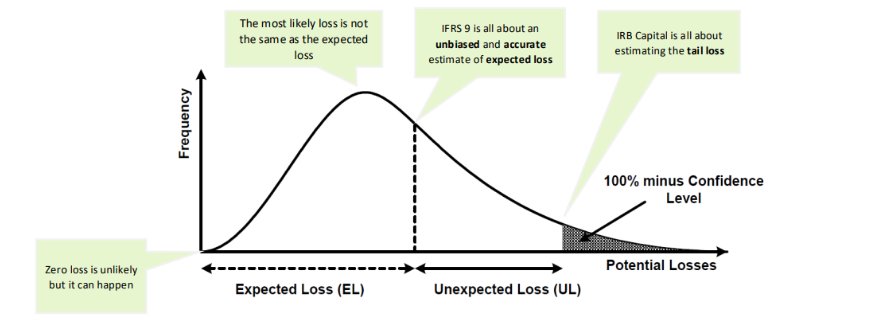
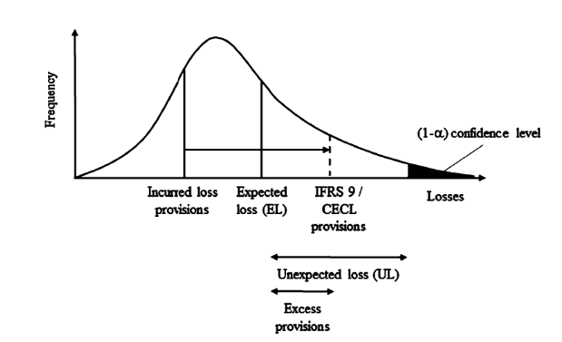

# Credit Losses

When estimating the amount of [[01-economic_capital|economic capital]] needed to support their credit risk activities, banks employ an analytical framework that relates the overall required [[01-economic_capital|economic capital]] for credit risk to their portfolio’s probability density function (PDF) of credit losses, also known as loss distribution of a credit portfolio. Figure below shows this relationship. Although the various modelling approaches would differ, all of them would consider estimating such a PDF.

<https://www.bis.org/bcbs/irbriskweight.pdf>

Mechanisms for allocating [[01-economic_capital|economic capital]] against credit risk typically assume that the shape of the PDF can be approximated by distributions that could be parameterised by the mean and standard deviation of portfolio losses. Figure below shows that credit risk has two components. First, the expected loss (EL) is the amount of credit loss the bank would expect to experience on its credit portfolio over the chosen time horizon. This could be viewed as the normal cost of doing business covered by provisioning and pricing policies. Second, banks express the risk of the portfolio with a measure of unexpected loss (UL). Capital is held to offset UL and within the IRB methodology, the regulatory capital charge depends only on UL. The standard deviation, which shows the average deviation of expected losses, is a commonly used measure of unexpected loss.

Figure below illustrates how variation in realised losses over time leads to a distribution of losses for a bank:

The worst case one could imagine would be that banks lose their entire credit portfolio in a given year. This event, though, is highly unlikely, and holding capital against it would be economically inefficient. Banks have an incentive to minimise the capital they hold, because reducing capital frees up economic resources that can be directed to profitable investments. On the other hand, the less capital a bank holds, the greater is the likelihood that it will not be able to meet its own debt obligations, i.e. that losses in a given year will not be covered by profit plus available capital, and that the bank will become insolvent. Thus, banks and their supervisors must carefully balance the risks and rewards of holding capital.

## Value-at-Risk

The area under the curve in the PDF is equal to 100%. The curve shows that small losses around or slightly below the EL occur more frequently than large losses. The likelihood that losses will exceed the sum of EL and UL – that is, the likelihood that the bank will not be able to meet its credit obligations by profits and capital – equals the shaded area on the RHS of the curve and depicted as stress loss. 100% minus this likelihood is called the Value-at- Risk (VaR) at this confidence level. If capital is set according to the gap between the EL and VaR, and if EL is covered by provisions or revenues, then the likelihood that the bank will remain solvent over a one-year horizon is equal to the confidence level.

Under [[basel_2|Basel II]], capital is set to maintain a supervisory fixed confidence level. The confidence level is fixed at 99.9% i.e. an institution is expected to suffer losses that exceed its capital once in a 1000 years. Lessons learned from the 2007-2009 global financial crisis, would suggest that stress loss is the potential unexpected loss against which it is judged to be too expensive to hold capital. Regulators have particular concerns about the tail of the loss distribution and about where banks would set the boundary for unexpected loss and stress loss. For further discussion on loss distributions under stress scenarios see Haldane et al (2007).

This confidence level might seem rather high. However, Tier 2 does not have the loss absorbing capacity of Tier 1. The high confidence level was also chosen to protect against estimation errors, that might inevitably occur from banks’ internal PD, LGD and EAD estimation, as well as other model uncertainties.

## Expected Losses

So far the Expected Loss has been regarded from a top-down perspective, i.e. from a portfolio view. It can also be viewed bottom-up, namely from its components.

A bank has to take a decision on the time horizon over which it assesses credit risk. In the [[bis|Basel]] context there is a one-year time horizon across all asset classes. The expected loss of a portfolio is assumed to be equal to the proportion of obligors that might default within a given time frame (frequency), multiplied by the outstanding exposure at default (severity), and once more by the loss given default (severity adjustment), which represents the proportion of the exposure that will not be recovered after default.

Under the [[basel_2|Basel II]] IRB framework the probability of default (PD) per rating grade is the average percentage of obligors that will default over a one-year period. Exposure at default (EAD) gives an estimate of the amount outstanding if the borrower defaults. Loss given default (LGD) represents the proportion of the exposure (EAD) that will not be recovered after default. Assuming a uniform value of LGD for a given portfolio, EL can be calculated as the sum of individual ELs in the portfolio.

$\text{EL} = \displaystyle \sum_{i=1}^N{\text{PD}_{i}^\text{TTC}(12,x_{i},[t_a',t_b'])\times\text{EAD}_{i,t}(12)\times\text{LGD}_i}$ where $i$ denotes an obligor

The relationship between PD, LGD, and EAD estimates is important to understand. The two latter estimates sound quite similar and are interlinked. The LGD is stated as a percentage of the EAD. If the client defaults, the EAD is the amount the bank could lose (the amount at risk), the LGD is the percentage of this amount that they are likely to lose, and the PD is the probability that the default, and so the loss, occurs.

For example, if the EAD is 65%, the LGD is 30%, and the PD is 15%, then for an amount of 100, the expected loss (PD x LGD x EAD) is 3:

- The amount that could be lost is 65 (100 x 65%), given a default occurs.
- The amount that is likely to be lost is 19,5 (100 x 65% x 30%), given a default occurs.
- The amount that is likely to be lost is 3 (100 x 65% x 30% x 15%), if a default occurs.

## Unexpected Losses

Banks must also, however, account for unexpected losses. This should be self-evident: it would not be possible to estimate accurately what future losses will be. It is common for actual loss rates to far exceed expected loss rates, especially if historical rates were used to estimate expected losses.

Unlike EL, total UL is not an aggregate of individual ULs but rather depends on loss correlations between all loans in the portfolio. The deviation of losses from the EL is usually measured by the standard deviation of the loss variable. The UL, or the portfolio’s standard deviation of credit losses can be decomposed into the contribution from each of the individual credit facilities:

$\text{UL} = \displaystyle\sum_{i=1}^N\sigma_i\rho_i$

where $\sigma_i$ denotes the stand-alone standard deviation of credit losses for the $i$th facility, and $\rho_i$ denotes the correlation between credit losses on the ith facility and those on the overall portfolio. The parameter captures the ith facility’s correlation/diversification effects with other instruments in the bank’s credit portfolio. Other things being equal, higher correlations among credit instruments – represented by higher $\rho_i$ lead to a higher standard deviation of credit losses for the portfolio as a whole.

In the case of corporate, sovereign and bank exposures, [[basel_2|Basel II]] assumes a relationship between the correlation parameter $\rho$ and the probability of default PD in an equation based on empirical research. A lower PD is associated with higher levels of correlation.

## Conditional Expected Losses

Another way of looking at it is through the following:

$\text{UL}=\text{Conditional Expected Losses}-\text{EL}$

$\text{Conditional Expected Losses}=\text{UL}+\text{EL}$

The formula sets the minimum capital requirement such that unexpected losses will not exceed the bank’s capital up to a 99.9% confidence level.

The implementation of this model (ASFR), developed for [[basel_2|Basel II]], makes use of average PDs that reflect expected default rates under normal business conditions. These average PDs are estimated by banks. To calculate the conditional expected loss, **bank-reported average PDs are transformed into systemically conditional PDs** using a supervisory mapping function (described below). The conditional PDs reflect default rates **given an appropriately conservative value of the systematic risk factor**. The same value of the systematic risk factor is used for all instruments in the portfolio. Diversification or concentration aspects of an actual portfolio are not specifically treated within an ASRF model.

In contrast to the treatment of PDs, [[basel_2|Basel II]] does not contain an explicit function that transforms average LGDs expected to occur under normal business conditions into conditional LGDs consistent with an appropriately conservative value of the systematic risk factor. Instead, banks are asked to report **LGDs that reflect economic-downturn conditions** in circumstances where loss severities are expected to be higher during cyclical downturns than during typical business conditions.

The conditional expected loss for an exposure is estimated as the product of the conditional PD and the “downturn” LGD for that exposure. Under the ASRF model the total economic resources (capital plus provisions and write-offs) that a bank must hold to cover the sum of UL and EL for an exposure is equal to that exposure’s conditional expected loss. Adding up these resources across all exposures yields sufficient resources to meet a portfolio-wide Value-at-Risk target.

This can be illustrated below. Ideally, ELs should be covered by provisions. However, if there is a shortfall between EL and provisions (EL> provisions), then this shortfall is deducted from Tier 1 capital. Likewise, if there is an excess, [[bis|Basel]] describes how much you are allowed to include in your Tier 2 capital.

### Defaulted Assets

For defaulted assets, the default has become a certainty, i.e. the PD is 100%. However, the LGD is still subject to uncertainty. Most losses will become certain once an asset defaults, but other losses may occur only after default and so may still present some level of uncertainty. For example, in the case of mortgage loans there may be unexpected costs involved in selling the underlying property.

If a supervisor agrees that a bank’s provisions sufficiently cover the capital required for defaulted assets, the difference may be included in Tier 2 capital. This can occur in practice as the assumptions used in modelling the provisions required do not necessarily align with those for the capital calculations (e.g. a PIT LGD is often used for provisioning, while a DT LGD is used as a basis for capital calculations).

## Downturn LGDs

The [[bis|Basel]] Committee considered two approaches for deriving economic-downturn LGDs. One approach would be to apply a mapping function similar to that used for PDs that would extrapolate downturn LGDs from bank-reported average LGDs. Alternatively, banks could be asked to provide [[07-risk_quantification|downturn LGD]] figures based on their internal assessments of LGDs during adverse conditions (subject to supervisory standards).

In principle, a function that transforms average LGDs into downturn LGDs could depend on many different factors including the overall state of the economy, the magnitude of the average LGD itself, the exposure class and the type and amount of collateral assigned to the exposure. The [[bis|Basel]] Committee determined that given the evolving nature of bank practices in the area of LGD quantification, it would be inappropriate to apply a single supervisory LGD mapping function. Rather, Advanced IRB banks are required to estimate their own downturn LGDs that, where necessary, reflect the tendency for LGDs during economic downturn conditions to exceed those that arise during typical business conditions. Supervisors will continue to monitor and encourage the development of appropriate approaches to quantifying downturn LGDs.

The [[07-risk_quantification|downturn LGD]] enters the [[basel_2|Basel II]] capital function in two ways. The [[07-risk_quantification|downturn LGD]] is multiplied by the conditional PD to produce an estimate of the conditional expected loss associated with an exposure. It is also multiplied by the average PD to produce an estimate of the EL associated with the exposure.

## Systemically Conditional PDs

The mapping function used to derive systemically conditional PDs from average PDs is derived from an adaptation of Merton’s (1974) single asset model to credit portfolios. According to Merton’s model, borrowers default if they cannot completely meet their obligations at a fixed assessment horizon (e.g. one year) because the value of their assets is lower than the due amount. Merton modelled the value of assets of a borrower as a variable whose value can change over time. He described the change in value of the borrower’s assets with a normally distributed random variable.

Vasicek (cf. Vasicek, 2002) showed that under certain conditions, Merton’s model can naturally be extended to a specific asymptotic single risk factor (ASRF) credit portfolio model. With a view on Merton’s and Vasicek’s ground work, the [[bis|Basel]] Committee decided to adopt the assumptions of a normal distribution for the systematic and idiosyncratic risk factors.

### Vasicek Model

Vasicek applied to firms’ asset values what had become the standard geometric Brownian motion model. Expressed as a stochastic differential equation:

$dA_i = \mu_iA_i~dt + \sigma_iA_i~dx_i$

Where $A_i$ is the value of the ݅ith firm’s assets, $\mu_i$ and $\sigma_i$ are the drift rate and volatility of that value, and $x_i$ is a Wiener process or Brownian motion, i.e. a random walk in continuous time in which the change over any finite time period is normally distributed with mean zero and variance equal to the length of the period, and changes in separate time periods are independent of each other. Solving this stochastic differential equation one obtains the value of the ith firm’s assets at time $T$ as:

$A_i(T)=e^{\small A(0) + \mu_iT-\frac{1}{2}\sigma_i^2T+\sigma_i\sqrt T X_i}$

The $݅i$-th firm defaults if $A_i(T)<B$ so the probability of such an event is

$P[A_i(T)<B]=P[X_i<c_i]=p^*$

where $c_i$ is easily derived from equation (1). That is, default of a single obligor happpens if the value of a normal random variable happens to fall below a certain $c_i$.

**$p^*$ is the average loss rate in 1-year or the 1-year through-the-cycle (TTC) PD.**

Assume that a bank has a very large number of obligors, all of which have the same 1-year PD. Correlation between defaults is introduced by assuming correlation in the $A_i$ processes, and thus in the terminal values, $A_i(T)$. In particular, it is assumed that the $X_i$ s in equation (1) are pair-wise correlated according to factor $\rho$. The higher $\rho$, the more dependent the borrowers are on systematic environment. When $\rho = 0$ this implies total independence between borrowers.

Being normal and equi-correlated, each random variable can then be represented as the sum of two other random variables: one common across firms, and the other idiosyncratic that are both standard normal ~$N(0,1)$.

$X_i = \text{S}_{t'}\sqrt{\rho}+Z_i\sqrt{1-\rho}$

where $\text{S}_{t'}$ and $Z_i$ are respectively the normalised systematic and the idiosyncratic (asset specific) components. An economic index over the interval $(0,T)$ is given by $\text{S}_{t'}=\Large\frac{\text{FLI}_{t'}-\mu}{\sigma}$. Hence the probability of default of obligor $i$, conditional on $\text{S}_{t'}$, can also be written as:

$P[X_i < c_i | \text{S}_{t'}] = P[X_i < N^{-1}(p^*)|\text{S}_{t'}]$

$= P[\text{S}_{t'}\sqrt{\rho}+Z_i\sqrt{1-\rho}<N^{-1}(p^*)]$
$= P[Z_i<\frac{N^{-1}(p^*)-\text{S}_{t'}\sqrt{\rho}}{\sqrt{1-\rho}}]$
$= N(\large\frac{N^{-1}(p^*)-\text{S}_{t'}\sqrt{\rho}}{\sqrt{1-\rho}})$

By taking the inverse of the standard normal distribution applied to confidence level one can derive conservative value of systematic factor $S$. Rewriting this in terms of the 99.9% quantile for [[bis|Basel]] we end up with the WCDR. The WCDR denotes the “worst-case default rate”, in that we are 99,9% certain will not be exceeded next year provided all exposures are equal and no correlation exists between LGD and PD.

$\text{WCDR} = \text{PD}_{i}^\text{SysPiT}(12,x_{i}|\text{S}_{99.9^{th}}=N^{-1}(0.999)) = N(\large\frac{N^{-1}(p^*)+\sqrt{\rho}N^{-1}(0.999)}{\sqrt{1-\rho}})$

where $p^* = \text{PD}_{i}^\text{TTC}(12,x_{i},[t_a',t_b'])$

This is component is the same one that appears [[bis|Basel]]:

$K=\text{LGD}[N(\frac{G(\text{PD})+\sqrt{R}\times G(0.999)}{\sqrt{1-R}})-\text{PD}]$

### Systemtic Risk

Given a macroeconomic scenario, a time series $S_t'$ can be computed, which can then be used in the Vasicek framework to  calculate the loss rate conditional to that specific scenario. The common component $S_t'$ may be viewed as representing aggregate macro-financial conditions which can be extracted from observable economic data. Aggregate credit risk depends on the stochastic common factor $S_t'$, because when we face good economic times the expected loss rate tends to below the long-term average, while during bad times the expected loss rate is expected to be above the long-term average. $S_t'$ can be estimated empirically using the Kalman filter algorithm.

### Asset Correlations

A portfolio with high correlations produces greater default oscillations over the cycle $S_t'$, compared with a portfolio with lower correlations. Correlations do not affect the timing of the default; higher correlations do not imply that defaults earlier or later than other portfolios. Thus, during good times a portfolio with high correlations will produce fewer defaults than a portfolio with low correlations. While in bad times the opposite is true, high correlations are creating more defaults. Some benchmark values of ρ are available from the regulatory regimes. The [[basel_2|Basel II]] IRB risk-weighted formulae, which are based on the Vasicek model, prescribes, for corporate exposures, correlations between 12% and 24%, where the actual number is computed as a probability of default weighted average.

Following the Vasicek framework, two borrowers are correlated because they are both linked to the common factor $S_t'$. Clearly this is a simplification of the true correlation structure.

### Time to Default (TTD)

An important concept in PD is “distance to default” or “time to default”. PD increases as the market value of the assets of a company decreases towards the book value of the liabilities. Issues considered are:

- The current asset value
- The distribution of asset values over the time horizon
- The volatility of the future assets’ values over the time horizon
- The level of the default point over the time horizon
- The expected rate of growth in the asset value over the time horizon
- The length of the time horizon.
  
The default point is sometimes when the two values, assets and liabilities, converge; although
companies may continue to trade if the liabilities are longer term and creditors believe in the
business.
