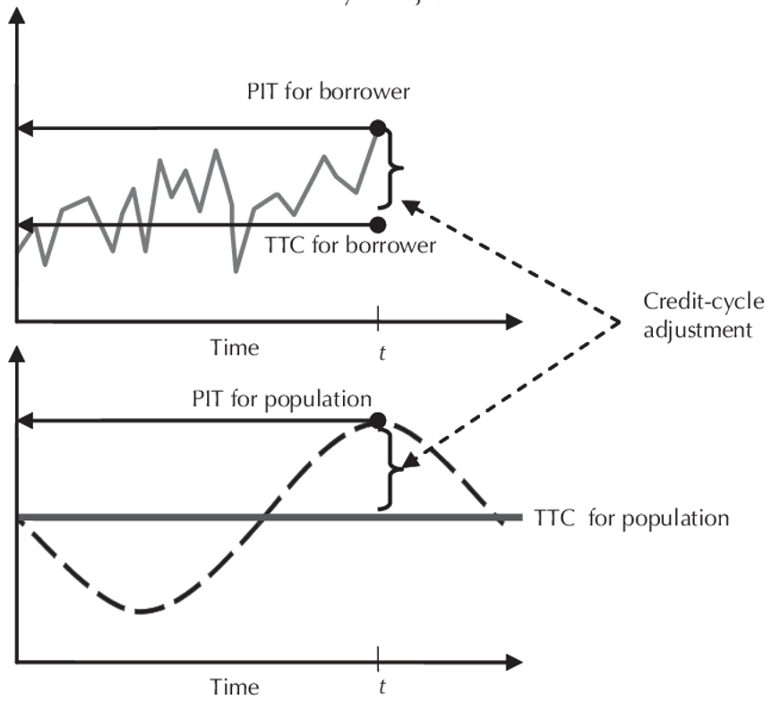

# [[ifrs9_standard|IFRS 9]] vs IRB

Banks around the globe leverage their well-established IRB models as starting point to satisfy the [[ifrs9_standard|IFRS 9]] modelling needs. The IRB PD, LGD and EAD parameters are typically TTC with some flooring and Margin of Conservatism (MoC) added. [[ifrs9_standard|IFRS 9]] requires the use of forward looking PIT parameters or conditional FiT parameters. The outcome of the IRB models is adjusted for [[ifrs9_standard|IFRS 9]] purposes to reflect forward looking and macro-economic information.

IRB models will be designed and implemented to estimate PDs and LGDs in order to calculate capital requirements. [[ifrs9_standard|IFRS9]] models are designed to estimate PDs and LGDs in order to calculate provision requirements. It should be noted that, though the purposes and calculations may differ, many banks choose to combine elements of the modelling process for these different risk parameters in order to reduce costs.

The level of provisions will not necessarily affect capital requirements but will affect the amount of capital available to meet these requirements.

## Standards & Setters

- IRB: Based on [[bis|Basel]] Accords created by [[bis|BIS]]. Specific approaches and guidance per asset class.
- [[ifrs9_standard|IFRS 9]]: Based on [[ifrs9_standard|IFRS9]] accounting regulation produced by IASB. Guidance and different approaches based on business models and cash flow characteristics of the assets.

## Purpose

- IRB: Focused on estimation of PDs and LGDs for use in the calculation of regulatory capital requirements. Focused on identifying possible defaults on assets and setting aside capital for these. Ensures banks can estimate and prepare for unexpected losses.
- [[ifrs9_standard|IFRS 9]]: Focused on estimation of PDs and LGDs for use in the calculation of regulatory provision requirements. Focused on identifying impaired assets and setting aside provisions for these. Ensures banks can estimate and prepare for expected losses.

## Data

- IRB: Explicit data requirements (e.g. 7 years for non-retail exposures)
- [[ifrs9_standard|IFRS 9]]: Data requirements are outcomes-focused and not explicit

## Modelling Methodology

- IRB: Multiple modelling approaches, including both FIRB and AIRB approaches. A more conservative approach is used to estimate losses, including the use of floors outlined in the IRBA.
- [[ifrs9_standard|IFRS 9]]: A general or simplified approach is possible. A best-estimate basis is used to estimate losses, over multiple economic scenarios.

## PDs

- IRB: Combinations of PIT and TTC PDs used when estimating default within the next 12 months
- [[ifrs9_standard|IFRS 9]]: PIT PDs estimating default within the next 12 months (Stage 1) or over the remaining lifetime (Stage 2/3).

<!-- ### Through-the-Cycle (TTC) PDs

Credit rating systems focus mostly on producing a conservative PD-estimate that remains static (but stressed) over the lifetime of each loan, often by design.

The broad goal of such systems is to facilitate the estimation of regulatory and [[01-economic_capital|economic capital]], which should absorb any catastrophic (or unexpected) losses under the [[basel_framework|Basel framework]] from the [[bis|BCBS]]. Any temporal effects that might affect the PD during loan life are therefore largely ignored, together with any macroeconomic influences; particularly since the latter is already assumed to be stressed to a recession-like level during PD-estimation. Doing so renders the resulting PD-estimates as through-the-cycle (TTC) in that they should at least approximate the long-run averages of 1-year (12-month) historical default rates over a full macroeconomic cycle, as required during capital estimation. While these TTC PD-estimates are certainly stable over time by design, they are also typically inaccurate within any other setting besides capital estimation.

Put simply, a TTC PD is a measure of the likelihood that a borrower will default over a specific time horizon, calculated in a way that smooths out fluctuations caused by economic or business cycles. It reflects a borrower's average risk of default under both favorable and unfavorable economic conditions. The goal of TTC PD is to isolate a borrower's intrinsic credit risk (their ability to meet obligations independent of short-term economic changes).

In this case, the TTC population PD  seen in the graph above (population being segmented by risk grades) is also the same TTC for the borrower (i.e. this is the LRA PD calibrated at the end of the [[07-risk_quantification|risk quantification]] step per risk grade):

$\text{PD}_{i}^\text{TTC}(12,x_{i},[t_a',t_b'])$

And it is this TTC PD that is used to aquire the systemically conditional PD (denoted as the PIT for population) used in the RWA calculation:

$\text{PD}_{i}^\text{SysPiT}(12,x_{i}|\text{S}_{99.9^{th}}=N^{-1}(0.999)) = N(\large\frac{N^{-1}(p^*)+\sqrt{\rho}N^{-1}(0.999)}{\sqrt{1-\rho}})$

where $p^* = \text{PD}_{i}^\text{TTC}(12,x_{i},[t_a',t_b'])$

For [[ifrs9_standard|IFRS 9]] models, we are interested in the PiT PD for the borrower (which is modeled during the [[03-risk-differentiation|risk differentiation]] phase) since we require not only a 12-month PD, but a lifetime one as well, or even a term-structure of PDs.

### Point-in-Time (PiT) PD

IRB PiT PD models are traditionally based on an expectation over the next twelve months. [[ifrs9_standard|IFRS 9]] requires a forward looking – or Forward in Time (FiT) – approach. The expectation as part of the [[ifrs9_standard|IFRS 9]] requirements is that both a 12 month and lifetime FiT PD are calculated with macroeconomic factors considered.

|Feature|IFRS 9|IRB|
|-|-|-|
|PD Types|PIT or FIT|TTC|
|Macroeconomic Sensitivity|High|Low|
|Update Frequency|Monthly|Annual or Longer|
|Data Time Horizon|Borrower specific time|Full economic cycle (at least 5 years)|
|Horizon|12m and lifetime|12m|
|Level of Granularity|Contract level|Counterparty level|
|Flooring|No floor|0.03% floor|
|Data Inputs|Model includes all reasonable and supportable information about past events, current conditions and forecasts of future macroeconomic conditions (forward looking perspective)|Model includes only variables representing the intrinsic quality to the counterparty.|

### Converting 12m TTC PD to 12m PiT PD

Conditional PiT PD and LGD values can be obtained by adjusting the pre-MoC and pre-floored IRB TTC PD (i.e. LRA PDs) for the macroeconomic impact using a Vasicek model (at a risk grade level not an individual borrower level). The Vasicek model links the impact of systematic risk to a single (unobservable) factor. Macro-economic factors can be used to approximate the single factor in the Vasicek model.

$\text{PD}_{i}^\text{SysPiT}(12,x_{i}|\text{S}_{1-\alpha^{th}}=N^{-1}(1-\alpha))$ for a given $\alpha$ that corresponds to the current PiT.

### Converting 12m PiT PiT to 12m Lifetime PD

Likewise, IRB PDs need to be extended from a 12-month horizon to a remaining lifetime. As rating is a key identifier for classifying assets between the three stages, it is necessary to extend the 12-month PD on a rating level. However, migrations between different ratings can occur over time.

The impact of migrations between ratings is considered by using migration matrices:

- Two migration matrices are multiplied with each other to obtain the 2-year migration matrix, The last column of the resulting matrix now represents a 2-year cumulative PD.
- The 12-month PD for the second year is obtained by subtracting the 1-year PD from the 2-year cumulative PD.
- Going forward, the n-th year cumulative PD is obtained from multiplying n migration matrices, and the n-th year 12-month PD is obtained by subtracting the (n - 1)th year cumulative PD from the n-th year cumulative PD.
- In order for the lifetime PD to represent current and future macro-economic conditions, the migration matrices used in this calculation are made PiT by linking it to the “state of the economy” per year in the future. -->

## LGD

- IRB: Downturn LGDs used to estimate expected losses, using conservative scenarios, and these include both direct and indirect costs related to recoveries. Floor on certain types of assets.
- [[ifrs9_standard|IFRS 9]]: “PIT” LGDs used to estimate losses, using a range of economic scenarios, and these include only direct costs related to recoveries. No floor.

## EAD

- IRB: Amortization not included.
- [[ifrs9_standard|IFRS 9]]: Model includes expected lifetime changes in the balance outstanding that are permitted by the contractual terms: amortization, repayments and (partial) prepayments.

## Outpus

- IRB: Outputs of models to be used to calculate risk-weighted assets (RWAs), and risk parameters to be refreshed annually
- [[ifrs9_standard|IFRS 9]]: Outputs of models to be used to calculate expected [[02-credit_losses|credit losses]] (ECLs) on an ongoing, continuous basis

## AFS

- IRB: Capital estimates will primarily affect the balance sheet statement.
- [[ifrs9_standard|IFRS 9]]: Provisions will affect the balance sheet and income statement, primarily profit and loss

## Disclosures

- IRB: Specific disclosures detailed (e.g. ICAAP), primarily within risk-based functions
- [[ifrs9_standard|IFRS 9]]: Detailed disclosures requiring linkages between risk and accounting / finance functions