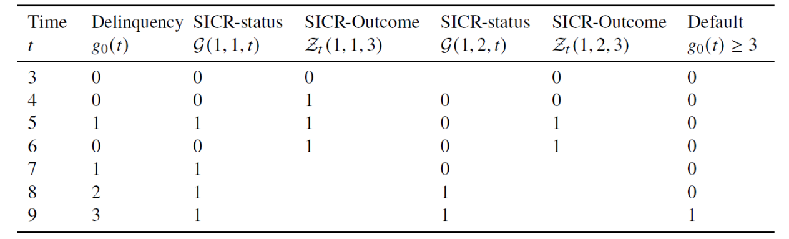
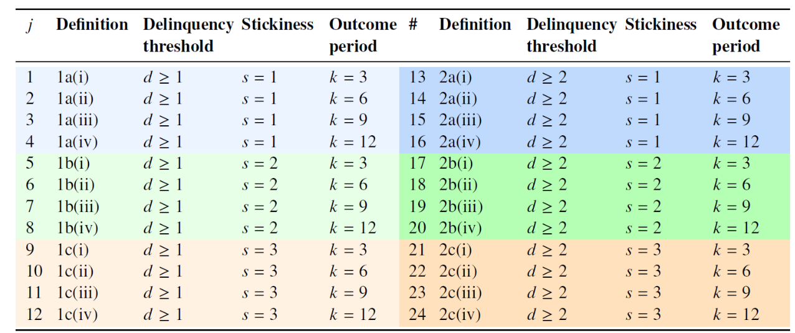

# SICR


The [[ifrs9_standard|IFRS 9]] standard does not prescribe a single method for determining a SICR but provides principles and guidelines. [[ifrs9_standard|IFRS 9]] allows institutions to design their SICR framework, which introduces variability across entities.

Factors to consider the occurence of SICR includes, but is not limited to:

- Quantitative indicators: PD comparison where a residual lifetime PD should used. It implies that the same remaining period is considered for PD at origination and reporting date. As a proxy, a 12m PD can be used if changes in a 12m PD are a reasonable approximation to changes in a lifetime PD.
- Qualitative indicators: [[ifrs9_standard|IFRS 9]] provides some examples such as credit spread, CDS price etc. These factors should considered separately as they are not included in the quantitative assessment.

## PD Comparison Approach

Let this $t$-month PD be denoted by $p_{t}(x_i,t')$ given risk information $x$ observed at time $t'$ for a specific loan account. A SICR-event can then be defined by comparing $p_1(x,t'_r)$ with $p_1(x,t'_i)$ between reporting time $t'_r$ and initial recognition time $t'_i$ , which reflects §5.5.9 in [[ifrs9_standard|IFRS 9]]. An accounted is SICR if there is a significant increase in the current FLI-adjsuted PD compared to the initial application PD (regardless of how it changed in between).

Should this change in risk estimates, or the magnitude $m(x,t'_r)$, exceed some arbitrarily chosen threshold $u$, then a SICR-event is said to have occurred. Note that $m(x,t'_r)$ can refer either to the difference $p_1(x,t'_r) -p_1(x,t'_i)$, or to the ratio $p_1(x,t'_r)/p_1(x,t'_i)$; though both definitions signify the change in lifetime PD. $m(x,t'_r) > u$, then the loan is migrated to Stage 2, otherwise it remains in Stage 1. Given any 𝑢-value, we subsequently formulate this approach into the binary-valued decision model $H(𝑚, 𝑢) ∈ {0, 1}$

```math
H(m,u) = [m>u]
```

The converse is presumably true as well: a Stage 2 loan is migrated back to Stage 1 once its risk has improved, i.e., if $m(x,t_r'')\leq u$ at some future time $t_r''> t_r'$ . Doing so would be cost-efficient, particularly since overzealous Stage 2 classification can become prohibitively costly, even if risk-prudent.

This approach immediately highlights at least two challenges in establishing whether credit quality has deteriorated significantly.

1. Selecting an appropriate threshold for the magnitude is non-trivial and highly subjective, which is exacerbated by [[ifrs9_standard|IFRS 9]] being principled instead of overly prescriptive. Neither [[ifrs9_standard|IFRS 9]] nor most regulators offer any firm guidance on the choice of $u$. While the [[eba|European Banking Authority]] defines $u = 200\%$, it provides no explanation for this seemingly arbitrary value. In fact, the [[pra|PRA]] observed multiple threshold-values that were in use across UK banks and even across different portfolios; all of which attests to further arbitrariness.
2. Secondly, any reliance on the point estimate PD tacitly requires a certain degree of accuracy. Examples: inappropriate
modelling technique, failing to capture the time-dynamic nature of lifetime PD, selecting good predictive variables, data quality, paucity of data for low default portofolios.

The UK-regulator is unsurprised by these differences in SICR-classification, presumably due to the underlying differences across banks in their risk appetites, strategies, and portfolio compositions.

<https://www.pwc.com/gx/en/audit-services/ifrs/publications/ifrs-9/ifrs-9-impairment-significant-increase-in-credit-risk.pdf>

### Threshold Options

The requirement for the use of significant deterioration requires a methodology to both define what is “significant” and identify a trigger process to apply the deterioration. The application and identification of these triggers has not yet been established in the industry. However, there are a number of ways being considered.

There are a number of approaches that can be used to apply the thresholds and triggers for an increase in credit risk using a Lifetime PD. Based on a simple total lifetime PD by grade, the following are examples identifying the PD Trigger:

- Absolute
- Fixed
- Proportional
- Combination

### Boundary Calibration

The selection of boundary between Stage 1 and Stage 2 is a special case of a scientific problem that has existed since at least the development of Radar in the 1930s. The problem of “is it a bird, or is it a bomber” is also encountered in many medical and scientific applications. Optimal separation of birds and bombers requires calibration of a threshold which minimises the Mean Square Error.

### Forward Roll Rates

Some banks select $u$ such that the SICR-flagged population constitutes a pre-defined % of the portfolio, where the percentage is based on the observed transition rate (**roll rate**) of becoming delinquent, i.e., reaching 30 days past due (Stage 1 to Stage 2). Roll rates offer a dynamic and quantitative way to model credit risk and inform SICR criteria. Roll rates represent the probability of a loan transitioning from one delinquency bucket to another over a specified time horizon.  

You can plot these roll rates historically to determine an average roll rate and use that to inform what % of your portofolio should be SICRed.

You determine the transition probabilities between delinquency buckets over the last 12 months lets say. If 10 out of 100 loans in the "current" bucket transition to the "1–30 days past due" bucket, the roll rate is 10%. At the reporting date, we then will move 10% of the accounts. But the question then becomes which accounts do we move? This is then up to the individual banks to look at other variables such as:

- Change in orgination vs current PDs
- Number of other loans
- Performance on other loans

A good example is if you have a home loan and a credit card. If you were to miss a payment it would be on your credit card since missing payments on your home could lead to repossesion. Hence, you would be SICRed on your home loan ECL should you miss payments on your credit card.

While certainly simple, this method suffers from at least three major drawbacks.

1. The precise way in which the roll rate is calculated can adversely affect the chosen $u$-value, if done incorrectly. Some notable risk factors include both the length and recency of the underlying sampling window, which may be inappropriately short or exclude known periods of macroeconomic distress.
2. Targeting any % presumes that the delinquent proportion of a portfolio will itself remain largely static in future. This rather crude assumption surely cripples the risk-sensitivity of SICR-classification, especially so during times of macroeconomic upheaval, precisely when SICR-classification should have been dynamic.
3. Stakeholders commonly disagree when adjusting this %-value across different macroeconomic scenarios, which
renders the eventual $u$ value as highly subjective and possibly divorced from reality.

## SICR Modelling

The basis of ‘SICR-modelling’ is then finding a statistical relationship between future SICR-events and a broad set of present-day inputs that predict those SICR-events. Such a binary classification task can render SICR-predictions more accurately, which includes the change in risk since initial recognition; i.e., the magnitude $m(x, t_r)$.

In fact, [[ifrs9_standard|IFRS 9]] already requires the use of "all reasonable and supportable information" to identify a SICR-event (cf. §5.5.4, §5.5.9, §5.5.11, §5.5.17), which further supports statistical modelling.

It is not strictly necessary to compare explicit PD-estimates at two points, provided that the evolution of default risk over time is incorporated in some other way. In principle, and when viewed retrospectively, a SICR-event should reasonably preempt a default event such that the **timings of both events do not coincide**, lest we contravene §B5.5.21. This principle suggests using loan delinquency (and its pre-default evolution) directly in defining a SICR-event, at least retrospectively.

### Deliquency Measure

A delinquency measure quantifies the gradual erosion of trust between bank and borrower in honouring the credit agreement. The $𝑔_0$-measure (or the unweighted number of payments in arrears) which is constructed from days past due (DPD) is used for its intuitive appeal and industry-wide ubiquity.

### SICR Indicators

In defining a SICR-event, one can compare the deliquency measure $𝑔_0(𝑡)$ at time 𝑡 against a specifiable threshold 𝑑. In fact, delinquency can be tested over multiple consecutive months, thereby ensuring that a ‘true’ SICR-event is eventually identified at 𝑡. Such a preliminary SICR-event is said to have occurred at time 𝑡 if $𝑔_0(𝑣) ≥ 𝑑$ holds true across a fixed time span $𝑣 ∈ [𝑡 − (𝑠 − 1), 𝑡]$. The specifiable parameter $𝑠 ≥ 1$ is the number of consecutive months for which delinquency is tested; put differently, 𝑠 is the **stickiness** of the aforementioned delinquency test. These ideas are formalised within the Boolean-valued decision function $G(𝑑, 𝑠, 𝑡)$ that yields a binary-valued SICR-status in defining a SICR-event at an end-point 𝑡, expressed as:

```math
G(d,s,t)=[(\displaystyle\sum_{v=t-(s-1)}^t[g_0(v)\geq d])=s] \text{ for } t\geq s
```

where [𝑎] are Iverson brackets that outputs 1 if the enclosed statement 𝑎 is true and 0 otherwise. The 𝑠-parameter simply smooths away rapid 0/1-fluctuations in the SICR-status over time, thereby becoming ‘sticker’ as 𝑠 increases.

The loan’s resulting binary-valued SICR-statuses, i.e., its $G(𝑑, 𝑠, 𝑡)$-values, can now be used within a typical cross-sectional modelling setup for predicting future SICR-events, or SICR-outcomes.

In preparing the modelling dataset, we observe all predictive information of loan $𝑖$ at a particular time 𝑡. Then, the loan’s future SICR-status at time $𝑡 + 𝑘$ is merged to the observations at 𝑡, thereby taking a snapshot between two points in time, or a cross-section. However, the chosen value for this third parameter $𝑘 ≥ 0$ (or outcome period) can significantly affect modelling results.

More formally, a process $Z_𝑡 (𝑑, 𝑠, 𝑘) = G(d,s,t+k)$ prepares a given loan’s monthly performance history by evaluating G at ‘future’ time $𝑡 + 𝑘$, though assigns the result to time 𝑡.



Various SICR-definitions are generated using the $Z_𝑡(𝑑, 𝑠, 𝑘)$-process simply by systematically varying its parameters $(𝑑, 𝑠, 𝑘)$.

The parameter space includes: 1) the threshold 𝑑 ∈ {1, 2} of $𝑔_0$-measured delinquency beyond which SICR is triggered; 2) the level of stickiness 𝑠 ∈ {1, 2, 3} within the delinquency test; and 3) the choice of outcome period 𝑘 ∈ {3, 6, 9, 12} when modelling SICR-outcomes. While the parameter spaces of 𝑑 and 𝑠 are appreciatively small, the same luxury does not hold for the outcome period 𝑘, which can indeed assume many values.



Each entry in the table can serve as a particular target definition in building a corresponding SICR-model using some technique.

### Binary Logistic Regression

Our chosen chosen modelling technique is binary logistic regression, given its ubiquity in credit risk modelling. Each resulting logit-model will therefore yield a probability score for a particular account at each point during its lifetime. These 𝑘-month forward SICR-predictions reasonably approximate their true lifetime counterpart, which can admittedly only be rendered by using more dynamic/complex modelling techniques, e.g., survival analysis.

In predicting the SICR-outcomes $𝑦_{𝑖𝑡}$ for each outcome period, consider the raw dataset D as a realised vector of input variables. These variables are thematically grouped as follows:

1. account-level information $𝒙_𝑖$ for loan 𝑖, e.g., repayment type (debit order, cash);
2. macroeconomic information $𝒙_𝑡$ at time 𝑡, e.g., the prevailing inflation rate;
3. time-dependent behavioural information $𝒙′_{𝑖𝑡}$ , e.g., the time spent in a performing spell, or the PD-ratio that signifies the change in default risk since initial recognition.

Here we are trying to model the **conditional SICR probability**.

The probabilistic SICR-predictions from logit-models will need to be dichotomised towards rendering impairment staging decisions under [[ifrs9_standard|IFRS 9]], i.e., Stage 1 or 2, which are respectively called a ‘negative’ or
‘positive’ event. An appropriate cut-off c ∈ [0, 1] is therefore required for dichotomising each probability score 𝑝 ∈ [0, 1] from each SICR-model 𝑗.

Moreover, SICR-outcomes are relatively rare and the consequences of misclassifying positives vs. negatives are intuitively unequal. Under [[ifrs9_standard|IFRS 9]], false negatives 𝐹− should be costlier than false positives 𝐹+ in that the former implies the bank has failed to increase its loss provision for those accounts with increasing credit risk, i.e., those accounts with an actual future SICR-outcome. Misclassification costs are accordingly assigned as $𝑐_{𝐹-}$ = 6 for false negatives and $𝑐_{𝐹+}$ = 1 for false positives, which implies an intuitively high cost ratio of 𝑎 = 6/1 across all SICR-models.

These costs are deduced using expert judgement and experimentation, though can certainly be refined in future work. Given this 𝑎-value, each 𝑐-value is then found using the Generalised Youden Index.

Finally, each SICR-model is dichotomised into the discrete classifier ℎ that yields the class prediction $ℎ(𝒙_𝑖) = 1$ if $𝑝(𝒙_𝑖) > 𝑐$ and $ℎ(𝒙_𝑖) = 0$ otherwise.

### Feature Selection

Selecting viable input variables within each SICR-model is mainly achieved by using iterative logistic regressions, often grouped into various mini-themes in distilling insight. This interactive process is guided by experimentation, expert judgement, model parsimony, statistical significance, macroeconomic theory, goodness-of-fit, and prediction
accuracy. Note that in this work, we are ultimately examining the effect of a particular SICR-definition within a broader multi-definition setup.

Therefore, and as a last step, the selected features are ‘standardised’ within each definition class in the table such that all SICR-models have the same input space per (𝑑, 𝑠)-tuple across all 𝑘-values. This ‘standardisation’ should not be confused with rescaling some quantity towards achieving zero mean and unit variance. By standardising the input space, one can therefore ascribe observable patterns in model performance
only to variations in the SICR-definition itself, without contending too much with changes in the input space.

>"Furthermore, the variable `pd_ratio` signifies the change in the lifetime PD since initial recognition, which ensures compliance with §5.5.9 of [[ifrs9_standard|IFRS 9]]. Our results, however, show that this variable is statistically insignificant across all SICR-definitions, which implies that the broader input space already captures whatever intrinsic information this variable might have in predicting future SICR-events. This profound result clearly rebuts the underlying intuition of §5.5.9 on incorporating the lifetime PD when rendering SICR-flagging decisions. However, this result is also unsurprising since the associated PD-model  has an input space that is similar (but smaller) to those of the various SICR-models. Therefore, not only do these SICR-models predict future SICR-events more accurately, but they also do so more parsimoniously than the PD-comparison approach."

### Outcome Period 𝑘

In general, SICR-classification should react dynamically to changes in credit risk and its pre-default evolution over time. This dynamicity is even implicit in §B5.5.2 of [[ifrs9_standard|IFRS 9]], which postulates that a SICR-event should ideally predate an increase in loan delinquency, i.e., the $𝑔_0$-measure. In predicting such events, shorter outcome periods 𝑘
can demonstrably achieve this dynamicity more readily than longer periods, since the latter is at greater risk of missing short-term fluctuations in $𝑔_0(𝑡)$ between times 𝑡 and 𝑡 + 𝑘.

However, the ‘optimal’ choice of this outcome period is yet unclear, as is the very idea of optimality within this SICR-modelling context. To help fill this gap, we deliberately vary 𝑘 from 3 months up to an extreme of 36 months when training our cross-sectional SICR-models,
at least within this particular subsection.

Aside from the 𝑘-parameter, the two other parameters are kept constant at 𝑑 = 1 and 𝑠 = 1, which resolves to definition class 1a within the table. These two values are relatively benign for the following two reasons. Firstly, the underlying SICR-test $𝑔_0(𝑡) ≥ 𝑑$ suggests that 𝑑 = 2 will yield a subset of SICR-outcomes that are already selected by 𝑑 = 1.

Secondly, 𝑠 = 1 implies zero ‘stickiness’ and simplifies the
resulting SICR-definition. Both choices of 𝑑 and 𝑠 should therefore have minimal interference when studying the effect of 𝑘, as intended.

In exploring the portfolio-level effect of a given SICR-definition, one may start by examining the actual SICR-rate; i.e., the Stage 2 transition/delinquency rate over a 𝑘-month period.

Each SICR-rate has a different but increasing mean-level as 𝑘 increases, especially when examined after the anomalous 2008 Global Financial Crisis (GFC). Since $𝑔_0(𝑡 + 𝑘) ≥ 3 > 𝑑$ will hold for both default and SICR-outcomes, larger 𝑘-values will increasingly capture a greater proportion of defaulting accounts, thereby explaining the phenomenon.

Moreover, the figure reveals a plateauing effect in the mean, which suggests that choosing $𝑘 ≥ 18$ has a negligible contribution to the overall SICR-mean. At worst, choosing $𝑘 ≥ 18$ will increasingly select default-instances into the sample, thereby ‘contaminating’ the SICR-mean. Doing so can detract from the very idea of SICR-staging, which should ideally act as a pro-cyclical early warning system for impending credit risk; see §B.5.5.21 in [[ifrs9_standard|IFRS 9]] from IASB (2014). The SICR-rate of each 𝑘-value also exhibits a unique volatility pattern, which is seemingly more stable at the extremes, i.e., $𝑘 ≤ 3$ and $𝑘 > 24$. However, stable SICR-rates may not necessarily be a useful pursuit, especially not during an unfolding macroeconomic crisis and its subsequent effect on default rates. In particular, the most stable SICR-rates also failed to track the increasing default rates during 2007-2008.

As a working principle for defining the SICR-event, SICR-rates should reasonably exceed default rates since SICR-staging should ideally preempt default. This principle avails a useful heuristic in disqualifying both $𝑘 ≤ 3$ and $𝑘 > 24$, given their failure in tracking the 12-month default rate.

Consider then the portfolio-level 12-month conditional default probability, both time graphs should ideally overlap with each other quite closely, thereby suggesting that the aggregated predictions agree with reality. The early peak in $𝐴_𝑡$ clearly signifies the 2008-GFC, while $𝐵_𝑡$ reacts at least moderately in its prediction of the prevailing default rates. Aside from the anomalous 2008-GFC, the prediction $𝐵_𝑡$ evidently exceeds the actual default experience $𝐴_𝑡$ across the majority of periods, which is reassuringly risk-prudent.

The actual SICR-rates per 𝑘-value can be further examined on the basis of various summary statistics, i.e., the earliest 𝑎(𝑘), the maximum 𝑏(𝑘), and the post-2008 mean 𝑐(𝑘). We define two elementary statistics as: 

1. The early warning degree 𝑏(𝑘) − 𝑎(𝑘), which denotes the degree to which a SICR-rate can respond to unfolding calamities
2. The recovery degree 𝑏(𝑘) − 𝑐(𝑘), which measures the magnitude by which the SICR-rate can normalise post-crisis.

In the figure below, we show the time graphs of actual $𝐴_𝑡$ vs expected $𝐵_𝑡$ SICR-rates over calendar time 𝑡 for 𝑘 ∈ {3, 6, 9, 12}. Ideally, both time graphs should closely overlap each other, which would imply that our aggregated SICR-predictions agree with reality. One can measure the level of such agreement using the mean absolute error (MAE) between $𝐴_𝑡$ and $𝐵_𝑡$.