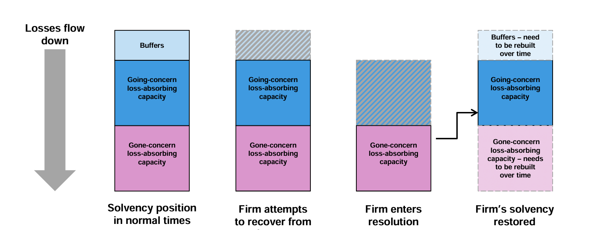
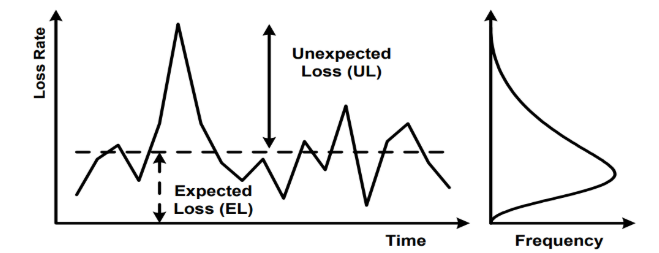

# Regulatory Capital

What we call regulatory capital differs from what is known as economic capital. In effect there are two approaches to consider the supply and demand of capital. The regulatory approach dictates the rules on which the demand is to be set, as well as the admissibility of supply, while an internal or economic approach considers the internal best estimate of demand and supply. Regulatory capital supply compared to a predetermined scalar of demand is what the regulators determine as adequate for a bank’s operations. Economic capital is what the bank itself views as appropriate for its activities. Usually, it is lower than regulatory capital, in that it incorporates a portfolio effect reflecting diversification of activities, but it may also include an additional small capital cushion or buffer.****

## Pillar 1: Minimum Capital Requirements (MCR)

The motivation to develop credit risk models stemmed from the need to develop quantitative estimates of the amount of regulatory and economic capital needed to support a bank’s risk taking activities.

### Basel I

Minimum capital requirements have been coordinated internationally since the Basel Accord of 1998. Under [Basel 1](docs\regulation\international\bis\basel_1.md), a bank’s assets were allotted via a **simple** rule of thumb to one of four broad risk categories, each with a ‘risk weighting’ that ranged from 0%-100%. A portfolio of corporate loans, for instance, received a risk weight of 100%, while retail mortgages – perceived to be safer – received a more favourable risk weighting of 50%.

Minimum capital $K$ was then set in proportion to the weighted sum of these risk-weighted assets (RWAs).

```math
K \geq 8\% \times \text{RWA}
\\
\text{RWA} = \text{Exposure} \times w
```

This can also be expressed in terms of capital adequacy ratio (CAR)

```math
\frac{K}{\text{RWA}} \geq 8\% 
```

Note that the original Basel I Accord only considered credit risk in the RWA. However, an amendment in 1996 then included an RWA associated with market risk as well. Some jurisdictions in emerging markets still apply the Basel I framework. For bank groups, some of their exposure may therefore be subject to Basel I in a specific country, Basel II in another country and Basel III on consolidation

### Basel II

Under Basel II, Pillar 1, the minimum capital requirement for credit risk in the banking book, is calculated in a new way that reflects the credit ratings of counterparties. The capital requirement for market risk remained unchanged from the 1996 Amendment, but there was a new capital charge for operational risk. The general requirement in Basel I, that banks hold a total capital equal to 8% of RWAs, remained unchanged. In response, Basel II had a much more granular approach to risk weighting. Under Basel II, the credit risk management techniques under can be classified under:

- Standardised approach: this involves a simple categorisation of obligors, without considering their actual credit risks. It includes reliance on external credit ratings.
- Internal ratings-based (IRB) approach: here banks are allowed to use their ‘internal models’ to calculate the regulatory capital requirement for credit risk.

These frameworks are designed to arrive at the RWAs, the denominator of four key capitalisation ratios (Total capital, Tier 1, Core Tier 1, Common Equity Tier 1).

#### Standardised Approach

The standardised approach has been used by banks which are not sufficiently sophisticated enough (in the view of the regulators) to use the internal ratings approaches. The standardised approach is similar to Basel I except for the calculation of risk weights.

##### Risk Weights

The risk weight for a country (sovereign) exposure ranges from 0% to 150%, and the risk weight for an exposure to another bank or a corporation ranges from 20% to 150%. Supervisors are allowed to apply lower risk weights (20% rather than 50%, 50% rather than 100%, and 100% rather than 150%) when exposures are to the country in which the bank is incorporated or to that country’s central bank.

For claims on banks, the rules are somewhat complicated. Instead of using the standard risk weights, national supervisors can choose to base capital requirements on the rating of the country in which the bank is incorporated.

The standard rule for retail lending is that a risk weight of 75% be applied, compared with 100% in Basel I. When claims are secured by a residential mortgage the risk weight is 35%, compared with 50% in Basel I. Due to poor historical loss experience, the risk weight for claims secured by commercial real estate is 100%.

##### Collateral Adjustment

There are two ways that banks can adjust risk weights for collateral. The first is called the simple approach and is similar to the approach used in Basel I. The second is called the comprehensive approach. Banks have a choice as to which approach is used in the banking book, but they must use the comprehensive approach to calculate capital for counterparty credit risk in the trading book.

Under the simple approach, the risk weight of the counterparty is replaced by the risk weight of the collateral for the part of the exposure covered by the collateral (the exposure is calculated after netting). For any exposure not covered by the collateral, the risk weight of the counterparty is used. The minimum level for the risk weight applied to the collateral is 20%. A requirement is that the collateral must be revalued at least every 6 months and must be pledged for at least the life of the exposure.

Under the comprehensive approach, banks adjust the size of their exposure upwards to allow for possible decreases in the value of the collateral. (The adjustments depend on the volatility of the exposure and the collateral.) A new exposure equal to the excess of the adjusted exposure over the adjusted value of the collateral is calculated and the counterparty’s risk weight is applied to this exposure. The adjustments applied to the exposure and the collateral can be calculated using rules specified in Basel II or, with regulatory approval, using a bank’s internal models. Where netting arrangements apply, exposures and collateral are separately netted and the adjustments made are weighted averages.

#### IRB Approach

Under the internal ratings-based (IRB) approach, regulators base the capital requirement on the value at risk calculated using a 1-year time horizon and a 99,9% confidence level. They recognise that expected losses are usually covered by the manner in which a financial institution prices its products (for example, the interest charged by a bank on a loan is designed to recover expected loan losses). The value at risk is calculated using a Gaussian copula model (single factor Vašíček) of time to default.

```math

\text{UL} = \text{VaR}_{99.9^{th}} = \text{EAD}_\text{Reg} × \text{LGD}_\text{Reg} × \text{WCDR}
\\
\text{EL} = \text{EAD}_\text{Reg} × \text{LGD}_\text{Reg} × \text{PD}_\text{Reg}
\\
```

The capital given by the above equations is intended to be enough to cover unexpected losses over a 1-year period that we are 99,9% certain will not be exceeded. The WCDR is the probability of default that (theoretically) happens once every thousand bank years. The capital required is therefore the value at risk minus the expected loss.

```math
K = (\text{UL} - \text{EL}) \times MA
\\
K = \text{EAD}_\text{Reg} × \text{LGD}_\text{Reg} × (\text{WCDR}-\text{PD}_\text{Reg}) \times MA
```

When the capital requirement for a risk is calculated in a way that does not involve RWAs, it is multiplied by 12,5 to convert it to an RWA. This approach has been adopted given the original Basel I approach to assess risk as a percentage of the value of an asset rather than calculating the capital requirement explicitly.

```math
\text{RWA} = K \times 12.5
```

The Basel Committee reserves the right to apply a scaling factor (less than or greater than 1,0) to the result of the calculations, if it finds that the aggregate capital requirements are too high or low.

A scaling factor of 1,06 has been applied by the SARB consistent with international practice.

##### Maturity Adjustment

The maturity adjustment is designed to allow for the fact that, if an instrument lasts longer than 1 year, there is a 1-year credit exposure arising from a possible decline in the creditworthiness of the counterparty as well as from a possible default by the counterparty.

##### F-IRB

Under the foundation IRB approach, banks supply PD, while the LGD, EAD, and maturity M are supervisory values set by the Basel Committee.

- PD is subject to a floor of 0,03% for bank and corporate exposures, while the LGD is set at 45% for senior claims and 75% for subordinated claims.
- When there is eligible collateral, in order to correspond to the comprehensive approach that was described earlier, the LGD is reduced by the ratio of the adjusted value of the collateral to the adjusted value of the exposure, both calculated using the comprehensive approach.
- The EAD is calculated in a way similar to the credit equivalent amount in Basel I and includes the impact of netting.
- M is set at 2,5 in most cases.

##### A-IRB

Under the advanced IRB approach, banks supply their own estimates of the PD, LGD, EAD, and M for corporate, sovereign, and bank exposures, subject to regulatory approval and therefore not necessarily the same as internal estimates.

- The PD can be reduced by credit mitigants such as credit triggers.
- The two main factors influencing the LGD are the seniority of the debt and the collateral.
- In calculating the EAD, banks can, with regulatory approval, use their own estimates of credit conversion factors.

> Suppose the assets of a bank consist of R1 billion of loans to BBB-rated corporations. The PD for the corporations is estimated as 0,1% and the LGD is 60%. Average maturity of the corporate loans is 2,5 years. Adjusted maturity is 1,59, which according to our equation makes the WCDR 3,4%. An implied value of p equal to 0,4 is used under the Basel II IRB approach, the RWAs for the corporate loans are: 12,5 × 1000 × 0,6 × (0,034 – 0,0001) × 1,59 = 393 or R393 million. This compares with R1 billion under Basel I and R1 billion under the standardised approach of Basel II.

The model underlying the calculation of capital for retail exposures is similar to that underlying the calculation of corporate, sovereign, and bank exposures. However, the foundation IRB and advanced IRB approaches are merged, and all banks using the A-IRB approach provide their own estimates of the PD, LGD, and EAD. There is no maturity adjustment.

> Suppose the assets of a bank consist of R500 million of residential mortgages where the PD is 0,005 and the LGD is 20%. In this case, p = 0,15 and WCDR = 0,67. The risk-weighted assets are: 12,5 × 500 × 0,2 × (0,067 – 0,005) = 78 or R78 million. This compares with R250 million under Basel I and R175 million under the standardised approach of Basel II.

In determining capital requirements for defaulted assets, the WCDR formula above sets N and PD equal to 1, and both EAD and LGD have to be estimated. The RWA formula then evaluates to LGD x EAD.

### Basel III

Basel III seeks to improve the standardised approach for credit risk in a number of ways. This includes strengthening the link between the standardised approach the internal ratings-based (IRB) approach. It also increased levels of capital by introducing usable capital buffers rather than capital minima.  

### Basel 3.1

Banks will need to start implementing and allowing for Basel 3.1 (IV) as it is to be in effect from January 2023.

### Additional MCR

Minimum capital requirements may be based on the jurisdiction in which a bank operates. The minimum capital requirements, however, are always set in line with the capital requirements set out by the Bank of International settlements (BIS) in their Basel guidelines.

In South Africa, Basel II implementation became effective 1 January 2008. Basel III became effective 1 January 2012 but is subject to transition elements that will continue until 2023. In South Africa, minimum capital included the sum of its Tier 1 and Tier 2 capital and primary and secondary unimpaired reserve funds. This amount could not at any time be less than the greater of R250 million or 10% (previously 8%) of risk-weighted assets. Tier 1 must make up at least 50% of a bank’s capital base.

### TLAC

Eligible instruments for [Total Loss-Absorbing Capacity TLAC]() should be stable and not subject to legal claim in the event of the bank’s resolution. TLAC is to be gradually phased in by 1 January 2022 with the following being met: TLAC must be 18% of RWAs and 6,75% of the Basel III leverage ratio denominator.

It should also be noted that TLAC must be held in addition to minimum capital requirements. Generally, instruments which are eligible for CET1 are also eligible for TLAC, but they may not be included in both.



### MREL

Minimum requirement for own funds and eligible liabilities (MREL) is a European standard introduced in 2016 that is conceptually similar to TLAC in that its implementation is supposed to ensure that banks have sufficient capacity to absorb losses and improve their ability to recapitalise in times of stress. While TLAC is based on percentages of RWA and leverage ratio (i.e. focusing on measures associated with Pillar 1 under Basel), MREL is equal to the loss-absorption amount plus a recapitalisation amount. These components are made up of:

- Loss-absorption amount: The higher of the sum of Pillar 1 and Pillar 2A risk-weighted capital requirements, leverage requirement, or the Basel I capital floor. This is intended to reflect the fact that a bank post-resolution would have to comply with these capital requirements
- Recapitalisation amount: A percentage from 0%–100% which is determined by local regulators. This percentage is larger for larger banks which are more systemically important.


The intent of MREL is that it broadly aligns to TLAC for G-SIBs and allows for the potential for
additional capital requirements (for the purpose of recapitalisation) for smaller non-SIBs.

## Credit Loss Distribution

When estimating the amount of economic capital needed to support their credit risk activities, banks employ an analytical framework that relates the overall required economic capital for credit risk to their portfolio’s probability density function (PDF) of credit losses, also known as loss distribution of a credit portfolio. Figure below shows this relationship. Although the various modelling approaches would differ, all of them would consider estimating such a PDF.


<https://www.bis.org/bcbs/irbriskweight.pdf>

Mechanisms for allocating economic capital against credit risk typically assume that the shape of the PDF can be approximated by distributions that could be parameterised by the mean and standard deviation of portfolio losses. Figure below shows that credit risk has two components. First, the expected loss (EL) is the amount of credit loss the bank would expect to experience on its credit portfolio over the chosen time horizon. This could be viewed as the normal cost of doing business covered by provisioning and pricing policies. Second, banks express the risk of the portfolio with a measure of unexpected loss (UL). Capital is held to offset UL and within the IRB methodology, the regulatory capital charge depends only on UL. The standard deviation, which shows the average deviation of expected losses, is a commonly used measure of unexpected loss.

Figure below illustrates how variation in realised losses over time leads to a distribution of losses for a bank:



The worst case one could imagine would be that banks lose their entire credit portfolio in a given year. This event, though, is highly unlikely, and holding capital against it would be economically inefficient. Banks have an incentive to minimise the capital they hold, because reducing capital frees up economic resources that can be directed to profitable investments. On the other hand, the less capital a bank holds, the greater is the likelihood that it will not be able to meet its own debt obligations, i.e. that losses in a given year will not be covered by profit plus available capital, and that the bank will become insolvent. Thus, banks and their supervisors must carefully balance the risks and rewards of holding capital.

### Value-at-Risk

The area under the curve in the PDF is equal to 100%. The curve shows that small losses around or slightly below the EL occur more frequently than large losses. The likelihood that losses will exceed the sum of EL and UL – that is, the likelihood that the bank will not be able to meet its credit obligations by profits and capital – equals the shaded area on the RHS of the curve and depicted as stress loss. 100% minus this likelihood is called the Value-at- Risk (VaR) at this confidence level. If capital is set according to the gap between the EL and VaR, and if EL is covered by provisions or revenues, then the likelihood that the bank will remain solvent over a one-year horizon is equal to the confidence level.

Under Basel II, capital is set to maintain a supervisory fixed confidence level. The confidence level is fixed at 99.9% i.e. an institution is expected to suffer losses that exceed its capital once in a 1000 years. Lessons learned from the 2007-2009 global financial crisis, would suggest that stress loss is the potential unexpected loss against which it is judged to be too expensive to hold capital. Regulators have particular concerns about the tail of the loss distribution and about where banks would set the boundary for unexpected loss and stress loss. For further discussion on loss distributions under stress scenarios see Haldane et al (2007).

This confidence level might seem rather high. However, Tier 2 does not have the loss absorbing capacity of Tier 1. The high confidence level was also chosen to protect against estimation errors, that might inevitably occur from banks’ internal PD, LGD and EAD estimation, as well as other model uncertainties.

### Expected Losses

So far the Expected Loss has been regarded from a top-down perspective, i.e. from a portfolio view. It can also be viewed bottom-up, namely from its components.

A bank has to take a decision on the time horizon over which it assesses credit risk. In the Basel context there is a one-year time horizon across all asset classes. The expected loss of a portfolio is assumed to be equal to the proportion of obligors that might default within a given time frame (frequency), multiplied by the outstanding exposure at default (severity), and once more by the loss given default (severity adjustment), which represents the proportion of the exposure that will not be recovered after default.

Under the Basel II IRB framework the probability of default (PD) per rating grade is the average percentage of obligors that will default over a one-year period. Exposure at default (EAD) gives an estimate of the amount outstanding if the borrower defaults. Loss given default (LGD) represents the proportion of the exposure (EAD) that will not be recovered after default. Assuming a uniform value of LGD for a given portfolio, EL can be calculated as the sum of individual ELs in the portfolio.

$\text{EL} = \displaystyle \sum_{i=1}^N{\text{PD}_{i}^\text{TTC}(12,x_{i},[t_a',t_b'])\times\text{EAD}_{i,t}(12)\times\text{LGD}_i}$ where $i$ denotes an obligor

### Unexpected Losses

Unlike EL, total UL is not an aggregate of individual ULs but rather depends on loss correlations between all loans in the portfolio. The deviation of losses from the EL is usually measured by the standard deviation of the loss variable. The UL, or the portfolio’s standard deviation of credit losses can be decomposed into the contribution from each of the individual credit facilities:

$\text{UL} = \displaystyle\sum_{i=1}^N\sigma_i\rho_i$

where $\sigma_i$ denotes the stand-alone standard deviation of credit losses for the $i$th facility, and $\rho_i$ denotes the correlation between credit losses on the ith facility and those on the overall portfolio. The parameter captures the ith facility’s correlation/diversification effects with other instruments in the bank’s credit portfolio. Other things being equal, higher correlations among credit instruments – represented by higher $\rho_i$ lead to a higher standard deviation of credit losses for the portfolio as a whole.

In the case of corporate, sovereign and bank exposures, Basel II assumes a relationship between the correlation parameter $\rho$ and the probability of default PD in an equation based on empirical research. A lower PD is associated with higher levels of correlation.

### Conditional Expected Losses

Another way of looking at it is through the following:

$\text{UL}=\text{Conditional Expected Losses}-\text{EL}$

$\text{Conditional Expected Losses}=\text{UL}+\text{EL}$

The formula sets the minimum capital requirement such that unexpected losses will not exceed the bank’s capital up to a 99.9% confidence level.

The implementation of this model (ASFR), developed for Basel II, makes use of average PDs that reflect expected default rates under normal business conditions. These average PDs are estimated by banks. To calculate the conditional expected loss, **bank-reported average PDs are transformed into systemically conditional PDs** using a supervisory mapping function (described below). The conditional PDs reflect default rates **given an appropriately conservative value of the systematic risk factor**. The same value of the systematic risk factor is used for all instruments in the portfolio. Diversification or concentration aspects of an actual portfolio are not specifically treated within an ASRF model.

In contrast to the treatment of PDs, Basel II does not contain an explicit function that transforms average LGDs expected to occur under normal business conditions into conditional LGDs consistent with an appropriately conservative value of the systematic risk factor. Instead, banks are asked to report **LGDs that reflect economic-downturn conditions** in circumstances where loss severities are expected to be higher during cyclical downturns than during typical business conditions.

The conditional expected loss for an exposure is estimated as the product of the conditional PD and the “downturn” LGD for that exposure. Under the ASRF model the total economic resources (capital plus provisions and write-offs) that a bank must hold to cover the sum of UL and EL for an exposure is equal to that exposure’s conditional expected loss. Adding up these resources across all exposures yields sufficient resources to meet a portfolio-wide Value-at-Risk target.

This can be illustrated below. Ideally, ELs should be covered by provisions. However, if there is a shortfall between EL and provisions (EL> provisions), then this shortfall is deducted from Tier 1 capital. Likewise, if there is an excess, Basel describes how much you are allowed to include in your Tier 2 capital.


### Downturn LGDs

The Basel Committee considered two approaches for deriving economic-downturn LGDs. One approach would be to apply a mapping function similar to that used for PDs that would extrapolate downturn LGDs from bank-reported average LGDs. Alternatively, banks could be asked to provide downturn LGD figures based on their internal assessments of LGDs during adverse conditions (subject to supervisory standards).

In principle, a function that transforms average LGDs into downturn LGDs could depend on many different factors including the overall state of the economy, the magnitude of the average LGD itself, the exposure class and the type and amount of collateral assigned to the exposure. The Basel Committee determined that given the evolving nature of bank practices in the area of LGD quantification, it would be inappropriate to apply a single supervisory LGD mapping function. Rather, Advanced IRB banks are required to estimate their own downturn LGDs that, where necessary, reflect the tendency for LGDs during economic downturn conditions to exceed those that arise during typical business conditions. Supervisors will continue to monitor and encourage the development of appropriate approaches to quantifying downturn LGDs.

The downturn LGD enters the Basel II capital function in two ways. The downturn LGD is multiplied by the conditional PD to produce an estimate of the conditional expected loss associated with an exposure. It is also multiplied by the average PD to produce an estimate of the EL associated with the exposure.

### Systemically Conditional PDs

The mapping function used to derive systemically conditional PDs from average PDs is derived from an adaptation of Merton’s (1974) single asset model to credit portfolios. According to Merton’s model, borrowers default if they cannot completely meet their obligations at a fixed assessment horizon (e.g. one year) because the value of their assets is lower than the due amount. Merton modelled the value of assets of a borrower as a variable whose value can change over time. He described the change in value of the borrower’s assets with a normally distributed random variable.

Vasicek (cf. Vasicek, 2002) showed that under certain conditions, Merton’s model can naturally be extended to a specific ASRF credit portfolio model. With a view on Merton’s and Vasicek’s ground work, the Basel Committee decided to adopt the assumptions of a normal distribution for the systematic and idiosyncratic risk factors.

#### Vasicek Model

Vasicek applied to firms’ asset values what had become the standard geometric Brownian motion model. Expressed as a stochastic differential equation:

$dA_i = \mu_iA_i~dt + \sigma_iA_i~dx_i$

Where $A_i$ is the value of the ݅ith firm’s assets, $\mu_i$ and $\sigma_i$ are the drift rate and volatility of that value, and $x_i$ is a Wiener process or Brownian motion, i.e. a random walk in continuous time in which the change over any finite time period is normally distributed with mean zero and variance equal to the length of the period, and changes in separate time periods are independent of each other. Solving this stochastic differential equation one obtains the value of the ith firm’s assets at time $T$ as:

$A_i(T)=e^{\small A(0) + \mu_iT-\frac{1}{2}\sigma_i^2T+\sigma_i\sqrt T X_i}$

The $݅i$-th firm defaults if $A_i(T)<B$ so the probability of such an event is

$P[A_i(T)<B]=P[X_i<c_i]=p^*$

where $c_i$ is easily derived from equation (1). That is, default of a single obligor happpens if the value of a normal random variable happens to fall below a certain $c_i$.

**$p^*$ is the average loss rate in 1-year or the 1-year through-the-cycle (TTC) PD.**

Assume that a bank has a very large number of obligors, all of which have the same 1-year PD. Correlation between defaults is introduced by assuming correlation in the $A_i$ processes, and thus in the terminal values, $A_i(T)$. In particular, it is assumed that the $X_i$ s in equation (1) are pair-wise correlated according to factor $\rho$. The higher $\rho$, the more dependent the borrowers are on systematic environment. When $\rho = 0$ this implies total independence between borrowers.

Being normal and equi-correlated, each random variable can then be represented as the sum of two other random variables: one common across firms, and the other idiosyncratic that are both standard normal ~$N(0,1)$.

$X_i = \text{S}_{t'}\sqrt{\rho}+Z_i\sqrt{1-\rho}$

where $\text{S}_{t'}$ and $Z_i$ are respectively the normalised systematic and the idiosyncratic (asset specific) components. An economic index over the interval $(0,T)$ is given by $\text{S}_{t'}=\Large\frac{\text{FLI}_{t'}-\mu}{\sigma}$. Hence the probability of default of obligor $i$, conditional on $\text{S}_{t'}$, can also be written as:

$P[X_i < c_i | \text{S}_{t'}] = P[X_i < N^{-1}(p^*)|\text{S}_{t'}]$

$= P[\text{S}_{t'}\sqrt{\rho}+Z_i\sqrt{1-\rho}<N^{-1}(p^*)]$
$= P[Z_i<\frac{N^{-1}(p^*)-\text{S}_{t'}\sqrt{\rho}}{\sqrt{1-\rho}}]$
$= N(\large\frac{N^{-1}(p^*)-\text{S}_{t'}\sqrt{\rho}}{\sqrt{1-\rho}})$

By taking the inverse of the standard normal distribution applied to confidence level one can derive conservative value of systematic factor $S$. Rewriting this in terms of the 99.9% quantile for Basel we end up with the WCDR. The WCDR denotes the “worst-case default rate”, in that we are 99,9% certain will not be exceeded next year provided all exposures are equal and no correlation exists between LGD and PD.

$\text{WCDR} = \text{PD}_{i}^\text{SysPiT}(12,x_{i}|\text{S}_{99.9^{th}}=N^{-1}(0.999)) = N(\large\frac{N^{-1}(p^*)+\sqrt{\rho}N^{-1}(0.999)}{\sqrt{1-\rho}})$

where $p^* = \text{PD}_{i}^\text{TTC}(12,x_{i},[t_a',t_b'])$

This is component is the same one that appears Basel:

$K=\text{LGD}[N(\frac{G(\text{PD})+\sqrt{R}\times G(0.999)}{\sqrt{1-R}})-\text{PD}]$

#### Systemtic Risk

Given a macroeconomic scenario, a time series $S_t'$ can be computed, which can then be used in the Vasicek framework to  calculate the loss rate conditional to that specific scenario. The common component $S_t'$ may be viewed as representing aggregate macro-financial conditions which can be extracted from observable economic data. Aggregate credit risk depends on the stochastic common factor $S_t'$, because when we face good economic times the expected loss rate tends to below the long-term average, while during bad times the expected loss rate is expected to be above the long-term average. $S_t'$ can be estimated empirically using the Kalman filter algorithm.

#### Asset Correlations

A portfolio with high correlations produces greater default oscillations over the cycle $S_t'$, compared with a portfolio with lower correlations. Correlations do not affect the timing of the default; higher correlations do not imply that defaults earlier or later than other portfolios. Thus, during good times a portfolio with high correlations will produce fewer defaults than a portfolio with low correlations. While in bad times the opposite is true, high correlations are creating more defaults. Some benchmark values of ρ are available from the regulatory regimes. The Basel II IRB risk-weighted formulae, which are based on the Vasicek model, prescribes, for corporate exposures, correlations between 12% and 24%, where the actual number is computed as a probability of default weighted average.

Following the Vasicek framework, two borrowers are correlated because they are both linked to the common factor $S_t'$. Clearly this is a simplification of the true correlation structure.
