# Definitions

## Definition of Default (DoD)

```mermaid
---
config:
  theme: 'base'
  themeVariables:
    primaryColor: '#BB2528'
    primaryTextColor: '#fff'
    primaryBorderColor: '#7C0000'
    lineColor: '#F8B229'
    secondaryColor: '#816c32ff'
    tertiaryColor: '#fff'
---
graph TD;
    A[Definition of Default] --> B[Return of Default]
    A --> C[Days past Due > 90]
    A ---> D[Unlikeliness to Pay]
    D --> D1[Bankruptcy]
    D --> D2[Forebearance]
    D2 --- E1[Rate reduction, hardship, short-term assitance, debt management]
    D --> D3[Charge-off]
    D --> D4[First Party Fraud]
    D --> D5[Deceased]
    D --> D6[Contagion/Pulling Effect]
    D6 --- E2[If a customer defaults on one card, flag all other cards as defaults too, given material default exposure]
    D2 --> |After 12 months probabtion period| B
    C --> |After 12 months probabtion period|B

    classDef black fill:#000,stroke:#999,stroke-width:0px
    classDef grey fill:#636363ff,stroke:#fff,stroke-width:0px;
    class A black
    class E1,E2 grey
```

Default identification is one of the most critical steps in transforming raw data into model-ready datasets for IRB and IFRS 9 models. The regulatory definition of default (DoD) is guided primarily by Article 178 of the CRR, and is interpreted via local guidance such as EBA GL/2016/07 and supervisory statements like SS11/13 and SS3/24 (PRA).

### Days Past Due (DPD)

| Term | Regulatory Reference | Regulatory Requirement | How Requirement Is Met|
| - | - | - | - |
| DPD | CRR §178(1)(b); SS3/24 §2.1–2.7 | Amounts of principal, interest or fees unpaid on the due date must be recognised as “credit obligation past due”. | A months-in-arrears approach beyond 3 months is used and is operationally aligned to “DPD > 90 days”. Accounts >90 DPD are classified as default. |
| Technical Past Due | SS3/24 §2.8–2.9 | Technical past due applies only when default is caused by: data/system error; failed execution of payment; payment system failure; timing lags in payment allocation; factoring cases where no receivable >30 DPD. | No historical technical defaults. Exception processes exist to identify and correct erroneous flags. IT teams correct system or process errors. Default flags corrected manually if needed. |
| Materiality Threshold | CRR §178(2)(d) and §178(2)(da); SS3/24 §2.16 | Past-due credit obligations are material if the sum of all past-due amounts are greater than 0 for retail exposures. | Threshold set to £0, so any past-due amount counts for the DPD rule. |

DPD is calculated as the number of calendar days between the due date of the oldest unpaid amount and the reference/reporting date. CRR Article 178(2)(c) states that DPD for credit cards commence on the minimum payment due date, DPD is automatically calculated on the platform. A financial asset is considered in default if the obligor is 90 days past due (DPD ≥ 90) on any material credit obligation. Materiality thresholds are applied based on absolute and relative criteria defined in Article 178(2)(d).

Suspense account treatment, payment holidays, and contractual changes (e.g. interest-only payments) are adjusted for in alignment with contractual obligations rather than actual cash flow timing. CRR Article 178(1D) outlines the conditions for suspending the counting of DPD when there is a dispute between the obligor and the institution regarding the repayment amount i.e. the DPD counter is stopped for the disputed amount. Additionally, any dispute amount is removed from the minimum payment due calculation.

The graph below shows the historical trend of accounts that default in the next 12 months due to the DPD criteria.

### Unlikeliness to Pay (UTP)

| Accrued Status | CRR Art. 178(3)(a); SS3/24 §3.1         | A borrower is unlikely to pay where interest is no longer recognised in P&L due to credit quality deterioration. | Interest is never suspended, so this trigger does not apply.|
| Specific Credit Risk Adjustments (SCRA)   | CRR Art. 178(3)(b); SS3/24 §3.2–3.6     | Credit losses recognised under accounting standards (fair-value impairments; specific impairment events; forborne exposures) indicate UTP. Includes charged-off, written-down or forborne accounts. Forbearance includes repayment plans.|
| Sale of Credit Obligation| CRR Art. 178(3)(c); SS3/24 §3.7–3.14    | Default triggered where a credit obligation is sold due to credit risk and sale amount exceeds the 5% materiality threshold.| Debt sales occur only after write-off; therefore exposures have already defaulted before sale.|
| Distressed Restructuring | CRR Art. 178(3)(d); SS3/24 §3.15–3.24   | Default triggered where a restructuring measure causes a diminished financial obligation, typically >1% NPV impact.| Seven forbearance types treated as default: rate reduction, hardship, short-term assistance, debt management, internal LTS, and US bankruptcy (Chapter 128).|
| Bankruptcy / Similar Protection| CRR Art. 178(3)(e–f); SS3/24 §3.25–3.26 | Firms must define which arrangements constitute bankruptcy or equivalent protection.| Bankruptcy or pending bankruptcy flagged as default.|
| Other UTP Indicators| SS3/24 (general)| Accounts of deceased customers or other exceptional UTP circumstances.| Deceased customer accounts flagged as default.|
| Contagion / Pulling Effect| SS3/24 §7.6–7.8| UTP assessment should consider the borrower’s overall situation. If a significant share of exposures are in default, remaining exposures should also be defaulted.| If a customer defaults on one card, all cards defaulted. 20% exposure-level threshold used (aligned with IFRS9 reporting).|
| Return to Non-Default (Cure) | CRR Art. 178(5); SS3/24 §5.2–5.5        | A firm must define criteria for return to performing, including: (1) improved financial situation; and (2) repayment likely to be made on time. A 12-month probation period is required.| Cure possible after: (a) exit from repayment plan, or (b) 90+ DPD event. A 12-month satisfactory performance period is required. Recurring default within 12 months = new default. For LGD modelling, redefaults within 9 months treated as same default (as per SS4/24 §12.2). |

### Unlikeliness to Pay (UTP) Triggers

Default can also occur via "Unlikeliness to Pay" (UTP), even if DPD < 90. Key triggers include:

| UTP Trigger | Description |
|-|-|
| Bankruptcy | Customer has declared bankruptcy or entered insolvency proceedings. |
| Forbearance | Material distressed restructuring with credit loss or customer hardship. |
| Charge-Off | Internal write-off decisions due to operational or economic loss. |
| First-Party Fraud | Proven fraud perpetrated by the customer (not third-party ID fraud). |
| Deceased | Account flagged due to customer’s death. |
| Contagion / Pulling Effect | Default on one facility spreads to another due to interconnected exposure.

1.3 Forbearance Classification

Per EBA Guidelines on Forbearance (GL/2018/06), forborne accounts should be monitored for risk classification and potential default. Common types include:

Forbearance Type	Description
Interest Rate Reduction	Temporary or permanent lower interest rate.
Hardship Assistance	Tailored plans due to verified customer hardship.
Short-Term Assistance	≤ 3 months of payment holiday or grace periods.
Debt Management Plan	Long-term partial repayments via third-party DMPs.
Settlement	Agreed partial payment to settle full obligation.
1.4 Historical Default Rate Comparison

Plotting the historical default rate under:

DPD-only definition (≥90 days)

DPD + UTP triggers

With and without forbearance-related defaults

This helps understand the impact of DoD criteria on overall observed default rates and segmentation. Visualisations should show:

Volume and rate trends over time

Distribution by trigger type

Overlap across different default types

2. 🔄 Return to Non-Default (Curing and Probation)

Accounts that meet the DoD criteria but subsequently improve their status may be cured — i.e., returned to performing status. The process for identifying a cure must be aligned with:

CRR Article 178(5a): A return to non-default can only be applied if the default trigger no longer applies and the obligor has demonstrated sustained performance.

EBA GL/2016/07: Sets a minimum 3-month period for reclassification.

PRA SS3/24 and SS11/13: Recommend extended 12-month probation windows to assess risk of re-default.

2.1 Probation Window Analysis

For model development purposes, a probation period is applied after an account returns to a non-default status to observe if it re-defaults. This informs the optimal cure classification period.

Objective: Balance between:

Too short → many accounts re-default and degrade data quality.

Too long → artificially suppresses the number of cured accounts.

2.2 Example Table – Curing vs. Re-default Rate
Probation Window (months)	Re-default Rate (%)	Cure Rate (%)	Avg # of Cured Accounts
3 months	35%	65%	8,240
6 months	25%	60%	7,500
9 months	18%	55%	6,940
12 months	14%	50%	6,210
15 months	12%	46%	5,900

Cure Rate: Number of cured accounts / total defaulted accounts.

Re-default Rate: Number of re-defaults within the probation window / total cured accounts.

Interpretation:

As the probation period increases, the re-default rate declines.

A 12-month window is often selected as a regulatory and statistical compromise, with possible overlays for high-risk portfolios.

2.3 Visualisation

Line graph: Re-default rate vs. probation period

Bar chart: Number of cures retained under each window

Overlay: Compare by segment (e.g., secured vs unsecured, or by product type)

### Return to Default

Article 178 five that in cases where the institution considers that a previously defaulted exposure
is such such that no trigger of default. Continue continues to apply continue to rate an exposure
as being in default until at least three months have passed since the conditions in points and B of
paragraph one cease to be met after this period the institution shall rate the exposure as it would
for a non-defaulted exposure in addition SS 324 paragraph 5.2 outlines the PRA‘s expectations

for firms to establish clear criteria and policies for reclassifying and Alyja from defaulted to non-
defaulted status the DOD uses a 12 month probation period i.e. accounts in the repayment

program or 90+ DPD, including pulling effect I’ll considered cured and returned to non-default
after 12 months satisfactory probation no longer satisfying any of the conditions of default as per
default definition criteria this is compliant with the minimum probation period of 12 months for
distressed restructuring defaults CRR article 178 five and minimum probation period of three
months for non-distressed restructuring defaults CRR article article 17 8 5A an assessment was
performed to determine a probation window that that reduces the read default rate while
avoiding significant accumulation of defaulted customers for the current book due to an
extended probation. The analysis was based on eight quarterly snapshots from March 2022 to
December December 2023 accounts that are closed with balance at default have been excluded
from this analysis as once an account goes into default they’re charging privileges are revoked
therefore accounts that are closed with balance therefore they can only repay their outstanding
balances and I’m not expected to read default or move back to the pre-default book. The
analysis is performed using following steps at each snapshot accounts that have previously
defaulted were first identified for each of these accounts those that no longer trigger any default
criteria for 10 months were categorized as cure following the probation period. This is assessed
for different 10 probation periods 369-121518 and 24 months account who exited probation and
no longer in default as at the snapshot date are then tracked for the next 12 months to check
their default status the number of cues and red defaults were averaged across the eight
quarterly snapshots. The red default rate was calculated for different probation. Period table 7.12
shows the average cure volumes and read default rate under various probation periods as
illustrated in the figure 7.19 and figure 7.110 for 90+ DPD and forbearances default respectively
based on the analysis it was concluded that 490+ DPD 12 months probation. Period is used the
change in red default rate drops sharply from 3M 6M9M and 12 M between between 1% to 3%
whereas the red default rate for 12 months probation is comparable to long periods at around
1%. In addition the average cured population has only decreased by 21% from 15 M to ATM and
11% from ATM to 24M compared to a marginal decrease of 30% percent between the shorter
probation periods four forbearance 12 months probation. Period is used the reader default rates
are close to 0% and there is only one account that read defaults across the different probation
periods this aligns with the repayment plan policy of not reinstating accounts after they conclude

their plan i.e. accounts are closed. In addition the volume of cured population that decreased
from from 12 months to 24 months is minimal at an average average of 72 accounts.

### Default Summary

This section of the document provides an overview of the different default types overtime, and
the overall portfolio default rate. There may be instances where an account is flagged as default
due to more than one DOD trigger. For example, an account can be more than 90 DPD
and bankrupt full model development purpose hierarchy has been applied to ensure a single final
default reason is associated with each defaulted event while the default reason is not likely to
affect PD EAD model may impact the estimation of LGB models as accounts that default for
different reasons maybe be treated differently according to the collections and recovery
strategies as part of the data preparation and indicator is first created for each default reason
and a final single default Rezin flag is assigned to each default event based on the hierarchy
provided by the collections team as follows
Table with hierarchy
From 7.111 above the default rate due to 90+ DPD and effect have similar trends where peaks are
observed in 2009 2017 and 2023 while the forbearance and bankruptcy default rates have
decreased overtime following a peak in late 2008 to early 2009 in comparison, the remaining
default types deceased first party fraud and charge off, maintain relatively stable with a low level
of defaults while charge off his second in the default type hierarchy and most defaults will
eventually eventually flow into charge off charge offs are typically not the initial default reason
this is evidenced by the low charge of default rates observed in figure 7.111
Figure 7.1 above shows the overall default rate when all default types are combined. This
provides the view of the default population used to cross model components PDEAD and LGD
the USCB portfolio default rate peaked at 10% percent in March 2008 and decreased their risk
with time with a second lower peak at 4.7% in December 2016 although total volumes increased
significantly in September 2022 with the conversion of the gap portfolio, the overall default rate
has only increased slightly. The composition of the default book has been further analyzed to
assess the concentration by default types from March 2008 to March 2024 the assessment was
conducted on performing accounts as of the observation month which then flowed into default
within the following 12 months. The reasons for each default account have been categorized into
seven groups first party fraud charge off deceased bankruptcy 90+ DPD DPD
forbearance and pulling effect. The following observations were made from from figure 7.113
below below the concentration by default types has largely remained relatively stable overtime
however the proportion of deceased accounts increased temporarily between 2020 and mid
2021 likely due to the impacts of COVID-19. This period of data is not used during model
development and is therefore not a concern. The concentration of accounts with 90+ DPD has increased since 2022 due due to delayed seasoning impact, but have since stabilized in more
recent cohorts. The pulling effect concentration has gradually increased overtime as the overall
portfolio volume has grown, especially since the inclusion of the gap portfolio in September 2022
forbearance concentration was higher during the global financial crisis from 2008 to 2009 after
which it gradually decreased overtime bankruptcy concentration has gradually reduced overtime.

## Transactor

A transactor exposure is defined as a revolving facility where the obligor has repaid the balance in full at each scheduled repayment date over the previous 12 months. This regulatory definition originates from the standardized credit risk classification under the CRR framework. (§CRR Glosarry (Annex A); §Basel CRE20.66)

However, for model development purposes, the internal definition may differ to better reflect observed behavioural characteristics. For modeling and reporting consistency across the bank, the internal transactor definition is applied as follows:

- Accounts must have been active for the past 4 months, and
- Must have been classified as transactors for at least 2 of those months, including the most recent two months.

## Inactive

The inactive indicator follows a similar logic to the transactor/revolver classification and is designed to capture accounts that are no longer demonstrating regular transactional activity.

For modelling consistency, the inactive indicator aligns with IFRS 9 definitions and business classification practices. An account is considered inactive if it has had no balance, purchases, or payments for the past four months, including the current month.

## LGD Terms

The fundamental building block for LG modeling is a set of defined terms that helped to bound
the modeling problem, align to regulation and established commonality between LGT
components this section set out the key LG defined terms

### Obligor

The CR makes numerous references to our Jew, but does not explicitly define the term CRR
article 178 one recognizes default status of the Arial level, but allows the option of facility level
estimates within retail exposure classes however an hourly jaw definition is required for the
implementation of definition of default primarily whether pulling rule looks across multiple
facilities within USCB the Ojo definition is aligned to an individual customer while accounts may
have additional authorized users. Only the main customer is responsible for the credit obligations
on the account, i.e. additional authorized users are not liable for the credit obligation, and are
therefore not considered as joint customers or obligors.

### Facility

The COR makes numerous references to facility, but does not explicitly define the term within
USCB the facility definition is aligned to customer account. No merging was required to work
around leg system features that would preclude a 1: one mapping for example, merge, drawn and
undrawn components of the facility or accommodate changing account numbers when floating
interest rate change or separate loan trenches are drawn.

### Cure

The concept of a cure is not defined within the CRR, but is referred to within SS for 24. The cure
classification underpants the choice of discount rate for post default cash flows as as well as
being included within the dependent variable definition for the probability components as part of
risk differentiation referred to section 9.1 account returned to a non-default status when they
have completed a 12 month probation period to be classified as cured an account must remain in
the non-default state for an additional nine month independence period. Refer to section 7.1.3.

### Resolved and unresolved facilities

SS foot 24 makes a distinction between facilities for which a resolution status can be determined
result, facilities, and facilities for which a resolution cannot be determined unresolved facilities.
Real realized LGD is calculated using cash flow flows only up to the point of resolution, resolved
case cases or latest cash flow in the data said unresolved cases referred to section 7.2.5. The
classification also underpins the difference between observed average LGT referred to section
7.2 and long run average LGD in line with SS for 24 paragraph 14.10 result facilities are defined as
those for which maximum recovery period MRP has been exceeded. The full amount owed has been paid and the facility closed The facility has been recognized from the IRS account written off or a cure event has been recorded.

### Loss

CRR article 5 defined loss as economic loss, including material discount effects and material
direct and indirect cost associated with collecting on the instrument SS for 24 paragraph 13.1
states that firm should calculate real LEDs for each exposure as a ratio of the economic loss to
the outstanding amount of the credit obligation at the time of default, including any amount of
principle interest or fee according to SS for 24 paragraph 13.2 firms should calculate the
economic loss on an exposure i.e. defaulted facility as referred to in CRR article 52 as the
difference between between the outstanding amount of the credit obligation at the moment of
default, including any amount of principle interest or fee increased by material, direct and
indirect cost associated with collecting on that exposure discounted to the moment of default,
and any recovery realized after the moment of default discounted to the moment of default all
components, feeding into the calculation of economic loss are discussed in the subsections
below. The chart below shows the volume of accounts the default in the 12 months after the
observation period LGD one and the total loss rate overtime from 2008 and 2019.
For LGD2 the definition is modified to refer to the moment of observation in lieu of the moment
of default. The chart below shows the volume of accounting default LGD2 and the total realized
loss rate overtime from 2018 and 2019.

### Maximum recovery period

