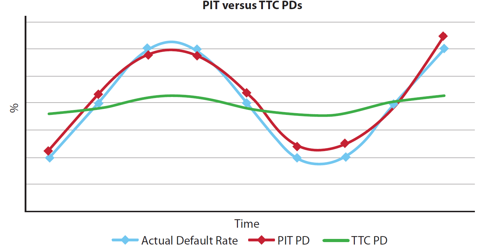

# Target Variable

* The **dependent variable** for PD modelling is the **default indicator** over a 12-month outcome window.
* The column (e.g., `m12_default`) flags whether the obligor defaults **at any time** within the 12 months following the observation date.
* This binary classification is in accordance with **CRR Article 180(2)(a)**, which requires the estimation of **1-year default rates**.
* The identification of default is based on the rules and classifications already described in the **Definition of Default (DoD)** section and includes both **90+ DPD** and **Unlikeliness to Pay (UTP)** events.

## Key Characteristics

* **Type**: Binary (1 = default, 0 = no default)
* **Window**: Rolling 12 months from each observation date
* **Coverage**: Includes all IRB-eligible exposures in the development population
* **Usage**: Core target for PD model development, calibration, and performance tracking

The important considerations when calculating PD are:

- Time horizon: point-in-time (PIT) versus through-the-cycle (TTC)
- Default of definition (DoD)

In terms of the element of the time horizon, banks will likely calculate both the PIT and TTC PD estimates for various differing purposes.

In practice, PDs and ratings are often linked and banks generally create a mapping between PDs and ratings. The PDs used for this purpose are expected, according to Basel, to be 1-year PDs, i.e. the probability of an entity defaulting over the next year. In this context, Basel defines the PD as “the average percentage of obligors that default in this rating grade in the course of 1 year”.

## Point-in-Time PD

The target variable for PD model is the default flag ("m12_default" in the MRD) indicating whether a default event occurs **at any point over the next 12 months**. A default is defined according to the DoD detailed in above, which includes accounts that trigger either the 90 DPD or UTP criteria on any day within the 12-month outcome period, and not just at the end of the 12-month period. This 12-month time horizon is mandated by CRR Article 180(2)(a), which requires PD estimates to reflect one-year default rates. Analysis of the default rate trends over time and proportion of different default rate reasons are included in above.

PIT PDs assess the probability of an entity defaulting over a specific period given available information at a point in time in the economic cycle. Even though it is only focused on one point in time, it should include an assessment of the entity’s ability to withstand adverse economic events.

PIT PDs are more useful in the case of a bank needing accurate and timely information on likely defaults – i.e. it is closer to the default rate and used updated information throughout time. This will allow the bank to manage its risk and the related capital more efficiently, as well as being useful for provisioning and IFRS9 purposes. However, it does require fluctuating PDs and continuous reviewing of the bank’s clients, as well as regular changes in the bank’s capital. This can be costly.

## Through-the-Cycle PDs

TTC PDs assess the probability of an entity defaulting throughout a long-term economic cycle. TTC PDs will inherently include this ability to withstand adverse economic events, as it will most often be the average PD over an economic cycle. The structure of these PDs over time is illustrated in the figure below.

TTC PDs are smoother and can be used for a longer-term view; thus, they reduce the aforementioned costs. However, a shortfall of these PDs is that they are not as successful at identifying defaults and may cause losses in this area.

TTC PDs can often be calculated using PIT PDs, albeit removing the credit cycle effects.
