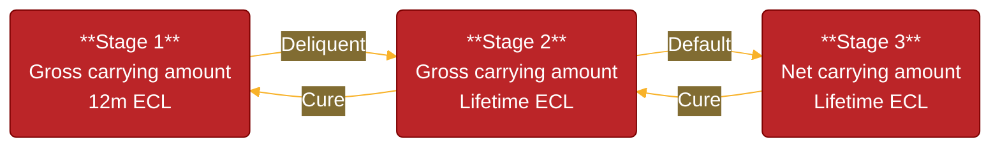
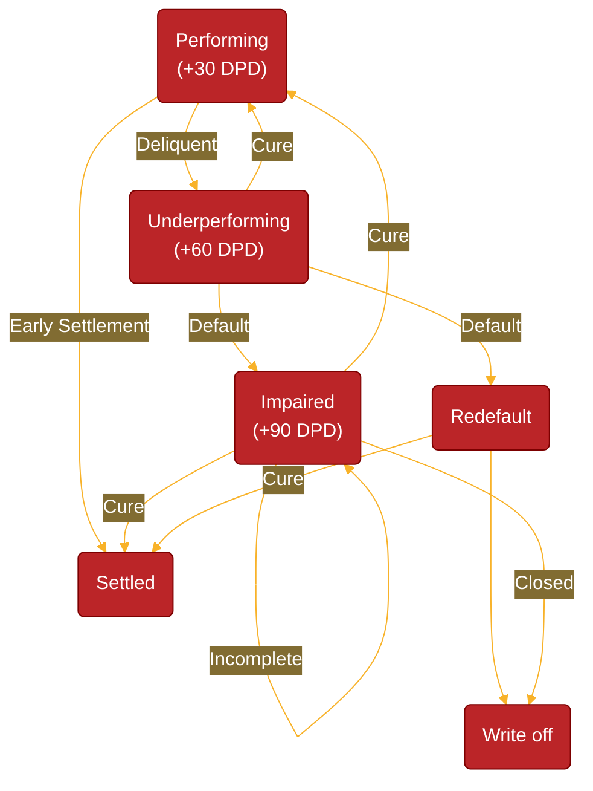

# Provisions & Impairments

IAS 39 and IFRS 9 are accounting standards issued by the IASB for financial instruments, particularly their recognition, measurement, and impairment. IFRS 9 replaced IAS 39 in 2018 to address the limitations and complexity of IAS 39 “incurred loss” framework, providing a more forward-looking and simplified approach. Under IAS 39, losses were recognized only when there was objective evidence of impairment (e.g., default or delinquency). Hence it was backward-looking, meaning it relied on historical data and loss events already incurred. This delayed provisioning during the 2008 financial crisis, leading to underestimation of risks.

The principle is to forfeit a portion of income today (also known as an **impairment charge** coming thorugh the income statement) into a **loss provision** (coming through as a reduction in the asset value not necessarily a liability) that ideally offsets amounts that may be written-off tomorrow. Doing so helps to smooth overall earnings volatility, which is itself a central tenet of risk management.

## Expected Credit Losses

IFRS 9 requires that this loss provision be regularly updated based on a statistical model, i.e., the asset’s **Expected Credit Loss (ECL)**. Given a new ECL-value, a bank adjusts its loss provision either by raising more from earnings or releasing a portion thereof back into the income statement. This ECL-model represents the:

- (1) probability-weighted sum of cash shortfalls that a bank expects to lose over ...
- (2) a certain horizon ...
- (3) incorporating forward-looking information as per §5.5.17.

The calculated ECL is recorded as a loss allowance on the balance sheet (§5.5.1).

> *Loss allowance reduces the gross carrying amount of loans (on the balance sheet) calculated at the amortised cost.  It reflects a provision set aside to cover anticipated losses due to credit risk.*

<https://www.bis.org/fsi/fsisummaries/ifrs9.pdf>

## Gross Carrying Amount

The gross carrying amount of a financial asset under IFRS 9 represents its original or amortized cost, before any adjustments for impairment losses (i.e., loss allowances). It reflects the contractual amounts due from the borrower and excludes any deductions for expected credit losses (IFRS9 §5.1.1).

> *Example: A bank issues a loan of £100,000 with £500 in legal fees at 10% interest. If the loan is measured at amortised cost, the bank records an initial gross carrying amount of £100,500.*

The gross carrying amount includes:

- Principal Outstanding: The unpaid balance of the loan or credit facility.
- Accrued Interest: Any interest income that has been earned but not yet received.
- Transaction Costs (for amortized cost assets): Costs directly attributable to issuing or acquiring the financial asset.
- Amortization: Adjustments made due to the effective interest rate (EIR) method.

## Net Carrying Amount

The net carrying amount (often referred to simply as amortized cost) is the value of a financial asset after adjusting for repayments, amortization of premiums/discounts, and the Expected Credit Loss (ECL) allowance (IFRS9 §5.2.2).

$\text{Net Carrying Amount} = \text{Gross Carrying Amount} - \text{ECL}$

> *Example: A retail customer borrows £100,000 from the bank, plus 500 in legal fees. After 6 months, it owes the bank £93,200. The bank plans to hold the loan to collect outstanding principal + interest, so it's measured at amortised cost. The bank applies ECL (£2,000) to reduce the net value of the loan on the balance sheet (£91,200).*

Financial assets are generally presented on the "asset side" at their net carrying amount (Amortized Cost). This means the gross carrying amount is reduced by the ECL allowance to reflect the amount the entity actually expects to collect. The allowance is not typically presented as a "provision" on the liability side for existing assets. However, for off-balance sheet exposures (such as undrawn loan commitments or financial guarantees), the estimated ECL is presented as a provision (liability) because there is no recognized asset to reduce.

Changes in the ECL (e.g., new impairments or reversals) are recognized as impairment charges in the income statement. (⬆️ECL → ⬆️Loss Provision → ⬇️Assets and ⬆️ECL → Impairment Loss → ⬇️Income → ⬇️Retained Earnings → ⬇️Equity)

## EIR

ECL is the present value of expected cash shortfalls. Use the effective interest rate (EIR) of the financial asset to discount future losses to their present value. The Effective Interest Rate (EIR) is the internal rate of return (IRR) on the expected future cash flows of a financial instrument over its life, accounting for:

- **Contractual Interest Rate**: The nominal interest rate stated in the loan agreement.
- **Transaction Costs**: Fees directly attributable to the acquisition or issuance of the financial instrument (e.g., initiation fees).
- **Other Adjustments**: Any premiums, discounts, or deferred fees.

The EIR is derived by solving the following equation:

$\text{Initial Loan Amount} = \Large\Sigma_{t=1}^n\frac{\text{CF}_t}{(1+\text{EIR})^t}$
$\text{CF}_t$ The expected cash inflows/outflows (e.g., interest payments, principal repayments, fees).
$\text{Initial Loan Amount}$ The net amount disbursed to the borrower after fees and costs.

Use numerical methods (e.g., Newton-Raphson method or financial software) to find the discount rate (EIR) that equates the present value of future cash flows to the initial loan amount. The EIR is found to be approximately higher than the contractual rate due to the initiation fee.

Reflects the true cost of borrowing or yield on lending. Allows borrowers or investors to compare financial instruments with different fee structures or terms.

## Interest Revenue

The distinction between gross and net carrying amounts is critical for calculating interest income (§5.4.1):

- Stage 1 & 2 Assets: Interest income is calculated using the gross carrying amount.
- Stage 3 Assets (Credit-Impaired): Interest income must be calculated using the net carrying amount (gross minus ECL). This ensures the entity only recognizes interest on the portion of the loan it actually expects to recover.

> *Let’s say a bank lends R1,000,000 (no transaction costs) to a corporate client at 10% interest over 5 years. Here’s how the rules apply at different stages of credit quality. At initial recognition, the loan is performing. Use the effective interest rate (EIR) — say 10% — to calculate interest on the gross carrying amount (i.e., full R1,000,000). (Paragraph 5.4.1 (b)) Suppose after 2 years, the original loan defaults or moves to Stage 3 under ECL. From that point, interest must be calculated using EIR (still 10%) but on the amortised cost — i.e., gross amount minus lifetime ECL.*

<!-- > Quick check: if EIR increases then ECL should get bigger since it is negative. -->

## Staging

IFRS 9 adopts a staged approach in §5.5.3 and §5.5.5 that is based on the extent of the perceived deterioration in the underlying risk. In principle, each of the three stages requires a progressively more severe ECL-estimate. Financial assets are categorized into three stages based on their credit risk. IFRS 9 does not explicility say in quantitative terms how to determine these stages. However, it is common in industry standard to denote it as such:

- Stage 1: No payments missed or partial arrears e.g. Debit order on 25th but you pay on the 10th
- Stage 2: 30 days to 89 days in arrears
- Stage 3: 90+ days in arrears. This is classified as default.

### Stage 1 (Performing Assets)

Assets that have low credit risk or where there has been no significant increase in credit risk since initial recognition. Impairment is calculated based on 12-month ECL (expected credit losses within the next 12 months). As soon as a financial instrument is originated, 12-month ECL would be recognised in the P&L (§5.5.5).

$\text{ECL Stage 1}_{i,t,t'} =\displaystyle\sum_{k=1}^{12} \text{PD}_{i,t,t'}^\text{FiT}(k,x_{i},x_{i,t})\times \text{LGD}_{t}^\text{PiT} \times \text{EAD}_{t}^\text{PiT} \times (1+\text{EIR})^{-k}$

> *When the corporate loan was initially recognised, the borrower had a solid credit rating, strong financial statements, and no signs of potential default. As there was no significant increase in credit risk at the initial or subsequent reporting dates, the loan remained in Stage 1. Under IFRS 9, the bank estimated a 12-month expected credit loss (ECL) of R50,000, which was booked as a loss allowance in the financial statements. This small provision reflects the expected credit losses arising from default events that could occur within the next 12 months, not the entire loan term. On the balance sheet, the loan is recorded at amortised cost less this allowance, and on the income statement, the R50,000 is shown as an impairment expense.*

### Stage 2 (Underperforming Assets)

Assets that have deteriorated quite significantly in their credit quality or where there has been a significant increase in credit risk (SICR) but no default from the point of origination (recognition) (§5.5.3). Impairment is based on Lifetime ECL (expected credit losses over the entire remaining life of the asset) ($5.5.19 and $5.5.20). The backstop criteria for Stage 2 is 30 days past due (§5.5.11).

$\text{ECL Stage 2}_{i,t,t'} =\displaystyle\sum_{k=1}^{n} \text{PD}_{i,t,t'}^\text{FiT}(k,x_{i},x_{i,t})\times \text{LGD}_{t}^\text{PiT} \times \text{EAD}_{t}^\text{PiT} \times (1+\text{EIR})^{-k}$

> *The bank observes a sharp decline in the borrower’s revenues and a negative credit rating downgrade from investment grade to sub-investment grade. These are clear indicators of a significant increase in credit risk since the loan’s initial recognition. As a result, the loan transitions from Stage 1 to Stage 2, and the loss allowance must now reflect lifetime expected credit losses (ECL). The bank re-evaluates its expected losses over the remaining life of the loan and increases the allowance from R50,000 (12-month ECL) to R400,000 (lifetime ECL), reflecting the increased likelihood of default.*

### Stage 3 (Non-performing Assets)

Assets that are objectively credit-impaired (as per Appendix A) or in default (§B5.5.37) (their future cash flows are likely compromised). The backstop criteria for Stage 3 is 90 days past due. The probability of default is equal to 1 since the asset has already defaulted.

$\text{ECL Stage 3}_{i,t,t'} =\displaystyle\sum_{k=1}^{n} \text{LGD}_{t}^\text{PiT} \times \text{EAD}_{t}^\text{PiT} \times (1+\text{EIR})^{-k}$

Evidence that a financial asset is credit-impaired include observable data about the following events:

- (a) significant financial difficulty of the issuer or the borrower;
- (b) a breach of contract, such as a default or past due event;
- (c) the lender(s) of the borrower, for economic or contractual reasons relating to the borrower’s financial difficulty, having granted to the borrower a concession(s) that the lender(s) would not otherwise consider;
- (d) it is becoming probable that the borrower will enter bankruptcy or other financial reorganisation;
- (e) the disappearance of an active market for that financial asset because of financial difficulties; or
- (f) the purchase or origination of a financial asset at a deep discount that reflects the incurred credit losses.

## Financial Metrics

### Coverage Ratio

A coverage ratio is a financial metric used to assess an entity's ability to meet its financial obligations, such as debt repayments, interest expenses, or other liabilities. In an IFRS 9 context it is the ECL over the total outstanding loan amounts.

$\Large\frac{\text{ECL}_{i,t,t'}}{\text{Balance}_{i,t}}$ where $\text{ECL}_{i,t,t'} = \displaystyle\sum_{s=1}^{3}\text{ECL Stage } s_{i,t,t'}$

Investors use this to compare companies and it is used to see if the book is getting better or worse. But could be also used to see if a change in strategy has worked or will work. Usually is grouped by new business vs existing business and on the new busienss side it is used to see if any updates to an application scorecard are working.

### NPL Ratio

You can determine the non-performing loan ratio by taking the proportion of loans in stage 3 divded by the total loan book to see how badly your book is performing.

$\Large\frac{\text{ECL Stage 3}_{i,t,t'}}{\text{Balance}_{i,t}}$

## Dymanic Conditional FiT (Marginal) PDs

Lending poses the fundamental risk of capital loss should the borrower fail to repay their loan, which necessitates the accurate prediction of the borrower’s underlying probability of default (PD). This task usually involves finding a statistical relationship between a set of borrower-specific input variables and the binary-valued repayment outcome (i.e., defaulted or not) over some outcome period. The literature on this particular classification task is considerable and spans various forms of supervised statistical learning, including machine learning.

A **forward-in-time (FIT)** rating system produces more **dynamic** PD-estimates that agree more closely with the observed variation in default risk over loan life, as well as incorporate any **temporal macroeconomic effects**. Such dynamicity is perhaps inappropriate for capital estimation since capital levels should preferably not fluctuate wildly over time.

$\text{PD}_{i,t,t'}^\text{FiT}(k,x_{i},x_{i,t})=\text{PD}_{i,t}^\text{PiT}(k,x_{i},x_{i,t})\times\text{FLI}_{t'}$

In fact, the introduction of the IFRS 9 accounting standard by the IASB (2014) provided additional impetus for such dynamicity in PD-modelling. Under IFRS 9, a financial asset’s value should be comprehensively adjusted according to a bank’s (evolving) expectation of the asset’s credit risk over time, i.e., the potential loss induced by default.

### Term Structure of PDs

In achieving such dynamicity, and especially for Stages 1-2, risk models need to project default risk ideally over **various time horizons** $k$ across loan life and against the changing macroeconomic background. This rather non-trivial task implies the estimation of a marginal (or PiT) PD as a **function of a rich set of input variables**, including macroeconomic covariates. These inputs are measured at each discrete period $t = t_1, ..., T$ during a loan’s lifetime $T$ , starting from its time of initial recognition $t_1$. The collection of these PD-estimates over the lifetime of a loan is then called the **term-structure** of default risk.

The term structure is a series of **conditional** Point-in-Time (PIT) PDs that reflect default probabilities over discrete time intervals (e.g., monthly or annually) for the life of the exposure. This term-structure typically manifests as a non-linear and right-skewed curve over loan life.

$\text{PD}_{i}^\text{Term}(k,x_{i})=\{ \text{PD}^\text{PiT}_{i,t}(k,x_{i},x_{i,t}) | \forall t \subset [1,\infty] \}$

#### Challenge 1: Redefaulting & Curing

However, there are certain modelling challenges to rendering such dynamic and time-sensitive PD-estimates. Chief among them is due to the fact that ‘default’ is not necessarily an **absorbing state** into which a loan is forever trapped. If ‘default’ is structured as a transient state during PD-estimation, then one can leverage the full credit histories that are otherwise etched with multiple cycles of curing from default and defaulting again.

> An absorbing state in a Markov chain is a state that, once entered, the system can never leave, characterized by a 100% probability (a '1' on the diagonal) of staying in that state. An absorbing Markov chain is a Markov chain containing at least one such state, where all other non-absorbing (transient) states can eventually lead to an absorbing state. These chains are useful for modeling systems that eventually "stop" or "fixate," allowing calculations of absorption probabilities and mean time to absorption, often using a fundamental matrix.

#### Challenge 2: Competing Risks

Another major modelling challenge arises from the fact that ‘default’ is not the only ailure-inducing event, despite its importance in credit risk modelling. Other events that may ultimately affect the risk of loss under IFRS 9 include prepayments (or early settlement), write-offs, and restructures. These competing risks will preclude the default-event from occurring, as well as affect the size of the risk set over time.

#### Challenge 3: Heterogeneous Borrowers

Lastly, default risk is itself a heterogeneous spectrum in that not all loans will have the same PD at the same time point, largely due to differences in the behavioural profiles of borrowers.
