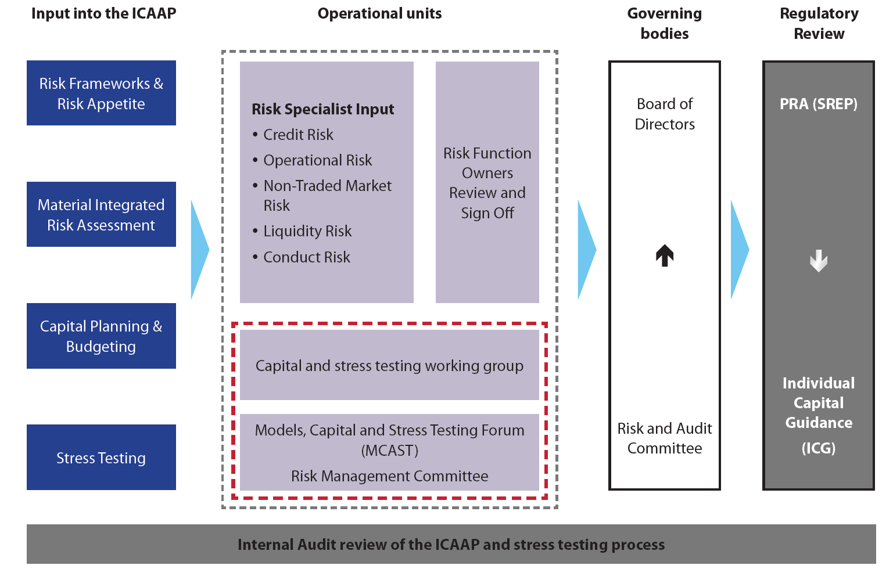

# Economic Capital

Through the Pillar 2 requirements of the internal capital adequacy assessment process (ICAAP), banks have become sophisticated at estimating their economic capital, based on their own risk appetite and strategy, and contrasting this to the regulatory capital requirements. This process is refined in line with the transition requirements imposed under Basel III.

## Pillar 2: Supervisory Review Process

Pillar 2, which is concerned with the supervisory review process, allows regulators in different countries some discretion in how rules are applied (so that they can take account of local conditions), but seeks to achieve overall consistency in the application of the principles. It places more emphasis on early intervention when problems arise. Supervisors are required to do far more than simply ensuring that the minimum capital required under Basel II is held. Part of their role is to encourage banks to develop and use better risk management techniques and to evaluate these techniques. They should evaluate risks that are not covered by Pillar 1 and enter into an active dialogue with banks when deficiencies are identified.

Four key principles of supervisory review are specified:

1. Banks should have a **process for assessing their overall capital adequacy** in relation to their risk profile and strategy for maintaining capital levels.
2. **Supervisors should review** and evaluate banks’ internal capital adequacy assessments and strategies, as well as their ability to monitor and ensure compliance with regulatory capital ratios. Supervisors should take appropriate supervisory action if they are not satisfied with the result of the process.
3. Supervisors should expect banks to **operate above the minimum regulatory capital** and should be able to require banks to hold capital in excess of this minimum.
4. Supervisors should seek to **intervene at an early stage** to prevent capital from falling below the minimum levels required to support the risk characteristics of a particular bank and should require rapid remedial action if capital is not maintained or restored.

### ICAAP

The first point is achieved by requiring banks to perform an Internal Capital Adequacy Assessment Process (ICAAP). The key components required in an ICAAP include the following two types of capital assessment:

1. PiT capital assessment as at the date chosen for the ICAAP submission:
   - Pillar 1 – 8% of RWA of credit, market, and operational risks.
   - Pillar 2A – additional capital requirements for risks not captured in Pillar 1 (e.g. Interest Rate Risk in the Banking Book (IRRBB), Pension Risk and Credit Concentration Risk). A material risk assessment (MIRA) is performed to ensure that all material risks are managed / capitalised adequately.
2. Forward-looking capital assessment using stress test results:
   - Maintain a capital surplus – total available less total required capital must be in surplus after considering management and recovery options where necessary.
   - Determine whether an additional capital buffer is required to enable a bank to remain in surplus during periods of stress. Determine the Capital Planning Buffer (CPB) (under the current regime) equal to the most adverse movement in the capital surplus (i.e. the level of this buffer should be set equal to the additional capital required in a downturn scenario to ensure that the bank can continue to meet the increased capital requirements that would arise due to adverse circumstances). This buffer is drawn upon when there is a downturn in the economic environment and adverse circumstances appear in the economic cycle.

Regulators place significant emphasis on the usage of the ICAAP in practice. Banks are encouraged not to simply comply with the regulation, but to use the processes in practice.

In the European Union, CRD IV introduces the Capital Conservation Buffer (CCoB), the Countercyclical Buffer (CCyB), and the Domestic Systemically Important Financial Institution (D-SIFI) buffers.

In South Africa, a CCoB was introduced in January 2016 with full implementation by 2019. The Financial Stability Committee of the SARB is responsible for setting the CCyB and uses a credit-to-GDP gap as the main indicator to inform what the CCyB should be.

Figure 2.1 below that illustrates the governance structure of the ICAAP framework at a typical commercial bank, mapping the components of the ICAAP to the internal processes, governance, and approvals, ultimately for regulatory review (SREP).

