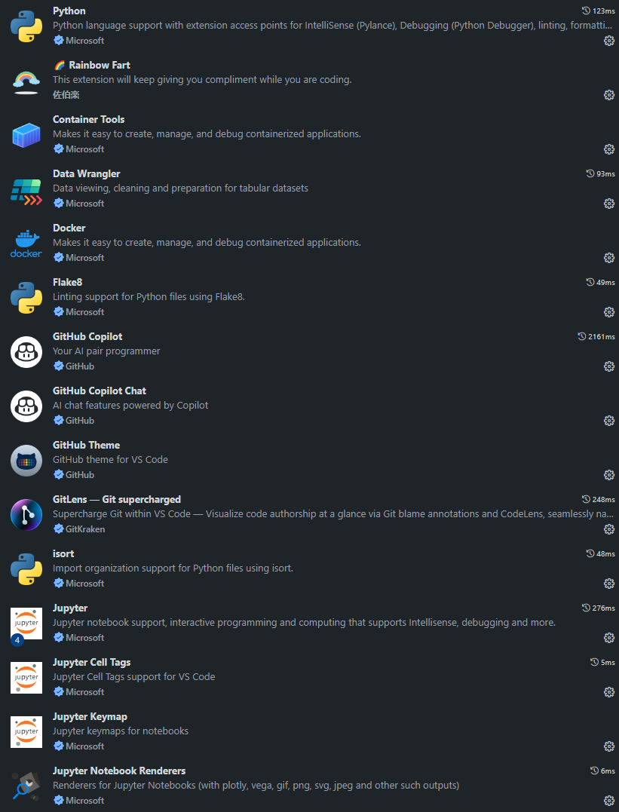
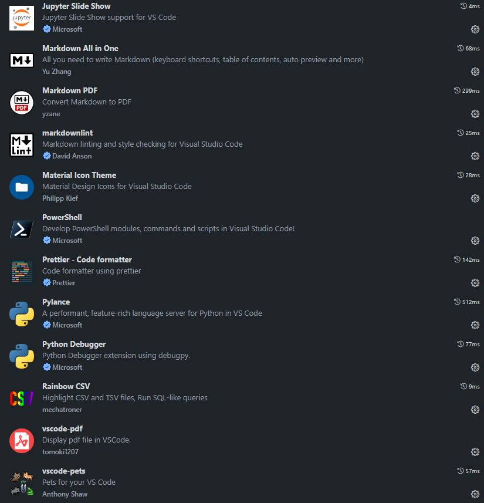
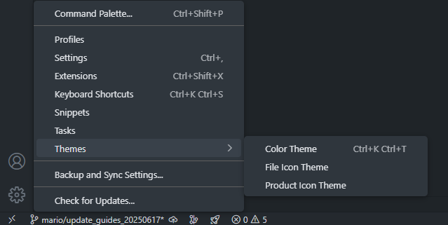

# Getting Started with Credit Risk Modelling Codelib

Welcome to the team! 🎉 This guide will help you set up your laptop so you can start working with our shared codebase. Follow each step carefully — if you get stuck, reach out to one of the maintainers or your team lead.

***

## 1️⃣ Install Python

1. Go to the official [Python website](https://www.python.org/downloads/)
2. Download the latest **Python 3.x** version for your operating system.
3. Run the installer:
   - Tick **"Add Python to PATH"**
   - Click "Install Now"
4. Confirm installation in your terminal:

```bash

python --version

```

You should see something like Python 3.11.x.

***

**_Troubleshooting_**: If you aren't seeing the output above, you will need to add `python` to your `PATH`. This could be done by first navigating and copying the path to your python.exe file on your desktop:_

 1. Navigate to **File Explorer**, then select on "**Windows**" and select on "**Users**".

 2. Select on the folder with your username. Select on "**View**" at the top of the list of the folders present and select on "Show" --> "Hidden" items.

 3. Select on "**AppData**", then navigate to "Local" and "Program Files".

 4. Select on the folder named "python3.13". Right click on that file and select "Copy as path"

_Once you have found the path to your "python.exe" file, you could then add 'python' to your 'PATH' by:_

 1. On your windows search bar, type `Edit environment variables for your account`.

 2. You would then view a list of `User variables`.

 3. Please select on `Path` and select on `Edit`.

 4. By selecting on `New`, add the paths to your "python.exe" file. The file path could look as follows:

```bash

C:\Users\<username>\AppData\Local\Programs\Python\Python313\Scripts\

C:\Users\<username>\AppData\Local\Programs\Python\Python313

```
  
_Note: The key of the exercise is to find the path to your python.exe file. Once you have added the paths to your system, a restart will be required for the new paths to be reflected._

***

## 2️⃣ Install Visual Studio Code (VS Code)

1. Download [VS Code](https://code.visualstudio.com/) or alternatively request additional software from Deloitte's [Software Catalogue](https://software.uk.deloitte.com/)
2. Install using default settings.
3. Open VS Code and pin it to your taskbar for easy access.

***

## 3️⃣ Install Git

1. Download [Git](https://git-scm.com/downloads) or alternatively request additional software from Deloitte's [Software Catalogue](https://software.uk.deloitte.com/)
2. Use default settings during installation.
3. Confirm Git was installed

```bash
git --version
```

***

## 4️⃣ Configure Git (Once-Off)

1. Set your name and email so Git can track your changes.

```bash
git config --global user.name "Your Name"
git config --global user.email "your.email@gmail.com"
```

***

## 5️⃣ Install VS Code Extensions

1. In VS Code, click the Extensions icon (left sidebar) and install the following:




1. Activate your file icons theme by going here:



***

## 6️⃣ Clone the Repository

1. Go to your Desktop or Documents and create a similar folder path like `C:\Users\mervedosa\OneDrive - Deloitte (O365D)\Azure\Code Library`
2. Open Azure DevOps in the browser.
3. Go to **Repos > Files** and choose the `main` branch.
4. CLick on the **Clone** button.
5. Then select **Clone in VS Code**. You will then choose the folder path you created above to clone it into.

***

## 7️⃣ Install Poetry (Dependency Manager)

1. Open Terminal (in VS Code or Command Prompt). Run the following:

```bash
curl -sSL https://install.python-poetry.org | python3 -
```

Your second option could also be to run `pip poetry install`.

Alternatively, Open PowerShell and run:

```bash
(Invoke-WebRequest -Uri https://install.python-poetry.org -UseBasicParsing).Content | python -
```

Then, restart your terminal.
2. Confirm installation:

```bash
poetry --version
```

***

## 8️⃣ Set Up the Project Environment

In the terminal, navigate to this folder path `C:\Users\mervedosa\OneDrive - Deloitte (O365D)\Azure\Code Library\crm_codelib`

```bash
cd crm_codelib
```

and run

```bash
poetry install
```

To install dependencies run

```bash
poetry install --with dev
```

***

### 📦 Packages

If you would like to add packages please consult with the repo maintainers or team coordinator. In the interim, you may add the package (e.g. `yfinance`) to the list in the `requirements.txt` and then run the following command in the terminal:

```bash
poetry add $(cat requirements.txt)
```

Next run `poetry update` after you add a package to be able to update the `.lock` file

### 📦 Dependencies

Dependencies are only needed during development (e.g., formatting, testing, linting). They don’t get installed when users install your package with poetry install unless `--with dev` is specified.

- isort
- black
- nbqa
- flake8

To add this type of dependency run the following

```bash
poetry add --dev black isort nbqa
```

***

## 🔟 Set Python Interpreter in VS Code

Press Ctrl + Shift + P

- Type: Python: Select Interpreter
- Choose the one showing .venv or created by poetry

Alternatively, you can find the interperter when selecting your Python to run the poetry environment you just set up by looking on the bottom right. This is important when running `black` or `isort` as well as importing modules from `src` in your Jupyter Notebook.

Run `poetry env activate` to ensure poetry is activated and then run `poetry env info` to make sure it is on. Alternatively, to work inside the virtual environment run `poetry shell` for Python files.

For Jupyter Notebooks, open any `.ipynb` file and click on **Select Kernel**. Choose teh interpreter that points to `.venv` or shows your poetry environment.
