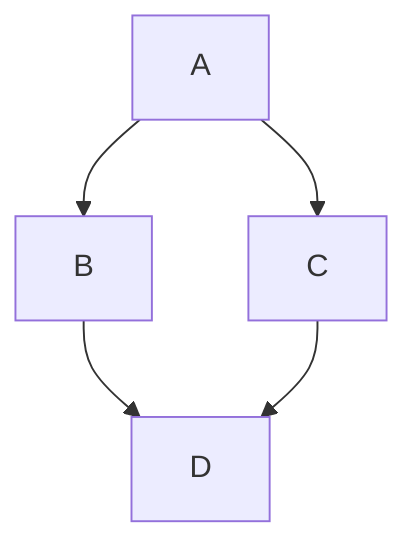

# Definitions

## Default

📂 Section: Data Manipulation and Feature Transformation
1. 📌 Definition of Default (DoD)

Default identification is one of the most critical steps in transforming raw data into model-ready datasets for IRB and IFRS 9 models. The regulatory definition of default (DoD) is guided primarily by Article 178 of the CRR, and is interpreted via local guidance such as EBA GL/2016/07 and supervisory statements like SS11/13 and SS3/24 (PRA).

1.1 Days Past Due (DPD) Criteria

A financial asset is considered in default if the obligor is 90 days past due (DPD ≥ 90) on any material credit obligation.

Materiality thresholds are applied based on absolute and relative criteria defined in Article 178(2)(d) and specified further in RTS on Materiality Threshold for Credit Obligations Past Due.

Calculation logic:

DPD is calculated as the number of calendar days between the due date of the oldest unpaid amount and the reference/reporting date.

Suspense account treatment, payment holidays, and contractual changes (e.g. interest-only payments) are adjusted for in alignment with contractual obligations rather than actual cash flow timing.

1.2 Unlikeliness to Pay (UTP) Triggers

Default can also occur via "Unlikeliness to Pay" (UTP), even if DPD < 90. Key triggers include:

UTP Trigger	Description
Bankruptcy	Customer has declared bankruptcy or entered insolvency proceedings.
Forbearance	Material distressed restructuring with credit loss or customer hardship.
Charge-Off	Internal write-off decisions due to operational or economic loss.
First-Party Fraud	Proven fraud perpetrated by the customer (not third-party ID fraud).
Deceased	Account flagged due to customer’s death.
Contagion / Pulling Effect	Default on one facility spreads to another due to interconnected exposure.
1.3 Forbearance Classification

Per EBA Guidelines on Forbearance (GL/2018/06), forborne accounts should be monitored for risk classification and potential default. Common types include:

Forbearance Type	Description
Interest Rate Reduction	Temporary or permanent lower interest rate.
Hardship Assistance	Tailored plans due to verified customer hardship.
Short-Term Assistance	≤ 3 months of payment holiday or grace periods.
Debt Management Plan	Long-term partial repayments via third-party DMPs.
Settlement	Agreed partial payment to settle full obligation.
1.4 Historical Default Rate Comparison

Plotting the historical default rate under:

DPD-only definition (≥90 days)

DPD + UTP triggers

With and without forbearance-related defaults

This helps understand the impact of DoD criteria on overall observed default rates and segmentation. Visualisations should show:

Volume and rate trends over time

Distribution by trigger type

Overlap across different default types

2. 🔄 Return to Non-Default (Curing and Probation)

Accounts that meet the DoD criteria but subsequently improve their status may be cured — i.e., returned to performing status. The process for identifying a cure must be aligned with:

CRR Article 178(5a): A return to non-default can only be applied if the default trigger no longer applies and the obligor has demonstrated sustained performance.

EBA GL/2016/07: Sets a minimum 3-month period for reclassification.

PRA SS3/24 and SS11/13: Recommend extended 12-month probation windows to assess risk of re-default.

2.1 Probation Window Analysis

For model development purposes, a probation period is applied after an account returns to a non-default status to observe if it re-defaults. This informs the optimal cure classification period.

Objective: Balance between:

Too short → many accounts re-default and degrade data quality.

Too long → artificially suppresses the number of cured accounts.

2.2 Example Table – Curing vs. Re-default Rate
Probation Window (months)	Re-default Rate (%)	Cure Rate (%)	Avg # of Cured Accounts
3 months	35%	65%	8,240
6 months	25%	60%	7,500
9 months	18%	55%	6,940
12 months	14%	50%	6,210
15 months	12%	46%	5,900

Cure Rate: Number of cured accounts / total defaulted accounts.

Re-default Rate: Number of re-defaults within the probation window / total cured accounts.

Interpretation:

As the probation period increases, the re-default rate declines.

A 12-month window is often selected as a regulatory and statistical compromise, with possible overlays for high-risk portfolios.

2.3 Visualisation

Line graph: Re-default rate vs. probation period

Bar chart: Number of cures retained under each window

Overlay: Compare by segment (e.g., secured vs unsecured, or by product type)

## Transactor

A transactor exposure is defined as a revolving facility where the obligor has repaid the balance in full at each scheduled repayment date over the previous 12 months. This regulatory definition originates from the standardized credit risk classification under the CRR framework. (§CRR Glosarry (Annex A); §Basel CRE20.66)

However, for model development purposes, the internal definition may differ to better reflect observed behavioural characteristics. For modeling and reporting consistency across the bank, the internal transactor definition is applied as follows:

- Accounts must have been active for the past 4 months, and
- Must have been classified as transactors for at least 2 of those months, including the most recent two months.

## Inactive

The inactive indicator follows a similar logic to the transactor/revolver classification and is designed to capture accounts that are no longer demonstrating regular transactional activity.

For modelling consistency, the inactive indicator aligns with IFRS 9 definitions and business classification practices. An account is considered inactive if it has had no balance, purchases, or payments for the past four months, including the current month.