# Mermaid

<https://mermaid.js.org/intro/syntax-reference.html>

## Configure

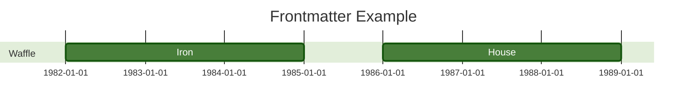

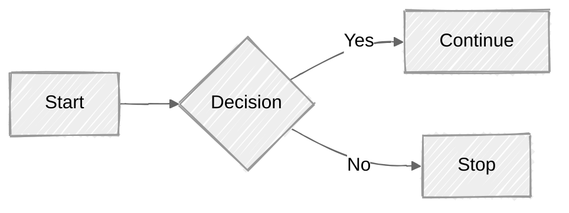

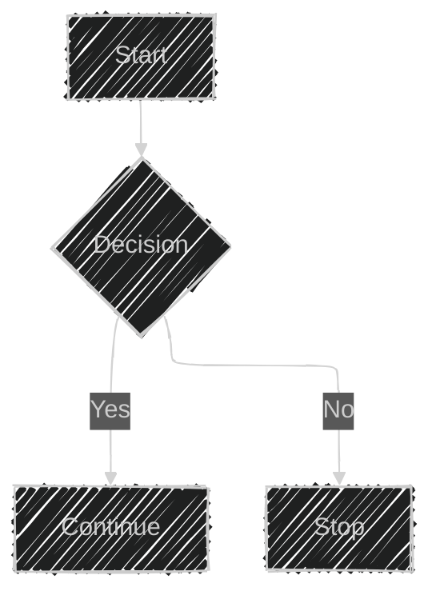

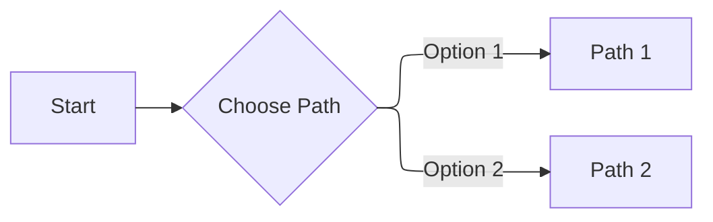

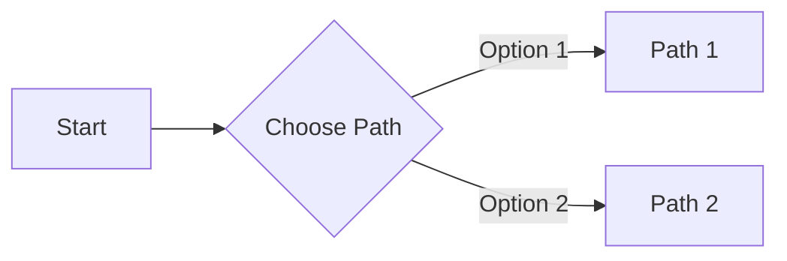

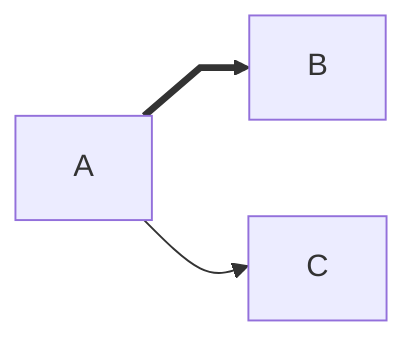

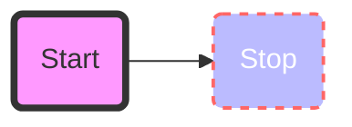

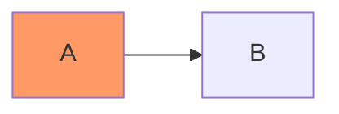

## Themes

`default` - This is the default theme for all diagrams.
`neutral` - This theme is great for black and white documents that will be printed.
`dark` - This theme goes well with dark-colored elements or dark-mode.
`forest` - This theme contains shades of green.
`base` - This is the only theme that can be modified. Use this theme as the base for customizations.

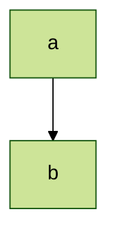

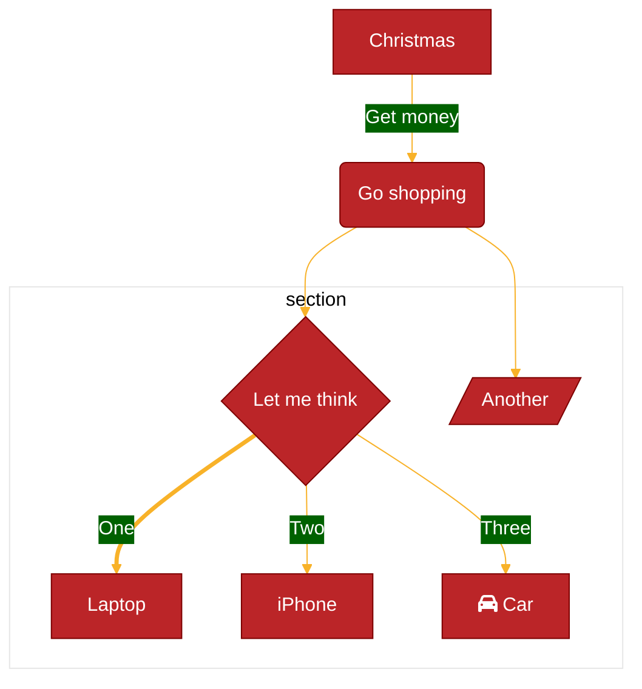

## Diagram Code

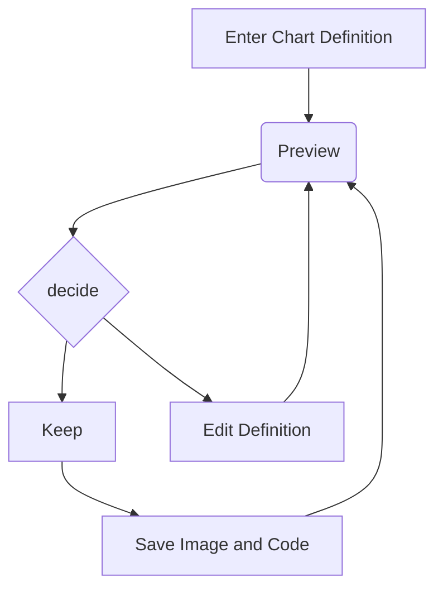

## Math

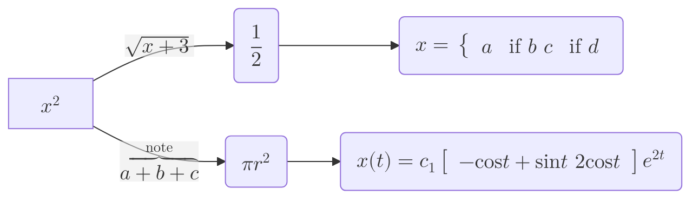

## Mind Maps

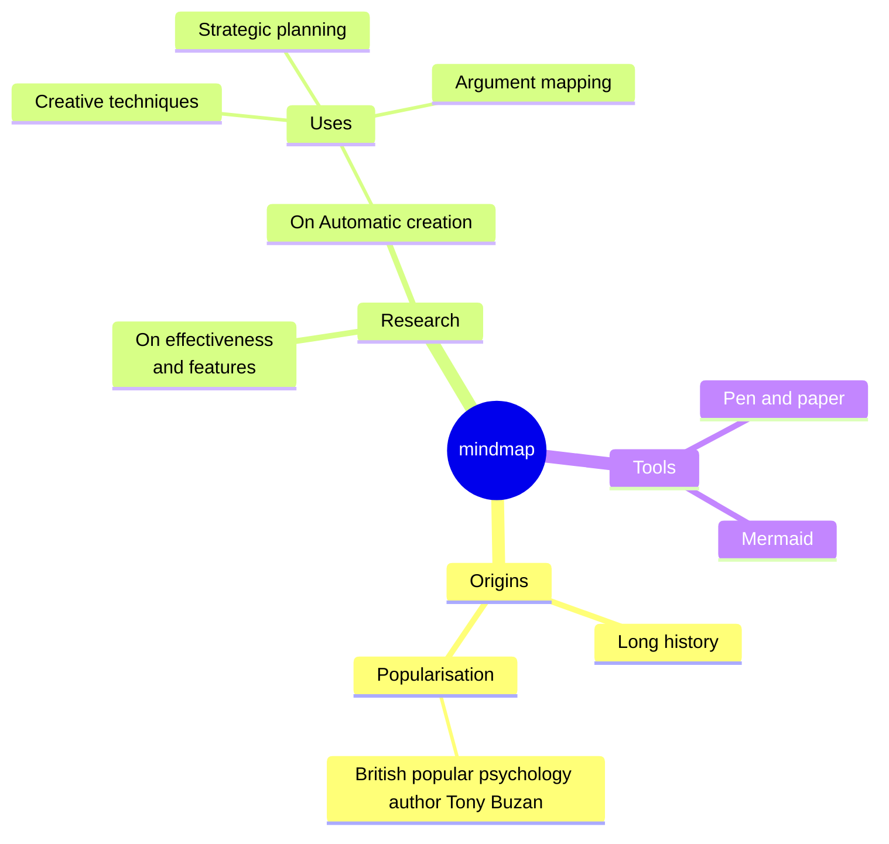

## Pie Chart

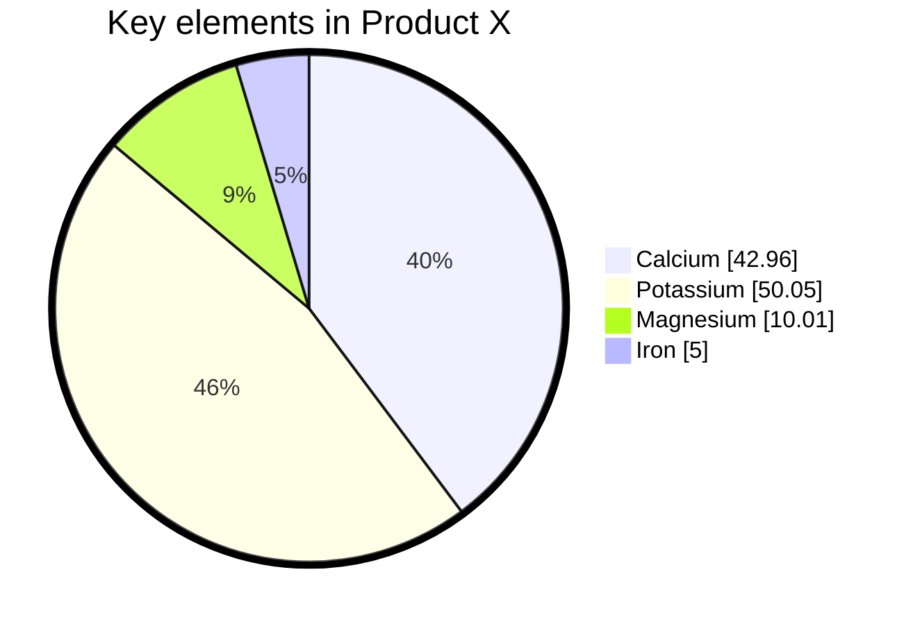

## ERD Diagram

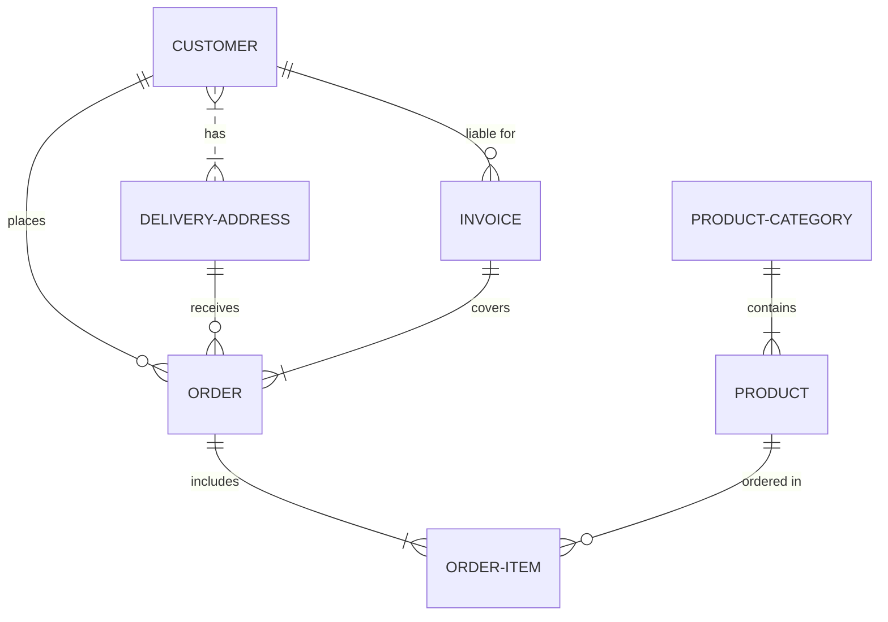

## Flowchart

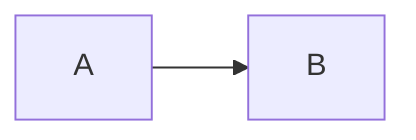

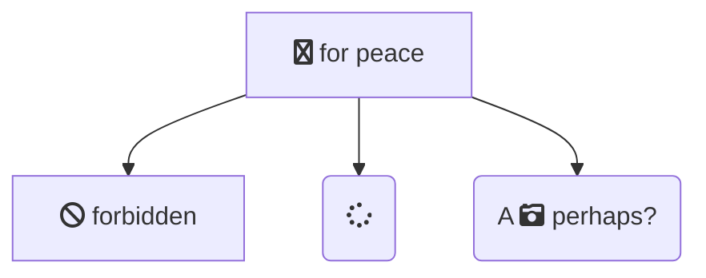

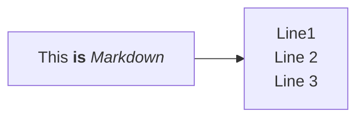

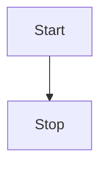

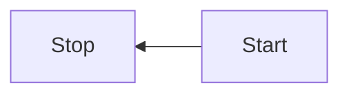

```mermaid
flowchart LR
    id1(This is the text in the box)
```

```mermaid
flowchart LR
    id1([This is the text in the box])
```

```mermaid
flowchart LR
    id1[[This is the text in the box]]
```

```mermaid
flowchart LR
    id1[(Database)]
```

```mermaid
flowchart LR
    id1((This is the text in the circle))
```

```mermaid
flowchart LR
    id1>This is the text in the box]
```

```mermaid
flowchart LR
    id1{This is the text in the box}
```

```mermaid
flowchart TD
    id1(((This is the text in the circle)))
```

```mermaid
flowchart RL
    A@{ shape: manual-file, label: "File Handling"}
    B@{ shape: manual-input, label: "User Input"}
    C@{ shape: docs, label: "Multiple Documents"}
    D@{ shape: procs, label: "Process Automation"}
    E@{ shape: paper-tape, label: "Paper Records"}
```

```mermaid
flowchart TD
    A@{ icon: "fa:user", form: "square", label: "User Icon", pos: "t", h: 60 }
```

```mermaid
flowchart TD
  %% My image with a constrained aspect ratio
  A@{ img: "https://mermaid.js.org/favicon.svg", label: "My example image label", pos: "t", h: 60, constraint: "on" }
```

```mermaid
flowchart LR
    A-->B
```

```mermaid
flowchart LR
    A --- B
```

```mermaid
flowchart LR
    A-- This is the text! ---B
```

```mermaid
flowchart LR
    A---|This is the text|B
```

```mermaid
flowchart LR
   A-.->B;
```

```mermaid
flowchart LR
   A ==> B
```

```mermaid
flowchart LR
   A -- text --> B -- text2 --> C
```

```mermaid
flowchart LR
   a --> b & c--> d

```

```mermaid
flowchart TB
    A & B--> C & D

```

```mermaid
flowchart TB
    A --> C
    A --> D
    B --> C
    B --> D

```

```mermaid
flowchart LR
    A --o B


```

```mermaid
flowchart LR
    A o--o B
    B <--> C
    C x--x D

```

```mermaid
flowchart TD
    A[Start] --> B{Is it?}
    B -->|Yes| C[OK]
    C --> D[Rethink]
    D --> B
    B ---->|No| E[End]


```

```mermaid
flowchart LR
  subgraph TOP
    direction TB
    subgraph B1
        direction RL
        i1 -->f1
    end
    subgraph B2
        direction BT
        i2 -->f2
    end
  end
  A --> TOP --> B
  B1 --> B2

```

```mermaid
flowchart TB
    c1-->a2
    subgraph one
    a1-->a2
    end
    subgraph two
    b1-->b2
    end
    subgraph three
    c1-->c2
    end

```

```mermaid
flowchart LR
  A e1@==> B
  e1@{ animate: true }

```

```mermaid
flowchart LR
    A-->B
    B-->C
    C-->D
    click A callback "Tooltip for a callback"
    click B "https://www.github.com" "This is a tooltip for a link"
    click C call callback() "Tooltip for a callback"
    click D href "https://www.github.com" "This is a tooltip for a link"

```

```mermaid
flowchart LR
%% this is a comment A -- text --> B{node}
   A -- text --> B -- text2 --> C
```

```mermaid
graph TB
    sq[Square shape] --> ci((Circle shape))

    subgraph A
        od>Odd shape]-- Two line<br/>edge comment --> ro
        di{Diamond with <br/> line break} -.-> ro(Rounded<br>square<br>shape)
        di==>ro2(Rounded square shape)
    end

    %% Notice that no text in shape are added here instead that is appended further down
    e --> od3>Really long text with linebreak<br>in an Odd shape]

    %% Comments after double percent signs
    e((Inner / circle<br>and some odd <br>special characters)) --> f(,.?!+-*ز)

    cyr[Cyrillic]-->cyr2((Circle shape Начало));

     classDef green fill:#9f6,stroke:#333,stroke-width:2px;
     classDef orange fill:#f96,stroke:#333,stroke-width:4px;
     class sq,e green
     class di orange
```
