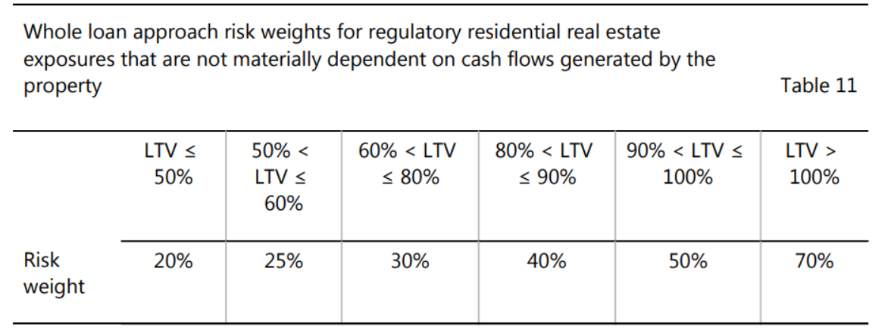

# **Basel**

## **Bank for International Settlements**

The BIS is owned by 63 central banks, representing countries from around the world that together account for about 95% of world GDP including the Bank of England, European Central Bank and South African Reserve Bank.

Their mission is to support central banks' pursuit of monetary and financial stability through international cooperation, and to act as a bank for central banks.

- The BIS provides central banks and financial supervisory authorities with a forum for dialogue and cooperation, where they can freely exchange information, forge a common understanding and decide on common actions.
- It also supports central banks and other financial authorities in the implementation of global regulatory standards and sound supervisory practices.
- As its name indicates, the BIS also acts as a bank. They offer financial services exclusively to central banks, monetary authorities and international organisations, mainly to assist them in the management of their foreign exchange assets.

The governance of the Bank is exercised at three levels

1. Board of Directors
2. General Meetings of member central banks
3. BIS Management

### **History**

Established in 1930, the Bank for International Settlements is the oldest international financial institution. From its inception to the present day, the BIS has played a number of key roles in the global economy, from settling reparation payments imposed on Germany following the First World War, to serving central banks in their pursuit of monetary and financial stability.

The BIS was set up to take over the functions previously performed by the Agent General for Reparations: managing the collection, administration and distribution of the annuities payable as reparations. The Bank's name is derived from this original role. Finally, the BIS was tasked to promote central bank cooperation more generally.

With the reparations issue out of the way, the BIS focused its activities on the technical cooperation between central banks (including reserve management, foreign exchange transactions, international postal payments, gold deposit and swap facilities) and on providing a forum for regular meetings of central bank Governors and officials.

In July 1944, a United Nations conference met at Bretton Woods in the United States to discuss the postwar international monetary system. The Bretton Woods Conference adopted a resolution calling for the abolition of the BIS "at the earliest possible moment", because it considered that the BIS would have no useful role to play once the newly created World Bank and International Monetary Fund were operational. European central bankers held a different opinion, and successfully lobbied for maintaining the BIS. By early 1948, the BIS liquidation resolution had been put aside. It was understood that henceforth the BIS would focus foremost on European monetary and financial matters.

### **The Basel Process**

The Basel Process refers to the way in which the BIS promotes international cooperation among monetary authorities and financial supervisory officials.

Governors and other senior officials of BIS member central banks hold bimonthly meetings, usually in Basel, to discuss current developments and the outlook for the world economy and financial markets. They also exchange views and experiences on issues of interest to central banks.

The outcomes of this process are visible to the public in the form of committee reports analysing specific topics and internationally agreed standards. International agreement is the precondition for globally consistent standards produced by the standard-setting committees. But it does not substitute for national legislation. In order to become binding, the agreements reached in Basel have to be approved and implemented at the national level, following due regulatory and legislative processes in each individual jurisdiction.

The Financial Stability Institute assists central banks and financial regulatory and supervisory authorities worldwide in strengthening their financial systems by supporting the implementation of global regulatory standards and sound supervisory practices. It does so through policy work, knowledge-sharing activities and capacity-building.

### **Committees**

The BIS hosts six committees, which are overseen by three senior groupings in the context of the Basel Process.

- The **Global Economy Meeting (GEM)** provides oversight to three committees: the Committee on the Global Financial System, the BIS Committee on Payments and Market Infrastructures and the Markets Committee
- The **All Governors' Meeting**, which includes all 63 BIS member central banks, oversees the work of two committees: the Central Bank Governance Forum and the Irving Fisher Committee on Central Bank Statistics
- The **Group of Governors and Heads of Supervision (GHOS)** provides oversight to the Basel Committee on Banking Supervision (BCBS). The GHOS comprises the central bank Governors and non-central bank heads of supervision from BCBS member jurisdictions.

The committees have their own respective governance arrangements and reporting lines, and their agendas are guided by various groups of central banks and supervisory authorities.

1. Basel Committee on Banking Supervision: develops global regulatory standards for banks and seeks to strengthen micro- and macroprudential supervision.
2. Committee on the Global Financial System: monitors and analyses issues relating to financial markets and systems.
3. Committee on Payments and Market Infrastructures: establishes and promotes global regulatory/oversight standards for payment, clearing, settlement and other market infrastructures, and monitors and analyses developments in these areas.
4. Markets Committee: monitors developments in financial markets and their implications for central bank operations.
5. Central Bank Governance Forum: examines issues related to the design and operation of central banks.
6. Irving Fisher Committee on Central Bank Statistics: addresses statistical issues relating to economic, monetary and financial stability.

### **Associations**

The following associations involved in international cooperation in the area of financial stability also have their secretariats at the BIS, but have their own separate legal identity and governance structure and report to their members.

1. Financial Stability Board: coordinates the work of national authorities and international standard setters  in developing and promoting the implementation of effective regulatory, supervisory and other financial sector policies in the interest of global financial stability.
2. International Association of Deposit Insurers: sets global standards for deposit insurance systems and promotes cooperation on deposit insurance and bank resolution arrangements.
3. International Association of Insurance Supervisors: sets global standards for the insurance sector to promote effective and globally consistent supervision for the benefit and protection of policyholders and to contribute to global financial stability.

## **Basel Committee on Banking Supervision**

The Basel Committee on Banking Supervision (BCBS) is the primary global standard setter for the prudential regulation of banks and provides a forum for regular cooperation on banking supervisory matters. Its 45 members comprise central banks and bank supervisors from 28 jurisdictions.

In 1974, the collapse of Bankhaus Herstatt in Germany and of Franklin National Bank in the United States highlighted the lack of efficient banking supervision of banks' international activities, and prompted the G10 central bank Governors to create the Basel Committee on Banking Supervision. The Basel Committee was initially named the Committee on Banking Regulations and Supervisory Practices.

The Committee's first meeting took place in February 1975, and meetings have been held regularly three or four times a year since. Since its inception, the Basel Committee has expanded its membership from the G10 to 45 institutions from 28 jurisdictions. Starting with the Basel Concordat, first issued in 1975 and revised several times since, the Committee has established a series of international standards for bank regulation, most notably its landmark publications of the accords on capital adequacy which are commonly known as Basel I, Basel II and, most recently, Basel III.


### **Basel Committee Charter**

#### **I. Purpose & Role**

(1) Mandate
Its mandate is to strengthen the regulation, supervision and practices of banks worldwide with the purpose of enhancing financial stability.

(2) Activities
The BCBS seeks to achieve its mandate through the following activities:

- exchanging information on developments in the banking sector and financial markets, to help identify current or emerging risks for the global financial system;
- sharing supervisory issues, approaches and techniques to promote common understanding and to improve cross-border cooperation;
- establishing and promoting global standards for the regulation and supervision of banks as well as guidelines and sound practices;
- addressing regulatory and supervisory gaps that pose risks to financial stability;
- monitoring the implementation of BCBS standards in member countries and beyond with the purpose of ensuring their timely, consistent and effective implementation and contributing to a "level playing field" among internationally active banks;
- consulting with central banks and bank supervisory authorities which are not members of the BCBS to benefit from their input into the BCBS policy formulation process and to promote the implementation of BCBS standards, guidelines and sound practices beyond BCBS member countries; and
- coordinating and cooperating with other financial sector standard setters and international bodies, particularly those involved in promoting financial stability.

The BCBS does not possess any formal supranational authority. Its decisions do not have legal force. Rather, the BCBS relies on its members' commitments, as described in Section 5, to achieve its mandate.

(3) Legal status
The BCBS does not possess any formal supranational authority. Its decisions do not have legal force. Rather, the BCBS relies on its members' commitments, as described in Section 5, to achieve its mandate.

#### **II. Membership**

(4) BCBS members
BCBS members include organisations with direct banking supervisory authority and central banks. After consulting the Committee, the BCBS Chair may invite other organisations to become BCBS observers.

#### **III. Oversight**

(6) The Group of Governors and Heads of Supervision (GHOS)
The GHOS is the oversight body of the BCBS. The BCBS reports to the GHOS and seeks its endorsement for major decisions.

#### **IV. Organisation**

(7) Structure
The internal organisational structure of the BCBS comprises:

- The Committee
- Groups, working groups, virtual networks and task forces3
- The Chair
- The Secretariat

(8) The Committee
The Committee is the ultimate decision-making body of the BCBS with responsibility for ensuring that its mandate is achieved. The Committee is responsible for:

- developing, guiding and monitoring the BCBS work programme within the general direction provided by GHOS;
- establishing and promoting BCBS standards, guidelines and sound practices;
- establishing and disbanding groups, working groups, virtual networks and task forces; approving and modifying their mandates; and monitoring their progress;
- recommending to the GHOS amendments to the BCBS Charter; and
- deciding on the organisational regulations governing its activities.

The Committee generally meets three times every year. However, the Chair can decide to hold additional or fewer meetings4 as necessary. Committee decisions of public interest shall be communicated through the BCBS website. The Committee shall issue, when appropriate, press statements to communicate its decisions.

(9) Groups, working groups, virtual networks and task forces
The BCBS's work is largely organised around groups, working groups, virtual networks and task forces. The Secretariat will make publicly available the list of BCBS groups and working groups. BCBS groups report directly to the Committee.

- BCBS groups form part of the permanent internal structure of the BCBS and thus operate without a specific deliverable or end date.
- Working groups consist of experts from BCBS members that support the technical work of BCBS groups.
- Virtual networks serve as an expert group that are called upon as needed by the parent group or the Committee. The primary function of virtual networks is to monitor existing policies.
- Task forces are created to undertake specific tasks for a limited time. These are generally composed of technical experts from BCBS member institutions. However, when these groupings are created by the Committee, they consist of BCBS representatives and deal with specific issues that require prompt attention of the Committee. In such cases, they are called high-level task forces.

(10) Chair
The Chair directs the work of the Committee in accordance with the BCBS mandate.

(11) The Secretariat
The Secretariat is provided by the Bank for International Settlements (BIS) and supports the work of the Committee, the Chair and the groups around which the Committee organises its work. The Secretariat is staffed mainly by professional staff, mostly on temporary secondment from BCBS members.

#### **V. BCBS standards, guidelines and sound practices**

(12) Standards
The BCBS sets standards for the prudential regulation and supervision of banks. The BCBS expects full implementation of its standards by BCBS members and their internationally active banks. However, BCBS standards constitute minimum requirements and BCBS members may decide to go beyond them.

The Committee expects standards to be incorporated into local legal frameworks through each jurisdiction's rule-making process within the pre-defined timeframe established by the Committee. If deviation from literal transposition into local legal frameworks is unavoidable, members should seek the greatest possible equivalence of standards and their outcome.

(13) Guidelines
Guidelines elaborate the standards in areas where they are considered desirable for the prudential regulation and supervision of banks, in particular international active banks. They generally supplement BCBS standards by providing additional guidance for the purpose of their implementation.

(14) Sound practices
Sound practices generally describe actual observed practices, with the goal of promoting common understanding and improving supervisory or banking practices. BCBS members are encouraged to compare these practices with those applied by themselves and their supervised institutions to identify potential areas for improvement.

### **Concordat**

At the outset, one important aim of the Committee's work was to close gaps in international supervisory coverage so that

- (i) no banking establishment would escape supervision; and
- (ii) supervision would be adequate and consistent across member jurisdictions.

A first step in this direction was the paper issued in 1975 that came to be known as the "Concordat". The Concordat set out principles for sharing supervisory responsibility for banks' foreign branches, subsidiaries and joint ventures between host and parent (or home) supervisory authorities.


In May 1983, the Concordat was revised and re-issued as Principles for the supervision of banks' foreign establishments.


### **Basel Capital Accord** 🔴

With the foundations for supervision of internationally active banks laid, capital adequacy soon became the main focus of the Committee's activities. In the early 1980s, the onset of the Latin American debt crisis heightened the Committee's concerns that the capital ratios of the main international banks were deteriorating at a time of growing international risks. Backed by the G10 Governors, Committee members resolved to halt the erosion of capital standards in their banking systems and to work towards greater convergence in the measurement of capital adequacy. This resulted in a broad consensus on a weighted approach to the measurement of risk, both on and off banks' balance sheets.

There was strong recognition within the Committee of the overriding need for a multinational accord to strengthen the stability of the international banking system and to remove a source of competitive inequality arising from differences in national capital requirements. Following comments on a consultative paper published in December 1987, a capital measurement system commonly referred to as the Basel Capital Accord was approved by the G10 Governors and released to banks in July 1988. The 1988 Accord called for a minimum ratio of capital to risk-weighted assets of 8% to be implemented by the end of 1992. The standards were almost entirely addressed to credit risk, the main risk incurred by banks.

The document consists of two main sections, which cover (a) the definition of capital and (b) the structure of risk weights. Two shorter sections define the target standard ratio and the transitional and implementing arrangements. There are four technical annexes covering the definition of capital, the counterparty risk weights, the credit conversion factors for off-balance-sheet items and the transitional arrangements.

<https://www.bis.org/publ/bcbs04a.htm>

### **Market Risk Amendment** 🔴

The Committee also refined the framework to address risks other than credit risk, which was the focus of the 1988 Accord. In January 1996, following two consultative processes, the Committee issued the Amendment to the Capital Accord to incorporate market risks (or Market Risk Amendment), to take effect at the end of 1997. This was designed to incorporate within the Accord a capital requirement for the market risks arising from banks' exposures to foreign exchange, traded debt securities, equities, commodities and options. An important aspect of the Market Risk Amendment was that banks were, for the first time, allowed to use internal models (value-at-risk models) as a basis for measuring their market risk capital requirements, subject to strict quantitative and qualitative standards. Much of the preparatory work for the market risk package was undertaken jointly with securities regulators.

<https://www.bis.org/publ/bcbs24a.htm>

### **Basel II** 🔴

In June 1999, the Committee issued a proposal for a new capital adequacy framework to replace the 1988 Accord. This led to the release of a revised capital framework in June 2004. Generally known as "Basel II", the revised framework comprised three pillars:

1. minimum capital requirements, which sought to develop and expand the standardised rules set out in the 1988 Accord
2. supervisory review of an institution's capital adequacy and internal assessment process
3. effective use of disclosure as a lever to strengthen market discipline and encourage sound banking practices

The new framework was designed to improve the way regulatory capital requirements reflect underlying risks and to better address the financial innovation that had occurred in recent years. The changes aimed at rewarding and encouraging continued improvements in risk measurement and control.  

The framework's publication in June 2004 followed almost six years of intensive preparation. During this period, the Basel Committee consulted extensively with banking sector representatives, supervisory agencies, central banks and outside observers in order to develop significantly more risk-sensitive capital requirements.

<https://www.bis.org/publ/bcbs107.htm>

Following the June 2004 release, which focused primarily on the banking book, the Committee turned its attention to the trading book. In close cooperation with the International Organization of Securities Commissions (IOSCO), the international body of securities regulators, the Committee published in July 2005 a consensus document governing the treatment of banks' trading books under the new framework. For ease of reference, this new text was integrated with the June 2004 text in a comprehensive document released in June 2006: Basel II: International convergence of capital measurement and capital standards: A revised framework - Comprehensive version.

<https://www.bis.org/publ/bcbs128.htm>

### **Basel III** 🔴

Even before Lehman Brothers collapsed in September 2008, the need for a fundamental strengthening of the Basel II framework had become apparent. The banking sector entered the financial crisis with too much leverage and inadequate liquidity buffers. These weaknesses were accompanied by poor governance and risk management, as well as inappropriate incentive structures. The dangerous combination of these factors was demonstrated by the mispricing of credit and liquidity risks, and excess credit growth.

Responding to these risk factors, the Basel Committee issued Principles for sound liquidity risk management and supervision in the same month that Lehman Brothers failed.

<https://www.bis.org/publ/bcbs144.htm>

In July 2009, the Committee issued a further package of documents to strengthen the Basel II capital framework, notably with regard to the treatment of certain complex securitisation positions, off-balance sheet vehicles and trading book exposures. These enhancements were part of a broader effort to strengthen the regulation and supervision of internationally active banks, in the light of weaknesses revealed by the financial market crisis.

In September 2010, the Group of Governors and Heads of Supervision (GHOS) announced higher global minimum capital standards for commercial banks. This followed an agreement reached in July regarding the overall design of the capital and liquidity reform package, now referred to as "Basel III". In November 2010, the new capital and liquidity standards were endorsed at the G20 Leaders' Summit in Seoul and subsequently agreed at the December 2010 Basel Committee meeting.

The proposed standards were issued by the Committee in mid-December 2010 (and have been subsequently revised). The December 2010 versions were set out in Basel III: International framework for liquidity risk measurement, standards and monitoring and Basel III: A global regulatory framework for more resilient banks and banking systems.

<https://www.bis.org/publ/bcbs188.htm>

<https://www.bis.org/publ/bcbs189_dec2010.htm>

The enhanced Basel framework revises and strengthens the three pillars established by Basel II, and extends it in several areas. Most of the reforms are being phased in between 2013 and 2019:

- stricter requirements for the quality and quantity of regulatory capital, in particular reinforcing the central role of common equity
- an additional layer of common equity - the capital conservation buffer - that, when breached, restricts payouts to help meet the minimum common equity requirement
- a countercyclical capital buffer, which places restrictions on participation by banks in system-wide credit booms with the aim of reducing their losses in credit busts
- a leverage ratio - a minimum amount of loss-absorbing capital relative to all of a bank's assets and off-balance sheet exposures regardless of risk weighting
- liquidity requirements - a minimum liquidity ratio, the Liquidity Coverage Ratio (LCR), intended to provide enough cash to cover funding needs over a 30-day period of stress; and a longer-term ratio, the Net Stable Funding Ratio (NSFR), intended to address maturity mismatches over the entire balance sheet
- additional requirements for systemically important banks, including additional loss absorbency and strengthened arrangements for cross-border supervision and resolution

### **Basel III Reforms | 3.1 | Endgame**

Basel 3.1 refers to the final set of banking reforms developed by the Basel Committee on Banking Supervision, aimed at strengthening the regulation, supervision, and risk management within the banking sector. These reforms are an extension of the original Basel III framework, often termed the "Basel III Endgame," and are known as Basel 3.1 in the UK.

From 2011, the Committee turned its attention to improvements in the calculation of capital requirements. The risk-based capital requirements set out in the Basel II framework were expanded to cover:

- in 2012, capital requirements for banks' exposures to central counterparties (initially an interim approach, subsequently revised in 2014)
- in 2013, margin requirements for non-centrally cleared derivatives and capital requirements for banks' equity in funds
- in 2014, a standardised approach for measuring counterparty credit risk exposures, improving the previous methodologies for assessing the counterparty credit risk associated with derivatives transactions
- in 2014, a more robust framework for calculating capital requirements for securitisations, as well as the introduction of large exposure limits to constrain the maximum loss a bank could face in the event of a sudden failure of a counterparty
- in 2016, a revised market risk framework that followed a fundamental review of trading book capital requirements
- a consolidated and enhanced framework for disclosure requirements to reflect the development of the Basel standards

The Committee completed its Basel III post-crisis reforms in 2017, with the publication of new standards for the calculation of capital requirements for credit risk, credit valuation adjustment risk and operational risk. The final reforms also include a revised leverage ratio, a leverage ratio buffer for global systemically important banks and an output floor, based on the revised standardised approaches, which limits the extent to which banks can use internal models to reduce risk-based capital requirements. These final reforms address shortcomings of the pre-crisis regulatory framework and provide a regulatory foundation for a resilient banking system that supports the real economy.

<https://www.bis.org/bcbs/publ/d424.htm>

<https://www.bis.org/bcbs/publ/d424_hlsummary.pdf>

A key objective of the revisions was to reduce excessive variability of risk-weighted assets (RWA). At the peak of the global financial crisis, a wide range of stakeholders lost faith in banks' reported risk-weighted capital ratios. The Committee's own empirical analyses also highlighted a worrying degree of variability in banks' calculation of RWA. The revisions to the regulatory framework will help restore credibility in the calculation of RWA by enhancing the robustness and risk sensitivity of the standardised approaches for credit risk and operational risk, constraining internally modelled approaches and complementing the risk-based framework with a revised leverage ratio and output floor.

## **Basel Framework**

<https://www.bis.org/basel_framework/>

<https://www.bis.org/baselframework/BaselFramework.pdf>

The Basel Framework is a consolidated version of the full set of standards of the Basel Committee on Banking Supervision (BCBS), which is the primary global standard setter for the prudential regulation of banks. The membership of the BCBS has agreed to fully implement these standards and apply them to the internationally active banks in their jurisdictions.

The framework comprises the 14 standards listed below. Each standard is divided into chapters, and many chapters have multiple versions, eg a chapter may have a version that is applicable now and one that will become applicable after the Basel III reforms have been implemented.

| Acronym | Standard names |
|-|-|
| SCO | Scope and definitions |
| CAP | Definition of capital |
| RBC | Risk-based capital requirements |
| CRE | Calculation of RWA for credit risk |
| MAR | Calculation of RWA for market risk |
| OPE | Calculation of RWA for operational risk |
| LEV | Leverage ratio |
| LCR | Liquidity Coverage Ratio |
| NSF | Net Stable Funding Ratio |
| LEX | Large exposures |
| MGN | Margin requirements |
| SRP | Supervisory review process |
| DIS | Disclosure requirements |
| BCP | Core Principles for Effective Banking Supervision |

### **CAP**

This standard describes the criteria that bank capital instruments must meet to be eligible to satisfy the Basel capital requirements, as well as necessary regulatory adjustments and transitional arrangements.

#### **CAP10: Eligible Capital**

This chapter sets out the eligibility criteria for regulatory capital. Three categories of instruments are permitted: Common Equity Tier 1, Additional Tier 1 and Tier 2.

##### **Capital Components**

10.1 Regulatory capital consists of three categories, each governed by a single set of criteria that instruments are required to meet before inclusion in the relevant category.

- Common Equity Tier 1 (going-concern capital)
- Additional Tier 1 (going-concern capital)
- Tier 2 Capital (gone-concern capital)

10.2 Total regulatory capital is the sum of Common Equity Tier 1, Additional Tier 1 and Tier 2 capital, net of regulatory adjustments described in CAP30. Tier 1 capital is the sum of Common Equity Tier 1 and Additional Tier 1 capital, net of the regulatory adjustments in CAP30 applied to those categories.

10.3 It is critical that banks’ risk exposures are backed by a high-quality capital base. To this end, the predominant form of Tier 1 capital must be common shares and retained earnings.


##### **Common Equity Tier 1**

10.6 Common Equity Tier 1 capital consists of the sum of the following elements:

- Common shares issued by the bank that meet the criteria for classification as common shares for regulatory purposes (or the equivalent for non-joint stock companies);
- Stock surplus (share premium) resulting from the issue of instruments included Common Equity Tier 1;
- Retained earnings;
- Accumulated other comprehensive income and other disclosed reserves; and
- Regulatory adjustments applied in the calculation of Common Equity Tier 1.

10.7  Dividends are removed from Common Equity Tier 1 in accordance with applicable accounting standards.

##### **Additional Tier 1**

10.9 Additional Tier 1 capital consists of the sum of the following elements:

- instruments issued by the bank that meet the criteria for inclusion in Additional Tier 1 capital (and are not included in Common Equity Tier 1);
- stock surplus (share premium) resulting from the issue of instruments included in Additional Tier 1 capital;

10.11 The following criteria must be met or exceeded for an instrument issued by the bank to be included in Additional Tier 1 capital.

- Subordinated to depositors, general creditors and subordinated debt of the bank. In the case of an issue by a holding company, the instrument must be subordinated to all general creditors.
- Is neither secured nor covered by a guarantee of the issuer or related entity or other arrangement that legally or economically enhances the seniority of the claim vis-à-vis bank creditors
- Is perpetual, ie there is no maturity date and there are no step-ups or other incentives to redeem

##### **Tier 2**

10.14 Tier 2 capital consists of the sum of the following elements:

- instruments issued by the bank that meet the criteria for inclusion in Tier 2 capital (and are not included in Tier 1 capital);
- stock surplus (share premium) resulting from the issue of instruments included in Tier 2 capital;
- certain loan-loss provisions as specified in CAP10.18 and CAP10.19;

10.16 The objective of Tier 2 is to provide loss absorption on a gone-concern basis. Based on this objective, the following criteria must be met or exceeded for an instrument to be included in Tier 2 capital.

- Subordinated to depositors and general creditors of the bank. In the case of an issue by a holding company, the instrument must be subordinated to all general creditors.
- Is neither secured nor covered by a guarantee of the issuer or related entity or other arrangement that legally or economically enhances the seniority of the claim vis-à-vis depositors and general bank creditors
- Maturity:
  - Minimum original maturity of at least five years
  - Recognition in regulatory capital in the remaining five years before maturity will be amortised on a straight line basis.

10.18 Under the standardised approach to credit risk, provisions or loan-loss reserves held against future, presently unidentified losses are freely available to meet losses which subsequently materialise and therefore qualify for inclusion within Tier 2. Provisions ascribed to identified deterioration of particular assets or known liabilities, whether individual or grouped, should be excluded. Furthermore, general provisions/general loan-loss reserves eligible for inclusion in Tier 2, measured gross of tax effects, will be limited to a maximum of 1.25% of credit risk-weighted assets (RWA) calculated under the standardised
approach.

10.19 Under the internal ratings based approach, where the total expected loss amount is less than total eligible provisions (measured gross of tax effects), as explained in CRE35, banks may recognise the difference in Tier 2 capital up to a maximum of 0.6% of credit risk-weighted assets calculated under the internal ratings-based approach. At national discretion, a limit lower than 0.6% may be applied.

#### **CAP30: Adjustments**

This chapter describes adjustments that must be made to the components of regulatory capital in order to calculate the amount of a bank's capital resources that may be used to meet prudential requirements.

##### **Minimum TLAC**

30.2 Global systemically important banks (G-SIBs) are required to meet a minimum total loss-absorbing capacity (TLAC) requirement set in accordance with the Financial Stability Board’s (FSB) TLAC principles and term sheet. The criteria for an instrument to be recognised as TLAC by the issuing G-SIB are set out in the FSB’s TLAC Term Sheet. Bank that invest in TLAC or similar instruments may be required to deduct them in the calculation of their own regulatory capital.

<https://www.fsb.org/uploads/TLAC-Principles-and-Term-Sheet-for-publication-final.pdf>

*4. Minimum TLAC must be at least 16% of the resolution group’s RWAs (“TLAC RWA Minimum”) as from 1 January 2019 and at least 18% as from 1 January 2022. This requirement does not include any applicable regulatory capital (Basel III) buffers, which must be met in addition to the TLAC RWA Minimum.*

*5. Minimum TLAC is an additional requirement to minimum regulatory capital requirements.*

##### **Goodwill & Other Intangibles**

30.7 Goodwill and all other intangibles must be deducted in the calculation of Common Equity Tier 1, including any goodwill included in the valuation of significant investments in the capital of banking, financial and insurance entities that are outside the scope of regulatory consolidation.

##### **Deferred Tax Assets**

30.9 Deferred tax assets (DTAs) that rely on future profitability of the bank to be realised are to be deducted in the calculation of Common Equity Tier 1. DTAs may be netted with associated DTLs only if the DTAs and DTLs relate to taxes levied by the same taxation authority and offsetting is permitted by the relevant taxation authority

#### **CAP50: Prudent Valuation Guidance**

This chapter provides banks with guidance on prudent valuation for positions that are accounted for at fair value, whether they are in the trading book or in the banking book.

##### **Marking-to-Market**

50.4 Marking-to-market is at least the daily valuation of positions at readily available
close out prices that are sourced independently. Examples of readily available
close out prices include exchange prices, screen prices, or quotes from several
independent reputable brokers.

50.5 Banks must mark-to-market as much as possible.

##### **Marking-to-Model**

50.6 Only where marking-to-market is not possible should banks mark-to-model, but this must be demonstrated to be prudent. Marking-to-model is defined as any valuation which has to be benchmarked, extrapolated or otherwise calculated from a market input. When marking to model, an extra degree of conservatism is appropriate. Valuation adjustments should be made as appropriate, for example, to cover
the uncertainty of the model valuation.

### **RBC**

This standard describes the framework for risk-based capital requirements.

#### **RBC20: MCR**

This chapter sets out the minimum regulatory capital requirements under the risk-based framework and how banks must calculate risk-weighted assets.

##### **MCR**

20.1 Banks must meet the following requirements at all times:

- Common Equity Tier 1 must be at least 4.5% of risk-weighted assets (RWA).
- Tier 1 capital must be at least 6% of RWA.
- Total capital must be at least 8% of RWA.


##### **RWA**

20.3 The Basel framework describes how to calculate RWA for credit risk, market risk and operational risk. The requirements for calculating RWA for credit risk and market risk allow banks to use different approaches, some of which banks may only use with supervisory approval.

20.4 The RWA that banks must use to determine compliance with the requirements set out in RBC20.1 (and the buffers in RBC30 and RBC40) is the higher of:

1) the sum of the following three elements, calculated using the bank’s nominated approaches:
   - RWA for credit risk (as calculated in RBC20.6 to RBC20.8);
   - RWA for market risk (as calculated in RBC20.9); and
   - RWA for operational risk (as calculated in RBC20.10); and
2) 72.5% of the sum of the elements listed in point (1) above, calculated using only the standardised approaches listed in RBC20.11. This element of this requirement is referred to as the output floor, and the RWA amount that is multiplied by 72.5% is referred to as the base of the output floor.


##### **Credit Risk RWA**

20.6 RWA for credit risk (including counterparty credit risk) is calculated as the sum of the following:

1) Credit RWA for banking book exposures, except the RWA listed in (2) to (6) below, calculated using:
   - The standardised approach, set out in CRE20 to CRE22; or
   - The internal ratings-based (IRB) approach, set out in CRE30 to CRE36.
2) RWA for counterparty credit risk arising from banking book exposures and from trading book instruments (as specified in CRE55), except the exposures listed in (3) to (6) below, using the methods outlined in CRE51.

##### **Market Risk RWA**

20.9 RWA for market risk is calculated as the sum of the following:

1) RWA for market risk for instruments in the trading book and for foreign exchange risk and commodities risk for exposures in the banking book, calculated using one or more of the following approaches:
   - The standardised approach for market risk, set out in MAR20 to MAR23;
   - The internal models approach (IMA) for market risk, set out in MAR30 to MAR33; or
   - The simplified standardised approach for market risk, set out in MAR40.
2) RWA for credit valuation adjustment (CVA) risk in the banking and trading book, calculated using one of the following methods set out in MAR50:
   - The basic approach to CVA risk (BA-CVA).
   - The standardised approach to CVA risk (SA-CVA).
   - 100% of the bank’s RWA for counterparty credit risk, for banks that have exposures below a materiality threshold (see MAR50.9).

##### **Operational Risk RWA**

20.10 RWA for operational risk is calculated using the standardised approach for operational risk, set out in OPE25.

#### **RBC25: Banking vs Trading Book**

This chapter sets out the instruments to be included in the trading book (which are subject to market risk capital requirements) and those to be included in the banking book (which are subject to credit risk capital requirements).

##### **Banking Book**

25.8 The following instruments must be assigned to the banking book:

- retail and small or medium-sized enterprise (SME) credit

##### **Trading Book**

25.9 There is a general presumption that any of the following instruments are being held for at least one of the purposes listed in RBC25.5 and therefore are trading book instruments, unless specifically otherwise provided for in RBC25.3 or RBC25.

- instruments held as accounting trading assets or liabilities;
- listed equities;
- trading-related repo-style transaction; or
- options including embedded derivatives

Under IFRS (IAS 39) and US GAAP, these instruments would be designated as held for trading. Under IFRS 9, these instruments would be held within a trading business model. These instruments would be fair valued through the P&L account

#### **RBC30: Buffers**

This chapter describes buffers that banks are expected to maintain above the minimum riskbased capital requirements, as well as the capital conservation requirements that apply to banks that do not maintain such buffers.

##### **Capital Conservation Buffer (CCoB)**

30.1 This chapter outlines the operation of the capital conservation buffer, which is designed to ensure that banks build up capital buffers outside periods of stress which can be drawn down as losses are incurred. The requirement is based on simple capital conservation rules designed to avoid breaches of minimum capital requirements.

30.2 A capital conservation buffer of 2.5%, comprised of Common Equity Tier 1 (CET1), is established above the regulatory minimum capital requirement. Capital distribution constraints will be imposed on a bank when capital levels fall within this range. Banks will be able to conduct business as normal when their capital levels fall into the conservation range as they experience losses. The constraints
imposed only relate to distributions, not the operation of the bank.

*Common Equity Tier 1 must first be used to meet the minimum capital and total loss-absorbing capacity (TLAC) requirements if necessary (including the 6% Tier 1, 8% Total capital requirements), before the
remainder can contribute to the capital conservation buffer.*

30.4 The table below shows the minimum capital conservation ratios (CET1 + CCoB) a bank must meet at various levels of CET1 capital ratios. The applicable conservation standards must be recalculated at each distribution date. For example, a bank with a CET1 capital ratio in the range of 5.125% to 5.75% is required to conserve 80% of its earnings in the subsequent payment period (ie pay out no more than 20% in terms of dividends, share buybacks and discretionary bonus payments). If the bank wants to make payments in excess of the constraints imposed by this regime, it would have the option of raising capital in the private sector equal to the amount above the constraint which it wishes to distribute. This would be discussed with the bank’s supervisor as part of the capital planning process. The CET1 ratio includes amounts used to meet the 4.5% minimum CET1 requirement, but excludes any additional CET1 needed to meet the 6% Tier 1 and 8% Total Capital requirements, and also excludes any CET1 needed to meet the total lossabsorbing capacity (TLAC) requirement.

For example, a bank with 8% CET1 and no Additional Tier 1 or Tier 2 capital, that has 10% of non-regulatory-capital TLAC instruments, would meet its minimum risk-based capital and risk-based TLAC
requirements, but would have a zero conservation buffer and therefore be subject to the 100% constraint on capital distributions.


##### **Countercyclical Buffer (CCyB)**

30.6 Losses incurred in the banking sector can be extremely large when a downturn is
preceded by a period of excess credit growth. These losses can destabilise the
banking sector and spark a vicious circle, whereby problems in the financial
system can contribute to a downturn in the real economy that then feeds back on
to the banking sector. These interactions highlight the particular importance of
the banking sector building up additional capital defences in periods where the
risks of system-wide stress are growing markedly.

30.7 The countercyclical buffer aims to ensure that banking sector capital
requirements take account of the macro-financial environment in which banks
operate. It will be deployed by national jurisdictions when excess aggregate
credit growth is judged to be associated with a build-up of system-wide risk to
ensure the banking system has a buffer of capital to protect it against future
potential losses. This focus on excess aggregate credit growth means that
jurisdictions are likely to only need to deploy the buffer on an infrequent basis.
The buffer for internationally-active banks will be a weighted average of the
buffers deployed across all the jurisdictions to which it has credit exposures. This
means that they will likely find themselves subject to a small buffer on a more
frequent basis, since credit cycles are not always highly correlated across
jurisdictions.

##### **National CCyB Requirements**

30.9 Each Basel Committee member jurisdiction will identify an authority with the
responsibility to make decisions on the size of the countercyclical capital buffer. If
the relevant national authority judges a period of excess credit growth to be
leading to the build up of system-wide risk, they will consider, together with any
other macroprudential tools at their disposal, putting in place a countercyclical
buffer requirement. This will vary between 0% and 2.5% of risk weighted assets,
depending on their judgement as to the extent of the build up of system-wide
risk.

30.11 To give banks time to adjust to a buffer level, a jurisdiction will pre-announce its
decision to raise the level of the countercyclical buffer by up to 12 months.

30.18 For illustrative purposes, the following table sets out the conservation ratios a
bank must meet at various levels of CET1 capital if the bank is subject to a 2.5%
countercyclical buffer requirement.


##### **Capital Conservation Best Practice**

30.20 Outside of periods of stress, banks should hold buffers of capital above the regulatory minimum.  Retaining a greater proportion of earnings during a downturn will help ensure that capital remains available to support the ongoing business operations of banks through the period of stress.

30.21 When buffers have been drawn down, one way banks should look to rebuild
them is through reducing discretionary distributions of earnings. This could
include reducing dividend payments, share-backs and staff bonus payments.
Banks may also choose to raise new capital from the private sector as an
alternative to conserving internally generated capital.

#### **RBC40: SIB Buffers**

This chapter describes the higher loss
absorbency requirements applying to global and
domestic systemically important banks.

##### **Higher Loss Absorbency: G-SIBs**

40.1 Taking into account this going-concern
objective, global systemically important banks (G-SIBs) must meet their higher
loss absorbency requirement with Common Equity Tier 1 capital only.

40.4 Based on the bucketing approach set out in SCO40.19 to SCO40.22, the magnitude of the higher loss
absorbency requirement for each bucket is as follows.


##### **Higher Loss Absorbency: D-SIBs**

40.7 As described in SCO50, a domestic systemically important bank (D-SIB)
framework is best understood as taking the complementary perspective to the GSIB regime by focusing on the impact that the distress or failure of banks (including by international banks) will have on the domestic economy.

### **CRE**

This standard describes how to calculate capital requirements for credit risk.


#### **CRE20: Standardised Approach (Indiviudal Exposures)**

This chapter sets out the standardised approach
for credit risk as it applies to individual claims.

##### **Sovereigns**

20.7 Exposures to sovereigns and their central banks will be risk-weighted as follows:


20.9 For the purpose of risk-weighting exposures to sovereigns, supervisors may
recognise the country risk scores assigned by Export Credit Agencies (ECAs). These ECA risk scores will correspond to risk weight
categories as detailed below.


20.10 Exposures to the Bank for International Settlements, the International Monetary
Fund, the European Central Bank, the European Union, the European Stability
Mechanism and the European Financial Stability Facility may receive a 0% risk
weight.

##### **Public Sector Entities**

20.11 Exposures to domestic PSEs will be risk-weighted at national discretion, according
to either of the following two options.


##### **Banks**

20.16 For the purposes of calculating capital requirements, a bank exposure is defined
as a claim (including loans and senior debt instruments, unless considered as
subordinated debt for the purposes of CRE20.60) on any financial institution that
is licensed to take deposits from the public and is subject to appropriate
prudential standards and level of supervision

20.17 Bank exposures will be risk-weighted based on the following hierarchy:

1. External Credit Risk Assessment Approach (ECRA): This approach is for banks
incorporated in jurisdictions that allow the use of external ratings for
regulatory purposes. It applies to all their rated exposures to banks. Banks
will apply CRE21.1 to CRE21.21 to determine which rating can be used and
for which exposures.
2. Standardised Credit Risk Assessment Approach (SCRA): This approach is for
all exposures of banks incorporated in jurisdictions that do not allow the use
of external ratings for regulatory purposes. For exposures to banks that are
unrated, this approach also applies to banks incorporated in jurisdictions
that allow the use of external ratings for regulatory purposes.

###### **ECRA**

20.18 Banks incorporated in jurisdictions that allow the use of external ratings for
regulatory purposes will assign to their rated bank exposures the corresponding
“base” risk weights determined by the external ratings according to Table 6.


###### **SCRA**

20.21 Banks incorporated in jurisdictions that do not allow the use of external ratings
for regulatory purposes will apply the SCRA to all their bank exposures. The SCRA
also applies to unrated bank exposures for banks incorporated in jurisdictions
that allow the use of external ratings for regulatory purposes. The SCRA requires
banks to classify bank exposures into one of three risk-weight buckets (ie Grades
A, B and C) and assign the corresponding risk weights in Table 7.


20.22 Grade A refers to exposures to banks, where the counterparty bank has adequate
capacity to meet their financial commitments (including repayments of principal
and interest) in a timely manner, for the projected life of the assets or exposures
and irrespective of the economic cycles and business conditions.

20.25 Grade B refers to exposures to banks, where the counterparty bank is subject to
substantial credit risk, such as repayment capacities that are dependent on stable
or favourable economic or business conditions.

20.28 Grade C refers to higher credit risk exposures to banks, where the counterparty
bank has material default risks and limited margins of safety. For these
counterparties, adverse business, financial, or economic conditions are very likely
to lead, or have led, to an inability to meet their financial commitments.

##### **Securities Firms & Other Financial Institutions**

20.40 Exposures to securities firms and other financial institutions will be treated as
exposures to banks provided that these firms are subject to prudential standards
and a level of supervision equivalent to those applied to banks (including capital
and liquidity requirements)

##### **Corporates**

20.41 For the purposes of calculating capital requirements, exposures to corporates
include exposures (loans, bonds, receivables, etc) to incorporated entities,
associations, partnerships, proprietorships, trusts, funds and other entities with
similar characteristics, except those which qualify for one of the other exposure
classes. The treatment associated with subordinated debt and equities of these
counterparties is addressed in CRE20.53 to CRE20.62. The corporate exposure
class includes exposures to insurance companies and other financial corporates
that do not meet the definitions of exposures to banks, or securities firms and
other financial institutions, as determined in CRE20.16 and CRE20.40 respectively.
The corporate exposure class does not include exposures to individuals. The
corporate exposure class differentiates between the following subcategories:

1. General corporate exposures;
2. Specialised lending exposures, as defined in CRE20.48.

##### **General Corporate Exposures**

20.42 For corporate exposures of banks incorporated in jurisdictions that allow the use
of external ratings for regulatory purposes, banks will assign "base" risk weights
according to Table 10.

20.43 Unrated corporate exposures of banks incorporated in jurisdictions that allow the
use of external ratings for regulatory purposes will receive a 100% risk weight,
with the exception of unrated exposures to corporate small or medium-sized
entities (SMEs), as described in CRE20.47.


20.44 For corporate exposures of banks incorporated in jurisdictions that do not allow
the use of external ratings for regulatory purposes, banks will assign a 100% risk
weight to all corporate exposures, with the exception of:

1. exposures to corporates identified as “investment grade” in CRE20.46; and
2. exposures to corporate SMEs in CRE20.47

20.46 Banks in jurisdictions that do not allow the use of external ratings for regulatory
purposes may assign a 65% risk weight to exposures to "investment grade"
corporates. An "investment grade" corporate is a corporate entity that has
adequate capacity to meet its financial commitments in a timely manner and its
ability to do so is assessed to be robust against adverse changes in the economic
cycle and business conditions.

##### **SMEs**

20.47 Corporate SMEs are defined as corporate exposures where the reported annual
sales for the consolidated group of which the corporate counterparty is a part is
less than or equal to €50 million for the most recent financial year. In some
jurisdictions (eg emerging economies), national supervisors might deem it
appropriate to define SMEs in a more conservative manner (ie with a lower level
of sales). For unrated exposures to corporate SMEs in jurisdictions that allow the
use of external ratings for regulatory purposes, and for all exposures to corporate
SMEs in jurisdictions that do not allow the use of external ratings for regulatory
purposes, an 85% risk weight will be applied. Exposures to SMEs that meet the
criteria in CRE20.65(1) to CRE20.65(3) will be treated as regulatory retail SME
exposures and risk weighted at 75%.

##### **Specialised Lending**

20.48 A corporate exposure will be treated as a specialised lending exposure if such
lending possesses some or all of the following characteristics, either in legal form
or economic substance:

- The exposure is not related to real estate and is within the definitions of
object finance, project finance or commodities finance under CRE20.49. If the
activity is related to real estate, the treatment would be determined in
accordance with CRE20.69 to CRE20.91;

20.49 Exposures described in CRE20.48 will be classified in one of the following three
subcategories of specialised lending:

1. Project finance refers to the method of funding in which the lender looks
primarily to the revenues generated by a single project, both as the source of
repayment and as security for the loan. This type of financing is usually for
large, complex and expensive installations such as power plants, chemical
processing plants, mines, transportation infrastructure, environment, media,
and telecoms.
2. Object finance refers to the method of funding the acquisition of equipment
(eg ships, aircraft, satellites, railcars, and fleets) where the repayment of the
loan is dependent on the cash flows generated by the specific assets that
have been financed and pledged or assigned to the lender.
3. Commodities finance refers to short-term lending to finance reserves,
inventories, or receivables of exchange-traded commodities (eg crude oil,
metals, or crops), where the loan will be repaid from the proceeds of the sale
of the commodity and the borrower has no independent capacity to repay
the loan.

20.50 Banks incorporated in jurisdictions that allow the use of external ratings for
regulatory purposes will assign to their specialised lending exposures the risk
weights determined by the issue-specific external ratings, if these are available,
according to Table 10. Issuer ratings must not be used (ie CRE21.12 does not
apply in the case of specialised lending exposures).

20.51 For specialised lending exposures for which an issue-specific external rating is not
available, and for all specialised lending exposures of banks incorporated in
jurisdictions that do not allow the use of external ratings for regulatory purposes,
the following risk weights will apply:

- Object and commodities finance exposures will be risk-weighted at 100%;
- Project finance exposures will be risk-weighted at 130% during the preoperational phase and 100% during the operational phase. Project finance exposures in the operational phase which are deemed to be high quality, as
described in CRE20.52, will be risk weighted at 80%. For this purpose,
operational phase is defined as the phase in which the entity that was
specifically created to finance the project has
(a) a positive net cash flow that is sufficient to cover any remaining
contractual obligation, and
(b) declining long-term debt

20.52 A high quality project finance exposure refers to an exposure to a project finance
entity that is able to meet its financial commitments in a timely manner and its
ability to do so is assessed to be robust against adverse changes in the economic
cycle and business conditions.

##### **Equity, Subordinated Debt & Other Instruments**

20.53 The treatment described in CRE20.57 to CRE20.60 applies to subordinated debt,
equity and other regulatory capital instruments issued by either corporates or
banks, provided that such instruments are not deducted from regulatory capital
or risk-weighted at 250% according to CAP30, or risk weighted at 1250%
according to CRE20.62. It also excludes equity investments in funds treated under
CRE60.

20.54 Equity exposures are defined on the basis of the economic substance of the
instrument. They include both direct and indirect ownership interests,20 whether
voting or non-voting, in the assets and income of a commercial enterprise or of a
financial institution that is not consolidated or deducted. An instrument is
considered to be an equity exposure if it meets all of the following requirements:

1. It is irredeemable in the sense that the return of invested funds can be
achieved only by the sale of the investment or sale of the rights to the
investment or by the liquidation of the issuer;
2. It does not embody an obligation on the part of the issuer; and
3. It conveys a residual claim on the assets or income of the issuer.

*Indirect equity interests include holdings of derivative instruments tied
to equity interests, and holdings in corporations, partnerships, limited
liability companies or other types of enterprises that issue ownership
interests and are engaged principally in the business of investing in
equity instruments.*

20.55 In addition to instruments classified as equity as a result of paragraph CRE20.54,
the following instruments must be categorised as an equity exposure:

- An instrument with the same structure as those permitted as Tier 1 capital
for banking organisations.

20.56 Debt obligations and other securities, partnerships, derivatives or other vehicles
structured with the intent of conveying the economic substance of equity
ownership are considered an equity holding. This includes liabilities from which
the return is linked to that of equities.

20.57 Banks will assign a risk weight of 400% to speculative unlisted equity exposures
described in CRE20.58 and a risk weight of 250% to all other equity holdings, with
the exception of those equity holdings referred to in CRE20.59.

20.58 Speculative unlisted equity exposures are defined as equity investments in
unlisted companies that are invested for short-term resale purposes or are
considered venture capital or similar investments which are subject to price
volatility and are acquired in anticipation of significant future capital gains.

20.60 Banks will assign a risk weight of 150% to subordinated debt and capital
instruments other than equities. Any liabilities that meet the definition of “other
TLAC liabilities” in CAP30.3 to CAP30.5 and that are not deducted from regulatory
capital are considered to be subordinated debt for the purposes of this
paragraph.

##### **Retail Lending**

20.63 The retail exposure class excludes exposures within the real estate exposure class.
The retail exposure class includes the following types of exposures:

1. exposures to an individual person or persons; and
2. exposures to SMEs (as defined in CRE20.47) that meet the “regulatory retail”
criteria set out in CRE20.65(1) to CRE20.65(3) below. Exposures to SMEs that
do not meet these criteria will be treated as corporate SMEs exposures under
CRE20.47.

20.64 For the purpose of determining risk weighted assets, the
retail exposure class consists of the follow three sets of exposures:

1. “Regulatory retail” exposures that do not arise from exposures to
“transactors” (as defined in CRE20.66).
2. “Regulatory retail” exposures to “transactors”.
3. “Other retail” exposures.

20.65 “Regulatory retail” exposures are defined as retail exposures that meet all of the
criteria listed below:

1. Product criterion: the exposure takes the form of any of the following:
revolving credits and lines of credit (including credit cards, charge cards and
overdrafts), personal term loans and leases (eg instalment loans, auto loans
and leases, student and educational loans, personal finance) and small
business facilities and commitments. Mortgage loans, derivatives and other
securities (such as bonds and equities), whether listed or not, are specifically
excluded from this category.
2. Low value of individual exposures: the maximum aggregated exposure to
one counterparty cannot exceed an absolute threshold of €1 million.
3. Granularity criterion: no aggregated exposure to one counterparty can
exceed 0.2% of the overall regulatory retail portfolio, unless national
supervisors have determined another method to ensure satisfactory
diversification of the regulatory retail portfolio. Defaulted retail exposures
are to be excluded from the overall regulatory retail portfolio when assessing
the granularity criterion.

20.66 “Transactors” are obligors in relation to facilities such as credit cards and charge
cards where the balance has been repaid in full at each scheduled repayment
date for the previous 12 months. Obligors in relation to overdraft facilities would
also be considered as transactors if there has been no drawdown over the
previous 12 months

20.67 “Other retail” exposures are defined as exposures to an individual person or
persons that do not meet all of the regulatory retail criteria in CRE20.65.

20.68 The risk weights that apply to exposures in the retail asset class are as follows:

1. Regulatory retail exposures that do not arise from exposures to transactors
(as defined in CRE20.66) will be risk weighted at 75%.
2. Regulatory retail exposures that arise from exposures to transactors (as
defined in CRE20.66) will be risk weighted at 45%.
3. Other retail exposures will be risk weighted at 100%

##### **Real Estate**

20.69 Real estate is immovable property that is land, including agricultural land and
forest, or anything treated as attached to land, in particular buildings, in contrast
to being treated as movable/personal property. The real estate exposure asset
class consists of:

1. Exposures secured by real estate that are classified as “regulatory real estate”
exposures.
2. Exposures secured by real estate that are classified as “other real estate”
exposures.
3. Exposures that are classified as “land acquisition, development and
construction” (ADC) exposures.

20.70 “Regulatory real estate” exposures consist of:

1. “Regulatory residential real estate” exposures that are not “materially
dependent on cash flows generated by the property”.
2. “Regulatory residential real estate” exposures that are “materially dependent
on cash flows generated by the property”.
3. “Regulatory commercial real estate” exposures that are not “materially
dependent on cash flows generated by the property”.
4. “Regulatory commercial real estate” exposures that are “materially
dependent on cash flows generated by the property”.

20.71 For an exposure secured by real estate to be classified as a “regulatory real
estate” exposure, the loan must meet the following requirements:

- Finished property: the exposure must be secured by a fully completed
immovable property. Subject to national discretion, supervisors may allow this
criteria to be met by loans to individuals that are secured by residential
property under construction or land upon which residential property would
be constructed, provided that: (i) the property is a one-to-four family
residential housing unit that will be the primary residence of the borrower
and the lending to the individual is not, in effect, indirectly financing land
acquisition, development and construction exposures described in CRE20.90;
or (ii) sovereign or PSEs involved have the legal powers and ability to ensure
that the property under construction will be finished.
- Ability of the borrower to repay: the borrower must meet the requirements
set according to CRE20.73.
- Prudent value of property: the property must be valued according to the
criteria in CRE20.74 to CRE20.76 for determining the value in the loan-to-value ratio (LTV). Moreover, the value of the property must not depend materially on the performance of the borrower.

###### **LTV**

20.74 The LTV is the amount of the loan divided by the value of the property. When
calculating the LTV, the loan amount will be reduced as the loan amortises. The
value of the property will be maintained at the value measured at origination,
with the following exceptions:

1. The national supervisors elect to require banks to revise the property value
downward. If the value has been adjusted downwards, a subsequent
upwards adjustment can be made but not to a higher value than the value at
origination.
1. The value must be adjusted if an extraordinary, idiosyncratic event occurs
resulting in a permanent reduction of the property value.
1. Modifications made to the property that unequivocally increase its value
could also be considered in the LTV.

20.75 The LTV must be prudently calculated in accordance with the following
requirements:

1. Amount of the loan: includes the outstanding loan amount and any undrawn
committed amount of the mortgage loan.
2. Value of the property: the valuation must be appraised independently
using prudently conservative valuation criteria

##### **Residential Real Estate**

20.77 A “regulatory residential real estate” exposure is a regulatory real estate exposure
that is secured by a property that has the nature of a dwelling and satisfies all
applicable laws and regulations enabling the property to be occupied for housing
purposes (ie residential property)

20.82 For regulatory residential real estate exposures that are not materially dependent
on cash flow generated by the property, the risk weight to be assigned to the
total exposure amount will be determined based on the exposure’s LTV ratio in
Table 11 below. The use of the risk weights in Table 11 is referred to as the
“whole loan” approach.



20.83 As an alternative to the whole loan approach for regulatory residential real estate
exposures that are not materially dependent on cash flows generated by the
property, jurisdictions may apply the “loan splitting” approach. Under the loan
splitting approach, the risk weight of 20% is applied to the part of the exposure
up to 55% of the property value and the risk weight of the counterparty (as
prescribed in CRE20.89(1)) is applied to the residual exposure.

*For example, for a loan of €70,000 to an individual secured on a property valued at €100,000, the bank will apply a risk weight of 20% to €55,000 of the exposure and, according to CRE20.89(1), a risk weight of 75% to the residual exposure of €15,000. This gives total risk weighted assets for the exposure of €22,250 =(0.20* €55,000) + (0.75 *€15,000).*

20.84 For regulatory residential real estate exposures that are materially dependent on
cash flows generated by the property, the risk weight to be assigned to the total
exposure amount will be determined based on the exposure’s LTV ratio in Table
12 below.


##### **Commercial Real Estate**

20.78 A “regulatory commercial real estate” exposure is regulatory real estate exposure
that is not a regulatory residential real estate exposure.

20.85 For regulatory commercial real estate exposures that are not materially
dependent on cash flow generated by the property, the risk weight to be
assigned to the total exposure amount will be determined based on the exposure’
s LTV in Table 13 below (which sets out a whole loan approach). The risk weight
of the counterparty for the purposes of Table 13 below and CRE20.86 below is
prescribed in CRE20.89(1).


20.86 As an alternative to the whole loan approach for regulatory commercial real
estate exposures that are not materially dependent on cash flows generated by
the property, jurisdictions may apply the “loan splitting” approach. Under the
loan splitting approach, the risk weight of 60% or the risk weight of the
counterparty, whichever is lower, is applied to the part of the exposure up to 55%
of the property value38, and the risk weight of the counterparty is applied to the
residual exposure.

20.87 For regulatory commercial real estate exposures that are materially dependent on
cash flows generated by the property39, the risk weight to be assigned to the
total exposure amount will be determined based on the exposure’s LTV in Table
14 below.


##### **Other Real Estate**

20.88 An “other real estate” exposure is an exposure within the real estate asset class
that is not a regulatory real estate exposure (as defined in CRE20.71 above) and is
not a land ADC exposure (as defined in CRE20.90 below).

20.89 Other real estate exposures are risk weighted as follows:

- The risk weight of the counterparty is used for other real estate exposures
that are not materially dependent on the cash flows generated by the
property. For exposures to individuals the risk weight applied will be 75%.
For exposures to SMEs, the risk weight applied will be 85%. For exposures to
other counterparties, the risk weight applied is the risk weight that would be
assigned to an unsecured exposure to that counterparty.
- The risk weight of 150% is used for other real estate exposures that are
materially dependent on the cash flows generated by the property

##### **Land ADC**

20.90 Land ADC exposures refers to loans to companies or SPVs financing any of the
land acquisition for development and construction purposes, or development
and construction of any residential or commercial property. ADC exposures will
be risk-weighted at 150%, unless they meet the criteria in CRE20.91.

ADC exposures do not include the acquisition of forest or agricultural
land, where there is no planning consent or intention to apply for
planning consent.

20.91 ADC exposures to residential real estate may be risk weighted at 100%, provided
that the following criteria are met:
20.91
(1) prudential underwriting standards meet the requirements in CRE20.71 (ie the
requirements that are used to classify regulatory real estate exposures)
where applicable;
(2) pre-sale or pre-lease contracts amount to a significant portion of total
contracts or substantial equity at risk. Pre-sale or pre-lease contracts must
be legally binding written contracts and the purchaser/renter must have
made a substantial cash deposit which is subject to forfeiture if the contract
is terminated. Equity at risk should be determined as an appropriate amount
of borrower-contributed equity to the real estate’s appraised as-completed
value.

##### **Derivatives**

20.102 For exposures that give rise to counterparty credit risk according to CRE51.4 (ie
OTC derivatives, exchange-traded derivatives, long settlement transactions and
securities financing transactions), the exposure amount to be used in the
determination of RWA is to be calculated under the rules set out in CRE50 to
CRE54.

##### **Credit Derivatives**

20.103 A bank providing credit protection through a first-to-default or second-to-default
credit derivative is subject to capital requirements on such instruments. For first-to-default credit derivatives, the risk weights of the assets included in the basket
must be aggregated up to a maximum of 1250% and multiplied by the nominal
amount of the protection provided by the credit derivative to obtain the risk-weighted asset amount.

##### **Defaulted Exposures (Stage 3)**

20.104 For risk-weighting purposes under the standardised approach, a defaulted
exposure is defined as one that is past due for more than 90 days, or is an
exposure to a defaulted borrower.

20.105 For retail exposures, the definition of default can be applied at the level of a
particular credit obligation, rather than at the level of the borrower. As such,
default by a borrower on one obligation does not require a bank to treat all other
obligations to the banking group as defaulted.

20.106 With the exception of residential real estate exposures treated under CRE20.107,
the unsecured or unguaranteed portion of a defaulted exposure shall be risk-weighted net of specific provisions and partial write-offs as follows:

1. 150% risk weight when specific provisions are less than 20% of the
outstanding amount of the loan; and
2. 100% risk weight when specific provisions are equal or greater than 20% of
the outstanding amount of the loan.

20.107 Defaulted residential real estate exposures where repayments do not materially
depend on cash flows generated by the property securing the loan shall be riskweighted net of specific provisions and partial write-offs at 100%. Guarantees or
financial collateral which are eligible according to the credit risk mitigation
framework might be taken into account in the calculation of the exposure in
accordance with CRE20.76.

#### **CRE30: IRB Approach Overiview**

This chapter sets out an overview of the internal
ratings-based approach to credit risk, including
the categorisation of exposures, a description of
the available approaches and the roll-out
requirements.

30.1 This chapter describes the internal ratings-based (IRB) approach for credit risk.
Subject to certain minimum conditions and disclosure requirements, banks that
have received supervisory approval to use the IRB approach may rely on their
own internal estimates of risk components in determining the capital requirement
for a given exposure. The risk components include measures of the probability of
default (PD), loss given default (LGD), the exposure at default (EAD), and effective
maturity (M). In some cases, banks may be required to use a supervisory value as
opposed to an internal estimate for one or more of the risk components.

30.2 The IRB approach is based on measures of unexpected losses (UL) and expected
losses. The risk-weight functions, as outlined in CRE31, produce capital
requirements for the UL portion. Expected losses are treated separately, as
outlined in CRE35.

30.4 Under the IRB approach, banks must categorise banking-book exposures into
broad classes of assets with different underlying risk characteristics, subject to the
definitions set out below. The classes of assets are (a) corporate, (b) sovereign, (c)
bank, (d) retail, and (e) equity. Within the corporate asset class, five sub-classes of
specialised lending are separately identified. Within the retail asset class, three
sub-classes are separately identified. Within the corporate and retail asset classes,
a distinct treatment for purchased receivables may also apply provided certain
conditions are met. For the equity asset class the IRB approach is not permitted,
as outlined further below.

##### **Corporate Class**

30.6 In general, a corporate exposure is defined as a debt obligation of a corporation,
partnership, or proprietorship. Banks are permitted to distinguish separately
exposures to small or medium-sized entities (SME), as defined in CRE31.8.

30.7 In addition to general corporates, within the corporate asset class five sub-classes
of specialised lending (SL) are identified.

30.8 The five sub-classes of SL are project finance (PF), object finance (OF),
commodities finance (CF), income-producing real estate (IPRE) lending, and highvolatility commercial real estate (HVCRE) lending. Each of these sub-classes is defined below.

30.9 PF is a method of funding in which the lender looks primarily to the revenues
generated by a single project, both as the source of repayment and as security
for the exposure

30.11 OF refers to a method of funding the acquisition of physical assets (eg ships,
aircraft, satellites, railcars, or fleets) where the repayment of the exposure is
dependent on the cash flows generated by the specific assets that have been
financed and pledged or assigned to the lender.

30.12 CF refers to structured short-term lending to finance reserves, inventories, or
receivables of exchange-traded commodities (eg crude oil, metals, or crops),
where the exposure will be repaid from the proceeds of the sale of the
commodity and the borrower has no independent capacity to repay the
exposure.

30.14 IPRE lending refers to a method of providing funding to real estate (such as,
office buildings to let, retail space, multifamily residential buildings, industrial or
warehouse space, or hotels) where the prospects for repayment and recovery on
the exposure depend primarily on the cash flows generated by the asset. The
primary source of these cash flows would generally be lease or rental payments
or the sale of the asset.

30.15 HVCRE lending is the financing of commercial real estate that exhibits higher loss
rate volatility (ie higher asset correlation) compared to other types of SL. HVCRE
includes:

1. Commercial real estate exposures secured by properties of types that are
categorised by the national supervisor as sharing higher volatilities in
portfolio default rates;
1. Loans financing any of the land acquisition, development and construction
(ADC) phases for properties of those types in such jurisdictions; and

##### **Sovereign Class**

30.17 This asset class covers all exposures to counterparties treated as sovereigns under
the standardised approach. This includes sovereigns (and their central banks),
certain public sector entities (PSEs) identified as sovereigns in the standardised
approach, multilateral development banks (MDBs) that meet the criteria for a 0%
risk weight and referred to in the first footnote of CRE20.14 of the standardised
approach, and the entities referred to in CRE20.10 of the standardised approach.

##### **Bank Class**

30.18 This asset class covers exposures to banks as defined in CRE20.16 of the
standardised approach for credit risk and those securities firms and other
financial institutions set out in CRE20.40 of the standardised approach for credit
risk that are treated as exposures to banks. This asset class also includes exposures to the entities
listed in this paragraph that are in the form of subordinated debt or regulatory
capital instruments (which form their own asset class within the standardised
approach), provided that such instruments: (i) do not fall within the scope of
equity exposures as defined in CRE30.26; (ii) are not deducted from regulatory
capital or risk-weighted at 250% according to CAP30; and (iii) are not risk
weighted at 1250% according to CRE20.62.

##### **Retail Class**

30.19 An exposure is categorised as a retail exposure if it meets all of the criteria set out
in CRE30.20 (which relate to the nature of the borrower and value of individual
exposures) and all of the criteria set out in CRE30.22 (which relate to the size of
the pool of exposures).

30.20 The criteria related to the nature of the borrower and value of the individual
exposures are as follows:

1. Exposures to individuals – such as revolving credits and lines of credit (eg
credit cards, overdrafts, or retail facilities secured by financial instruments) as
well as personal term loans and leases (eg instalment loans, auto loans and
leases, student and educational loans, personal finance, or other exposures
with similar characteristics) – are generally eligible for retail treatment
regardless of exposure size, although supervisors may wish to establish
exposure thresholds to distinguish between retail and corporate exposures.
2. Where a loan is a residential mortgage (including first and subsequent liens,
term loans and revolving home equity lines of credit) it is eligible for retail
treatment regardless of exposure size so long as the credit is: (a) an exposure to an individual; or
(b) an exposure to associations or cooperatives of individuals that are
regulated under national law and exist with the only purpose of
granting its members the use of a primary residence in the property
securing the loan.
3. Where loans are extended to small businesses and managed as retail
exposures they are eligible for retail treatment provided the total exposure
of the banking group to a small business borrower (on a consolidated basis
where applicable) is less than €1 million. Small business loans extended
through or guaranteed by an individual are subject to the same exposure
threshold.

30.23 Within the retail asset class category, banks are required to identify separately
three sub-classes of exposures:

1. residential mortgage loans, as defined above;
2. qualifying revolving retail exposures, as defined in the following paragraph;
and
3. all other retail exposures.

30.24 All of the following criteria must be satisfied for a sub-portfolio to be treated as a
qualifying revolving retail exposure (QRRE). These criteria must be applied at a
sub-portfolio level consistent with the bank’s segmentation of its retail activities
generally. Segmentation at the national or country level (or below) should be the
general rule.

1. The exposures are revolving, unsecured, and uncommitted (both
contractually and in practice). In this context, revolving exposures are defined
as those where customers’ outstanding balances are permitted to fluctuate
based on their decisions to borrow and repay, up to a limit established by
the bank.
2. The exposures are to individuals.
3. The maximum exposure to a single individual in the sub-portfolio is €100,000 or less.

30.25 The QRRE sub-class is split into exposures to transactors and revolvers. A QRRE
transactor is an exposure to an obligor that meets the definition set out in CRE20.
64 of the standardised approach. That is, the exposure is to an obligor in relation
to a facility such as credit card or charge card where the balance has been repaid
in full at each scheduled repayment date for the previous 12 months, or the
exposure is in relation to an overdraft facility if there have been no drawdowns
over the previous 12 months. All exposures that are not QRRE transactors are
QRRE revolvers, including QRRE exposures with less than 12 months of
repayment history.

##### **Equity Class**

30.26 This asset class covers exposures to equities as defined in CRE20.54 to CRE20.56
of the standardised approach for credit risk

##### **F-IRB vs A-IRB**

30.32 For each of the asset classes covered under the IRB framework, there are three
key elements:

1. Risk components: estimates of risk parameters provided by banks, some of
which are supervisory estimates.
2. Risk-weight functions: the means by which risk components are transformed
into risk-weighted assets and therefore capital requirements.
3. Minimum requirements: the minimum standards that must be met in order
for a bank to use the IRB approach for a given asset class.

30.33 For certain asset classes, the Committee has made available two broad
approaches: a foundation and an advanced approach.

- Under the foundation
approach (F-IRB approach), as a general rule, banks provide their own estimates
of PD and rely on supervisory estimates for other risk components.
- Under the advanced approach (A-IRB approach), banks provide their own estimates of PD,
LGD and EAD, and their own calculation of M, subject to meeting minimum
standards.
- For both the foundation and advanced approaches, banks must always
use the risk-weight functions provided in this Framework for the purpose of
deriving capital requirements. The full suite of approaches is described below.

30.34 For exposures to equities, as defined in CRE30.26 above, the IRB approaches are
not permitted (see CRE30.43). In addition, the A-IRB approach cannot be used for
the following:

1. Exposures to general corporates (ie exposures to corporates that are not
classified as specialised lending) belonging to a group with total
consolidated annual revenues greater than €500m.
2. Exposures in the bank asset class CRE30.18, and other securities firms and
financial institutions (including insurance companies and any other financial
institutions in the corporate asset class).

30.35 In making the assessment for the revenue threshold in CRE30.34 above, the
amounts must be as reported in the audited financial statements of the
corporates or, for corporates that are part of consolidated groups, their
consolidated groups (according to the accounting standard applicable to the
ultimate parent of the consolidated group). The figures must be based on the
average amounts calculated over the prior three years, or on the latest amounts
updated every three years by the bank.

###### **Corporate, Sovereign & Bank Exposures**

30.36 Under the foundation approach, banks must provide their own estimates of PD
associated with each of their borrower grades, but must use supervisory
estimates for the other relevant risk components. The other risk components are
LGD, EAD and M.

30.37 Under the advanced approach, banks must calculate the effective maturity (M)
and provide their own estimates of PD, LGD and EAD.

30.38 There is an exception to this general rule for the five sub-classes of assets
identified as SL.

###### **Speciliased Lending & Commercial Real Estate**

30.39 Banks that do not meet the requirements for the estimation of PD under the
corporate foundation approach for their SL exposures are required to map their
internal risk grades to five supervisory categories, each of which is associated
with a specific risk weight. This version is termed the ‘supervisory slotting criteria
approach’.

30.40 Banks that meet the requirements for the estimation of PD are able to use the
foundation approach to corporate exposures to derive risk weights for all classes
of SL exposures except HVCRE. At national discretion, banks meeting these
requirements for HVCRE exposures are able to use a foundation approach that is
similar in all respects to the corporate approach, with the exception of a separate
risk-weight function as described in CRE31.11.

30.41 Banks that meet the requirements for the estimation of PD, LGD and EAD are able
to use the advanced approach to corporate exposures to derive risk weights for
all classes of SL exposures except HVCRE. At national discretion, banks meeting
these requirements for HVCRE exposure are able to use an advanced approach
that is similar in all respects to the corporate approach, with the exception of a
separate risk-weight function as described in CRE31.11.

###### **Retail Exposure**

30.42 For retail exposures, banks must provide their own estimates of PD, LGD and
EAD. There is no foundation approach for this asset class.

##### **Roll-out Requirements**

30.45. Once a bank adopts an IRB approach for part of its holdings within an asset class,
it is expected to extend it across all holdings within that asset class. In this
context, the relevant assets classes are as follows:

1) Sovereigns
2) Banks
3) Corporates (excluding specialised lending and purchased receivables)
4) Specialised lending
5) Corporate purchased receivables
6) QRRE
7) Retail residential mortgages
8) Other retail (excluding purchased receivables)
9) Retail purchased receivables

30.46 The Committee recognises that, for many banks, it may not be practicable for
various reasons to implement the IRB approach for an entire asset class across all
business units at the same time. Furthermore, once on IRB, data limitations may
mean that banks can meet the standards for the use of own estimates of LGD and
EAD for some but not all of their exposures within an asset class at the same time
(for example, exposures that are in the same asset class, but are in different
business units).

30.47 As such, supervisors may allow banks to adopt a phased rollout of the IRB
approach across an asset class. The phased rollout includes:

1. adoption of IRB
across the asset class within the same business unit;
2. adoption of IRB for the
asset class across business units in the same banking group; and
3. move from
the foundation approach to the advanced approach for certain risk components
where use of the advanced approach is permitted.

However, when a bank adopts  an IRB approach for an asset class within a particular business unit, it must apply
the IRB approach to all exposures within that asset class in that unit.

30.48 If a bank intends to adopt an IRB approach to an asset class, it must produce an
implementation plan, specifying to what extent and when it intends to roll out
the IRB approaches within the asset class and business units. The plan should be
realistic, and must be agreed with the supervisor. It should be driven by the
practicality and feasibility of moving to the more advanced approaches, and not
motivated by a desire to adopt an approach that minimises its capital charge.
During the roll-out period, supervisors will ensure that no capital relief is granted
for intra-group transactions which are designed to reduce a banking group’s
aggregate capital charge by transferring credit risk among entities on the
standardised approach, foundation and advanced IRB approaches. This includes,
but is not limited to, asset sales or cross guarantees.

30.49 Some exposures that are immaterial in terms of size and perceived risk profile
within their asset class may be exempt from the requirements in the previous two
paragraphs, subject to supervisory approval. Capital requirements for such
operations will be determined according to the standardised approach, with the
national supervisor determining whether a bank should hold more capital under
the supervisory review process standard (SRP) for such positions.

30.50 Banks adopting an IRB approach for an asset class are expected to continue to
employ an IRB approach for that asset class. A voluntary return to the
standardised or foundation approach is permitted only in extraordinary
circumstances, such as divestiture of a large fraction of the bank’s credit-related
business in that asset class, and must be approved by the supervisor

30.51 Given the data limitations associated with SL exposures, a bank may remain on
the supervisory slotting criteria approach for one or more of the PF, OF, CF, IPRE
or HVCRE sub-classes, and move to the foundation or advanced approach for the
other sub-classes. However, a bank should not move to the advanced approach
for the HVCRE sub-class without also doing so for material IPRE exposures at the
same time

###### **Equity**

30.43 All equity exposures are subject to the approach set out in CRE20.57 of the
standardised approach for credit risk, with the exception of equity investments in
funds that are subject to the requirements set out in CRE60.

#### **CRE31: IRB Approach Risk-weight Functions**

31.1 This chapter presents the calculation of risk weighted assets under the internal
ratings-based (IRB) approach for: (i) corporate, sovereign and bank exposures;
and (ii) retail exposures. Risk weighted assets are designed to address unexpected
losses from exposures. The method of calculating expected losses, and for
determining the difference between that measure and provisions, is described
CRE35

31.2 Regarding the risk-weight functions for deriving risk weighted assets set out in
this chapter:

- Probability of default (PD) and loss-given-default (LGD) are measured as
decimals
- Exposure at default (EAD) is measured as currency (eg euros), except where
explicitly noted otherwise
- $\ln$ denotes the natural logarithm
- $N(x)$ denotes the cumulative distribution function for a standard normal
random variable (ie the probability that a normal random variable with mean
zero and variance of one is less than or equal to x). The normal cumulative
distribution function is, for example, available in Excel as the function
`NORMSDIST`.
- $G(z)$ denotes the inverse cumulative distribution function for a standard
normal random variable (ie the value of x such that $N(x) = z$). The inverse of
the normal cumulative distribution function is, for example, available in Excel
as the function `NORMSINV`.

```python
from scipy.stats import norm

x = 1.3
N_x = norm.cdf(x)

z = 0.95
G_z = norm.ppf(z)

print(N_x)
print(G_z)
```

##### **Defaulted Exposures (ST3)**

31.3 The capital requirement $K$ for a defaulted exposure is equal to the greater of
zero and the difference between its LGD (described in CRE36.83) and the bank’s
best estimate of expected loss (described in CRE36.86). The risk-weighted asset
amount for the defaulted exposure is the product of $K$, 12.5, and the EAD.

$\text{RWA} = \max\{0, 12.5\times(\text{LGD}-\text{EL}_\text{BE})\times \text{EAD}\}$

##### **Corporates, Sovereigns & Banks**

31.4 The derivation of risk-weighted assets is dependent on estimates of the PD, LGD,
EAD and, in some cases, effective maturity (M), for a given exposure.

31.5 For exposures not in default, the formula for calculating risk-weighted assets is as
follows (illustrative risk weights are shown in CRE99):

Correlation
$= R = 0.12\Large{(\frac{1-e^{-50PD}}{1-e^{-50}}})$
$+0.24(1-\Large{(\frac{1-e^{-50PD}}{1-e^{-50}}})$
$)$

Maturity Adjustment $=b=[0.11852-0.05478\ln(\text{PD})]^2$

Capital Req $=K=[N(\Large\frac{G(PD)+\sqrt{R}\times G(0.999)}{\sqrt{1-R}})$
$\text{LGD}-PD\times \text{LGD}]\times\Large\frac{1+(M-2.5)b}{1-1.5b}$

RWA $=12.5\times K\times$ EAD

31.6 Regarding the formula set out in CRE31.5 above, M is the effective maturity,
calculated according to CRE32.43 to CRE32.54 and the following term is used to
refer to a specific part of the capital requirements formula:

Full Maturity Adjustment $= \Large\frac{1+(M-2.5)b}{1-1.5b}$

31.7 A multiplier of 1.25 is applied to the correlation parameter of all exposures to
financial institutions meeting the following criteria:

1. Regulated financial institutions whose total assets are greater than or equal
to USD100 billion.
2. Unregulated financial institutions, regardless of size

Correlation $= R_{FI} = 1.25 R$

##### **SME**

31.8 Under the IRB approach for corporate credits, banks will be permitted to
separately distinguish exposures to SME borrowers (defined as corporate
exposures where the reported sales for the consolidated group of which the firm
is a part is less than €50 million) from those to large firms. A firm-size adjustment is made to the corporate risk weight formula for
exposures to SME borrowers. S is expressed as total annual sales in millions of
euros with values of S falling in the range of equal to or less than €50 million or
greater than or equal to €5 million. Reported sales of less than €5 million will be
treated as if they were equivalent to €5 million for the purposes of the firm-size
adjustment for SME borrowers.

Correlation $= R - 0.04(1-\Large\frac{S-5}{45}$
$)$

##### **Specialised  Lending**

31.10 Regarding project finance, object finance, commodities finance and income producing real estate sub-asset classes of specialised lending (SL):

1. Banks that meet the requirements for the estimation of PD will be able to
use the foundation IRB (F-IRB) approach for the corporate asset class to
derive risk weights for SL sub-classes. As specified in CRE33.2, banks that do
not meet the requirements for the estimation of PD will be required to use
the supervisory slotting approach.
2. Banks that meet the requirements for the estimation of PD, LGD and EAD
(where relevant) will be able to use the advanced IRB (A-IRB) approach for
the corporate asset class to derive risk weights for SL sub-classes.

31.11 Regarding the high volatility commercial real estate (HVCRE) sub-asset class of
specialised lending, banks that meet the requirements for the estimation of PD
and whose supervisor has chosen to implement a foundation or advanced
approach to HVCRE exposures will use the same formula for the derivation of risk
weights that is used for other SL exposures, except that they will apply the
following asset correlation formula:

Correlation
$= R = 0.12\Large{(\frac{1-e^{-50PD}}{1-e^{-50}}})$
$+0.30(1-\Large{(\frac{1-e^{-50PD}}{1-e^{-50}}})$
$)$

31.12 Banks that do not meet the requirements for estimation of LGD or EAD for
HVCRE exposures must use the supervisory parameters for LGD and EAD for
corporate exposures, or use the supervisory slotting approach.

##### **Retail  Lending**

31.13 There are three separate risk-weight functions for retail exposures, as defined in
CRE31.14 to CRE31.16. Risk weights for retail exposures are based on separate
assessments of PD and LGD as inputs to the risk-weight functions. None of the
three retail risk-weight functions contain the full maturity adjustment component
that is present in the risk-weight function for exposures to banks, sovereigns and
corporates. Illustrative risk weights are shown in CRE99.

##### **Retail Residential Mortgage**

31.14 For exposures defined in CRE30.19 that are not in default and are secured or
partly secured by residential mortgages, risk weights will be assigned based on
the following formula:

Correlation $= R = 0.15$

Capital Req $=K=\text{LGD}[N(\Large\frac{G(PD)+\sqrt{R}\times G(0.999)}{\sqrt{1-R}})$
$-PD]$

RWA $=12.5\times K\times$ EAD

##### **QRRE**

31.15 For qualifying revolving retail exposures as defined in CRE30.23 and CRE30.24
that are not in default, risk weights are defined based on the following formula:

Correlation $= R = 0.04$

Capital Req $=K=\text{LGD}[N(\Large\frac{G(PD)+\sqrt{R}\times G(0.999)}{\sqrt{1-R}})$
$-PD]$

RWA $=12.5\times K\times$ EAD

##### **Other Retail Exposures**

31.16 For all other retail exposures that are not in default, risk weights are assigned
based on the following function, which allows correlation to vary with PD:

Correlation
$= R = 0.03\Large{(\frac{1-e^{-50PD}}{1-e^{-50}}})$
$+0.16(1-\Large{(\frac{1-e^{-50PD}}{1-e^{-50}}})$
$)$

Capital Req $=K=\text{LGD}[N(\Large\frac{G(PD)+\sqrt{R}\times G(0.999)}{\sqrt{1-R}})$
$-PD]$

RWA $=12.5\times K\times$ EAD

#### **CRE32: IRB Approach Risk Components**

32.1 This chapter presents the calculation of the risk components (PD, LGD, EAD, M)
that are used in the formulas set out in CRE31. In calculating these components,
the legal certainty standards for recognising credit risk mitigation under the
standardised approach to credit risk (CRE22) apply for both the foundation and
advanced internal ratings-based (IRB) approaches.

##### **Corporate, Sovereign and Banks**

32.2 This section, CRE32.2 to CRE32.56, sets out the calculation of the risk components
for corporate, sovereign and bank exposures.

###### **PDs**

32.3 For corporate, sovereign and bank exposures, the PD is the one-year PD
associated with the internal borrower grade to which that exposure is assigned.
The PD of borrowers assigned to a default grade(s), consistent with the reference
definition of default, is 100%. The minimum requirements for the derivation of
the PD estimates associated with each internal borrower grade are outlined in
CRE36.77 to CRE36.79.

32.4 With the exception of exposures in the sovereign asset class, the PD for each
exposure that is used as input into the risk weight formula and the calculation of
expected loss must not be less than 0.05%.

###### **LGD: F-IRB**

32.6 Under the foundation approach, senior claims on sovereigns, banks, securities
firms and other financial institutions (including insurance companies and any
financial institutions in the corporate asset class) that are not secured by
recognised collateral will be assigned a 45% LGD. Senior claims on other
corporates that are not secured by recognised collateral will be assigned a 40%
LGD.

32.7 All subordinated claims on corporates, sovereigns and banks will be assigned a
75% LGD. A subordinated loan is a facility that is expressly subordinated to
another facility. At national discretion, supervisors may choose to employ a wider
definition of subordination. This might include economic subordination, such as
cases where the facility is unsecured and the bulk of the borrower’s assets are
used to secure other exposures.

32.8 to 32.14 give a in-depth description of how to deal with collateral

###### **LGD: A-IRB**

32.15 Subject to certain additional minimum requirements specified below (and the
conditions set out in CRE30.34), supervisors may permit banks to use their own
internal estimates of LGD for corporate and sovereign exposures. LGD must be
measured as the loss given default as a percentage of the EAD. Banks eligible for
the IRB approach that are unable to meet these additional minimum
requirements must utilise the foundation LGD treatment described above.

32.16 The LGD for each corporate exposure that is used as input into the risk weight
formula and the calculation of expected loss must not be less than the parameter
floors indicated in the table below (the floors do not apply to the LGD for
exposures in the sovereign asset class):


32.17 to 32.18 discuss how to account for collateralised exposures.

32.19 The minimum requirements for the derivation of LGD estimates are outlined in
CRE36.83 to CRE36.88.

###### Exposure at default (EAD)

32.29 The following sections apply to both on and off-balance sheet positions. All
exposures are measured gross of specific provisions or partial write-offs. The EAD
on drawn amounts should not be less than the sum of: (i) the amount by which a
bank’s regulatory capital would be reduced if the exposure were written-off fully;
and (ii) any specific provisions and partial write-offs. When the difference
between the instrument’s EAD and the sum of (i) and (ii) is positive, this amount is
termed a discount. The calculation of risk-weighted assets is independent of any
discounts. Under the limited circumstances described in CRE35.4, discounts may
be included in the measurement of total eligible provisions for purposes of the
EL-provision calculation set out in CRE35.

>*A credit card with a £100,000 credit limit has £20,000 drawn down. The bank has a specific provision of £2,000 for potential losses. If the entire £20,000 were written off, the bank's regulatory capital would reduce by £20,000. The minimum EAD on the drawn amount is £20,000 (i) + £2,000 (ii) = £22,000.*

32.30 On-balance sheet netting of loans and deposits will be recognised subject to the
same conditions as under CRE22.68 of the standardised approach.

32.31 For off-balance sheet items there are two approaches for the estimation of EAD: a
foundation approach and an advanced approach. When only the drawn balances
of revolving facilities have been securitised, banks must ensure that they continue
to hold required capital against the undrawn balances associated with the
securitised exposures.

32.32 In the foundation approach, EAD is calculated as the committed but undrawn
amount multiplied by a credit conversion factor (CCF). In the advanced approach,
EAD for undrawn commitments may be calculated as the committed but undrawn
amount multiplied by a CCF or derived from direct estimates of total facility
EAD. In both the foundation approach and advanced approaches, the definition
of commitments is the same as in the standardised approach, as set out in CRE20.
94.

###### **EAD: F-IRB**

32.33 The types of instruments and the CCFs applied to them under the F-IRB approach
are the same as those in the standardised approach, as set out in CRE20.94 to
CRE20.101

32.34 The amount to which the CCF is applied is the lower of the value of the unused
committed credit line, and the value that reflects any possible constraining of the
availability of the facility, such as the existence of a ceiling on the potential
lending amount which is related to a borrower’s reported cash flow.

###### **EAD: A-IBR**

32.36 Banks which meet the minimum requirements for use of their own estimates of
EAD (see CRE36.89 to CRE36.98) will be allowed for exposures for which A-IRB is
permitted (see CRE30.33) to use their own internal estimates of EAD for undrawn
revolving commitments to extend credit, purchase assets or issue credit
substitutes provided the exposure is not subject to a CCF of 100% in the
foundation approach (see CRE32.33). Standardised approach CCFs must be used
for all other off-balance sheet items (for example, undrawn non-revolving
commitments), and must be used where the minimum requirements for own
estimates of EAD are not met. The EAD for each exposure that is not in the
sovereign asset class that is used as input into the risk weight formula and the
calculation of expected loss is subject to a floor that is the sum of: (i) the on
balance sheet amount; and (ii) 50% of the off balance sheet exposure using the
applicable CCF in the standardised approach.

*A revolving loan facility is one that lets a borrower obtain a loan where
the borrower has the flexibility to decide how often to withdraw from
the loan and at what time intervals. A revolving facility allows the
borrower to drawdown, repay and re-draw loans advanced to it.
Facilities that allow prepayments and subsequent redraws of those
prepayments are considered as revolving.*

###### **Effective Maturity (M)**

32.44 Effective maturity (M) will be 2.5 years for exposures to which the bank applies
the foundation approach, except for repo-style transactions where the effective
maturity is 6 months (ie M=0.5). National supervisors may choose to require all
banks in their jurisdiction (those using the foundation and advanced approaches)
to measure M for each facility using the definition provided below

32.45 Banks using any element of the A-IRB approach are required to measure effective
maturity for each facility as defined below. However, national supervisors may
allow the effective maturity to be fixed at 2.5 years (the “fixed maturity
treatment”) for facilities to certain smaller domestic corporate borrowers if the
reported sales (ie turnover) as well as total assets for the consolidated group of
which the firm is a part of are less than €500 million.

32.46 Except as noted in CRE32.51, the effective maturity (M) is subject to a floor of one
year and a cap of 5 years.

32.47 For an instrument subject to a determined cash flow schedule, effective maturity
$M$ is defined as follows, where $CF_t$ denotes the cash flows (principal, interest,
payments and fees) contractually payable by the borrower in period $t$

Effective Maturity $=M=\Large\frac{\sum_t t \text{CF}_t}{\sum_t \text{CF}_t}$

32.48 If a bank is not in a position to calculate the effective maturity of the contracted
payments as noted above, it is allowed to use a more conservative measure of M
such as that it equals the maximum remaining time (in years) that the borrower is
permitted to take to fully discharge its contractual obligation (principal, interest,
and fees) under the terms of loan agreement. Normally, this will correspond to
the nominal maturity of the instrument

##### **Retail**

32.57 This section, CRE32.57 to CRE32.67, sets out the calculation of the risk
components for retail exposures.

###### **PDs & LGDs**

32.58 For each identified pool of retail exposures, banks are expected to provide an
estimate of the PD and LGD associated with the pool, subject to the minimum
requirements as set out in CRE36. Additionally, the PD for retail exposures is the
greater of: (i) the one-year PD associated with the internal borrower grade to
which the pool of retail exposures is assigned; and (ii) 0.1% for qualifying
revolving retail exposure (QRRE) revolvers (see CRE30.24 for the definition of
QRRE revolvers) and 0.05% for all other exposures.

The LGD for each exposure
that is used as input into the risk weight formula and the calculation of expected
loss must not be less than the parameter floors indicated in the table below:


32.59 Regarding the LGD parameter floors set out in the table above, the LGD floors for
partially secured exposures in the “other retail” category should be calculated
according to the formula set out in CRE32.17. The LGD floor for residential
mortgages is fixed at 5%, irrespective of the level of collateral provided by the
property.

###### **EAD**

32.62 Both on- and off-balance sheet retail exposures are measured gross of specific
provisions or partial write-offs. The EAD on drawn amounts should not be less
than the sum of: (i) the amount by which a bank’s regulatory capital would be
reduced if the exposure were written-off fully; and (ii) any specific provisions and
partial write-offs. When the difference between the instrument’s EAD and the
sum of (i) and (ii) is positive, this amount is termed a discount. The calculation of
risk-weighted assets is independent of any discounts. Under the limited
circumstances described in CRE35.4, discounts may be included in the
measurement of total eligible provisions for purposes of the EL-provision
calculation set out in chapter CRE35.

32.63 Banks must use their own estimates of EAD for undrawn revolving commitments to extend credit,
purchase assets or issue credit substitutes provided the exposure is not subject to
a CCF of 100% in the standardised approach (see CRE20.92) and the minimum
requirements in CRE36.89 to CRE36.99 are satisfied.

32.65 For retail exposures with uncertain future drawdown such as credit cards, banks
must take into account their history and/or expectation of additional drawings
prior to default in their overall calibration of loss estimates. In particular, where a
bank does not reflect conversion factors for undrawn lines in its EAD estimates, it
must reflect in its LGD estimates the likelihood of additional drawings prior to
default. Conversely, if the bank does not incorporate the possibility of additional
drawings in its LGD estimates, it must do so in its EAD estimates.

32.66 When only the drawn balances of revolving retail facilities have been securitised,
banks must ensure that they continue to hold required capital against the
undrawn balances associated with the securitised exposures using the IRB
approach to credit risk for commitments

#### **CRE35: IRB Approach ELs and Provisions**

35.1 This chapter discusses the calculation of expected losses (EL) under the internal
ratings-based (IRB) approach, and the method by which the difference between
provisions (eg specific provisions, partial write-offs, portfolio-specific general
provisions such as country risk provisions or general provisions) and EL may be
included in or must be deducted from regulatory capital, as outlined in the
definition of capital standard (CAP10.19 and CAP30.13). The treatment of EL and
provisions related to securitisation exposures is outlined in CRE40.36.

##### **Expected Losses**

35.2 A bank must sum the EL amount (defined as EL multiplied by exposure at default)
associated with its exposures to which the IRB approach is applied (excluding the
EL amount associated with securitisation exposures) to obtain a total EL amount.

35.3 Banks must calculate EL as probability of default (PD) times loss-given-default (LGD)
for corporate, sovereign, bank, and retail exposures not in default. For corporate,
sovereign, bank, and retail exposures that are in default, banks must use their
best estimate of expected loss as defined in CRE36.86 for exposures subject to
the advanced approach and for exposures subject to the foundation approach
banks must use the supervisory LGD. For exposures subject to the supervisory
slotting criteria EL is calculated as described in the chapter on the supervisory
slotting approach (paragraphs CRE33.8 to CRE33.12). Securitisation exposures do
not contribute to the EL amount, as set out in CRE40.36.

##### **Provisions**

35.4 Total eligible provisions are defined as the sum of all provisions (eg specific
provisions, partial write-offs, portfolio-specific general provisions such as country
risk provisions or general provisions) that are attributed to exposures treated
under the IRB approach. In addition, total eligible provisions may include any
discounts on defaulted assets. General and specific provisions set aside against
securitisation exposures must not be included in total eligible provisions.

35.8 As specified in CAP10.19 and CAP30.13, banks using the IRB approach must
compare the total amount of total eligible provisions (as defined in paragraph
CRE35.4) with the total EL amount as calculated within the IRB approach (as
defined in paragraph CRE35.2). In addition, CAP10.18 outlines the treatment for
that portion of a bank that is subject to the standardised approach for credit risk
when the bank uses both the standardised and IRB approaches.

35.9 Where the calculated EL amount is lower than the total eligible provisions of the
bank, its supervisors must consider whether the EL fully reflects the conditions in
the market in which it operates before allowing the difference to be included in
Tier 2 capital. If specific provisions exceed the EL amount on defaulted assets this
assessment also needs to be made before using the difference to offset the EL
amount on non-defaulted assets.

#### **CRE36: IRB Approach Minimum Requirements**

36.1 This chapter presents the minimum requirements for entry and on-going use of
the internal ratings-based (IRB) approach. The minimum requirements are set out
in the following 11 sections:

1) Composition of minimum requirements
2) Compliance with minimum requirements
3) Rating system design
4) Risk rating system operations
5) Corporate governance and oversight
6) Use of internal ratings
7) Risk quantification
8) Validation of internal estimates
9) Supervisory loss-given-default (LGD) and exposure at default (EAD) estimates
10) Requirements for recognition of leasing
11) Disclosure requirements

##### **Section 3: Rating System Design**

36.9 The term “rating system” comprises all of the methods, processes, controls, and
data collection and IT systems that support the assessment of credit risk, the
assignment of internal risk ratings, and the quantification of default and loss
estimates.

36.10 Within each asset class, a bank may utilise multiple rating methodologies
/systems.

###### **Corporate, Sovereign and  Banks**

36.11 A qualifying IRB rating system must have two separate and distinct dimensions:

- the risk of borrower default; and
- transaction-specific factors.
  
36.12 The first dimension must be oriented to the risk of borrower default. Separate
exposures to the same borrower must be assigned to the same borrower grade,
irrespective of any differences in the nature of each specific transaction.

36.13 The second dimension must reflect transaction-specific factors, such as collateral,
seniority, product type, etc.

###### **Retail Exposures**

36.16 Rating systems for retail exposures must be oriented to both borrower and
transaction risk, and must capture all relevant borrower and transaction
characteristics. Banks must assign each exposure that falls within the definition of
retail for IRB purposes into a particular pool. Banks must demonstrate that this
process provides for a meaningful differentiation of risk, provides for a grouping
of sufficiently homogenous exposures, and allows for accurate and consistent
estimation of loss characteristics at pool level.

36.17 For each pool, banks must estimate PD, LGD, and EAD. Multiple pools may share
identical PD, LGD and EAD estimates. At a minimum, banks should consider the
following risk drivers when assigning exposures to a pool:

- Borrower risk characteristics (eg borrower type, demographics such as age
/occupation).
- Transaction risk characteristics, including product and/or collateral types (eg
loan to value measures, seasoning,
 guarantees; and seniority (first vs.
second lien)). Banks must explicitly address crosscollateral provisions where
present.
- Delinquency of exposure: Banks are expected to separately identify
exposures that are delinquent and those that are not.

##### **Section 7: Risk Quantification**

###### **Overall Requirements**

36.62 This section addresses the broad standards for own-estimates of PD, LGD, and
EAD. Generally, all banks using the IRB approaches must estimate a PD for each
internal borrower grade for corporate, sovereign and bank exposures or for each
pool in the case of retail exposures.

36.63 PD estimates must be a long-run average of one-year default rates for borrowers
in the grade, with the exception of retail exposures as set out in CRE36.81 and
CRE36.82. Requirements specific to PD estimation are provided in CRE36.77 to
CRE36.82. Banks on the advanced approach must estimate an appropriate LGD
(as defined in CRE36.83 to CRE36.88) for each of its facilities (or retail pools). For
exposures subject to the advanced approach, banks must also estimate an
appropriate long-run default-weighted average EAD for each of its facilities as
defined in CRE36.89 and CRE36.90. Requirements specific to EAD estimation
appear in CRE36.89 to CRE36.99. For corporate, sovereign and bank exposures,
banks that do not meet the requirements for own-estimates of EAD or LGD,
above, must use the supervisory estimates of these parameters. Standards for use
of such estimates are set out in CRE36.128 to CRE36.145

36.66 The population of exposures represented in the data used for estimation, and
lending standards in use when the data were generated, and other relevant
characteristics should be closely matched to or at least comparable with those of
the bank’s exposures and standards. The bank must also demonstrate that
economic or market conditions that underlie the data are relevant to current and
foreseeable conditions. For estimates of LGD and EAD, banks must take into
account CRE36.83 to CRE36.99. The number of exposures in the sample and the
data period used for quantification must be sufficient to provide the bank with
confidence in the accuracy and robustness of its estimates. The estimation
technique must perform well in out-of-sample tests.

###### **Margin of Conservatism (MoC)**

36.67 In general, estimates of PDs, LGDs, and EADs are likely to involve unpredictable
errors. In order to avoid over-optimism, a bank must add to its estimates a margin of conservatism that is related to the likely range of errors. Where methods and data are less satisfactory and the likely range of errors is larger, the
margin of conservatism must be larger.

###### **Appropriate Adjustment (AA)**

Supervisors may allow some flexibility in application of the required standards for data that are collected prior to the date of implementation of this Framework. However, in such cases banks must
demonstrate to their supervisors that appropriate adjustments have been made to achieve broad equivalence to the data without such flexibility. Data collected beyond the date of implementation must conform to the minimum standards unless otherwise stated.

###### **Default Definition**

36.68 A default is considered to have occurred with regard to a particular obligor when
either or both of the two following events have taken place.

1. The bank considers that the obligor is unlikely to pay its credit obligations to
the banking group in full, without recourse by the bank to actions such as
realising security (if held).
2. The obligor is past due more than 90 days on any material credit obligation
to the banking group. Overdrafts will be considered as being past due once
the customer has breached an advised limit or been advised of a limit
smaller than current outstandings.

36.71 For retail exposures, the definition of default can be applied at the level of a
particular facility, rather than at the level of the obligor. As such, default by a
borrower on one obligation does not require a bank to treat all other obligations
to the banking group as defaulted.

36.72 A bank must record actual defaults on IRB exposure classes using this reference
definition. A bank must also use the reference definition for its estimation of PDs,
and (where relevant) LGDs and EADs.

###### **Loss Definition**

36.76 The definition of loss used in estimating LGD is economic loss. When measuring
economic loss, all relevant factors should be taken into account. This must
include material discount effects and material direct and indirect costs associated
with collecting on the exposure. Banks must not simply measure the loss
recorded in accounting records, although they must be able to compare
accounting and economic losses. The bank’s own workout and collection
expertise significantly influences their recovery rates and must be reflected in
their LGD estimates, but adjustments to estimates for such expertise must be
conservative until the bank has sufficient internal empirical evidence of the
impact of its expertise.

###### **PD Requirements: Corporates, Sovereigns and Banks**

36.78 For all
methods listed below, banks must estimate a PD for each rating grade based on
the observed historical average one-year default rate that is a simple average
based on number of obligors (count weighted). Weighting approaches, such as
EAD weighting, are not permitted.

1. A bank may use data on internal default experience for the estimation of PD.
A bank must demonstrate in its analysis that the estimates are reflective of
underwriting standards and of any differences in the rating system that
generated the data and the current rating system. Where only limited data
are available, or where underwriting standards or rating systems have
changed, the bank must add a greater margin of conservatism in its estimate
of PD. The use of pooled data across institutions may also be recognised. A
bank must demonstrate that the internal rating systems and criteria of other
banks in the pool are comparable with its own.
2. Banks may associate or map their internal grades to the scale used by an
external credit assessment institution or similar institution and then attribute
the default rate observed for the external institution's grades to the bank's
grades. Mappings must be based on a comparison of internal rating criteria
to the criteria used by the external institution and on a comparison of the
internal and external ratings of any common borrowers. Biases or
inconsistencies in the mapping approach or underlying data must be
avoided. The external institution's criteria underlying the data used for
quantification must be oriented to the risk of the borrower and not reflect
transaction characteristics. The bank's analysis must include a comparison of
the default definitions used, subject to the requirements in CRE36.68 to
CRE36.73. The bank must document the basis for the mapping.
3. A bank is allowed to use a simple average of default-probability estimates
for individual borrowers in a given grade, where such estimates are drawn
from statistical default prediction models. The bank's use of default
probability models for this purpose must meet the standards specified in
CRE36.33

36.79 Irrespective of whether a bank is using external, internal, or pooled data sources,
or a combination of the three, for its PD estimation, the length of the underlying
historical observation period used must be at least five years for at least one
source. If the available observation period spans a longer period for any source,
and this data are relevant and material, this longer period must be used. The data
should include a representative mix of good and bad years.

###### **PD Requirements: Retail**

36.80 Given the bank-specific basis of assigning exposures to pools, banks must regard
internal data as the primary source of information for estimating loss
characteristics. Banks are permitted to use external data or statistical models for
quantification provided a strong link can be demonstrated between: (a) the bank’
s process of assigning exposures to a pool and the process used by the external
data source; and (b) between the bank’s internal risk profile and the composition
of the external data. In all cases banks must use all relevant and material data
sources as points of comparison.

36.79 Irrespective of whether a bank is using external, internal, or pooled data sources,
or a combination of the three, for its PD estimation, the length of the underlying
historical observation period used must be at least five years for at least one
source. If the available observation period spans a longer period for any source,
and this data are relevant and material, this longer period must be used. The data
should include a representative mix of good and bad years.

36.81 One method for deriving long-run average estimates of PD and default-weighted
average loss rates given default (as defined in CRE36.83) for retail would be
based on an estimate of the expected long-run loss rate. A bank may (i) use an
appropriate PD estimate to infer the long-run default-weighted average loss rate
given default, or (ii) use a long-run default-weighted average loss rate given
default to infer the appropriate PD. In either case, it is important to recognise that
the LGD used for the IRB capital calculation cannot be less than the long-run
default-weighted average loss rate given default and must be consistent with the
concepts defined in CRE36.83.

36.82 Irrespective of whether banks are using external, internal, pooled data sources, or
a combination of the three, for their estimation of loss characteristics, the length
of the underlying historical observation period used must be at least five years. If
the available observation spans a longer period for any source, and these data
are relevant, this longer period must be used. The data should include a
representative mix of good and bad years of the economic cycle relevant for the
portfolio. The PD should be based on the observed historical average one-year
default rate.

###### **LGD Requirements**

36.83 A bank must estimate an LGD for each facility that aims to reflect economic
downturn conditions where necessary to capture the relevant risks. This LGD
cannot be less than the long-run default-weighted average loss rate given default
calculated based on the average economic loss of all observed defaults within the
data source for that type of facility. In addition, a bank must take into account the
potential for the LGD of the facility to be higher than the default-weighted
average during a period when credit losses are substantially higher than average.
For certain types of exposures, loss severities may not exhibit such cyclical
variability and LGD estimates may not differ materially from the long-run default weighted average. However, for other exposures, this cyclical variability in loss
severities may be important and banks will need to incorporate it into their LGD
estimates. For this purpose, banks may make reference to the averages of loss
severities observed during periods of high credit losses, forecasts based on
appropriately conservative assumptions, or other similar methods. Appropriate
estimates of LGD during periods of high credit losses might be formed using
either internal and/or external data. Supervisors will continue to monitor and
encourage the development of appropriate approaches to this issue.

36.85 LGD estimates must be grounded in historical recovery rates and, when
applicable, must not solely be based on the collateral’s estimated market value.
This requirement recognises the potential inability of banks to gain both control
of their collateral and liquidate it expeditiously. To the extent that LGD estimates
take into account the existence of collateral, banks must establish internal
requirements for collateral management, operational procedures, legal certainty
and risk management process that are generally consistent with those required
for the foundation IRB approach.

36.86 Recognising the principle that realised losses can at times systematically exceed
expected levels, the LGD assigned to a defaulted asset should reflect the
possibility that the bank would have to recognise additional, unexpected losses
during the recovery period. For each defaulted asset, the bank must also
construct its best estimate of the expected loss on that asset based on current
economic circumstances and facility status. The amount, if any, by which the LGD
on a defaulted asset exceeds the bank's best estimate of expected loss on the
asset represents the capital requirement for that asset, and should be set by the
bank on a risk-sensitive basis in accordance with CRE31.3. Instances where the
best estimate of expected loss on a defaulted asset is less than the sum of
specific provisions and partial charge-offs on that asset will attract supervisory
scrutiny and must be justified by the bank.

36.87 Estimates of LGD must be based on a minimum data observation period that
should ideally cover at least one complete economic cycle but must in any case
be no shorter than a period of seven years for at least one source. If the available
observation period spans a longer period for any source, and the data are
relevant, this longer period must be used.

36.88 The minimum data observation period for LGD estimates for retail exposures is
five years. The less data a bank has, the more conservative it must be in its
estimation.

###### **EAD Requirements**

36.89 EAD for an on-balance sheet or off-balance sheet item is defined as the expected
gross exposure of the facility upon default of the obligor.

36.90 Under the advanced approach, banks must assign an estimate of EAD for each
eligible facility. It must be an estimate of the long-run default-weighted average
EAD for similar facilities and borrowers over a sufficiently long period of time, but
with a margin of conservatism appropriate to the likely range of errors in the
estimate. If a positive correlation can reasonably be expected between the default
frequency and the magnitude of EAD, the EAD estimate must incorporate a larger
margin of conservatism. Moreover, for exposures for which EAD estimates are
volatile over the economic cycle, the bank must use EAD estimates that are
appropriate for an economic downturn, if these are more conservative than the
long-run average. For banks that have been able to develop their own EAD
models, this could be achieved by considering the cyclical nature, if any, of the
drivers of such models. Other banks may have sufficient internal data to examine
the impact of previous recession(s). However, some banks may only have the
option of making conservative use of external data. Moreover, where a bank
bases its estimates on alternative measures of central tendency (such as the
median or a higher percentile estimate) or only on ‘downturn’ data, it should
explicitly confirm that the basic downturn requirement of the framework is met, ie
the bank’s estimates do not fall below a (conservative) estimate of the long-run
default-weighted average EAD for similar facilities.

36.93 Banks’ EAD estimates must be developed using a 12-month fixed-horizon
approach; ie for each observation in the reference data set, default outcomes
must be linked to relevant obligor and facility characteristics twelve months prior
to default.

36.94 Consistent with this principle, EAD estimates applied to particular exposures should not be based on data that comingle the effects of disparate characteristics or data from exposures that
exhibit different characteristics (eg same broad product grouping but different
customers that are managed differently by the bank). The estimates should be
based on appropriately homogenous segments. Alternatively, the estimates
should be based on an estimation approach that effectively disentangles the
impact of the different characteristics exhibited within the relevant dataset.
Practices that generally do not comply with this principle include use of estimates
based or partly based on:

- (1) SME/midmarket data being applied to large corporate obligors.
- (2) Data from commitments with ‘small’ unused limit availability being applied
to facilities with ‘large’ unused limit availability.
- (3) Data from obligors already identified as problematic at reference date being
applied to current obligors with no known issues (eg customers at reference
date who were already delinquent, watchlisted by the bank, subject to recent
bank-initiated limit reductions, blocked from further drawdowns or subject
to other types of collections activity).
- (4) Data that has been affected by changes in obligors’ mix of borrowing and
other credit-related products over the observation period unless that data
has been effectively mitigated for such changes, eg by adjusting the data to
remove the effects of the changes in the product mix

36.95 A well-known feature of the commonly used undrawn limit factor (ULF) approach
to estimating CCFs is the region of instability associated with facilities close to
being fully drawn at reference date. Banks should ensure that their EAD estimates
are effectively quarantined from the potential effects of this region of instability.

- (1) An acceptable approach could include using an estimation method other
than the ULF approach that avoids the instability issue by not using
potentially small undrawn limits that could approach zero in the
denominator or, as appropriate, switching to a method other than the ULF as
the region of instability is approached, eg a limit factor, balance factor or
additional utilisation factor approach. Note that, consistent with CRE36.94,
including limit utilisation as a driver in EAD models could quarantine much
of the relevant portfolio from this issue but, in the absence of other actions,
leaves open how to develop appropriate EAD estimates to be applied to
exposures within the region of instability.
- (2) Common but ineffective approaches to mitigating this issue include capping
and flooring reference data (eg observed CCFs at 100 per cent and zero
respectively) or omitting observations that are judged to be affected.

###### Undrawn Limit Factor Method

A specific type of CCF, where predicted additional drawings in the leadup to default are expressed as a percentage of the undrawn limit that remains available to the obligor under the terms and conditions of a facility

$\text {EAD} = B_0 = B_t + \text{ULF}(L_t – B_t)$ where

- $B_0$ is the facility balance at date of default;
- $B_t$ is the current balance (for predicted EAD) or balance at reference date (for observed EAD);
- $L_t$ is the current limit (for predicted EAD) or limit at reference date (for realised/observed EAD).

###### Limit Factor Method

A limit factor (LF) is a specific type of CCF, where the predicted balance at default is expressed as a percentage of the total limit that is available to the obligor under the terms and conditions of a credit facility,

$\text {EAD} = B_0 = LF\times L_t$ where

###### Balance Factor Method

A balance factor (BF) is a specific type of CCF, where the predicted balance at default is
expressed as a percentage of the current balance that has been drawn down under a credit facility.

$\text {EAD} = B_0 = BF\times B_t$ where

###### Additional Utilisation Factor

An additional utilisation factor (AUF) is a specific type of CCF, where predicted
additional drawings in the lead-up to default are expressed as a percentage of the total limit that is available to the obligor under the terms and conditions of a credit facility.

$\text {EAD} = B_0 = B_t + \text{AUF}(L_t)$ where

36.96 EAD reference data must not be capped to the principal amount outstanding or
facility limits. Accrued interest, other due payments and limit excesses should be
included in EAD reference data.

36.98 Estimates of EAD must be based on a time period that must ideally cover a
complete economic cycle but must in any case be no shorter than a period of
seven years. If the available observation period spans a longer period for any
source, and the data are relevant, this longer period must be used. EAD estimates
must be calculated using a default-weighted average and not a time-weighted
average.

36.99 The minimum data observation period for EAD estimates for retail exposures is
five years. The less data a bank has, the more conservative it must be in its
estimation.
