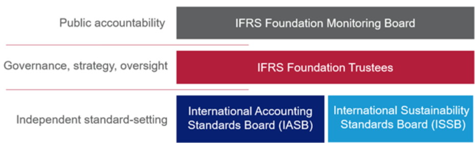
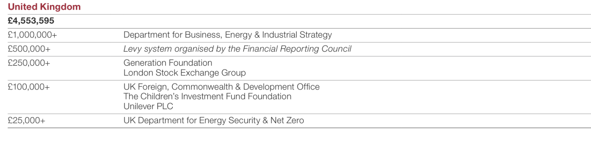
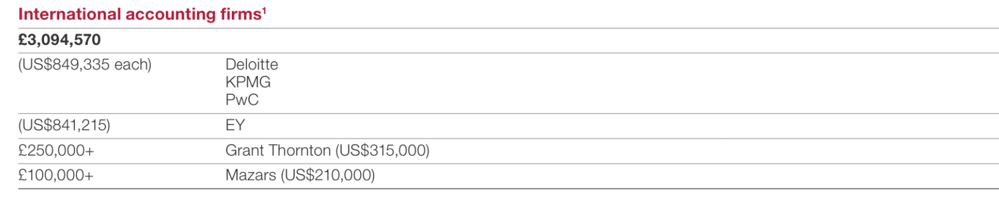
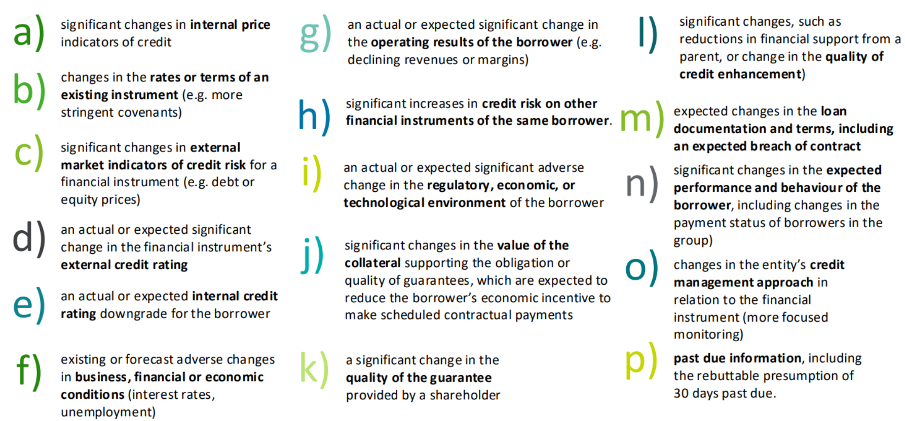

# **IFRS**

## **IFRS Foundation**

<https://www.ifrs.org/about-us/who-we-are/>

The IFRS Foundation sets standards used globally for financial reporting that improve the communication between companies and investors. They are an independent, not-for-profit organisation founded on the belief that better information from companies leads to better investment decisions. Their standards, called IFRS Accounting Standards, boost transparency, comparability and trust in financial reporting.

The IFRS Foundation has a three-tier governance structure that strengthens our ability to carry out our mission:

- Two independent standard-setting boards of experts—the International Accounting Standards Board (IASB) and the International Sustainability Standards Board (ISSB)—which are responsible for setting high-quality IFRS Standards through our robust and inclusive due process;
- Trustees from around the world who set our organisational strategy, govern our work and oversee our boards; and
- A monitoring board of public authorities which enhances our public accountability and oversees the work of our Trustees.

### **Monitoring Board**

The Monitoring Board was created in January 2009 with the aim of 'providing a formal link between the Trustees and public authorities' in order to enhance the public accountability of the IFRS Foundation.

The Monitoring Board's main responsibilities are to ensure that the Trustees continue to discharge their duties as defined by the IFRS Foundation Constitution, as well as approving the appointment or reappointment of Trustees. The Monitoring Board meets the Trustees at least once a year, or more often if appropriate

The Monitoring Board consists of capital markets authorities responsible for setting the form and content of financial reporting. Through the Monitoring Board, securities regulators that allow or require the use of IFRS in their jurisdictions will be able to more effectively carry out their mandates regarding investor protection, market integrity, and capital formation.

The members of the Monitoring Board are representatives from:

- the Board of the International Organization of Securities Commissions (IOSCO);
- the IOSCO Growth and Emerging Markets Committee;
- the Financial Services Agency of Japan (JFSA);
- the European Commission;
- the US Securities and Exchange Commission (SEC);
- the Comissão de Valores Mobiliários (CVM) of Brazil;
- the Financial Services Commission (FSC) of Korea;
- the Ministry of Finance of the People’s Republic of China; and
- the Financial Conduct Authority (FCA) of the United Kingdom.

The Basel Committee on Banking Supervision is an observer.

### **Foundation Trustees**

The 22 Trustees are appointed from varied countries and professional backgrounds, for a renewable three-year term. They are responsible for:

- overseeing our governance and organisational strategy;
- overseeing the due process;
- maintaining our Constitution and Due Process Handbook;
- appointing members to the International Accounting Standards Board, International Sustainability Standards Board, IFRS Interpretations Committee and various advisory bodies;
- and securing our funding.

Much of the Trustees’ work is carried out via committees. The Trustees are not involved in any technical matters relating to IFRS Standards; this responsibility rests solely with the boards.

The Trustees are accountable to the Monitoring Board, a body of publicly accountable market authorities. Trustee appointments and reappointments are approved by the Monitoring Board.

The Trustees are responsible for the organisation’s funding—they have a Funding Committee dedicated to overseeing the Foundation’s funding activities. Its focus is on developing a medium- to long-term sustainable funding strategy for both contributed and earned revenue to support the work of both our standard-setting boards, the International Accounting Standards Board (IASB) and the International Sustainability Standards Board (ISSB).

#### **Funding**

<https://www.ifrs.org/content/dam/ifrs/about-us/funding/2024/ifrs-foundation-annual-report-2024.pdf>

We receive income from two main sources: contributed revenue and earned revenue. For the year ended 31 December 2024 total revenue was £67.6 million—comprising contributed revenue (61%) and earned revenue (39%).

##### **Contributed revenue**

Contributed revenue is made up of voluntary contributions from jurisdictions; seed funding for the ISSB from Canada, China, Germany and Japan; philanthropic grants; and contributions from companies. Most jurisdictions have established either a levy on companies or a system of publicly supported financing, although funding mechanisms vary.

Deloitte, EY, KPMG and PwC have licensing agreements with the Foundation, for which annual fees are received in addition to their voluntary contributions.

##### **Earned revenue**

Most of our earned revenue comes from licensing our intellectual property; a licensing agreement allows companies and organisations to reproduce, translate or use our Standards commercially.

### **International Accounting Standards Board (IASB)**

The IASB is an independent group of experts with an appropriate mix of recent practical experience in setting accounting standards, in preparing, auditing, or using financial reports, and in accounting education. Broad geographical diversity is also required. The IFRS Foundation Constitution outlines the full criteria for the composition of the IASB, and the geographical allocation can be seen on the individual profiles.

IASB members are responsible for the development and publication of IFRS Accounting Standards, including the IFRS for SMEs Accounting Standard. The IASB is also responsible for approving Interpretations of IFRS Accounting Standards as developed by the IFRS Interpretations Committee (formerly IFRIC).

Members are appointed by the Trustees of the IFRS Foundation through an open and rigorous process that includes advertising vacancies and consulting relevant organisations.

#### **IFRS Accounting Standards**

Since its creation in 2001, the IFRS Foundation has transformed the global landscape of financial information by introducing IFRS Accounting Standards developed by the International Accounting Standards Board (IASB). The Standards have in effect become the global language of financial statements—trusted by investors worldwide and required for use by more than 140 jurisdictions. We are continually developing and improving the Standards.

### **Interpretations Committee**

The IFRS Interpretations Committee (Committee) works with the IASB in maintaining and supporting the consistent application of IFRS Accounting Standards. The Committee responds to questions about the application of the Accounting Standards and does other work at the request of the IASB.

The Committee comprises 14 voting members, appointed by the Trustees of the IFRS Foundation. The members provide the best available technical expertise and diversity of international business and market experience relating to the application of IFRS Accounting Standards.

### **International Sustainability Standards Board (ISSB)**

The Trustees of the IFRS Foundation announced the formation of the International Sustainability Standards Board (ISSB) on 3 November 2021 at COP26 in Glasgow, following strong market demand for its establishment. The ISSB is developing—in the public interest—standards that will result in a high-quality, comprehensive global baseline of sustainability disclosures focused on the needs of investors and the financial markets.

The ISSB has international support with its work to develop sustainability disclosure standards backed by the G7, the G20, the International Organization of Securities Commissions (IOSCO), the Financial Stability Board, African Finance Ministers and Finance Ministers and Central Bank Governors from more than 40 jurisdictions.

The ISSB builds on the work of market-led investor-focused reporting initiatives, including the Climate Disclosure Standards Board (CDSB), the Task Force for Climate-related Financial Disclosures (TCFD), the Value Reporting Foundation’s Integrated Reporting Framework and industry-based SASB Standards, as well as the World Economic Forum’s Stakeholder Capitalism Metrics.

#### **IFRS Sustainability Disclosures**

Responding to the need for consistent and comparable sustainability information to inform economic and investment decisions, in 2021 the IFRS Foundation created the International Sustainability Standards Board (ISSB) which operates alongside the IASB. The ISSB develops IFRS Sustainability Disclosure Standards, designed to deliver a truly global baseline of sustainability disclosures to inform capital markets. Over 1,000 companies have referenced the ISSB in their reports and 30 jurisdictions are making progress towards introducing ISSB Standards in their legal or regulatory frameworks.

IFRS Accounting Standards and IFRS Sustainability Disclosure Standards are developed using the same rigorous, inclusive, and transparent due process. The two boards ensure their work is connected and the Standards can be used effectively together, so that companies also connect their sustainability disclosures with the information in the financial statements. In working together, the IASB and ISSB build on integrated reporting and management commentary concepts.

## **IFRS 9**

<https://www.ifrs.org/issued-standards/list-of-standards/ifrs-9-financial-instruments.html/content/dam/ifrs/publications/html-standards/english/2025/issued/ifrs9/>

IFRS 9 specifies how an entity should classify and measure financial assets, financial liabilities, and some contracts to buy or sell non-financial items. IFRS 9 requires an entity to recognise a financial asset or a financial liability in its statement of financial position when it becomes party to the contractual provisions of the instrument.

### **Standard History**

In April 2001 the International Accounting Standards Board (Board) adopted IAS 39 Financial Instruments: Recognition and Measurement, which had originally been issued by the International Accounting Standards Committee in March 1999.

The Board had always intended that IFRS 9 Financial Instruments would replace IAS 39 in its entirety. However, in response to requests from interested parties that the accounting for financial instruments should be improved quickly, the Board divided its project to replace IAS 39 into three main phases. As the Board completed each phase, it issued chapters in IFRS 9 that replaced the corresponding requirements in IAS 39.

In November 2009 the Board issued the chapters of IFRS 9 relating to the classification and measurement of financial assets. In October 2010 the Board added the requirements related to the classification and measurement of financial liabilities to IFRS 9. This includes requirements on embedded derivatives and how to account for changes in own credit risk on financial liabilities designated under the fair value option.

In October 2010 the Board also decided to carry forward unchanged from IAS 39 the requirements related to the derecognition of financial assets and financial liabilities. Because of these changes, in October 2010 the Board restructured IFRS 9 and its Basis for Conclusions. In December 2011 the Board deferred the mandatory effective date of IFRS 9.

In November 2013 the Board added a Hedge Accounting chapter. IFRS 9 permits an entity to choose as its accounting policy either to apply the hedge accounting requirements of IFRS 9 or to continue to apply the hedge accounting requirements in IAS 39. Consequently, although IFRS 9 is effective (with limited exceptions for entities that issue insurance contracts and entities applying the IFRS for SMEs Standard), IAS 39, which now contains only its requirements for hedge accounting, also remains effective.

In July 2014 the Board issued the completed version of IFRS 9. The Board made limited amendments to the classification and measurement requirements for financial assets by addressing a narrow range of application questions and by introducing a ‘fair value through other comprehensive income’ measurement category for particular simple debt instruments. The Board also added the impairment requirements relating to the accounting for an entity’s expected credit losses on its financial assets and commitments to extend credit. A new mandatory effective date was also set.

IFRS 9 was effective for annual periods beginning on or after 1 January 2018 with early application permitted.

### **Chapter 4: Classification**

#### **4.1 Classification of financial assets**

When an entity first recognises a financial asset, it classifies it based on the entity’s business model for managing the asset and the asset’s contractual cash flow characteristics, as follows:

##### **Retail & Corporate Loans**

4.1.2 A financial asset shall be measured at **amortised cost** if both of the following conditions are met:

- (a) the financial asset is held within a business model whose objective is to hold financial assets in order to collect contractual cash flows and
- (b) the contractual terms of the financial asset give rise on specified dates to cash flows that are solely payments of principal and interest on the principal amount outstanding.

> *In laymans terms, This classification is used when a bank’s objective is to hold a financial asset to collect regular payments (principal + interest). Example: A bank gives a customer a home loan or corporate loan. The bank expects to collect monthly repayments that include interest and principal. Since the bank doesn't plan to sell the loan to another party and only wants the cash flows, the loan is measured at amortised cost. The loan sits on the balance sheet and accrues interest income over time, adjusted for credit impairments (e.g. IFRS 9 Expected Credit Losses).*

##### **Corporate Bonds**

4.1.2A financial asset shall be measured at fair value through other comprehensive income if both of the following conditions are met:

- (a) the financial asset is held within a business model whose objective is achieved by both collecting contractual cash flows and selling financial assets and
- (b) the contractual terms of the financial asset give rise on specified dates to cash flows that are solely payments of principal and interest on the principal amount outstanding.

> *In laymans terms, this applies when the bank collects cash flows but also sometimes sells the asset. The bank holds corporate bonds that pay regular interest but may also be sold if interest rates shift or for liquidity management. The objective is dual: collect interest (cash flows) and sell when strategic. These assets are recorded at fair value, but gains/losses from changes in fair value go to Other Comprehensive Income (OCI), not P&L—until sold.*

##### **Principal & Interest**

4.1.3 For the purpose of applying paragraphs 4.1.2(b) and 4.1.2A(b):

- (a) principal is the fair value of the financial asset at initial recognition. Paragraph B4.1.7B provides additional guidance on the meaning of principal.
- (b) interest consists of consideration for the time value of money, for the credit risk associated with the principal amount outstanding during a particular period of time and for other basic lending risks and costs, as well as a profit margin. Paragraphs B4.1.7A and B4.1.9A⁠–⁠B4.1.9E provide additional guidance on the meaning of interest, including the meaning of the time value of money.

##### **Derivates**

4.1.4 A financial asset shall be measured at fair value through profit or loss unless it is measured at amortised cost in accordance with paragraph 4.1.2 or at fair value through other comprehensive income in accordance with paragraph 4.1.2A. However an entity may make an irrevocable election at initial recognition for particular investments in equity instruments that would otherwise be measured at fair value through profit or loss to present subsequent changes in fair value in other comprehensive income (see paragraphs 5.7.5⁠–⁠5.7.6).

> *Used when the bank’s objective is trading or active management—not just collecting cash flows. The bank holds derivatives (e.g., interest rate swaps, FX forwards) or structured financial products. These are actively traded or managed for short-term profit. The cash flows are often not simple principal + interest, and/or the business model is to sell or trade.*

### **Chapter 5: Measurement**

#### **5.1 Initial measurement**

##### **Gross Carrying Amount**

5.1.1 Except for trade receivables within the scope of paragraph 5.1.3, at initial recognition, an entity shall measure a financial asset or financial liability at its fair value plus or minus, in the case of a financial asset or financial liability not at fair value through profit or loss, **transaction costs** that are directly attributable to the acquisition or issue of the financial asset or financial liability.

> *Example: A bank issues a loan of £100,000 with £500 in legal fees. If the loan is measured at amortised cost, the bank records an initial gross carrying amount of £100,500.*

#### **5.2 Subsequent measurement**

##### **Net Carrying Amount**

5.2.2 An entity shall apply the impairment requirements in Section 5.5 to financial assets that are measured at amortised cost in accordance with paragraph 4.1.2 and to financial assets that are measured at fair value through other comprehensive income in accordance with paragraph 4.1.2A.

> *Example: A retail customer borrows £100,000 from the bank, plus 500 in legal fees. After 6 months, it owes the bank £90,000. The bank plans to hold the loan to collect outstanding principal + interest, so it's measured at amortised cost. The bank applies ECL to reduce the net value of the loan on the balance sheet.*

##### **Fair Value**

5.2.3 An entity shall apply the hedge accounting requirements in paragraphs 6.5.8⁠–⁠6.5.14 (and, if applicable, paragraphs 89⁠–⁠94 of IAS 39 Financial Instruments: Recognition and Measurement for the fair value hedge accounting for a portfolio hedge of interest rate risk) to a financial asset that is designated as a hedged item.

> *Normally, derivatives (like interest rate swaps) are marked to market with changes going to P&L, but the hedged items (e.g., a fixed-rate loan or bond) are not. Hedge accounting aligns the accounting of both, to reflect the economics better and avoid mismatches in the financial statements.Example: A bank issues a fixed-rate loan to a corporate client. But rising interest rates would reduce the value of this fixed-rate asset. To hedge, the bank enters into a receive-floating, pay-fixed interest rate swap. The fixed-rate loan is designated as the hedged item, and the swap is the hedging instrument. The loan’s fair value changes due to interest rate risk → recorded in P&L. The swap’s fair value changes → also go to P&L. The gains/losses offset, reducing volatility*

#### **5.4 Amortised cost measurement**

##### **Interest Revenue**

5.4.1 Interest revenue shall be calculated by using the effective interest method (see Appendix A and paragraphs B5.4.1⁠–⁠B5.4.7). This shall be calculated by applying the effective interest rate to the gross carrying amount of a financial asset except for:

- (a) purchased or originated credit-impaired financial assets. For those financial assets, the entity shall apply the credit-adjusted effective interest rate to the amortised cost of the financial asset from initial recognition.
- (b) financial assets that are not purchased or originated credit-impaired financial assets but subsequently have become credit-impaired financial assets. For those financial assets, the entity shall apply the effective interest rate to the amortised cost of the financial asset in subsequent reporting periods.

> *Let’s say a bank lends R1,000,000 (no transaction costs) to a corporate client at 10% interest over 5 years. Here’s how the rules apply at different stages of credit quality. At initial recognition, the loan is performing. Use the effective interest rate (EIR) — say 10% — to calculate interest on the gross carrying amount (i.e., full R1,000,000). (Paragraph 5.4.1 (a)) Imagine the bank buys a distressed loan already in default, at a discount (say R600,000). Since it's credit-impaired from day one, use a credit-adjusted EIR (8%), which reflects expected losses. Apply this EIR to the amortised cost, not gross amount. (Paragraph 5.4.1 (b)) Suppose after 2 years, the original loan defaults or moves to Stage 3 under ECL. From that point, interest must be calculated using EIR (still 10%) but on the amortised cost — i.e., gross amount minus lifetime ECL.*

5.4.2 An entity that, in a reporting period, calculates interest revenue by applying the effective interest method to the amortised cost of a financial asset in accordance with paragraph 5.4.1(b), shall, in subsequent reporting periods, calculate the interest revenue by applying the effective interest rate to the gross carrying amount if the credit risk on the financial instrument improves so that the financial asset is no longer credit-impaired and the improvement can be related objectively to an event occurring after the requirements in paragraph 5.4.1(b) were applied (such as an improvement in the borrower’s credit rating).

> *Now, in a later period, the borrower recovers, credit rating improves, and you determine that it's no longer credit-impaired. You must resume calculating interest revenue on the gross carrying amount, not the amortised cost. Interest = 10% × R1,000,000 = R100,000*

##### **Modifications, Gains & Losses**

5.4.3 When the contractual cash flows of a financial asset are renegotiated or otherwise modified and the renegotiation or modification does not result in the derecognition of that financial asset in accordance with this Standard, an entity shall recalculate the gross carrying amount of the financial asset and shall recognise a modification gain or loss in profit or loss. The gross carrying amount of the financial asset shall be recalculated as the present value of the renegotiated or modified contractual cash flows that are discounted at the financial asset’s original effective interest rate (or credit-adjusted effective interest rate for purchased or originated credit-impaired financial assets) or, when applicable, the revised effective interest rate calculated in accordance with paragraph 6.5.10. Any costs or fees incurred adjust the carrying amount of the modified financial asset and are amortised over the remaining term of the modified financial asset.

> A bank initially grants a customer a loan of R1,000,000 over 5 years, with annual payments and an effective interest rate (EIR) of 10%. Based on this original rate, the annual contractual payment is approximately R263,797.20. However, due to borrower hardship, the bank agrees to reduce the interest rate to 6%, while keeping the loan term unchanged. The revised annual payment under the new interest rate becomes R237,396.79. In accordance with IFRS 9, since the modification does not result in derecognition of the financial asset, the bank must recalculate the gross carrying amount of the loan as the present value of the modified cash flows discounted at the original EIR of 10%. Discounting the new annual payments of R237,396.79 over the remaining 5-year term at 10% yields a present value of approximately R899,251.55. This becomes the new carrying amount of the loan, and the difference between the original carrying amount (R1,000,000) and the recalculated amount (R899,251.55), which equals R100,748.45, is recognised immediately as a modification loss in profit or loss. If any fees had been charged or incurred as part of the renegotiation, these would be included in the adjusted carrying amount and amortised over the remaining life of the loan.*

##### **Write Offs**

5.4.4 An entity shall directly reduce the gross carrying amount of a financial asset when the entity has no reasonable expectations of recovering a financial asset in its entirety or a portion thereof. A write-off constitutes a derecognition event (see paragraph B3.2.16(r)).

> *In the context of expected credit loss (ECL) modelling, paragraph 5.4.4 refers to the process of writing off a financial asset—such as a bank loan—when the bank has no reasonable expectation of full or partial recovery. This typically happens after significant default and exhaustive recovery efforts have failed. At this point, the bank derecognises the written-off portion of the loan by directly reducing the gross carrying amount of the asset. For example, suppose a bank has a loan with a gross carrying amount of R100,000. After default and collection efforts, it expects to recover only R20,000. The remaining R80,000 is written off. If the bank later recovers R5,000 through post-write-off legal action, that recovery is treated as income, but the written-off portion remains derecognised.*

#### **5.5 Impairment**

##### **Loss Allowance (BS)**

5.5.1 An entity shall recognise a loss allowance for expected credit losses on a financial asset that is measured in accordance with paragraphs 4.1.2 or 4.1.2A, a lease receivable, a contract asset or a loan commitment and a financial guarantee contract to which the impairment requirements apply in accordance with paragraphs 2.1(g), 4.2.1(c) or 4.2.1(d).

> *Loss allowance reduces the gross carrying amount of loans (on the balance sheet) calculated at the amortised cost.  It reflects a provision set aside to cover anticipated losses due to credit risk.*

5.5.2 An entity shall apply the impairment requirements for the recognition and measurement of a loss allowance for financial assets that are measured at fair value through other comprehensive income in accordance with paragraph 4.1.2A. However, the loss allowance shall be recognised in other comprehensive income and shall not reduce the carrying amount of the financial asset in the statement of financial position.

##### **Lifetime ECL**

5.5.3 Subject to paragraphs 5.5.13⁠–⁠5.5.16, at each reporting date, an entity shall measure the loss allowance for a financial instrument at an amount equal to the lifetime expected credit losses if the credit risk on that financial instrument has increased significantly since initial recognition.

> *The bank observes a sharp decline in the borrower’s revenues and a negative credit rating downgrade from investment grade to sub-investment grade. These are clear indicators of a significant increase in credit risk since the loan’s initial recognition. As a result, the loan transitions from Stage 1 to Stage 2, and the loss allowance must now reflect lifetime expected credit losses (ECL). The bank re-evaluates its expected losses over the remaining life of the loan and increases the allowance from R50,000 (12-month ECL) to R400,000 (lifetime ECL), reflecting the increased likelihood of default.*

5.5.4 The objective of the impairment requirements is to recognise lifetime expected credit losses for all financial instruments for which there have been significant increases in credit risk since initial recognition — whether assessed on an individual or collective basis — considering all reasonable and supportable information, including that which is forward-looking.

> *The transition to Stage 2 is not based on actual default, but rather on the bank’s forward-looking assessment of credit risk. The IFRS 9 model requires that even if a loan is still performing (i.e., no payments are yet missed), a significant increase in credit risk should trigger a shift to lifetime ECL recognition. The bank considers all available information, including industry-wide economic downturns and the borrower’s weakened financial metrics. The updated lifetime ECL of R400,000 is now booked as a loss allowance, increasing the impairment expense in the income statement.*

##### **12-Month ECL**

5.5.5 Subject to paragraphs 5.5.13⁠–⁠5.5.16, if, at the reporting date, the credit risk on a financial instrument has not increased significantly since initial recognition, an entity shall measure the loss allowance for that financial instrument at an amount equal to 12‑month expected credit losses.

> *When the corporate loan was initially recognised, the borrower had a solid credit rating, strong financial statements, and no signs of potential default. As there was no significant increase in credit risk at the initial or subsequent reporting dates, the loan remained in Stage 1. Under IFRS 9, the bank estimated a 12-month expected credit loss (ECL) of R50,000, which was booked as a loss allowance in the financial statements. This small provision reflects the expected credit losses arising from default events that could occur within the next 12 months, not the entire loan term. On the balance sheet, the loan is recorded at amortised cost less this allowance, and on the income statement, the R50,000 is shown as an impairment expense.*

##### **Curing**

5.5.7 If an entity has measured the loss allowance for a financial instrument at an amount equal to lifetime expected credit losses in the previous reporting period, but determines at the current reporting date that paragraph 5.5.3 is no longer met, the entity shall measure the loss allowance at an amount equal to 12‑month expected credit losses at the current reporting date.

> *In a later reporting period, suppose the borrower that had previously moved into Stage 2 due to a temporary dip in financial performance now shows signs of recovery. For example, their revenues improve, debt ratios normalize, and their credit rating is upgraded. After evaluating all available and forward-looking information, the bank concludes that the significant increase in credit risk no longer exists. As a result, the loan transitions back to Stage 1, and the loss allowance is adjusted from a lifetime ECL (e.g., R400,000) back down to a 12-month ECL (e.g., R75,000). The reduction of R325,000 is recognised in the income statement as an impairment gain, improving the bank's profitability for that period. This transition also reduces the loss allowance shown on the balance sheet, increasing the net carrying amount of the asset.*

##### **Impairment (IS)**

5.5.8 An entity shall recognise in profit or loss, as an impairment gain or loss, the amount of expected credit losses (or reversal) that is required to adjust the loss allowance at the reporting date to the amount that is required to be recognised in accordance with this Standard.

5.5.14  At each reporting date, an entity shall recognise in profit or loss the amount of the change in lifetime expected credit losses as an impairment gain or loss. An entity shall recognise favourable changes in lifetime expected credit losses as an impairment gain, even if the lifetime expected credit losses are less than the amount of expected credit losses that were included in the estimated cash flows on initial recognition.

> *Impairment gain/loss affects the income statement, reflecting changes in ECL or loss allowance. At the inital measurement the impairment will simply be the ECL. Increases in ECL → Impairment losses. Decreases in ECL → Impairment gains.*

##### **SICR**

5.5.9 At each reporting date, an entity shall assess whether the credit risk on a financial instrument has increased significantly since initial recognition. When making the assessment, an entity shall use the change in the risk of a default occurring over the expected life of the financial instrument instead of the change in the amount of expected credit losses. To make that assessment, an entity shall compare the risk of a default occurring on the financial instrument as at the reporting date with the risk of a default occurring on the financial instrument as at the date of initial recognition and consider reasonable and supportable information, that is available without undue cost or effort, that is indicative of significant increases in credit risk since initial recognition.

> *At each reporting date, the bank is required to assess whether the credit risk of a loan has increased significantly compared to its risk at initial recognition. Let’s say a bank issued a 5-year loan to a mid-sized logistics company in 2022. At the time of origination, the borrower had a healthy balance sheet, steady cash flow, and an external credit rating equivalent to BBB, reflecting a low probability of default. Now, in 2025, during a new reporting cycle, the bank reassesses the risk of default over the remaining life of the loan. It notices that the borrower has experienced a significant drop in revenue, is taking longer to pay other creditors, and is on credit watch for a potential downgrade. Although the actual ECL amount hasn't changed drastically yet, the risk of default occurring over the life of the loan has materially increased when compared to 2022. Therefore, this loan would move from Stage 1 to Stage 2, and the bank would now recognise lifetime expected credit losses instead of just 12-month ECLs. This results in a higher loss allowance and an impairment loss on the income statement, even if actual cash shortfalls haven't occurred yet.*

##### **Low Credit Risk**

5.5.10 An entity may assume that the credit risk on a financial instrument has not increased significantly since initial recognition if the financial instrument is determined to have low credit risk at the reporting date (see paragraphs B5.5.22⁠–⁠B5.5.24).

> *If the asset is within the globally understood definition of ‘investment grade’, it may be allocated into stage 1. The application of this concept is optional and will avoid the need to assess significant increases in credit risk for assets with low credit risk which could provide operational savings. However, the simplification of the assessment does not result in a stage trigger.*

##### **30 DPD Backstop**

5.5.11 If reasonable and supportable forward-looking information is available without undue cost or effort, an entity cannot rely solely on past due information when determining whether credit risk has increased significantly since initial recognition. However, when information that is more forward-looking than past due status (either on an individual or a collective basis) is not available without undue cost or effort, an entity may use past due information to determine whether there have been significant increases in credit risk since initial recognition. Regardless of the way in which an entity assesses significant increases in credit risk, there is a rebuttable presumption that the credit risk on a financial asset has increased significantly since initial recognition when contractual payments are more than 30 days past due. An entity can rebut this presumption if the entity has reasonable and supportable information that is available without undue cost or effort, that demonstrates that the credit risk has not increased significantly since initial recognition even though the contractual payments are more than 30 days past due. When an entity determines that there have been significant increases in credit risk before contractual payments are more than 30 days past due, the rebuttable presumption does not apply.

##### **Modified Assets**

5.5.12 If the contractual cash flows on a financial asset have been renegotiated or modified and the financial asset was not derecognised, an entity shall assess whether there has been a significant increase in the credit risk of the financial instrument in accordance with paragraph 5.5.3 by comparing:

- (a) the risk of a default occurring at the reporting date (based on the modified contractual terms); and
- (b) the risk of a default occurring at initial recognition (based on the original, unmodified contractual terms).

##### **Probability-Weighted Discounted Cashflows**

5.5.17 An entity shall measure expected credit losses of a financial instrument in a way that reflects:

- (a) an unbiased and probability‑weighted amount that is determined by evaluating a range of possible outcomes;
- (b) the time value of money; and
- (c) reasonable and supportable information that is available without undue cost or effort at the reporting date about past events, current conditions and forecasts of future economic conditions.

##### **Economic Scenarios**

5.5.18 When measuring expected credit losses, an entity need not necessarily identify every possible scenario. However, it shall consider the risk or probability that a credit loss occurs by reflecting the possibility that a credit loss occurs and the possibility that no credit loss occurs, even if the possibility of a credit loss occurring is very low.

##### **Lifetime Definition**

5.5.19 The maximum period to consider when measuring expected credit losses is the maximum contractual period (including extension options) over which the entity is exposed to credit risk and not a longer period, even if that longer period is consistent with business practice.

5.5.20 However, some financial instruments include both a loan and an undrawn commitment component and the entity’s contractual ability to demand repayment and cancel the undrawn commitment does not limit the entity’s exposure to credit losses to the contractual notice period. For such financial instruments, and only those financial instruments, the entity shall measure expected credit losses over the period that the entity is exposed to credit risk and expected credit losses would not be mitigated by credit risk management actions, even if that period extends beyond the maximum contractual period.

### **Appendix A: Defined Terms**

<https://www.ifrs.org/issued-standards/list-of-standards/ias-32-financial-instruments-presentation.html/content/dam/ifrs/publications/html-standards/english/2025/issued/ias32/#IAS32_11__IAS32_P0115>

<https://www.ifrs.org/issued-standards/list-of-standards/ifrs-7-financial-instruments-disclosures.html/content/dam/ifrs/publications/html-standards/english/2025/issued/ifrs7/#IFRS07_APPA__IFRS07_P0862>

#### **financial instrument**

A financial instrument is any contract that gives rise to a financial asset of one entity and a financial liability or equity instrument of another entity.

#### **financial liability**

A financial liability is any liability that is:

- (a) a contractual obligation:
  - (i) to deliver cash or another financial asset to another entity; or
  - (ii) to exchange financial assets or financial liabilities with another entity under conditions that are potentially unfavourable to the entity;

#### **financial asset**

A financial asset is any asset that is:

- (a) cash;
- (b) an equity instrument of another entity;
- (c) a contractual right:
  - (i) to receive cash or another financial asset from another entity; or
  - (ii) to exchange financial assets or financial liabilities with another entity under conditions that are potentially favourable to the entity;

#### **contract assets**

Those rights that *IFRS 15 Revenue from Contracts with Customers* specifies are accounted for in accordance with this Standard for the purposes of recognising and measuring impairment gains or losses.

#### **past due**

A financial asset is past due when a counterparty has failed to make a payment when that payment was contractually due.

#### **credit risk**

The risk that one party to a financial instrument will cause a financial loss for the other party by failing to discharge an obligation.

#### **credit loss**

The difference between all contractual cash flows that are due to an entity in accordance with the contract and all the cash flows that the entity expects to receive (ie all cash shortfalls), discounted at the original effective interest rate

#### **expected credit losses**

The weighted average of credit losses with the respective risks of a default occurring as the weights.

#### **lifetime expected credit losses**

The expected credit losses that result from all possible default events over the expected life of a financial instrument.

#### **12‑month expected credit losses**

The portion of lifetime expected credit losses that represent the expected credit losses that result from default events on a financial instrument that are possible within the 12 months after the reporting date.

#### **impairment gain or loss**

Gains or losses that are recognised in profit or loss in accordance with paragraph 5.5.8 and that arise from applying the impairment requirements in Section  5.5.

#### **loss allowance**

The allowance for expected credit losses on financial assets measured in accordance with paragraph 4.1.2, lease receivables and contract assets, the accumulated impairment amount for financial assets measured in accordance with paragraph 4.1.2A and the provision for expected credit losses on loan commitments and financial guarantee contracts.

#### **transaction costs**

Incremental costs that are directly attributable to the acquisition, issue or disposal of a financial asset or financial liability (see paragraph B5.4.8). An incremental cost is one that would not have been incurred if the entity had not acquired, issued or disposed of the financial instrument.

#### **amortised cost**

The amount at which the financial asset or financial liability is measured at initial recognition minus the principal repayments, plus or minus the cumulative amortisation using the effective interest method of any difference between that initial amount and the maturity amount and, for financial assets, adjusted for any loss allowance.

#### **fair value**

The price that would be received to sell an asset or paid to transfer a liability in an orderly transaction between market participants at the measurement date.

#### **gross carrying amount**

The amortised cost of a financial asset, before adjusting for any loss allowance.

#### **credit-impaired financial asset**

A financial asset is credit-impaired when one or more events that have a detrimental impact on the estimated future cash flows of that financial asset have occurred. Evidence that a financial asset is credit-impaired include observable data about the following events:

- (a) significant financial difficulty of the issuer or the borrower;
- (b) a breach of contract, such as a default or past due event;
- (c) the lender(s) of the borrower, for economic or contractual reasons relating to the borrower’s financial difficulty, having granted to the borrower a concession(s) that the lender(s) would not otherwise consider;
- (d) it is becoming probable that the borrower will enter bankruptcy or other financial reorganisation;
- (e) the disappearance of an active market for that financial asset because of financial difficulties; or
- (f) the purchase or origination of a financial asset at a deep discount that reflects the incurred credit losses.

It may not be possible to identify a single discrete event—instead, the combined effect of several events may have caused financial assets to become credit-impaired.

### **Appendix B: Application Guidance**

#### **EIR Method**

B5.4.1 In applying the effective interest method, an entity identifies fees that are an integral part of the effective interest rate of a financial instrument. The description of fees for financial services may not be indicative of the nature and substance of the services provided. Fees that are an integral part of the effective interest rate of a financial instrument are treated as an adjustment to the effective interest rate, unless the financial instrument is measured at fair value, with the change in fair value being recognised in profit or loss. In those cases, the fees are recognised as revenue or expense when the instrument is initially recognised.

B5.4.4 When applying the effective interest method, an entity generally amortises any fees, points paid or received, transaction costs and other premiums or discounts that are included in the calculation of the effective interest rate over the expected life of the financial instrument.

#### **Fees**

B5.4.2 Fees that are an integral part of the effective interest rate of a financial instrument include:

- (a) origination fees received by the entity relating to the creation or acquisition of a financial asset. Such fees may include compensation for activities such as evaluating the borrower’s financial condition, evaluating and recording guarantees, collateral and other security arrangements, negotiating the terms of the instrument, preparing and processing documents and closing the transaction. These fees are an integral part of generating an involvement with the resulting financial instrument.
- (b) commitment fees received by the entity to originate a loan when the loan commitment is not measured in accordance with paragraph 4.2.1(a) and it is probable that the entity will enter into a specific lending arrangement. These fees are regarded as compensation for an ongoing involvement with the acquisition of a financial instrument. If the commitment expires without the entity making the loan, the fee is recognised as revenue on expiry.

B5.4.3 Fees that are not an integral part of the effective interest rate of a financial instrument and are accounted for in accordance with IFRS 15 include:

- (a) fees charged for servicing a loan;
  
#### **Transaction Costs**

B5.4.8 Transaction costs include fees and commission paid to agents (including employees acting as selling agents), advisers, brokers and dealers, levies by regulatory agencies and security exchanges, and transfer taxes and duties. Transaction costs do not include debt premiums or discounts, financing costs or internal administrative or holding costs.

#### **SICR Qualitative Trigger Options**

B5.5.17 

#### **Default Defintion**

B5.5.37 When defining default for the purposes of determining the risk of a default occurring, an entity shall apply a default definition that is consistent with the definition used for internal credit risk management purposes for the relevant financial instrument and consider qualitative indicators (for example, financial covenants) when appropriate. However, there is a rebuttable presumption that default does not occur later than when a financial asset is 90 days past due unless an entity has reasonable and supportable information to demonstrate that a more lagging default criterion is more appropriate. The definition of default used for these purposes shall be applied consistently to all financial instruments unless information becomes available that demonstrates that another default definition is more appropriate for a particular financial instrument.

#### **Best-Estimate Basis**

B5.5.41 The purpose of estimating expected credit losses is neither to estimate a worst-case scenario nor to estimate the best-case scenario. Instead, an estimate of expected credit losses shall always reflect the possibility that a credit loss occurs and the possibility that no credit loss occurs even if the most likely outcome is no credit loss.

#### **Probability-Weighted Outcome**

B5.5.42 Paragraph 5.5.17(a) requires the estimate of expected credit losses to reflect an unbiased and probability-weighted amount that is determined by evaluating a range of possible outcomes. In practice, this may not need to be a complex analysis. In some cases, relatively simple modelling may be sufficient, without the need for a large number of detailed simulations of scenarios. For example, the average credit losses of a large group of financial instruments with shared risk characteristics may be a reasonable estimate of the probability-weighted amount. In other situations, the identification of scenarios that specify the amount and timing of the cash flows for particular outcomes and the estimated probability of those outcomes will probably be needed. In those situations, the expected credit losses shall reflect at least two outcomes in accordance with paragraph 5.5.18.

#### **Time Value of Money**

B5.5.44 Expected credit losses shall be discounted to the reporting date, not to the expected default or some other date, using the effective interest rate determined at initial recognition or an approximation thereof.

B5.5.45 For purchased or originated credit-impaired financial assets, expected credit losses shall be discounted using the credit-adjusted effective interest rate determined at initial recognition.

### **COVID 19**

*Accounting for expected credit losses applying IFRS 9 Financial Instruments in the light of current uncertainty resulting from the COVID 19 pandemic.*

A number of assumptions and linkages underlying the way ECLs have been implemented to date may no longer hold in the the COVID 19 environment. Entities should not continue to apply their existing ECL methodology mechanically. For example, the extension of payment holidays to all borrowers in particular classes of financial instruments should not automatically result in all those instruments being considered to have suffered an SICR.  

To assess SICR, IFRS 9 requires that entities assess changes in the risk of a default occurring over the **expected life** of a financial instrument. It is likely to be difficult to incorporate the specific effects of COVID 19 and government support measures on a reasonable and supportable basis. However, changes in economic conditions should be reflected in macroeconomic scenarios applied by entities and in their weightings. If the effects of COVID 19 cannot be reflected in models, post-model overlays or adjustments will need to be considered. The environment is subject to rapid change and updated facts and circumstances should continue to be monitored as new information becomes available.
