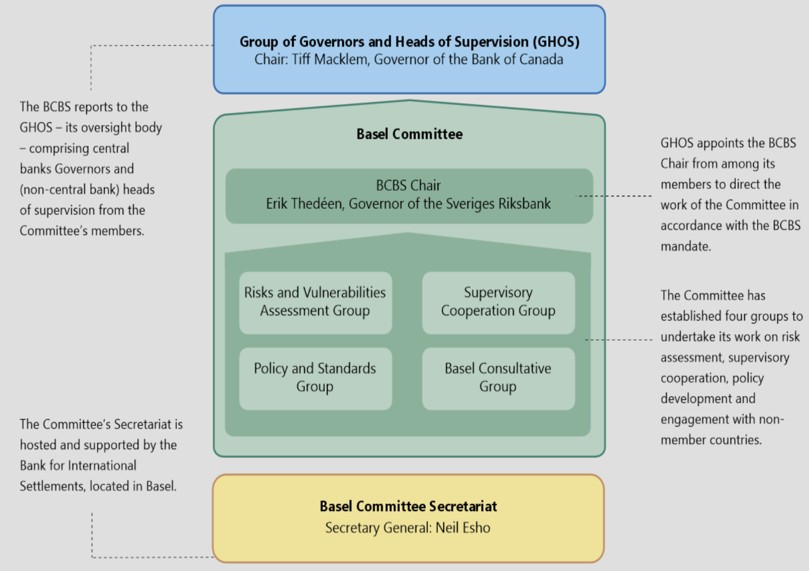
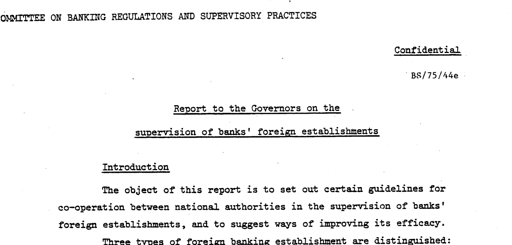
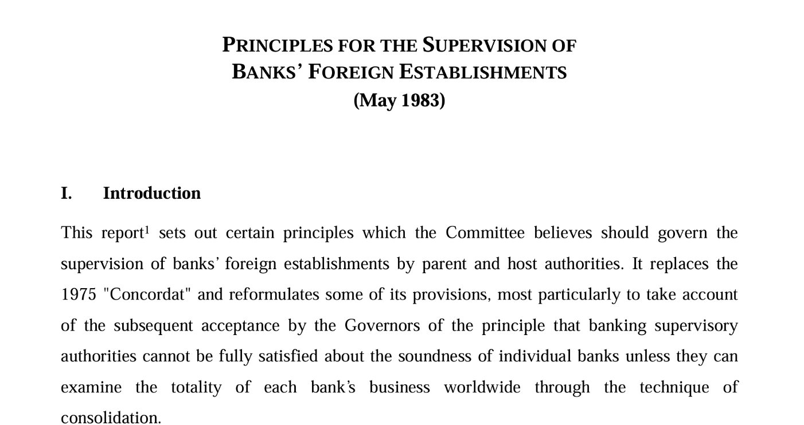

# **Basel**

## **Bank for International Settlements**

The BIS is owned by 63 central banks, representing countries from around the world that together account for about 95% of world GDP including the Bank of England, European Central Bank and South African Reserve Bank.

Their mission is to support central banks' pursuit of monetary and financial stability through international cooperation, and to act as a bank for central banks.

- The BIS provides central banks and financial supervisory authorities with a forum for dialogue and cooperation, where they can freely exchange information, forge a common understanding and decide on common actions.
- It also supports central banks and other financial authorities in the implementation of global regulatory standards and sound supervisory practices.
- As its name indicates, the BIS also acts as a bank. They offer financial services exclusively to central banks, monetary authorities and international organisations, mainly to assist them in the management of their foreign exchange assets.

The governance of the Bank is exercised at three levels

1. Board of Directors
2. General Meetings of member central banks
3. BIS Management

### **History**

Established in 1930, the Bank for International Settlements is the oldest international financial institution. From its inception to the present day, the BIS has played a number of key roles in the global economy, from settling reparation payments imposed on Germany following the First World War, to serving central banks in their pursuit of monetary and financial stability.

The BIS was set up to take over the functions previously performed by the Agent General for Reparations: managing the collection, administration and distribution of the annuities payable as reparations. The Bank's name is derived from this original role. Finally, the BIS was tasked to promote central bank cooperation more generally.

With the reparations issue out of the way, the BIS focused its activities on the technical cooperation between central banks (including reserve management, foreign exchange transactions, international postal payments, gold deposit and swap facilities) and on providing a forum for regular meetings of central bank Governors and officials.

In July 1944, a United Nations conference met at Bretton Woods in the United States to discuss the postwar international monetary system. The Bretton Woods Conference adopted a resolution calling for the abolition of the BIS "at the earliest possible moment", because it considered that the BIS would have no useful role to play once the newly created World Bank and International Monetary Fund were operational. European central bankers held a different opinion, and successfully lobbied for maintaining the BIS. By early 1948, the BIS liquidation resolution had been put aside. It was understood that henceforth the BIS would focus foremost on European monetary and financial matters.

### **The Basel Process**

The Basel Process refers to the way in which the BIS promotes international cooperation among monetary authorities and financial supervisory officials.

Governors and other senior officials of BIS member central banks hold bimonthly meetings, usually in Basel, to discuss current developments and the outlook for the world economy and financial markets. They also exchange views and experiences on issues of interest to central banks.

The outcomes of this process are visible to the public in the form of committee reports analysing specific topics and internationally agreed standards. International agreement is the precondition for globally consistent standards produced by the standard-setting committees. But it does not substitute for national legislation. In order to become binding, the agreements reached in Basel have to be approved and implemented at the national level, following due regulatory and legislative processes in each individual jurisdiction.

The Financial Stability Institute assists central banks and financial regulatory and supervisory authorities worldwide in strengthening their financial systems by supporting the implementation of global regulatory standards and sound supervisory practices. It does so through policy work, knowledge-sharing activities and capacity-building.

### **Committees**

The BIS hosts six committees, which are overseen by three senior groupings in the context of the Basel Process.

- The **Global Economy Meeting (GEM)** provides oversight to three committees: the Committee on the Global Financial System, the BIS Committee on Payments and Market Infrastructures and the Markets Committee
- The **All Governors' Meeting**, which includes all 63 BIS member central banks, oversees the work of two committees: the Central Bank Governance Forum and the Irving Fisher Committee on Central Bank Statistics
- The **Group of Governors and Heads of Supervision (GHOS)** provides oversight to the Basel Committee on Banking Supervision (BCBS). The GHOS comprises the central bank Governors and non-central bank heads of supervision from BCBS member jurisdictions.

The committees have their own respective governance arrangements and reporting lines, and their agendas are guided by various groups of central banks and supervisory authorities.

1. Basel Committee on Banking Supervision: develops global regulatory standards for banks and seeks to strengthen micro- and macroprudential supervision.
2. Committee on the Global Financial System: monitors and analyses issues relating to financial markets and systems.
3. Committee on Payments and Market Infrastructures: establishes and promotes global regulatory/oversight standards for payment, clearing, settlement and other market infrastructures, and monitors and analyses developments in these areas.
4. Markets Committee: monitors developments in financial markets and their implications for central bank operations.
5. Central Bank Governance Forum: examines issues related to the design and operation of central banks.
6. Irving Fisher Committee on Central Bank Statistics: addresses statistical issues relating to economic, monetary and financial stability.

### **Associations**

The following associations involved in international cooperation in the area of financial stability also have their secretariats at the BIS, but have their own separate legal identity and governance structure and report to their members.

1. Financial Stability Board: coordinates the work of national authorities and international standard setters  in developing and promoting the implementation of effective regulatory, supervisory and other financial sector policies in the interest of global financial stability.
2. International Association of Deposit Insurers: sets global standards for deposit insurance systems and promotes cooperation on deposit insurance and bank resolution arrangements.
3. International Association of Insurance Supervisors: sets global standards for the insurance sector to promote effective and globally consistent supervision for the benefit and protection of policyholders and to contribute to global financial stability.

## **Basel Committee on Banking Supervision**

The Basel Committee on Banking Supervision (BCBS) is the primary global standard setter for the prudential regulation of banks and provides a forum for regular cooperation on banking supervisory matters. Its 45 members comprise central banks and bank supervisors from 28 jurisdictions.

In 1974, the collapse of Bankhaus Herstatt in Germany and of Franklin National Bank in the United States highlighted the lack of efficient banking supervision of banks' international activities, and prompted the G10 central bank Governors to create the Basel Committee on Banking Supervision. The Basel Committee was initially named the Committee on Banking Regulations and Supervisory Practices.

The Committee's first meeting took place in February 1975, and meetings have been held regularly three or four times a year since. Since its inception, the Basel Committee has expanded its membership from the G10 to 45 institutions from 28 jurisdictions. Starting with the Basel Concordat, first issued in 1975 and revised several times since, the Committee has established a series of international standards for bank regulation, most notably its landmark publications of the accords on capital adequacy which are commonly known as Basel I, Basel II and, most recently, Basel III.

### **Basel Committee Charter**

#### **I. Purpose & Role**

(1) Mandate
Its mandate is to strengthen the regulation, supervision and practices of banks worldwide with the purpose of enhancing financial stability.

(2) Activities
The BCBS seeks to achieve its mandate through the following activities:

- exchanging information on developments in the banking sector and financial markets, to help identify current or emerging risks for the global financial system;
- sharing supervisory issues, approaches and techniques to promote common understanding and to improve cross-border cooperation;
- establishing and promoting global standards for the regulation and supervision of banks as well as guidelines and sound practices;
- addressing regulatory and supervisory gaps that pose risks to financial stability;
- monitoring the implementation of BCBS standards in member countries and beyond with the purpose of ensuring their timely, consistent and effective implementation and contributing to a "level playing field" among internationally active banks;
- consulting with central banks and bank supervisory authorities which are not members of the BCBS to benefit from their input into the BCBS policy formulation process and to promote the implementation of BCBS standards, guidelines and sound practices beyond BCBS member countries; and
- coordinating and cooperating with other financial sector standard setters and international bodies, particularly those involved in promoting financial stability.

The BCBS does not possess any formal supranational authority. Its decisions do not have legal force. Rather, the BCBS relies on its members' commitments, as described in Section 5, to achieve its mandate.

(3) Legal status
The BCBS does not possess any formal supranational authority. Its decisions do not have legal force. Rather, the BCBS relies on its members' commitments, as described in Section 5, to achieve its mandate.

#### **II. Membership**

(4) BCBS members
BCBS members include organisations with direct banking supervisory authority and central banks. After consulting the Committee, the BCBS Chair may invite other organisations to become BCBS observers.

#### **III. Oversight**

(6) The Group of Governors and Heads of Supervision (GHOS)
The GHOS is the oversight body of the BCBS. The BCBS reports to the GHOS and seeks its endorsement for major decisions.

#### **IV. Organisation**

(7) Structure
The internal organisational structure of the BCBS comprises:

- The Committee
- Groups, working groups, virtual networks and task forces3
- The Chair
- The Secretariat

(8) The Committee
The Committee is the ultimate decision-making body of the BCBS with responsibility for ensuring that its mandate is achieved. The Committee is responsible for:

- developing, guiding and monitoring the BCBS work programme within the general direction provided by GHOS;
- establishing and promoting BCBS standards, guidelines and sound practices;
- establishing and disbanding groups, working groups, virtual networks and task forces; approving and modifying their mandates; and monitoring their progress;
- recommending to the GHOS amendments to the BCBS Charter; and
- deciding on the organisational regulations governing its activities.

The Committee generally meets three times every year. However, the Chair can decide to hold additional or fewer meetings4 as necessary. Committee decisions of public interest shall be communicated through the BCBS website. The Committee shall issue, when appropriate, press statements to communicate its decisions.

(9) Groups, working groups, virtual networks and task forces
The BCBS's work is largely organised around groups, working groups, virtual networks and task forces. The Secretariat will make publicly available the list of BCBS groups and working groups. BCBS groups report directly to the Committee.

- BCBS groups form part of the permanent internal structure of the BCBS and thus operate without a specific deliverable or end date.
- Working groups consist of experts from BCBS members that support the technical work of BCBS groups.
- Virtual networks serve as an expert group that are called upon as needed by the parent group or the Committee. The primary function of virtual networks is to monitor existing policies.
- Task forces are created to undertake specific tasks for a limited time. These are generally composed of technical experts from BCBS member institutions. However, when these groupings are created by the Committee, they consist of BCBS representatives and deal with specific issues that require prompt attention of the Committee. In such cases, they are called high-level task forces.

(10) Chair
The Chair directs the work of the Committee in accordance with the BCBS mandate.

(11) The Secretariat
The Secretariat is provided by the Bank for International Settlements (BIS) and supports the work of the Committee, the Chair and the groups around which the Committee organises its work. The Secretariat is staffed mainly by professional staff, mostly on temporary secondment from BCBS members.

#### **V. BCBS standards, guidelines and sound practices**

(12) Standards
The BCBS sets standards for the prudential regulation and supervision of banks. The BCBS expects full implementation of its standards by BCBS members and their internationally active banks. However, BCBS standards constitute minimum requirements and BCBS members may decide to go beyond them.

The Committee expects standards to be incorporated into local legal frameworks through each jurisdiction's rule-making process within the pre-defined timeframe established by the Committee. If deviation from literal transposition into local legal frameworks is unavoidable, members should seek the greatest possible equivalence of standards and their outcome.

(13) Guidelines
Guidelines elaborate the standards in areas where they are considered desirable for the prudential regulation and supervision of banks, in particular international active banks. They generally supplement BCBS standards by providing additional guidance for the purpose of their implementation.

(14) Sound practices
Sound practices generally describe actual observed practices, with the goal of promoting common understanding and improving supervisory or banking practices. BCBS members are encouraged to compare these practices with those applied by themselves and their supervised institutions to identify potential areas for improvement.

### **Concordat**

At the outset, one important aim of the Committee's work was to close gaps in international supervisory coverage so that

- (i) no banking establishment would escape supervision; and
- (ii) supervision would be adequate and consistent across member jurisdictions.

A first step in this direction was the paper issued in 1975 that came to be known as the "Concordat". The Concordat set out principles for sharing supervisory responsibility for banks' foreign branches, subsidiaries and joint ventures between host and parent (or home) supervisory authorities.

In May 1983, the Concordat was revised and re-issued as Principles for the supervision of banks' foreign establishments.

### **Basel Capital Accord** 🔴

With the foundations for supervision of internationally active banks laid, capital adequacy soon became the main focus of the Committee's activities. In the early 1980s, the onset of the Latin American debt crisis heightened the Committee's concerns that the capital ratios of the main international banks were deteriorating at a time of growing international risks. Backed by the G10 Governors, Committee members resolved to halt the erosion of capital standards in their banking systems and to work towards greater convergence in the measurement of capital adequacy. This resulted in a broad consensus on a weighted approach to the measurement of risk, both on and off banks' balance sheets.

There was strong recognition within the Committee of the overriding need for a multinational accord to strengthen the stability of the international banking system and to remove a source of competitive inequality arising from differences in national capital requirements. Following comments on a consultative paper published in December 1987, a capital measurement system commonly referred to as the Basel Capital Accord was approved by the G10 Governors and released to banks in July 1988. The 1988 Accord called for a minimum ratio of capital to risk-weighted assets of 8% to be implemented by the end of 1992. The standards were almost entirely addressed to credit risk, the main risk incurred by banks.

The document consists of two main sections, which cover (a) the definition of capital and (b) the structure of risk weights. Two shorter sections define the target standard ratio and the transitional and implementing arrangements. There are four technical annexes covering the definition of capital, the counterparty risk weights, the credit conversion factors for off-balance-sheet items and the transitional arrangements.

<https://www.bis.org/publ/bcbs04a.htm>

The Basel Accord is not a law.

### **Market Risk Amendment** 🔴

The Committee also refined the framework to address risks other than credit risk, which was the focus of the 1988 Accord. In January 1996, following two consultative processes, the Committee issued the Amendment to the Capital Accord to incorporate market risks (or Market Risk Amendment), to take effect at the end of 1997. This was designed to incorporate within the Accord a capital requirement for the market risks arising from banks' exposures to foreign exchange, traded debt securities, equities, commodities and options. An important aspect of the Market Risk Amendment was that banks were, for the first time, allowed to use internal models (value-at-risk models) as a basis for measuring their market risk capital requirements, subject to strict quantitative and qualitative standards. Much of the preparatory work for the market risk package was undertaken jointly with securities regulators.

<https://www.bis.org/publ/bcbs24a.htm>

### **Basel II** 🔴

In June 1999, the Committee issued a proposal for a new capital adequacy framework to replace the 1988 Accord. This led to the release of a revised capital framework in June 2004. Generally known as "Basel II", the revised framework comprised three pillars:

1. minimum capital requirements, which sought to develop and expand the standardised rules set out in the 1988 Accord
2. supervisory review of an institution's capital adequacy and internal assessment process
3. effective use of disclosure as a lever to strengthen market discipline and encourage sound banking practices

The new framework was designed to improve the way regulatory capital requirements reflect underlying risks and to better address the financial innovation that had occurred in recent years. The changes aimed at rewarding and encouraging continued improvements in risk measurement and control.  

The framework's publication in June 2004 followed almost six years of intensive preparation. During this period, the Basel Committee consulted extensively with banking sector representatives, supervisory agencies, central banks and outside observers in order to develop significantly more risk-sensitive capital requirements.

<https://www.bis.org/publ/bcbs107.htm>

Following the June 2004 release, which focused primarily on the banking book, the Committee turned its attention to the trading book. In close cooperation with the International Organization of Securities Commissions (IOSCO), the international body of securities regulators, the Committee published in July 2005 a consensus document governing the treatment of banks' trading books under the new framework. For ease of reference, this new text was integrated with the June 2004 text in a comprehensive document released in June 2006: Basel II: International convergence of capital measurement and capital standards: A revised framework - Comprehensive version.

<https://www.bis.org/publ/bcbs128.htm>

### **Basel III** 🔴

Even before Lehman Brothers collapsed in September 2008, the need for a fundamental strengthening of the Basel II framework had become apparent. The banking sector entered the financial crisis with too much leverage and inadequate liquidity buffers. These weaknesses were accompanied by poor governance and risk management, as well as inappropriate incentive structures. The dangerous combination of these factors was demonstrated by the mispricing of credit and liquidity risks, and excess credit growth.

Responding to these risk factors, the Basel Committee issued Principles for sound liquidity risk management and supervision in the same month that Lehman Brothers failed.

<https://www.bis.org/publ/bcbs144.htm>

In July 2009, the Committee issued a further package of documents to strengthen the Basel II capital framework, notably with regard to the treatment of certain complex securitisation positions, off-balance sheet vehicles and trading book exposures. These enhancements were part of a broader effort to strengthen the regulation and supervision of internationally active banks, in the light of weaknesses revealed by the financial market crisis.

In September 2010, the Group of Governors and Heads of Supervision (GHOS) announced higher global minimum capital standards for commercial banks. This followed an agreement reached in July regarding the overall design of the capital and liquidity reform package, now referred to as "Basel III". In November 2010, the new capital and liquidity standards were endorsed at the G20 Leaders' Summit in Seoul and subsequently agreed at the December 2010 Basel Committee meeting.

The proposed standards were issued by the Committee in mid-December 2010 (and have been subsequently revised). The December 2010 versions were set out in Basel III: International framework for liquidity risk measurement, standards and monitoring and Basel III: A global regulatory framework for more resilient banks and banking systems.

<https://www.bis.org/publ/bcbs188.htm>

<https://www.bis.org/publ/bcbs189_dec2010.htm>

The enhanced Basel framework revises and strengthens the three pillars established by Basel II, and extends it in several areas. Most of the reforms are being phased in between 2013 and 2019:

- stricter requirements for the quality and quantity of regulatory capital, in particular reinforcing the central role of common equity
- an additional layer of common equity - the capital conservation buffer - that, when breached, restricts payouts to help meet the minimum common equity requirement
- a countercyclical capital buffer, which places restrictions on participation by banks in system-wide credit booms with the aim of reducing their losses in credit busts
- a leverage ratio - a minimum amount of loss-absorbing capital relative to all of a bank's assets and off-balance sheet exposures regardless of risk weighting
- liquidity requirements - a minimum liquidity ratio, the Liquidity Coverage Ratio (LCR), intended to provide enough cash to cover funding needs over a 30-day period of stress; and a longer-term ratio, the Net Stable Funding Ratio (NSFR), intended to address maturity mismatches over the entire balance sheet
- additional requirements for systemically important banks, including additional loss absorbency and strengthened arrangements for cross-border supervision and resolution

### **Basel III Reforms | 3.1 | Endgame**

Basel 3.1 refers to the final set of banking reforms developed by the Basel Committee on Banking Supervision, aimed at strengthening the regulation, supervision, and risk management within the banking sector. These reforms are an extension of the original Basel III framework, often termed the "Basel III Endgame," and are known as Basel 3.1 in the UK.

From 2011, the Committee turned its attention to improvements in the calculation of capital requirements. The risk-based capital requirements set out in the Basel II framework were expanded to cover:

- in 2012, capital requirements for banks' exposures to central counterparties (initially an interim approach, subsequently revised in 2014)
- in 2013, margin requirements for non-centrally cleared derivatives and capital requirements for banks' equity in funds
- in 2014, a standardised approach for measuring counterparty credit risk exposures, improving the previous methodologies for assessing the counterparty credit risk associated with derivatives transactions
- in 2014, a more robust framework for calculating capital requirements for securitisations, as well as the introduction of large exposure limits to constrain the maximum loss a bank could face in the event of a sudden failure of a counterparty
- in 2016, a revised market risk framework that followed a fundamental review of trading book capital requirements
- a consolidated and enhanced framework for disclosure requirements to reflect the development of the Basel standards

The Committee completed its Basel III post-crisis reforms in 2017, with the publication of new standards for the calculation of capital requirements for credit risk, credit valuation adjustment risk and operational risk. The final reforms also include a revised leverage ratio, a leverage ratio buffer for global systemically important banks and an output floor, based on the revised standardised approaches, which limits the extent to which banks can use internal models to reduce risk-based capital requirements. These final reforms address shortcomings of the pre-crisis regulatory framework and provide a regulatory foundation for a resilient banking system that supports the real economy.

<https://www.bis.org/bcbs/publ/d424.htm>

<https://www.bis.org/bcbs/publ/d424_hlsummary.pdf>

A key objective of the revisions was to reduce excessive variability of risk-weighted assets (RWA). At the peak of the global financial crisis, a wide range of stakeholders lost faith in banks' reported risk-weighted capital ratios. The Committee's own empirical analyses also highlighted a worrying degree of variability in banks' calculation of RWA. The revisions to the regulatory framework will help restore credibility in the calculation of RWA by enhancing the robustness and risk sensitivity of the standardised approaches for credit risk and operational risk, constraining internally modelled approaches and complementing the risk-based framework with a revised leverage ratio and output floor.
