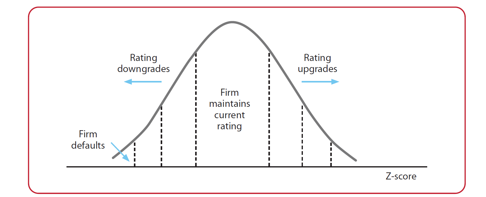

---
tags:
  - application/banking/internal-environment/risk-measurement/credit-risk/models
  - difficulty/unknown
  - study-status/new
aliases:
---
# Modelling Approaches

Risk parameter estimates (PDs, EADs, and LGDs) for capital purposes may not be the same for pricing or impairment purposes. Point-in-time or through-the-cycle views may differ. For example, one will not necessarily price a 12-month loan on a through-the-cycle credit expectation. This means models, or methodologies within models, may differ according to the use of the estimate. There are many considerations when developing a model. These include:

- Availability of sound and reliable data
- The purpose of the model and the use of the model outputs
- The costs involved in building the model (e.g. systems and model developers)
- The level of complexity – additional complexity, and therefore improved performance, must be weighed against the costs of this complexity and the difficulty of interpreting results
- Models and methodologies approved by the regulator
- The risk type being modelled – different risk types require different modelling techniques
- Suitability of the model, and any assumptions made within the model, to the bank’s [[01-business_model|business model]] and the specific asset class or portfolio
- Inclusion of both quantitative and qualitative factors.

## Single Exposure Models

When estimating risk parameters, modelling approaches will estimate these on an individual level and so “single exposure” models will be required. Single exposure models have the express purpose of assessing credit risk on a counterparty and transaction level.

Approaches can be split largely into top-down or bottom-up approaches. Models can be split into various categories: statistical, machine learning, structural and reduced-form models.

### Top-Down vs Bottom-Up Approach

A top-down approach is more likely to be used in retail portfolios, where aggregate portfolio estimates are used to measure individual credit risk estimates. For asset classes that do not have the available underlying data to individually estimate PDs, LGDs, and EADs, estimates can be assigned to sub-groups of assets that behave similarly. However, each asset will be assigned individual risk parameters essentially for pricing purposes.

Bottom-up approaches are more commonly used where more detailed information is available on individual exposures, such as large commercial companies that produce financial statements. In these approaches, credit risk would be measured directly at an individual level.

### Statistical Models

The techniques described below are common techniques used by banks within the sphere of credit risk.

#### Regression Models

Regression models are statistical modelling methods used in many banks, owing to the extensive research and resources on these methods, and their relative simplicity. Regression can be viewed as a traditional method to estimate risk parameters which most banks tend to use. Commonly used regression models include linear, logistic, and probit regression models. These all use input (or independent / explanatory) variables to statistically predict, or model, output (or dependent / response) variables.

Linear regression is used to estimate continuous output variables and logistic and probit regression are used to estimate binary output variables. For example, a binary target could be the probability of defaulting (1) versus not defaulting (0).

##### Linear Regression

Linear regression inherently assumes there exists a linear relationship between the input and output variables, which is not always the case when modelling PDs or LGDs. The formula below illustrates, quite simply, the form of linear regression models.

Linear regression benefits from many advantages, such as:

- Easily understood and interpretable – the importance of input variables can be clearly identified and interpreted
- Simply explained to non-technical parties
- Extensive research and resources available, including modelling packages and software
- Cost effective in terms of resources and time required.

However, the method does have its drawbacks:

- The method may struggle to model complex relationships and assumes linearity
- Outliers can severely impact results
- Multicollinearity, the correlation between input variables, is not considered – i.e. the input variables are assumed to be independent
- Homoscedasticity is assumed – i.e. constant variance around the mean
- Overfitting can be prevalent within this modelling method.

It should be noted that some of these drawbacks can be alleviated, such as removing outliers
in the data cleaning process of modelling.

##### Logistic Regression

Logistic regression (also known as a logit model) uses the cumulative distribution function of the logistic distribution to link input and output variables.

Logistic regression shares similar advantages and disadvantages to linear regression. A specific drawback of this method is only being able to predict binary values (assuming a binomial distribution of the independent variable), but this does not necessarily hold when predicting PDs and LGDs. PDs and LGDs are referenced as percentages, so when the binary outputs are default (1) or non-default (0), the logistic regression can only predict values within the range of 0 to 1, since it uses a cumulative distribution function. This is preferable to assuming a normal distribution of dependent values, as is the case with linear regression.

Logistic regression also assumes linearity between the input variables, but not strictly between the input variables and the output variable (a log odds linearity assumption is made). This means that a curve is fitted rather than a linear trend, which is more suitable when modelling risk parameters.

##### Probit Regression

Probit regression uses the cumulative distribution function of the normal distribution to link input and output variables. The formula below illustrates, quite simply, the form of probit regression model.

```math
y = \Phi(\beta_0 + \beta_1 x_1 + \beta_2 x_2 + \text{... } + \beta_n x_n + \epsilon)
```

Probit regression shares similar advantages and disadvantages to logistic regression, but the primary drawback of this method is the assumption of normality. PD distributions are rarely normal, and a normal distribution may underestimate extreme events, of which defaults would be a prime case.

#### Discriminant Analysis

The basic methodology underlying discriminant analysis is improving coefficients in models that assume linear relationships between input variables, where the inputs into these models form distinct categorical groups. For example, there are risky and non-risky clients.

Discriminant analysis is a modelling technique that is not always necessarily used in isolation but rather used in line with other models, most often regression models. For example, linear discriminant analysis (LDA) is where the process is used in line with linear regression models. The focus of this analysis is to improve the accuracy of the coefficients in a linear regression model. This methodology is quite commonly used within the credit risk sphere, specifically to identify defaults rather than direct PD estimation. A commonly used discriminant analysis-based model is the “Altman Z-score”. This is a linear regression model used to identify the risk of default, which made use of discriminant analysis in its construction. If the score is below 1,8, a default is likely. Scores above 3 indicate low risk entities. The formula is as follows:

```math
Z = 1.2A + 1.4B +3.3C +0.6D + E
```

A – Working capital to Total assets (i.e. liquidity)
B – Retained earnings to Total assets (i.e. profitability)
C – EBIT to Total assets (i.e. operating efficiency)
D – Market value of equity to Total liabilities (i.e. marketability)
E – Total sales to Total assets (i.e. turnover measure)

Discriminant analysis shares many advantages and disadvantages with regression techniques as most of the underlying assumptions are the same; it can even be more accurate in many cases. However, the primary flaws of this methodology are the fact that it assumes normality, which is a requirement that is seldom met in finance, and that the dependent variable must be discrete (i.e. it cannot predict PDs on a scale of 0 to 1, but rather a default or non-default).

#### Panel Models

Panel models are a combination of regression and time series analysis, where a regression is run for groups of individuals over different time periods. The formula below illustrates this:

```math
y_{i,t} = \beta_0 + \beta_1 x_{1,i,t}  + \beta_2 x_{2,i,t} + \text{...} + \beta_n x_{n,i,t} + \epsilon_{it}
```

The $i$ and $t$ represent the individuals forming the group and the time period respectively. The composition of the groups within this model can be balanced / fixed or unbalanced. Balanced groups retain the same number of individual entities (the actual entities can differ), while a fixed group would be the exact same entities. An unbalanced group would change over time and will provide less accurate results in most cases.

Panel models introduce the additional dimension of time (other dimensions can be included in the more complex multidimensional analysis model). This, and the overall structure of the model, provide many benefits. These include:

- Panel models are inherently homogeneous but can also be heterogeneous if the α term is varied by individual entities (i.e. αi).
- The model is quite flexible to the needs of the modeller, owing to its use of vectors and time series.
- Possible increased performance of the combined time series and regression methods, and the methods of pooling information in the underlying groups.
- The model parameters and outputs are easily interpretable and understandable.
- Computing and expert resources, and costs are relatively low owing to the models not being overly complex.

However, the model is not without its flaws:

- Data collection can be challenging, though in terms of the [[bis|Basel]] requirements this should not be too concerning.
- Though the model is relatively simple, resources such as modellers familiar with time series analysis will be required.

Panel models are not commonly used within the credit risk space currently, though there are instances of its use. [[bis|Basel]] itself has used panel models in various studies.

#### Cox Proportional Hazards Model

The Cox proportional hazards model is a specific model within the class of statistical survival models. These models estimate a hazard rate, i.e. the rate (or probability) of an event occurring at a particular point given that it has survived up until that point, based on various underlying factors – covariates.

```math
h(t) = h_0(t) \times e^{\beta_1 x_1 + \beta_2 x_2 + \text{... } + \beta_n x_n}
```

The covariates are denoted by x and their coefficients by $\beta$. $h(t)$ represents the hazard function, which measures the rate of the event occurring, and $h_0$ is the baseline hazard function – which is the hazard rate if all the covariates are zero (this varies over time). This model is a familiar model to the actuarial profession, being used in many traditional actuarial areas such as life insurance to measure survival rates.

The Cox model can be used to model PDs, where survival would be defined as a non-default and a hazard as a default. The covariates would then be factors that are used to predict possible defaults. In the case of PD modelling, a probability would be required as the dependent variable.

The structure of a Cox model is similar to and uses similar modelling techniques as regression models and can be transformed into a regression function similar to linear regression. The Cox model presents many advantages for use in modelling risk parameters, many of which are shared by traditional regression models. It can perform more efficiently than a simple logistic regression, as it does not need a full historical time period for entities (i.e. from the inception of an entity to its default or closure). [[bis|Basel]] itself has used this model to assess default risks in studies.

However, the model is also subject to disadvantages. The time element of the model is limited, as since this is a proportional model, risks are considered to be proportional and so the model does not inform the user as to how risks can change over time – this is a vital aspect for modelling PDs over a credit cycle, or during a downturn.

### Machine Learning Models

#### Neural Networks

Neural networks are complex models where machine learning techniques are used to determine outputs and are a prime example of models where the complexity may, in some cases, outweigh the benefit. These models attempt to replicate the workings of the human brain in order to replicate the human decision-making process and ability to recognise relationships between variables.

Neural networks can be either supervised or unsupervised. Supervised models’ inputs and outputs are both known, which makes these suitable for estimating PDs or LGDs, as they are focused on determining relationships. Unsupervised models require only inputs to be known and focus on identifying underlying patterns or data features.

Neural networks, and machine learning methods in general, have been a great topic of debate – especially in terms of their applicability to capital modelling. These models do have many advantages, including:

- The ability to account for uncertainty and standard error more efficiently, produces more accurate results.
- Less manual human intervention during period recalibrations is required, leading to lower costs and more efficient models. This applies to non-neural network AI models as well. Moreover, neural networks require a lot more effort to build, which means that they potentially require more time and resources to build.
- Back-propagation, similar to back-testing, allows for the model to be improved and to allow for flawed outputs.
- Missing information is accounted for seamlessly. Note that this can result in overfitting, and the model still requires clean data as an input.

On the other hand, neural networks do present challenges as well, such as:

- A “black box” effect can be created, where those using or managing the model do not understand the underlying workings of the model – this will be a challenge when obtaining regulatory approval.
- A conservative internal validation team may not approve the use of such a complex model. The team may also not have the skills to adequately assess the model, and hence block its use regardless of the benefits.
- The costs to implement these models can be quite high and both extensive expertise and computing resources will be required.
- These models tend to require a large amount of data, which means that its not as generally applicable as simpler models.
- There is no guarantee that neural networks will outperform or sufficiently outperform simpler models.

Neural networks are currently not a primary modelling technique amongst banks, at least not for credit risk. There is arguably more activity in the [[wiki/application/banking/01_internal_environment/risk_measurement/market_risk/02-models|market risk]], trading, pricing, and derivative space, more so around research and development.

### Structural Models

Structural models (e.g. Merton and CreditMetrics) use theoretical micro-economic factors that serve as
indicators of default or a reduction of credit quality (e.g. asset values falling below liability
values).

#### Merton Model

The Merton model is a very vital component of most structural models and should be understood before discussing other related models. The Merton model is a structural model as it makes the inherent assumption that the risk of default, or a change in credit risk, is related to the value of an entity’s assets in relation to its debt. The Merton model is illustrated by the following formulae:

```math
E = V_t\Phi(d_1) - K e^{r\delta T}\Phi(d_2)
```

The Merton model, as illustrated above, measures credit risk by modelling an entity’s equity (E) as a call option on its assets and is based on the Black Scholes option pricing model. Equity is used as this indicates the value of the entity, i.e. if this value reduces, credit risk increases. If assets are greater than debt in a future time period (VT > K), then equity is positive and debt can be repaid, but if assets are lower (VT < K), the risk of default increases.

It should be noted that the Merton model assumes normality in the returns of an entity’s assets, which may not be entirely realistic in some cases. A model that improves upon this is the KMV model.

#### KMV Model

The KMV model was developed by Kealhofer, McQuown, and Vasicek shortly after the Merton model was developed and it shares many characteristics of the Merton model. The model is now maintained and developed by Moody’s KMV.

The KMV model produces an expected default frequency (EDF), which is the probability of an entity defaulting within a 1-year time period. The primary differences can be summarised as:

- The KMV model does not assume a standard normal distribution, but rather uses a decreasing function which has been empirically estimated using Moody’s extensive database.
- The value of debt is also further refined, as a value that can vary within the limit of total liabilities – a threshold which indicates default when surpassing assets.
- Distance to default (DD) is used within the model as an intermediary calculation prior to estimating the risk of default.

A general distance to default can be defined as:

```math
DD = \frac{V_0 - DP}{\sigma_0 V_0}
\\
DP = B + 0.5L
```

Where:

- DP – the default point, i.e. the point at which default will occur
- B – the value of an entity’s short-term debt
- L – the value of an entity’s long-term debt.

This model is a vendor model, so the particular details of the model construction are not known – especially in terms of refinements made over the years – but many banks globally use the model.

The asymptotic risk factor model is based on the Merton model and measures credit risk at a portfolio level. It has been used by [[bis|Basel]] to inform their formulae for the calculation of capital requirements. Other notable structural models include the Black-Cox model and Brownian Motion-based models.

### Reduced Form Models

Reduced-form models (e.g. CreditRisk+, Jarrow-Turnbull), on the other hand, investigate the relationships between underlying variables (e.g. asset values) in relation to the risk of default or credit migration.

Reduced form models are not as commonly used by banks, or produced by vendors, as structural models, but can be just as useful in modelling credit risk. These models do not make any assumptions of relationships of financial variables to the risk of default. For example, where the Merton model assumes that asset values falling below a certain value of debt indicates a risk of default (based on economic principles), a reduced form model will not make this assumption directly and rather models default statistically.

Reduced form models allow for greater transparency and do not rely on micro-economic principles, which can lead to structural models having many underlying assumptions. An in-depth knowledge of an entity’s capital structure is not required under a reduced-form model. However, if used without any understanding of economic factors (both macro-economic and micro-economic), reduced form models can lead to a lack of understanding of the factors influencing default and this can lead to correlation being hailed as causation.

#### Jarrow-Turnbull Model

The Jarrow-Turnbull model is an example of a reduced form model and was one of the first developed. There are many variations to this model currently, but the original model focused on utilising stochastic processes and changing interest rates to estimate the time of default. The underlying methodology makes use of a hazard rate, as discussed in a previous section, and assumes an underlying exponential distribution for this hazard rate.

## Portoflio Models

There are also models that allow banks to assess credit risk within an entire portfolio as a whole. These models can prove extremely useful when assessing portfolio correlations and possible diversification benefits.

It is vital that a bank understands the interactions between its portfolios and asset classes, as most portfolios would have some level of correlation. Positively correlated portfolios can create large risks in times of downturn, where higher losses are experienced and losses in one portfolio may increase the risk of losses in another. Negatively correlated portfolios, on the other hand, can result in diversification where losses in one portfolio are offset by gains in another. For example, individual clients may pose little risk and low losses if they default, but if these clients are positively correlated, these smaller losses can add up quite quickly to a large loss.

Credit portfolio models are designed to address and measure portfolio risk, which is the risk that a portfolio(s) does not perform adequately and so does not meet its financial objectives – this is related to credit risk as explained by the prior examples. The bank is concerned about the overall risk, and therefore performance, of portfolios. This is a vital part of [[01-risk_management|risk management]], as monitoring the overall risk in a portfolio frequently allows for more informed and timely decision-making (e.g. noticing a reduction in overall credit quality before defaults begin occurring). This approach allows banks to identify diversification opportunities as well as concentration risks.

There are some common modelling approaches used by banks to assess this risk:

- Credit migration models
- Copula-based approaches

### Credit Migration Models

Credit migration models measure credit risk at a portfolio level by modelling default risk and/ or credit migrations – i.e. the risk of a default or a change in credit risk. Two commonly used vendor models are CreditMetricsTM, produced by J.P. Morgan, and CreditRisk+TM, produced by Credit Suisse Financial Products.

An important element in these models is the migration probabilities of and the correlations between exposures within a portfolio.

#### CreditMetrics

<https://www.msci.com/documents/10199/93396227-d449-4229-9143-24a94dab122f>

CreditMetrics is a credit migration model that involves modelling both default events and credit migrations. This modelling methodology was developed by J.P. Morgan and has been made publicly available for use by other banks and is an example of a structural model.

CreditMetrics utilises rating migration matrices and transition probabilities, i.e. the probability of an entity moving from one rating to another over a specific time period (where at least one migration can result in a default). These transition probabilities can, at a bank’s discretion, be sourced directly from credit rating agencies or developed internally. This approach utilises four main components in its methodology:

- Individual credit exposures
- [[03-var_limitations|Value at risk]] (VaR) of individual credit exposures (including ratings and changes in individual ratings)
- Correlations between exposures
- VaR of the overall portfolio.

These components are then used to estimate and model portfolio risk using Monte Carlo simulations, as illustrated in the technical documentation for CreditMetrics. This approach makes the assumption of an underlying standard normal distribution for the asset values that are used as the primary migration factor within the model – this is based on the underlying theory of the Merton model. In simple terms, the change in value of an entity’s assets is used to estimate the migration of the entity’s rating. The transition probabilities within the CreditMetrics model are estimated using a Gaussian Copula (discussed in more detail in a later section). The CreditMetrics model is considered a mark-to-market model as it incorporates mark-to-market values of debt.

An example of a credit rating migration distribution for a firm with a specific credit rating is illustrated below:



It should be noted that this approach can be used to assess the credit risk and migration probabilities of individual exposures.

CreditMetrics is widely used, but is not without its flaws, such as the assumption of the normal distribution (portfolio distributions can vary greatly, and credit risk modelling generally requires fatter tails) and the fact that it is often used as a “black-box” approach.

#### CreditRisk+

<https://globalriskguard.com/resources/credit/creditrisk.pdf>

The CreditRisk+ model was developed by Credit Suisse Financial Products and is a reduced form model. It differs from the CreditMetrics primarily owing to its use of the Poisson distribution to model defaults and the fact that the model only considers default events, not credit migrations.

CreditRisk+ also uses an underlying Gamma distribution for underlying elements of the model. Before estimating default risk, the CreditRisk+ model groups exposures by adjusted exposure amount (exposure bands) and correlation (sub-portfolios affected by the same economic risk factors).

Some banks do create their own in-house migration models, but the vendor models above illustrate a common general approach to this type of modelling. While some banks do have adequate resources, smaller banks cannot build in-house models that rival the above while limiting costs. Having been documented and vetted thoroughly, some would argue that these vendor models are also easier to obtain regulatory approval for.

### Copulas

Copulas are a statistical modelling technique in which the relationships between multiple statistical functions can be assessed, and these functions can be combined into a single function – a copula. Copulas combine multiple underlying probability distributions into a single cumulative probability distribution and allow banks to study dependency between portfolios without relying on the distribution of the underlying portfolios (the marginal distributions).

In the context of credit risk and portfolio risk, copulas can be used to model dependencies between individual sources of credit risk within a portfolio by using a copula function (where individual credit risk exposures are essentially the underlying marginal distributions).

This is especially useful for PDs and LGDs – where the CDFs are available, but the marginal distributions are generally not. Copulas use the relationships between these risk parameters and their CDFs to assess the dependencies between exposures in a portfolio, or even between portfolios.

Copulas can be very useful in assessing portfolio credit risk and can provide useful insights when [[01-pillar_2b|stress testing]], and do not require the use of marginal distributions which can cause complexity. It should be noted that the direct use of copulas is not widespread, owing to their complexity and the correspondingly higher costs of implementation (e.g. required expertise). As discussed, the commonly used CreditMetrics model uses copulas as a part of its methodology, but this is indirect.