---
tags:
  - application/banking/internal-environment/risk-measurement/credit-risk/airb-capital/introduction/definitions
  - difficulty/unknown
  - study-status/new
aliases:
---
# Definitions

## Obligor (Group Entity)

The obligor definition is aligned to an individual customer. While accounts may have additional authorised users, only the main customer is responsible for the credit obligations on the account, i.e. additional authorised users are not liable for the credit obligation and are therefore not considered as joint customers or obligors.

The [[crr|CRR]] makes numerous references to "Obligor" but does not explicitly define the term. [[crr|CRR]] Article 178(1) recognises default status at the Obligor-level but allows the option of Facility-level estimates within Retail exposure classes. However, an Obligor definition is required for the implementation of definition of default, primarily where the "pulling rule" looks across multiple facilities.

Banks must analyse exposure to all entities in a legal or economic group when setting limits and take a view on the group’s industry sector to manage concentration. Given support and cross-support arrangements within groups, the performance of non-borrowing entities in the group can either improve or hinder the ability of the borrowing entities to pay. Covenants and default events can be negotiated to apply to the entire group.

### Legal Entity (Lending Exposure)

As a first step, lenders must know exactly to whom they are lending (“[[05-aml_kyc|know your customer]]” – [[05-aml_kyc|KYC]]). The legal entity and type (individual, partnership, trust, or corporation) and its powers to conduct business and engage in borrowing must be fully understood. The structure can be simple or highly complex, involving organisational charts and legal shells. This is extremely important under most prevailing regulations, as banks in most jurisdictions can be held accountable for failures in this respect, e.g. fraud and money laundering.

### Transactor

A transactor exposure is defined as a revolving facility where the obligor has repaid the balance in full at each scheduled repayment date over the previous 12 months. This regulatory definition originates from the standardized credit risk classification under the [[crr|CRR]] framework. (§[[crr|CRR]] Glosarry (Annex A); §[[bis|Basel]] CRE20.66)

However, for model development purposes, the internal definition may differ to better reflect observed behavioural characteristics. For modeling and reporting consistency across the bank, the internal transactor definition is applied as follows:

- Accounts must have been active for the past 4 months, and
- Must have been classified as transactors for at least 2 of those months, including the most recent two months.

### Inactive

The inactive indicator follows a similar logic to the transactor/revolver classification and is designed to capture accounts that are no longer demonstrating regular transactional activity.

For modelling consistency, the inactive indicator aligns with [[ifrs9_standard|IFRS 9]] definitions and business classification practices. An account is considered inactive if it has had no balance, purchases, or payments for the past four months, including the current month.

## Facility (Accounts)

Credit agreements include the terms of drawing down, or utilising, the amounts of a facility and
types of accounts (e.g. revolving credit account, term loan account).

The Facility definition is aligned to customer accounts. The [[crr|CRR]] makes numerous references to "Facility" but does not explicitly define the term. Typically, and from a [[bis|Basel]] regulatory standpoint, retail exposures are managed on a product (facility) basis as opposed to an obligor basis.

## Collateral

Collateral is a single asset or multiple assets pledged by the borrower to the lender to secure a loan. In the event of default, and where the bank decides not to restructure the transaction (and the counterparty cannot refinance externally), the bank will take possession of the collateral in order to offset their loss exposure. It is essential that the lender can easily take control of and/ or sell the collateral without dispute should the borrower fail to meet the terms of the loan.

Collateral ranges from cash and securities, to the asset being financed (e.g. the property underlying a mortgage loan). The lender is best protected if the collateral is marketable in all economic conditions, characterised by low price volatility, and denominated in the same currency.

Collateral will generally impact LGD values, as it will affect the expected losses if the entity had.to default. Cashflow focused lending (focusing on the client’s ability to repay) lowers a bank’s.earnings volatility, whereas taking more collateral enables a client to lower the price of credit.

### Loan-to-value (LTV)

Banks can choose to lend up to a percentage of the value of the asset to protect against a decline in value. This is called taking a “haircut” and is the concept behind fixing loan-to-value (LTV) percentages in the residential mortgage market. On the other hand, some loans are “over collateralised”, meaning the bank receives collateral worth more than the loan. Collateral value must be monitored regularly, with additional collateral (“margin”) required in some cases if the value declines (i.e. share-based lending).

## Definition of Default (DoD)

Even default has no simple definition. The default definition is a vital aspect in determining a PD estimate, and this should be consistent – both over time and between PD, LGD, and EAD models. Generally, the regulator will define the default definition, and most regulators will align their definitions with international standards, such as [[bis|Basel]] and IFRS. This definition needs to be clearly defined for the product or asset class in question in order to assess the probability of the event, default, occurring.

Many banks classify indicators of possible default as either time or event driven. For example, time-driven indicators include the 90 days past due indicator, and event-driven indicators include contractual breaches.

In practice, banks can only use broader definitions if information is available to them. Some banks may see these definitions as default definitions, others may use the above incidences as indicators of distress that may lead to default, rather than default itself and may mark the assets as sources of concern.

```mermaid
---
config:
  theme: 'base'
  themeVariables:
    primaryColor: '#BB2528'
    primaryTextColor: '#fff'
    primaryBorderColor: '#7C0000'
    lineColor: '#F8B229'
    secondaryColor: '#816c32ff'
    tertiaryColor: '#fff'
---
graph TD;
    A[Definition of Default] --> B[Return of Default]
    A --> C[Days past Due > 90]
    A ---> D[Unlikeliness to Pay]
    D --> D1[Bankruptcy]
    D --> D2[Forebearance]
    D2 --- E1[Rate reduction, hardship, short-term assitance, debt management]
    D --> D3[Charge-off]
    D --> D4[First Party Fraud]
    D --> D5[Deceased]
    D --> D6[Contagion/Pulling Effect]
    D6 --- E2[If a customer defaults on one card, flag all other cards as defaults too, given material default exposure]
    D2 --> |After 12 months probabtion period| B
    C --> |After 12 months probabtion period|B

    classDef black fill:#000,stroke:#999,stroke-width:0px
    classDef grey fill:#636363ff,stroke:#fff,stroke-width:0px;
    class A black
    class E1,E2 grey
```



Default identification is one of the most critical steps in transforming raw data into model-ready datasets for IRB and [[ifrs9_standard|IFRS 9]] models. The regulatory definition of default (DoD) is guided primarily by Article 178 of the [[crr|CRR]], and is interpreted via local guidance such as [[eba|EBA]] GL/2016/07 and supervisory statements like SS11/13 and [[ss3-24|SS3/24]] ([[pra|PRA]]).

### Days Past Due (DPD)

| Term | Regulatory Reference | Regulatory Requirement | How Requirement Is Met |
| - | - | - | - |
| DPD | [[crr|CRR]] §178(1)(b); [[ss3-24|SS3/24]] §2.1–2.7 | Amounts of principal, interest or fees unpaid on the due date must be recognised as “credit obligation past due”. | A months-in-arrears approach beyond 3 months is used and is operationally aligned to “DPD > 90 days”. Accounts >90 DPD are classified as default. |
| Technical Past Due | [[ss3-24|SS3/24]] §2.8–2.9 | Technical past due applies only when default is caused by: data/system error; failed execution of payment; payment system failure; timing lags in payment allocation; factoring cases where no receivable >30 DPD. | No historical technical defaults. Exception processes exist to identify and correct erroneous flags. IT teams correct system or process errors. Default flags corrected manually if needed. |
| Materiality Threshold | [[crr|CRR]] §178(2)(d) and §178(2)(da); [[ss3-24|SS3/24]] §2.16 | Past-due credit obligations are material if the sum of all past-due amounts are greater than 0 for retail exposures. | Threshold set to £0, so any past-due amount counts for the DPD rule. |

DPD is calculated as the number of calendar days between the due date of the oldest unpaid amount and the reference/reporting date. [[crr|CRR]] Article 178(2)(c) states that DPD for credit cards commence on the minimum payment due date, DPD is automatically calculated on the platform. A financial asset is considered in default if the obligor is 90 days past due (DPD ≥ 90) on any material credit obligation. Materiality thresholds are applied based on absolute and relative criteria defined in Article 178(2)(d).

Suspense account treatment, payment holidays, and contractual changes (e.g. interest-only payments) are adjusted for in alignment with contractual obligations rather than actual cash flow timing. [[crr|CRR]] Article 178(1D) outlines the conditions for suspending the counting of DPD when there is a dispute between the obligor and the institution regarding the repayment amount i.e. the DPD counter is stopped for the disputed amount. Additionally, any dispute amount is removed from the minimum payment due calculation.

The graph below shows the historical trend of accounts that default in the next 12 months due to the DPD criteria.


#### Technical Past Due

Technical defaults are caused by erroncous assignment of default status to the obligor, where this should not occur. This can be as a result of technical issues, such as data or system errors.

If any erroneous default flags are added to an account, they will be identified via exceptions processes and manually removed or corrected. A defined process is in place to determine the root cause, assess any impacts, and implement a fix to correct erroncous data, including those used to create the default flags.

#### Materiality Threshold

The materiality threshold is defined as the minimum amount of outstanding obligation to which the associated facility would be considered under the respective default definition. According to [[crr|CRR]] Article 178(2)(d), the [[pra|PRA]] has defined the materiality threshold for retail exposures to be an absolute threshold of CBP 0 and relative threshold of 0%. The DoD development adopts a zero-materiality threshold, ensuring compliance with regulatory guidelines.

### Unlikeliness to Pay (UTP)

| Term | Regulatory Reference | Regulatory Requirement | How Requirement Is Met |
| - | - | - | - |
| Non-accrued Status | [[crr|CRR]] Art. 178(3)(a); [[ss3-24|SS3/24]] §3.1 | A borrower is unlikely to pay where interest is no longer recognised in P&L due to credit quality deterioration. | Interest is never suspended, so this trigger does not apply. |
| Specific Credit Risk Adjustments (SCRA) | [[crr|CRR]] Art. 178(3)(b); [[ss3-24|SS3/24]] §3.2–3.6 | [[02-credit_losses|Credit losses]] recognised under accounting standards (fair-value impairments; specific impairment events; forborne exposures) indicate UTP. | Includes charged-off, written-down or forborne accounts. Forbearance includes repayment plans. |
| Sale of Credit Obligation | [[crr|CRR]] Art. 178(3)(c); [[ss3-24|SS3/24]] §3.7–3.14 | Default triggered where a credit obligation is sold due to credit risk and sale amount exceeds the 5% materiality threshold. | Debt sales occur only after write-off; therefore exposures have already defaulted before sale. |
| Distressed Restructuring | [[crr|CRR]] Art. 178(3)(d); [[ss3-24|SS3/24]] §3.15–3.24 | Default triggered where a restructuring measure causes a diminished financial obligation, typically >1% NPV impact. | Seven forbearance types treated as default: rate reduction, hardship, short-term assistance, debt management and internal long term settlement (LTS) |
| Bankruptcy / Similar Protection | [[crr|CRR]] Art. 178(3)(e–f); [[ss3-24|SS3/24]] §3.25–3.26 | Firms must define which arrangements constitute bankruptcy or equivalent protection. | Bankruptcy or pending bankruptcy flagged as default. |
| Other UTP Indicators | [[ss3-24|SS3/24]] §3.27–3.32 | Accounts of deceased customers or other exceptional UTP circumstances. | First party fraud is flagged as a default. Third party fraud is treated as operational risk instead of credit risk and written off as soon as identified which are excluded from both the scoring population and the performance data. Deceased customer accounts flagged as default. |
| Contagion / Pulling Effect | [[ss3-24|SS3/24]] §7.6–7.8 | UTP assessment should consider the borrower’s overall situation. If a significant share of exposures are in default, remaining exposures should also be defaulted. | If a customer defaults on one card, all cards defaulted. 20% exposure-level threshold used (aligned with [[ifrs9_standard|IFRS9]] reporting). |

[[crr|CRR]] Article 178(1)(a) states that a facility shall be considered to be classed as default when it "is unlikely to pay its credit obligations to the institution, the parent undertaking or any of its subsidiones in full, without recourse by the institution to actions such as realising security". [[crr|CRR]] Article 178(3) sets out several UTP indicators which should be included in the DoD:

- the institution puts the credit obligation on non-accrued status.
- the institution recognises a specific credit adjustment resulting from a significant percelved decline in credit quality subsequent to the institution taking on the exposure.
- the institution sells the credit obligation at a material credit-related economic loss.
- the institution consents to a distressed restructuring of the credit obligation where this is likely to result in a diminished financial obligation caused by the material forgiveness, or postponement, of principal, interest or, where relevant, fees.
- the institution has filed for the obligor's bankruptcy or a similar order in respect of an obligor's credit obligation to the institution, the parent undertaking or any of its subsidiaries.
- the obligor has sought or has been placed in bankruptcy or similar protection where this would avold or delay repayment of a credit obligation to the institution, the parent undertaking or any of its subsidiaries.

In addition to the above, [[ss3-24|SS3/24]] Paragraph 3.27 states that firms must identify any other potential UTP
triggers for inclusion in the DoD. The DoD includes the following UTP indicators:

- Bankruptcy
- Forbearance or Repayment Plans;
- Charge-off;
- First Party Fraud;
- Deceased Customers; and
- Contagion.

#### Bankruptcy

Bankruptcy is defined as when a customer associated with the credit card account has entered bankruptcy or has a pending bankruptcy according to their legal status. According to [[crr|CRR]] Article 178(3) points (e) and (f) bankruptcy is defined as a UTP default trigger in cases where elther "the institution has filed for the obligor's bankruptcy ... " or "the abligor has sought or has been placed in bankruptcy ... where this would avoid or delay repayment of a credit obligation to the institution".

#### Forbearance

Forbearance occurs when the customer is facing financial difficulty to repay the debt within the original terms and conditions.

Restructured credit exposures should be considered a special case of default identification. If an entity is undergoing a restructure, this does not technically indicate a default as described above. An entity may be undergoing a restructure, but the inherent default risk may not have changed significantly. However, it is more often the case that restructures are performed owing to financial distress, so banks consider these exposures to no longer be performing.

| Forbearance Type | Description |
| - | - |
| Interest Rate Reduction | Temporary or permanent lower interest rate. |
| Hardship Assistance | Tailored plans due to verified customer hardship. |
| Short-Term Assistance | ≤ 3 months of payment holiday or grace periods. |
| Debt Management Plan | Long-term partial repayments via third-party DMPs. |
| Settlement | Agreed partial payment to settle full obligation. |

#### Charge Off

Charge-off status is assigned to accounts after 180 days past due, or after bankruptcy, settlement or deceased status after both days past due and bankruptcy are included in the default definition. Charge-off can occur after another default type has been triggered e.g. following failure to meet forbearance plan conditions.

#### First Party Fraud

First party application fraud is considered credit risk and therefore has been included as an UTP indicator in the DoD. Third party fraud is treated as operational risk instead of credit risk; therefore, cases of third party fraud are out of scope and were excluded from the modelling data (see Section 6.2.4).

#### Deceased Customers

The death of a customer is considered an UTP indicator in the DoD, given the possibility of contractual terms not being met.

#### Contagion or Pulling Effect

Contagion or Pulling Effect refers to the default treatment wherein if a customer defaults on one card account, all other card accounts held by the customer would also be flagged as defaults, given material default exposure. Whilst regulatory requirements do not necessitate the automatic default of an exposure linked to a defaulted account, via the same customer, treatment of potential contagion is nonetheless referenced in [[ss3-24|SS3/24]] Paragraph 7.6, which states that:

"*firms should take into account that some indications of default are related to the condition of the obligor rother than the status of a particular exposure including, in particular, the indications of unlikeliness to pay related to the bankruptcy of the obligor as specified in Articles 178(3)(e) and 178(3)(f) of the Credit Risk: Internal Ratings Based Approach ([[crr|CRR]]) Part. Where such Indication of default occurs, firms should treat all exposures to the same obligor as defaulted regardiess of the level of application of the definition of default.*"

[[ss3-24|SS3/24]] Paragraph 7.8 references a "significant proportion of the exposures to an obligor" for the pulling effect to be applicable. For now, this is set to 20% to align with existing reporting DoD, which was developed when the [[eba|EBA]] Cuidelines on DoD ([[eba|EBA]]/CL/2016/07) were in force. This means that if the original default balance is greater than 20% of all balance exposure at the time of default, then all accounts held by the customer will be flagged as default.

### Return to Non-Default

| Term | Regulatory Reference | Regulatory Requirement | How Requirement Is Met |
| - | - | - | - |
| Return to Non-Default (Cure) | [[crr|CRR]] Art. 178(5); [[ss3-24|SS3/24]] §5.2–5.5 | A firm must define criteria for return to performing, including: (1) improved financial situation; and (2) repayment likely to be made on time. | Cure possible after: (a) exit from repayment plan, or (b) 90+ DPD event. A 12-month probation period is required (i.e an account must remain in non-default status for 12 months before being moved to performing). Recurring default within 12 months = new default. For LGD modelling, redefaults within 9 months treated as same default (as per [[ss4-24|SS4/24]] §12.2). |

[[crr|CRR]] Article 178(5)(a) states that "*in cases where the institution considers that a previously defaulted exposure is such that no trigger of default continues to apply, continue to rate an exposure as being in default until at least 3 months have passed since the conditions in points (a) and (b) of paragraph 1 ceased to be met. After this period the institution shall rate the exposure as it would for a non-defaulted exposure*". In addition, [[ss3-24|SS3/24]] Paragraph 5.2 outlines the [[pra|PRA]]'s expectations for firms to establish clear criteria and policies for reclassifying an obligor from defaulted to non-defaulted status.

#### Probabation Period

The DoD uses a 12-month probation period. i.e. accounts in the repayment program or 90+ DPD (including pulling effect) are considered cured and return to non-default after 12 months' satisfactory probation (no longer satisfying any of the conditions of default as per default definition criteria). This is compliant with the minimum probation period of 12 months for distressed restructuring defaults ([[crr|CRR]] Article 178(5A)) and minimum probation period of 3 months for non-distressed restructuring defaults ([[crr|CRR]] Article 178(5)(a)).

An assessment was performed to determine a probation window that reduces the re-default rate, while avoiding significant accumulation of defaulted customers for the current book due to an extended probation period. Accounts that are closed with balance at default have been excluded from this analysis, as once an account goes into default their charging privileges are revoked, therefore they can only repay their outstanding balances and are not expected to re-default or move back to the pre-default book. The analysis is performed using following steps:

- At each snapshot, accounts that have previously defaulted were first identified.
- For each of these accounts, those that no longer trigger any default criteria for $N$ months were categorised as cure following the probation period. This is assessed for different $N$ probation periods: 3, 6, 9, 12, 15, 18 and 24 months.
- Accounts who exited probation and no longer in default as at the snapshot date are then tracked for the next 12 months to check their re-default status.
- The number of cures and re-defaults were averaged across the 8 quarterly snapshots.
- The re-default rate was calculated for different probation period.
  - Cure Rate: Number of cured accounts / total defaulted accounts.
  - Re-default Rate: Number of re-defaults within the probation window / total cured accounts.

As the probation period increases, the re-default rate declines. Too short → many accounts re-default and degrade data quality. Too long → artificially suppresses the number of cured accounts.

Based on the analysis, it was concluded that for 90+ DPD and Forebearance a 12-month probation period is used.


### LGD DoD

For the purposes of LGD estimation, [[ss4-24|SS4/24]] Paragraph 12.2 states that "*where the time between the moment of the return of the exposure to non-defaulted status and the subsequent classification as default is shorter than nine months, firms should treat such an exposure as having been constantly defaulted from the first moment when the default occurred. Firms may specify a period longer than nine months for the purpose of considering two subsequent defaults as a single default in the LCD estimation if this is adequate for the specific type of exposures and reflects the economic meaning of the default experience*".

Accounts with multiple defaults were analysed. There are no defaults that occur within the 9-month independence period. A 9-month independence period is considered to meet the minimum requirements. Therefore, in the MDS used for LGD model development, accounts that re-default within nine months of moving to a non-default state were treated as a single default event where default date is equal to the first default occurrence.

### Specialised Lending DoD

For specialised lending, default is more complex to define and depends on the structure of the lending and how losses can be incurred. A cash waterfall is the priority of payments by which classes of lenders receive interest and principal. Senior lenders are paid first, followed by junior (also called subordinated or mezzanine) lenders. On loan initiation or bond purchase, senior lenders receive lower returns in exchange for lower credit risk. When default occurs, equity holders receive what (if anything) remains after assets are distributed to both senior and subordinated debt holders.

For specialised lending, banks (lenders or debt holders in this case) will analyse the size of the company, or a project’s assets and collateral, relative to debt to assess the value of seniority. For example, if the loan is a general obligation of a large company to finance a small project, seniority may be less important. However, if repayment is secured only on the asset financed and the cashflow it can generate, a higher priority of payment may be more important. Loan covenants require borrowers to meet certain conditions over the period of a loan. Breaches of covenants may trigger default, higher pricing, penalties, or termination of the loan. Termination can result in the “acceleration” or “call” of a loan, i.e. the total outstanding loan amount must be repaid. Covenants can relate to reporting standards, financial performance, ownership (e.g. merger or acquisition restrictions), or business activities. Common financial covenants include:

- Debt service coverage ratio (DSCR) covenants – The DSCR is the ratio of income less expenses to interest and principal payments. DSCR is the main measure to determine whether cashflow is sufficient to service debt. It can be applied to all types of transactions and used as a covenant set at the minimum level acceptable to the lender.
- Loan life coverage ratio (LLCR) covenants – The LLCR is the net present value of cashflow available for debt servicing to total debt. LLCR is like DSCR but is a useful standard in project finance as the analysis covers the term of the transaction. LLCR is more difficult to monitor if project cashflows are likely to be inconsistent.
- Loan-to-value ratio (LTV) covenants – The LTV is the ratio of the total loan amount to the value of the asset underlying the loan and is central to residential mortgage lending (loan value to property value) and commercial property finance. LTV allows banks to gauge how far prices can fall before loss is incurred should they need to foreclose on the loan and liquidate the property.

Covenants may be waived by the bank, and only serve to ensure early alerts and constructive dialogue when conditions become more difficult. However, covenants do cede some control to banks, and management can be forced to take actions not believed by them to be in the best interests of the company. This allows the risk of default to be managed more effectively for more complex lending.

## Cure

The concept of a Cure is not defined within the [[crr|CRR]] but is referred to within [[ss4-24|SS4/24]]. The cure classification underpins the choice of discount rate for post-default cash flows, as well as being included within the dependent variable definition for the probability components as part of [[wiki/application/banking/01_internal_environment/risk_measurement/credit_risk/02_airb_capital/05_modelling/pd/03-risk-differentiation|risk differentiation]] for LGD. Accounts return to a non-default status when they have completed a 12-month probation period. To be classified as cured, an account must remain in the non-default state for an additional 9-month independence period.

## Loss (Economic Loss)

[[crr|CRR]] Article 5(2) defines "Loss" as "*Economic loss, including material discount effects, and material direct and indirect costs associated with collecting on the instrument [ ... ]*".

[[ss4-24|SS4/24]] Paragraph 13.1 states that "*firms should calculate realised LGDs for each exposure as a ratio of the economic loss to the outstanding amount of the credit obligation at the time of default. Including any amount of principal, interest, or fee*".

According to [[ss4-24|SS4/24]] Paragraph 13.2, "*firms should calculate the economic loss realised on an exposure (i.e. defaulted facility) as referred to in [[crr|CRR]] Article 5(2) as the difference between*

- *(a) the outstanding amount of the credit obligation at the moment of default ... including any amount of principal, interest, or fee, increased by material direct and indirect costs associated with collecting on that exposure, discounted to the moment of default; and*
- *(b) any recoveries realised after the moment of default, discounted to the moment of default.*"

The economic loss accounts for outflows (via additional post-default drawdowns on the credit facility, internal administrative costs, external legal fees, and valuation fees), as well as inflows (via sale of supporting collateral, unsecured recoveries, and guarantor payments).

An “economic” loss (unlike an accounting loss) considers all relevant factors including material discount effects, and material direct and indirect costs associated with holding and collecting the defaulted facilities, i.e. direct and indirect costs discounted back to the point of default. Indirect costs are only considered when calculating the LGD used for capital calculations, but not included within the LGD used in the [[ifrs9_standard|IFRS9]] impairment calculations.

All components feeding into the calculation of economic loss are discussed in the sub-sections below.

### Additional and Future Drawings

The [[crr|CRR]] refers to "additional drawings" in Articles 181 and 182. In this context, the term refers to both drawings that occur up to the moment of default, and drawings that occur after default. Within this document, additional drawings that occur after default are referred to as "post default drawings".

[[crr|CRR]] Articles 181(1) and 182(1)(ca)(il) state that post default drawings may be included in either the EAD or LGD model. It was chosen to recognise post default drawings in the [[wiki/application/banking/01_internal_environment/risk_measurement/credit_risk/02_airb_capital/05_modelling/pd/03-risk-differentiation|risk differentiation]] LGD model. Usually there are no future drawings except for accounts included in the default book solely due to their probationary or pulling status. To account for post default drawings in the LGD model, the recovery amounts were decreased by the amount of post default drawings and discounted to the default date ([[ss4-24|SS4/24]] Paragraph 13.14).

The conclusion is that post default drawing is an immaterial factor in overall recovery and loss framework.

### Recovery Cash Flows

There exists usually three primary sources of recovery streams: litigation, agency and debt-sale. Collections teams manage recovery agencies spread across the country. Additionally, there are specialty recovery streams.

Economic loss is calculated using net recovery cash flows, as recovery inflows are not operationally distinguishable between amounts allocated to principal, interest, costs or fees. All cashflows received through the above channels post-default are treated as recoveries in the economic loss calculation.

### Debt Sale

For the LGD model development, debt-sale cash flows are added as a non-modelled component onto the LGD [[wiki/application/banking/01_internal_environment/risk_measurement/credit_risk/02_airb_capital/05_modelling/pd/03-risk-differentiation|risk differentiation]] model.

Debt-sale can occur at various stages post-default, such as immediately after default or during the placement of recoveries process. Debt-sale strategies are also used through forward-flow contracts, negotiated annually, and ad hoc or bulk sales. Forward-flow debt-sale includes written-off accounts that flow out of agency streem and are sold at 12 to 36 months post charge-off, with the vast majority at 12 months post-charge-off when no payments have been received.

Ad-hoc and bulk debt-sales have been very few and far between over the last 10 years and are not modelled or accounted for in the LCD model. Forward-flow debt-sale is included as a non-modelled component in the LCD model since this recovery is expected per policy. The expected rate and price of sale for forward-flow debt-sale will be based on a moving average.

### Cost of Recoveries

Adhering to [[ss4-24|SS4/24]] Paragraph 13.21, all material direct and indirect costs related to the recovery process should be considered for the purpose of calculating the realised LGDs.

For the LGD model development, all direct and indirect cost related to the recovery process, driven by default events, are added as a non-modelled component onto the LGD [[wiki/application/banking/01_internal_environment/risk_measurement/credit_risk/02_airb_capital/05_modelling/pd/03-risk-differentiation|Risk differentiation]] model. All these costs are incurred after the moment of default.

The largest driver of the costs is associated with recoveries from Charged off accounts, which includes costs such as supplier/vendor cornmission, court costs in legal recovery and other overhead costs. The cost of recoveries is primarily based on contingency fees (commissions) paid to third party recovery suppliers that pursue recoveries on behalf of the bank. The fees are paid as a proportion of recovery that is generated by the third-party suppliers. The fee rates are agreed in the contract terms, which are generally over a three-year period. Therefore, the cost of recoveries fee rates is not believed to be sensitive to economic cycles. There is also a Legal Fees component to the cost of recovery that is charged for each lawsuit the bank might file against a charged off customer. These fees are also proportional to the charge-off volume and scale with recovery.

It could be argued that if there is a shift in the proportion of accounts sued during a downturn, there could be an increase in the instances of legal fees charged in comparison with a baseline scenario.

Therefore, the average observed across all available data is used to calculate the cost of recoveries component, i.e. the total charge-off cost of recovery rate (direct and indirect) is $X$% of the payments made post charge-off.

For the purposes of calculating actual realised LGD, the $X$% cost of recovery rate is applied to the payments made post-charge-off for accounts that were observed to have Charged off.

### Post-Default Interest and Fees

There is no post-default interest charged, which means it does not increase economic loss. So no adjustments were included in the outstanding/default balance for post-default interest charges in the LGD model to ensure alignment to the regulatory expectations.

Fees can be taken into consideration by:

- Calculating recoveries estimates based on net recoveries; or
- Calculating recoveries estimates based on gross recoveries with a post-forecast adjustment for fees.

[[ss4-24|SS4/24]] Paragraph 13.9 states that "*only fees capitalised after the moment of default should not increase the amount of economic loss or amount outstanding at the moment of default*". Fees incurred up to the default date has been included in the outstanding amount at default date (i.e. default balance). Incorporating post-default fees would increase the amount of economic loss, therefore no adjustments were included for post-default fees in the LGD1 model to ensure alignment to the regulatory expectations.

Some post-default fees were observed in the default book; however, these are close to zero as fees are only charged for a short period after default. As shown in below table, post-default fee is very smail comparing to default balance. Similarly to the LGD1 model, no adjustments were made for post-default fees as it is not required to be incorporated into the LGD2 (default book) as per [[ss4-24|SS4/24]] Paragraph 16.14.

[[ss4-24|SS4/24]] Paragraph 13.10 requires firms to "*apply the treatment specified in paragraph 13.9 to any interest capitalised in their income statement before and after the moment of default*". The default balance includes all interest charged pre-default. Any interest charged post-default are not included in the default balance. No adjustments were made to the default balance for post-default interest charges in the LG model to ensure alignment to the regulatory expectations. Since recoveries is not allocated towards repayment of principal or repayment of post-default interest, all recovery amounts (including those related to post-default interest) are included in the calculation of economic loss.

### Discount Rate

As described in Section 7.2.3, the calculation of economic loss requires recovery amounts and costs to be discounted to the default date to account for the time value of money and the impact of discounting. The following discount rates were used:

- For estimating long-run average (LRA) LGD and BEEL for defaulted exposures, the Secured Overnight Financing Rate (SOFR) plus five percentage points was used as the discount rate, since the  xposures are denominated in US dollars. SOFR is the US liquid interest rate comparable with the Sterling Overnight index Average (SONIA). This is aligned to [[pra|PRA]] expectations set out in [[ss4-24|SS4/24]] Paragraphs 13.16 and 13.18
- For estimating [[07-risk_quantification|downturn LGD]], a discount rate of max (SOFR+5%, 9%) was used. This aligns with [[pra|PRA]] expectations set out In [[ss4-24|SS4/24]] Paragraph 13.17.
- For estimating LGD in default, max (SOFR+5%, 9%) was used. This aligns with [[pra|PRA]] expectations set
out in [[ss4-24|SS4/24]] Paragraph 13.18.

SOFR was introduced as a replacement to the 3-month USD LIBOR. SOFR data is only available from April 2018. The Federal Reserve conducted a survey of primary dealers' overnight Treasury general collateral repurchase borrowing activity and published the rates prior to March 2018, referred as the "Fed survey rate" which goes back historically to February 1998.

Since there is a gap in March 2018 when data is not available, the Model Development team performed a
regression between SOFR and 3-month USD LIBOR to back cast a "modelied SOFR" prior to April 2018. The
scatterplot below shows that there is a strong correlation between 3-month LBOR and SOFR. with R-Squared
value of 63%.

Since the Fed survey rate is based on actual collected data, it was the preferred proxy rate to use in place of SOFR where data is not available prior to March 2018. The trends of both rates are generally well aligned for the historical period prior to April 2018, however the modelled SOFR is consistently higher. According to the Fed, "the transactions underlying the survey rate are not as broad as those underlying the SOFR, as the survey collects only the general collateral segments of the repo market and does not capture borrowing activity conducted by non-primary dealer market participants".

The following was decided for discounting recoveries prior to April 2018 where SOFR data is not available:

- Prior to March 2018, an adjustment of 0.58235% is added to the Fed survey rate as a proxy for SOFR.
- For March 2018, the modelled SOFR is used as a proxy for SOFR.

The following equation was used for discounting cash flows:

```math
\text{Discounted Payment} = \text{Undiscounted Payment} \times (1+\frac{2}{12})^{-t}
```

where $r$ is the discount rate and $t$ is the months since default.

### Economic Loss Given Cure

[[ss4-24|SS4/24]] paragraph 13.7 sets out a separate treatment for calculation of Economic Loss Given Cure (ELCC) based on its material impact on LGD. ELGC measures the losses incurred by the bank from default to subsequent cure of an account as a proportion of EAD driven by delays in customer payments against plan and costs incurred by the bank to arrange and facilitate the customer's path to cure.

ELGC takes into consideration any losses incurred by the bank from the default event of an account that goes on to cure. The losses are primarily driven by:

- Delays in payments due by the customer; this pertains to delays in the Bank receiving due payments against plan, which can be months later than the original payments due. Given that this has to be discounted to the month of default, this causes the value of the payment to reduce in value the more months it is late, reducing the recovery made by the Bank from a time value of money perspective.
- Associated costs incurred by the Bank, including contacting the customer, making any arrangements, and generally facilitating the customer's path to cure.

In summary, there is no explicit ELGC component required, and the desire of the section below is to prove that the LGD assigned to cured accounts is conservative.

For accounts that return to non-default status, [[ss4-24|SS4/24]] Paragraph 13,6 states that "*firms should calculate economic loss as for all other defaulted exposures with the only difference that an additional recovery cosh flow ('artificial cash flow') should be added to the calculation ... as if a payment had been made by the obligor at the date of the return to non-defaulted status.*"

The main concept introduced for the estimation of ELGC is that of the artificial cash flow. This represents the balance at cure with some adjustments, and is the main component of the ELGC calculation. It is artificial in the sense that it is not a cash flow made by the customer; however, it represents the balance remaining after the cure event, which acts as the best guide to summarise the position of the account and its expected future activity upon curing.

[[ss4-24|SS4/24]] Paragraph 13.7 continues to describe how the artificial cashflow need to be calculated:

"*(a) the artificial cash flow should reflect:*

*i. principal: total outstanding amount of the full loan at the moment of cure, but only the amount of missed payments (i.e. actual past due payments) accrued up to the moment of cure should be discounted;*

*ii. interest: amount accrued between the moment of default and the moment of cure;*

*iii. fees: amount accrued between the moment of defoult and the moment of cure;*

*iv. additional observed recoveries: total amount received up to the moment of cure;*

*v. additianal drawings: firms should follow the requirements of the last sentence of Article 181(1) and Article 182(1)(ca) of the Credit Risk: Internal Ratings Based Approach ([[crr|CRR]]) Part, and paragraphs 13.11 to 13.14. Additional drawings included in the artificial cash flow should be treated in the same way as the principal; ond*

*vi. costs: amount accrued between the moment of default and the moment of cure;*"

The revolving nature of credit cards relies on minimum payments rather than equal instalments, therefore, making the split between these categories challenging. Therefore, it was considered appropriate to discount the whole artificial cash flow in a consistent manner with all other recoveries.

The "moment of cure" is defined in [[ss4-24|SS4/24]] Paragraph 13.7(b) as "*the start of the final period when no triggers of default continue to apply prior to the exposure being rated as a non-defaulted exposure.*" The Model Development team considers probation as a default trigger and hence defines the "moment of cure" as the start of the independence period.

The ELGC value for observed cures, for a given account $i$, was calculated as follows:

```math
\text{ELGC}_i = \frac{\text{EAD}_i - \text{NPV}(\text{Observed payments})_i - \text{NPV}(\text{Artificial Cashflow})_i + \text{NPV}(\text{Costs})_i}{\text{EAD}_i}
```

- EAD: Outstanding amount at default date, including all accrued interests and fees
- Artificial Cashflow: Balance at the 'moment of cure', with adjustments to account for any post- default drawings
- NPV(Observation payments): The net present value of all future observed payments, calculated by discounted all future observed payments back to the default date for LCD1 or observation date for LCD2
- NPV(Artificial Cashflow): The net present value of the artificial cashflow, calculated by discounted the artificial cashflow back to the default date for LCD1 or observation date for LCD2
- Observed paymemnts: All repayments made while the account was in default

The discount rate was applied to the cashflows described above to discount the amounts back to default date for LCD1 and observation date for LGD2.

### Economic Loss Summary

To summarise, economic loss is quantified as the difference between the outstanding amount at the point
of default (i.e. EAD which includes all interest and fees accrued up to that point), and any recoveries achieved after the point of default (which includes cash recoveries from collections and recoveries from debt sales), discounted to the moment of default. Direct and indirect costs after default are included in the calculation and increase the economic loss.

```math
\text{Economic Loss}_i = \frac{\text{EAD}_i - \text{NPV}(\text{Cash Recoveries})_i - \text{NPV}(\text{Debt Sales Proceeds})_i + \text{NPV}(\text{Cost of Recoveries})_i}
```

There are cases where the realised recoveries of defaulted accounts are greater than the outstanding amount at default date (i.e. a profit is observed). In these cases, the realised loss or realised LGD of defaulted accounts are floored to zero to align with expectations set out in [[ss4-24|SS4/24]] Paragraph 14.14.

## Resolved and Unresolved Facilities

[[ss4-24|SS4/24]] makes a distinction between facilities for which a resolution status can be determined (resolved facilities) and facilities for which a resolution cannot be determined (unresolved facilities). Realised LGD is calculated using cash flows only up to the point of resolution (resolved cases) or latest cash flow in the dataset (unresolved cases), however, due to the choice of development sample, there are no unresolved cases in model development. The classification also underpins the difference between observed average LGD and long run average LGD.

In line with [[ss4-24|SS4/24]] Paragraph 14.10, resolved facilities are defined as those for which:

- Maximum Recovery Period (MRP) has been exceeded.
- The full amount owed has been repaid and the facility closed.
- The facility has been de-recognised from the IFRS accounts ("written off"); or
- A cure event has been recorded.

### Maximum Recovery Period (MRP)

[[ss4-24|SS4/24]] Paragraph 14.8 requires that firms define the "*maximum period of the recovery process for a given type of exposures from the moment of default that reflects the expected period of time observed on the closed recovery processes during which the firm realises the vast majority of the recoveries, without toking into account the outlier observations with significantly longer recovery processes. The maximum period of the recovery processes should be specified in a way that ensures sufficient data for the estimation of the recoveries within this period for the incomplete recovery processes.*"

For [[07-risk_quantification|risk quantification]], a 60-month outcome period is used to calculate the realised LCD. This 60-month period is defined as the maximum repayment period (MRP). Although similar to the outcome period used as part of [[wiki/application/banking/01_internal_environment/risk_measurement/credit_risk/02_airb_capital/05_modelling/pd/03-risk-differentiation|risk differentiation]] (discussed below), it should be noted that the two are distinct concepts. Accounts whose time in default exceeds the MRP are set to resolved status (marked as non-cure). Cash flows received after MRP are excluded from the economic loss calculation. In the live environment, accounts whose time in default exceeds the MRP will receive an LGD of 100% on the remaining balance.

Analysis performed shows that most recoveries occur within the first 60 months after default and as a result this period was chosen as the outcome period for the recovery rate model as part of [[wiki/application/banking/01_internal_environment/risk_measurement/credit_risk/02_airb_capital/05_modelling/pd/03-risk-differentiation|risk differentiation]]. Note that [[wiki/application/banking/01_internal_environment/risk_measurement/credit_risk/02_airb_capital/05_modelling/pd/03-risk-differentiation|risk differentiation]] probability models are trained using a shorter outcome period of 24 months. The development dataset for both the LGD1 and LGD2 [[wiki/application/banking/01_internal_environment/risk_measurement/credit_risk/02_airb_capital/05_modelling/pd/03-risk-differentiation|risk differentiation]] models do not contain any incomplete recoveries, since the choice of development period for the recovery rate model (2015 and 2016 cohorts) allows the inclusion of the full outcome period. Similarly, the development period for the probability models (2015, 2016 and 2022 cohorts) allows the inclusion of the full 24-month outcome period of the probability models.

## Ratings

Ratings act as the basis for bank credit approval, pricing, monitoring, provisioning, and regulatory or [[01-economic_capital|economic capital]]. The [[bis|Basel]] Committee defines:

- a **rating system** as “the conceptual methodology, management processes, and systems that play a role in the assignment of a rating”.
- a **rating** as a “summary indicator of the risk inherent in an individual credit”, that “typically embodies an assessment of the risk of loss due to failure by a given borrower to pay as promised”.

Ratings have two dimensions:

1) risk of borrower default (i.e. PD)
2) transaction characteristics (e.g. product, terms, seniority, and collateral). (i.e. LGD)

Ratings remain relatively constant and are often linked to a schedule of average default probabilities.

Ratings, if they are to be truly indicative of the credit risk presented by a client, require an extensive amount of accurate information. For larger clients, many of whom will maintain financial statements, this information is more easily accessed and verified. For smaller clients in retail, such as SMEs and individuals, this is not the case and so calculating ratings on a one-onone basis may often be unreasonable.

Owing to this, retail exposures are not generally managed using ratings on an individual borrower basis. Exposures will often be grouped into segments with similar risk characteristics. This often results in the distinction between borrower and product becoming limited or eliminated. In these cases, borrower characteristics (e.g. population segment, income, credit history) and those of the facility (e.g. product type, credit limit, collateral) would be blended in formulating segments.

To demonstrate homogeneity of risk, genuine [[08-segmentation|segmentation]] requires all borrowers within a segment to be treated the same. Ratings reflective of the entire segment can then be applied.

### Ratings Philosophy

A **rating philosophy** refers to the specific approach a bank uses to assign credit ratings, primarily distinguished by how the system accounts for changes in the economic cycle. It is generally categorized into Point-in-Time (PIT), which focuses on the borrower’s current condition, or Through-the-Cycle (TTC), which assesses the borrower’s ability to survive a full economic cycle including a downturn.

### Ratings Mobility

Rating mobility is a function of a bank’s rating philosophy, which can be either through-the-cycle (TTC – less active migration) or point-in-time (PIT – more migration).

## On-balance-sheet Netting

Banks offset client loans against deposits to reduce risk and capital requirements through netting. This is possible when:

- A bank has a well-founded legal basis for concluding that netting is enforceable in each relevant jurisdiction in all conditions, supported by documents such as legal opinions and netting agreements referred to as the legal right of set-off (LROS).
- The maturity of the deposit is at least as long as the loan.
- A bank has adequate reporting and monitoring systems in place, so it can always identify the relevant assets and liabilities as well as rollovers.

It should be noted that netting is not permitted when calculating the [[bis|Basel]] Leverage Ratio. Netting allows a bank to do more business with its clients. Netting is also key to non-balance sheet activities and businesses including securities clearing, payment systems, and derivatives.

## Guarantees

Guarantees take many forms and are issued by all types of entities including banks, corporations, and sovereigns, as well as individuals. Banks issue direct guarantees and indirect or counterguarantees (where non-performance of a second party’s guarantee is guaranteed). Guarantees include:

- A payment guarantee, which ensures the seller that the purchase price will be paid on the agreed date if all contractual obligations are met
- An advance payment guarantee, which ensures the buyer that the advanced payment will be reimbursed if the seller does not meet contractual delivery obligations in full
- A performance bond, which serves as collateral for costs incurred by the buyer due to failure of the seller to provide goods and services promptly and as contractually agreed
- A bid bond (tender bond), which secures the organiser’s expenses in tenders by requiring participants to pay if their bid is accepted but withdrawn
- A warranty obligations guarantee, which secures any claims by the buyer for defects appearing after delivery
- A letter of indemnity, which secures the shipping company against any claims if goods are delivered prior to receipt of the original bill of lading
- A credit security bond, which serves as collateral for loan repayment.
- Sovereign guarantees back projects deemed in the public interest, and support development and promotion of infrastructure, new industries, regions, and exports. Many sovereigns have state-owned development and export-import banks to facilitate these guarantees.
- Parent company guarantees are provided by an entity’s holding company when the bank is lending to a subsidiary of the group.
- Director guarantees are personal guarantees, where directors will provide a guarantee on an agreement and can be held personally liable in the event of default. This is usually used in cases where an entity has limited resources and cannot provide collateral or alternative guarantees and/or where the directors’ involvement is essential for success (promotes commitment in having “skin in the game”).

PD will be primarily affected by guarantees, as the risk of a default is reduced. The impact of a guarantee will depend on the bank’s view of the credit risk posed by the guarantor (the provider of the guarantee). Under the SA, the bank will be allowed to use the guarantor’s PD when assessing the credit risk. In the case where a guarantee includes collateral, this will have an impact on the LGD if the bank has a clear legal ability to take possession of the collateral in the case of default. This approach is only allowed under the AIRB approach.

[[bis|Basel]] considers insurance as a form of guarantee.