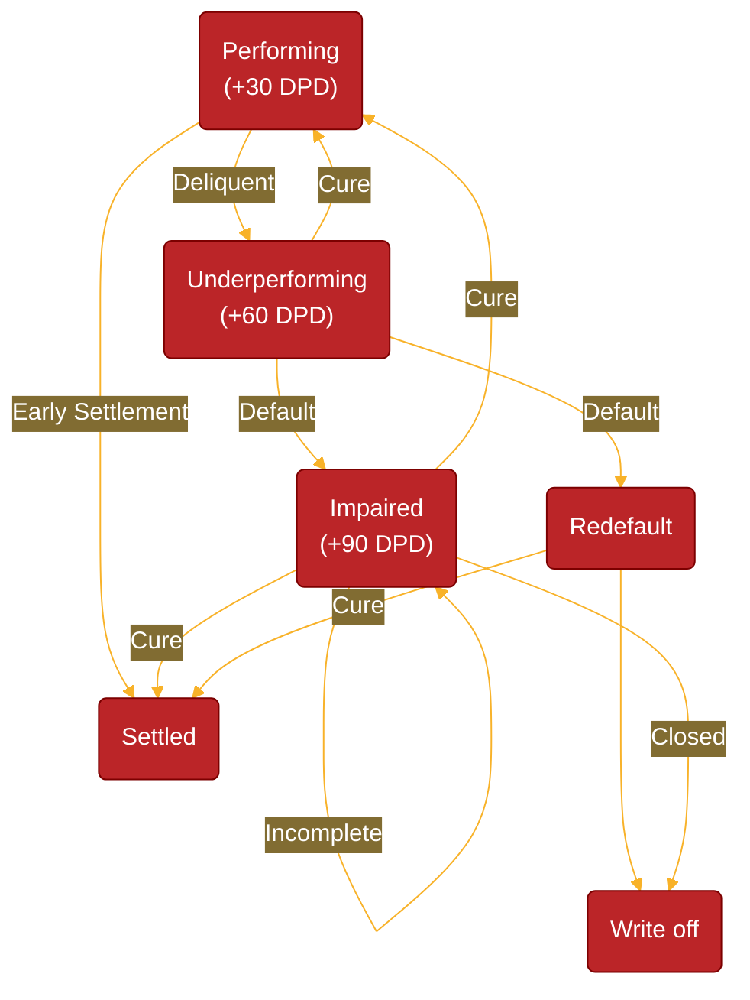

---
tags:
  - application/banking/internal-environment/risk-measurement/credit-risk/ifrs9-impairments/feature-engineering/pd/data-requirements
  - difficulty/unknown
  - study-status/new
aliases:
---
# Data Requirements

## Probability of Default (PD)

|Metadata|Notation|Description|Reference|
|-|-|-|-|
|Dependent Variable (Target)|$D^*_{i,t}(12,p)$|Indicator of defualt in line with IRB (regulatory) DoD. However, depending on the asset the PD measuers either for the next 12 months (Stage 1) or for the remainign life of the financial instrument (Stage 2 and 3).  | |
|Independent Variables (Features)|$I(x_{i},x_{i,t},m_{t'})$|Same set of risk drivers as IRB + forecasts of future economic conditions| |
|Measurement Period|$[t'_0,t'_n]$|No requirement on historical data but current and expectedfuture conditions. | |

- Typically, to calibrate your PDs the dataset has monthly loan performance (e.g. 20-year mortgage loan) observations for each loan 𝑖 = 1, ..., 𝑁.
- Each loan 𝑖 is therefore observed over discrete time $𝑡 = 1, ..., T_𝑖$ from the time of its first month-end observation up to the end of its lifetime $T_𝑖$.
- These loans are sampled between two dates, during which time new mortgages were continuously originated.
- Loans that predate the start of this sampling window, i.e., left-truncated loans, are retained along with their subsequent observations throughout this window.
- It also includes fundamental credit fields such as net cash flows (receipts), expected instalments, arrears balances, month-end balances, variable interest rates, original loan principals, the amount and timing of write-offs and early settlement.

One can compare $𝑔_0(𝑡)$ at time 𝑡 against the specifiable threshold 𝑑=3. Thus the default status at time t can be denoted as:

$D_t= [g_0(t) \geq d]$ where $d=3$

Where [𝑎] are Iverson brackets that outputs 1 if the enclosed statement 𝑎 is true and 0 otherwise.

The loan’s resulting binary-valued default indicator, can now be used within a typical cross-sectional modelling setup for predicting future default-outcomes.

In preparing the modelling dataset, we observe all predictive information of loan $𝑖$ at a particular time 𝑡. Then, the loan’s future default-status at time $𝑡 + 𝑣$ is merged to the observations at 𝑡, thereby taking a snapshot between two points in time, or a cross-section. However, the chosen value for this third parameter $𝑣 ≥ 0$ (or outcome period) is what we will define as our $𝑣$-month default indicator which will then be used to determine our $𝑣$-month PD.

More formally, a process $Z_𝑡(𝑑, 𝑣) = D_{t+𝑣}$ prepares a given loan’s monthly performance history by evaluating $D_t$ at ‘future’ time $𝑡 + 𝑣$, though assigns the result to time 𝑡.

Let $𝐷_{𝑖,𝑡}$ be a Bernoulli random variable that denotes the default status of loan 𝑖 at time 𝑡, i.e., 1 if in state D, and 0 otherwise. In creating a 𝑣-month forward default indicator, we use the worst-ever aggregation type that indicates future default at present time 𝑡 whenever any of the next 𝑣 ≥ 1 statuses $𝐷_{𝑖,𝑡+1}, ..., 𝐷_{𝑖,𝑡+v}$ equals one. The worst-ever 𝑣-month conditional probability of a non-defaulted loan 𝑖 is then:  

$P(\max [𝐷_{𝑖,𝑡+1}, . . . , 𝐷_{𝑖,𝑡+v}] = 1 | 𝐷_{𝑖,𝑡} = 0)$.

Therefore a 12-month conditional default probability will be

$P(𝐷_{𝑖,𝑡+12}] = 1 | 𝐷_{𝑖,𝑡} = 0)$

## Dymanic Conditional FiT (Marginal) PDs

Lending poses the fundamental risk of capital loss should the borrower fail to repay their loan, which necessitates the accurate prediction of the borrower’s underlying probability of default (PD). This task usually involves finding a statistical relationship between a set of borrower-specific input variables and the binary-valued repayment outcome (i.e., defaulted or not) over some outcome period. The literature on this particular classification task is considerable and spans various forms of supervised statistical learning, including machine learning.

A **forward-in-time (FIT)** rating system produces more **dynamic** PD-estimates that agree more closely with the observed variation in default risk over loan life, as well as incorporate any **temporal macroeconomic effects**. Such dynamicity is perhaps inappropriate for capital estimation since capital levels should preferably not fluctuate wildly over time.

$\text{PD}_{i,t,t'}^\text{FiT}(k,x_{i},x_{i,t})=\text{PD}_{i,t}^\text{PiT}(k,x_{i},x_{i,t})\times\text{FLI}_{t'}$

In fact, the introduction of the [[ifrs9_standard|IFRS 9]] accounting standard by the IASB (2014) provided additional impetus for such dynamicity in PD-modelling. Under [[ifrs9_standard|IFRS 9]], a financial asset’s value should be comprehensively adjusted according to a bank’s (evolving) expectation of the asset’s credit risk over time, i.e., the potential loss induced by default.

### Term Structure of PDs

In achieving such dynamicity, and especially for Stages 1-2, risk models need to project default risk ideally over **various time horizons** $k$ across loan life and against the changing macroeconomic background. This rather non-trivial task implies the estimation of a marginal (or PiT) PD as a **function of a rich set of input variables**, including macroeconomic covariates. These inputs are measured at each discrete period $t = t_1, ..., T$ during a loan’s lifetime $T$ , starting from its time of initial recognition $t_1$. The collection of these PD-estimates over the lifetime of a loan is then called the **term-structure** of default risk.

The term structure is a series of **conditional** Point-in-Time (PIT) PDs that reflect default probabilities over discrete time intervals (e.g., monthly or annually) for the life of the exposure. This term-structure typically manifests as a non-linear and right-skewed curve over loan life.

$\text{PD}_{i}^\text{Term}(k,x_{i})=\{ \text{PD}^\text{PiT}_{i,t}(k,x_{i},x_{i,t}) | \forall t \subset [1,\infty] \}$

#### Challenge 1: Redefaulting & Curing

However, there are certain modelling challenges to rendering such dynamic and time-sensitive PD-estimates. Chief among them is due to the fact that ‘default’ is not necessarily an **absorbing state** into which a loan is forever trapped. If ‘default’ is structured as a transient state during PD-estimation, then one can leverage the full credit histories that are otherwise etched with multiple cycles of curing from default and defaulting again.

> An absorbing state in a Markov chain is a state that, once entered, the system can never leave, characterized by a 100% probability (a '1' on the diagonal) of staying in that state. An absorbing Markov chain is a Markov chain containing at least one such state, where all other non-absorbing (transient) states can eventually lead to an absorbing state. These chains are useful for modeling systems that eventually "stop" or "fixate," allowing calculations of absorption probabilities and mean time to absorption, often using a fundamental matrix.

#### Challenge 2: Competing Risks

Another major modelling challenge arises from the fact that ‘default’ is not the only ailure-inducing event, despite its importance in credit risk modelling. Other events that may ultimately affect the risk of loss under [[ifrs9_standard|IFRS 9]] include prepayments (or early settlement), write-offs, and restructures. These competing risks will preclude the default-event from occurring, as well as affect the size of the risk set over time.

#### Challenge 3: Heterogeneous Borrowers

Lastly, default risk is itself a heterogeneous spectrum in that not all loans will have the same PD at the same time point, largely due to differences in the behavioural profiles of borrowers.
