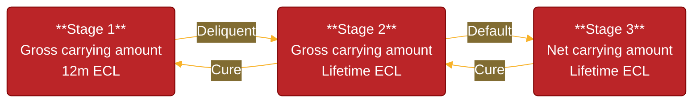

---
tags:
  - application/banking/internal-environment/risk-measurement/credit-risk/ifrs9-impairments/introduction/provisions
  - difficulty/unknown
  - study-status/new
aliases:
---
# Provisions

Capital and provisions are used jointly to ensure a bank is adequately prepared for defaults in the case of credit risk, and generally have an effect on each other – though capital affects the balance sheet and provisions affect the income statement.

The principle is to forfeit a portion of income today (also known as an **impairment charge** coming thorugh the income statement) into a **loss provision** (coming through as a reduction in the asset value not necessarily a liability) that ideally offsets amounts that may be written-off tomorrow. Doing so helps to smooth overall earnings volatility, which is itself a central tenet of [[01-risk_management|risk management]].

For example, loans generally appear on bank balance sheets as assets using nominal principal values. Once a loan is identified as impaired, the current probability of default and loss given default is applied and discounted to establish the new value. Both the loan and capital (shareholders’ equity) are marked down on the balance sheet. Impairments appear on the income statement as an expense. Debate as to the optimal balance accounting for loans is ongoing, with some arguing that constant  marking-to-market is needed.

Banks generally follow the [[ifrs9_standard|IFRS 9]] methodology when dealing with impairments, and provisions will be held for eligible exposures. The [[ifrs9_standard|IFRS 9]] ECL calculation has the following components:

## Asset Classification

[[ifrs9_standard|IFRS 9]] introduces a simpler process to classify financial assets into asset classes, following which the measurement of losses is clearly outlined.

The classification is based on the **[[01-business_model|business model]]** for managing assets of the entity and the **contractual cashflow characteristics** of the asset. ECLs can be calculated on an amortised cost or fair value basis, based on the classification. For example, a simple loan will be held by the bank in order to collect contractual cashflows of principal and interest. These cashflows are certain in terms of timing and amount. The approach to estimate ECLs, in this case, would be amortised cost.

## Expected [[02-credit_losses|Credit Losses]] (ECL)

<https://www.bis.org/fsi/fsisummaries/ifrs9.pdf>
[[ifrs9_standard|IFRS 9]] requires that this loss provision be regularly updated based on a statistical model, i.e., the asset’s **Expected Credit Loss (ECL)**. Given a new ECL-value, a bank adjusts its loss provision either by raising more from earnings or releasing a portion thereof back into the income statement (i.e increasing or decreasing or increasing its impairments). This ECL-model represents the:

- (1) probability-weighted sum of cash shortfalls that a bank expects to lose over ...
- (2) a certain horizon ...
- (3) incorporating forward-looking information as per §5.5.17.

In other words, this is calculated by calculating the present value of all future shortfalls resulting from various default scenarios. The impairment is the probability weighted sum of these various scenarios. For banks this translates to calculating impairments in a similar manner to that done when calculating capital requirements. However, where capital requirements use a conservative approach, an ECL calculation would use a best estimate (“expected”) approach, i.e. the bank’s best estimate of the PD, LGD, and EAD are used.

```math
\text{ECL}(\text{FLI}^i) = \displaystyle\sum_{t=1}^{T}(\text{EAD}_t × \text{LGD}_t × \text{PD}_t | \text{FLI}^i_t)\times v^t 
```

Where $v^t$ is the discount factor, $\text{PD}_t$ is the probability of default at time t. $\text{LGD}_t$ is the loss given default at time t and $\text{EAD}_t$ is the exposure at default at time t. The forward-looking component is taken into account by conditioning the credit risk parameters on a macro-economic scenario time series $\text{FLI}^i_t$. Depending on the calculation required, the calculation can run over 12 months or over a lifetime depending on the stage allocation.

The ECLs used to determine provisions should:

- Be calculated on a best-estimate basis, i.e. neither biased towards default or non-default. This means that the probability of a default occurring and not occurring should be considered, in multiple possible scenarios (the range of these scenarios are left to the entity’s discretion). This also means banks should avoid being conservative.
- Account for the time value of money and discount expected [[02-credit_losses|credit losses]] to the reporting date.
- Consider all information that can improve the accuracy and reasonability of estimates, with consideration given to the cost and effort of obtaining this information.
- This information may be internal or external.
- It should include historical, current, and forecasted data.
- Use a default definition consistent with existing internal [[01-risk_management|risk management]] systems.

## Staging

A significant change between the two accounting standards was the introduction of “stages”. These stages are simply a way of categorising assets according to their credit risk, so when credit risk increases, the corresponding increase in provisions is clearly linked and the measurement of ECLs is clear.

Financial assets are categorized into three stages based on their credit risk. In principle, each of the three stages requires a progressively more severe ECL-estimate. [[ifrs9_standard|IFRS 9]] does not explicility say in quantitative terms how to determine these stages. However, it is common in industry standard to denote it as such:

- Stage 1: No payments missed or partial arrears e.g. Debit order on 25th but you pay on the 10th
- Stage 2: 30 days to 89 days in arrears
- Stage 3: 90+ days in arrears. This is classified as default.



Both Stage 2 and Stage 3 accounts have a lifetime ECL calculated, i.e. the present value of all future cashflows are considered as opposed to only 12 months of cashflows considered for Stage 1 accounts.

### Stage 1 (Performing Assets)

The assets within this category are performing, with the credit risk not having significantly increased since the assets were originated or purchased. Impairment is calculated based on 12-month ECL (expected [[02-credit_losses|credit losses]] within the next 12 months). As soon as a financial instrument is originated, 12-month ECL would be recognised in the P&L (§5.5.5).

$\text{ECL Stage 1}_{i,t,t'} =\displaystyle\sum_{k=1}^{12} \text{PD}_{i,t,t'}^\text{FiT}(k,x_{i},x_{i,t})\times \text{LGD}_{t}^\text{PiT} \times \text{EAD}_{t}^\text{PiT} \times (1+\text{EIR})^{-k}$

> *When the corporate loan was initially recognised, the borrower had a solid credit rating, strong financial statements, and no signs of potential default. As there was no significant increase in credit risk at the initial or subsequent reporting dates, the loan remained in Stage 1. Under [[ifrs9_standard|IFRS 9]], the bank estimated a 12-month expected credit loss (ECL) of R50,000, which was booked as a loss allowance in the financial statements. This small provision reflects the expected [[02-credit_losses|credit losses]] arising from default events that could occur within the next 12 months, not the entire loan term. On the balance sheet, the loan is recorded at amortised cost less this allowance, and on the income statement, the R50,000 is shown as an impairment expense.*

### Stage 2 (Underperforming Assets)

Assets that have deteriorated quite significantly in their credit quality or where there has been a significant increase in credit risk (SICR) but no default from the point of origination (recognition) (§5.5.3). Impairment is based on Lifetime ECL (expected [[02-credit_losses|credit losses]] over the entire remaining life of the asset) (§5.5.19 and §5.5.20). These ECLs would be significantly higher than Stage 1 ECLs.

Many banks consider payments more than 30 days past due to be an indicator of this significant increase, but IFRS does not provide a specific rule and leaves this to a bank’s discretion (as well as the supervisor). The definition used, however, should be consistent with internal [[01-risk_management|risk management]] practices (e.g. if loan covenants relate to payments being 30 days past due, this would be an indicator for credit impairment).

These indicators could be quantitative or qualitative (as per Appendix B). The indicators will be different depending
on the type of lending such as retail or non-retail lending.

$\text{ECL Stage 2}_{i,t,t'} =\displaystyle\sum_{k=1}^{n} \text{PD}_{i,t,t'}^\text{FiT}(k,x_{i},x_{i,t})\times \text{LGD}_{t}^\text{PiT} \times \text{EAD}_{t}^\text{PiT} \times (1+\text{EIR})^{-k}$

> *The bank observes a sharp decline in the borrower’s revenues and a negative credit rating downgrade from investment grade to sub-investment grade. These are clear indicators of a significant increase in credit risk since the loan’s initial recognition. As a result, the loan transitions from Stage 1 to Stage 2, and the loss allowance must now reflect lifetime expected [[02-credit_losses|credit losses]] (ECL). The bank re-evaluates its expected losses over the remaining life of the loan and increases the allowance from R50,000 (12-month ECL) to R400,000 (lifetime ECL), reflecting the increased likelihood of default.*

### Stage 3 (Non-performing Assets)

Assets that are objectively credit-impaired (as per Appendix A) or in default (§B5.5.37) (their future cash flows are likely compromised). The backstop criteria for Stage 3 is 90 days past due. The probability of default is equal to 1 since the asset has already defaulted.

ECLs are estimated on a “lifetime” basis, as in Stage 2.

$\text{ECL Stage 3}_{i,t,t'} =\displaystyle\sum_{k=1}^{n} \text{LGD}_{t}^\text{PiT} \times \text{EAD}_{t}^\text{PiT} \times (1+\text{EIR})^{-k}$

## [[wiki/application/banking/01_internal_environment/risk_measurement/credit_risk/a-irb_capital/05_modelling/pd/01-model_methodology|Forward Looking Information]] (FLI)

An important element of ECLs is the incorporation of forward-looking information (FLI) or economic scenario generation. Credit risk parameters need to incorporate this FLI and various techniques are possible in which to incorporate FLI into credit risk parameters.

[[ifrs9_standard|IFRS9]] ECLs generally require multiple scenarios to be considered. The final ECLs are probability weighted depending on the scenarios. For example, a bank may consider three scenarios such as base, upside, and downside. These scenarios will have probabilities assigned to each of them. The final ECL estimate will need to consider the estimated ECL for each scenario and the probability of that scenario occurring. In these scenario generations, key assumptions for macro-economic variables such as GDP, inflation, and interest rates are defined.

Another aspect regarding models can be considered with regard to scenario generation. There are various economic and time-series methods to model economic scenarios. Many of these are discussed in earlier actuarial subjects. Banks may therefore interpret and forecast economic activity differently, but comparison to central bank forecasts do allow for comparability in their approaches from external auditors and regulators.

# [[ifrs9_standard|IFRS 9]] vs IRB

Banks around the globe leverage their well-established IRB models as starting point to satisfy the [[ifrs9_standard|IFRS 9]] modelling needs. The IRB PD, LGD and EAD parameters are typically TTC with some flooring and Margin of Conservatism (MoC) added. [[ifrs9_standard|IFRS 9]] requires the use of forward looking PIT parameters or conditional FiT parameters. The outcome of the IRB models is adjusted for [[ifrs9_standard|IFRS 9]] purposes to reflect forward looking and macro-economic information.

IRB models will be designed and implemented to estimate PDs and LGDs in order to calculate capital requirements. [[ifrs9_standard|IFRS9]] models are designed to estimate PDs and LGDs in order to calculate provision requirements. It should be noted that, though the purposes and calculations may differ, many banks choose to combine elements of the modelling process for these different risk parameters in order to reduce costs.

The level of provisions will not necessarily affect capital requirements but will affect the amount of capital available to meet these requirements.

## Standards & Setters

- IRB: Based on [[bis|Basel]] Accords created by [[bis|BIS]]. Specific approaches and guidance per asset class.
- [[ifrs9_standard|IFRS 9]]: Based on [[ifrs9_standard|IFRS9]] accounting regulation produced by IASB. Guidance and different approaches based on business models and cash flow characteristics of the assets.

## Purpose

- IRB: Focused on estimation of PDs and LGDs for use in the calculation of regulatory capital requirements. Focused on identifying possible defaults on assets and setting aside capital for these. Ensures banks can estimate and prepare for unexpected losses.
- [[ifrs9_standard|IFRS 9]]: Focused on estimation of PDs and LGDs for use in the calculation of regulatory provision requirements. Focused on identifying impaired assets and setting aside provisions for these. Ensures banks can estimate and prepare for expected losses.

## Data

- IRB: Explicit data requirements (e.g. 7 years for non-retail exposures)
- [[ifrs9_standard|IFRS 9]]: Data requirements are outcomes-focused and not explicit

## Modelling Methodology

- IRB: Multiple modelling approaches, including both FIRB and AIRB approaches. A more conservative approach is used to estimate losses, including the use of floors outlined in the IRBA.
- [[ifrs9_standard|IFRS 9]]: A general or simplified approach is possible. A best-estimate basis is used to estimate losses, over multiple economic scenarios.

## PDs

- IRB: Combinations of PIT and TTC PDs used when estimating default within the next 12 months
- [[ifrs9_standard|IFRS 9]]: PIT PDs estimating default within the next 12 months (Stage 1) or over the remaining lifetime (Stage 2/3).

## LGD

- IRB: Downturn LGDs used to estimate expected losses, using conservative scenarios, and these include both direct and indirect costs related to recoveries. Floor on certain types of assets.
- [[ifrs9_standard|IFRS 9]]: “PIT” LGDs used to estimate losses, using a range of economic scenarios, and these include only direct costs related to recoveries. No floor.

## EAD

- IRB: Amortization not included.
- [[ifrs9_standard|IFRS 9]]: Model includes expected lifetime changes in the balance outstanding that are permitted by the contractual terms: amortization, repayments and (partial) prepayments.

## Outpus

- IRB: Outputs of models to be used to calculate risk-weighted assets (RWAs), and risk parameters to be refreshed annually
- [[ifrs9_standard|IFRS 9]]: Outputs of models to be used to calculate expected [[02-credit_losses|credit losses]] (ECLs) on an ongoing, continuous basis

## AFS

- IRB: Capital estimates will primarily affect the balance sheet statement.
- [[ifrs9_standard|IFRS 9]]: Provisions will affect the balance sheet and income statement, primarily profit and loss

## Disclosures

- IRB: Specific disclosures detailed (e.g. ICAAP), primarily within risk-based functions
- [[ifrs9_standard|IFRS 9]]: Detailed disclosures requiring linkages between risk and accounting / finance functions